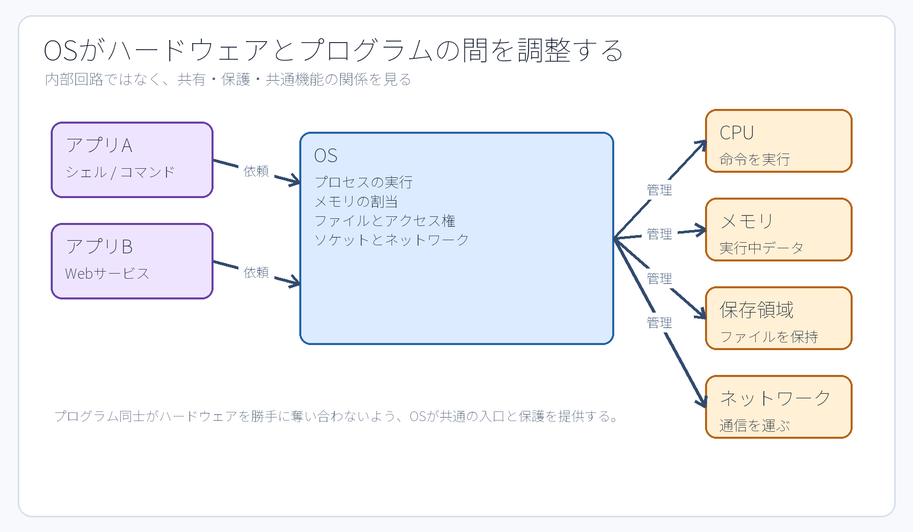
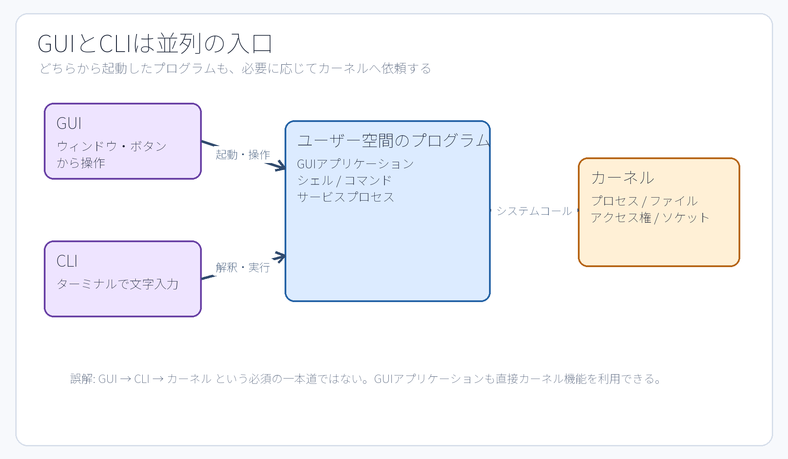

# 第1章 OSは何をしているのか

## この章で答えられるようになる問い

- OSがなければ、アプリケーションは何に困るのか。
- OSとカーネルは同じものなのか。
- CPU、メモリ、保存領域を、なぜOSが管理するのか。
- Ubuntuの名前、Linuxカーネルの版、PID 1は、どこを見れば分かるのか。

## 1.1 コンピューターには異なる役割の部品がある

コンピューターは、一つの部品だけで仕事をしているわけではない。CPUは命令を実行する。メモリは、実行中のプログラムがすぐに使う命令やデータを一時的に保持する。SSDや仮想ディスクなどの保存領域（ストレージ）は、電源を切った後も残したいプログラム、設定、文書、ログを保存する。ネットワーク装置は、別のコンピューターとの通信を運ぶ。

ここで重要なのは内部の電気的な処理ではなく、複数のプログラムが同じ部品を同時に使いたがることである。Webサーバー、SSH、ログ記録、学生のコマンドが同時に動くとき、各プログラムが勝手にCPUやメモリを独占したり、別の利用者のファイルを自由に読んだりしては困る。誰に何を使わせるかを調整し、共通の利用方法を提供するのがOSの中心的な役割である。



**図1-1　OSがハードウェアを管理し、プログラムへ共通機能を提供する概念図。** 矢印は、アプリケーションがハードウェアを直接好き勝手に操作するのではなく、OSが提供する仕組みを利用することを表す。

## 1.2 OSが提供する四つの共通機能

本書では、OSの働きを次の四つに整理する。

1. **実行の管理**: プログラムをプロセスとして動かし、CPUを使う順序や実行状態を管理する。
2. **記憶とファイル**: メモリをプロセスへ割り当て、保存領域をファイルとディレクトリとして利用できる形にする。
3. **保護**: ユーザー、グループ、アクセス権（パーミッション）を使い、誰が何を読めるか、変更できるか、実行できるかを判断する。
4. **通信**: プロセスがネットワークを利用するためのソケットなどの共通機能を提供する。

たとえば、学生が`cat /srv/jdu-web/index.txt`を実行すると、`cat`というプログラムがプロセスになる。そのプロセスは、指定されたパスのファイルを開くようOSへ依頼する。OSはプロセスのユーザー／グループとファイルのアクセス権を照合する。許可されれば保存領域から内容を読み出し、プロセスへ渡す。`cat`は受け取った文字列をターミナルへ出力する。この一つの操作にも、プロセス、パス、アクセス権、入出力という複数のOS機能が関係している。

## 1.3 カーネルとユーザー空間

**カーネル（kernel）**は、実行中のOSの中核部分である。CPU、メモリ、デバイス、ファイル、プロセス、アクセス権、ネットワークなどの低レイヤーを管理する。通常のアプリケーションが、カーネルのメモリを直接書き換えることは許されない。

一方、シェル、`ls`、`grep`、`systemctl`、Webサーバーなどは、通常は**ユーザー空間（user space）**で動くプログラムである。ここでの「ユーザー」は人間の利用者だけを意味するのではない。カーネルから分離された保護領域で動作するプログラム全体を指す表現である。

ユーザー空間のプログラムは、ファイルを開く、プロセスを作る、ネットワークを使うといった処理をカーネルへ依頼する。この境界を越える仕組みを**システムコール（system call）**という。本書ではシステムコールの番号やC言語APIの詳細までは扱わない。「プログラムがOSの共通機能を利用するための公式な窓口」と理解すればよい。



**図1-2　GUIとCLIは別の操作入口であり、どちらから起動したプログラムも必要に応じてカーネルの機能を利用する。** GUIがCLIを必ず経由するわけではない。

## 1.4 OSとカーネルは完全な同義ではない

Linuxは厳密にはカーネル（中核部）の名称である。しかし、学生が実際に操作するUbuntuにはLinuxカーネルだけでなく、シェル、基本コマンド、ライブラリ、パッケージ管理、systemd、設定ファイル群などが含まれる。これらを組み合わせ、利用者が導入・更新できる完成されたOSの形にまとめたものを**Linuxディストリビューション（distribution）**という。Ubuntuはディストリビューションの一つである。

したがって、「Ubuntuのバージョン」と「Linuxカーネルのバージョン」は別々に確認する。Ubuntu 24.04 LTS上でも、日々の更新によってカーネルリリース（kernel release）が変わることがある。

```bash
cat /etc/os-release
uname -r
```

`/etc/os-release`の`ID`はディストリビューションを識別し、`VERSION_ID`はそのバージョンを示す。`uname -r`は現在動作しているカーネルリリースを表示する。教科書の表示例をそのまま課題に書くのではなく、自身の実機で出力された値を読む。

## 1.5 起動後に最初の管理プロセスが動く

保存領域にあるプログラムは、置かれているだけでは何もしない。起動され、OSから**PID（プロセスID）**を割り当てられた実行中の存在が**プロセス**である。Ubuntu Server 24.04の本演習環境では、カーネルの起動後に`systemd`がPID 1として動き、ほかの各種サービスの起動や状態管理を行う。

```bash
cat /proc/1/comm
ps -p 1 -o pid,comm,args
```

`/proc`は通常の文書置き場とは異なり、カーネルがプロセスやシステムの状態をファイルの形で見せる仮想的なファイルシステムである。`/proc/1/comm`はPID 1の短いコマンド名を示す。PID 1やsystemdの詳細な関係は第8章と第10章で扱う。

## 1.6 人、端末、ホストを区別する

本演習環境には、少なくとも三つの異なる操作対象がある。

- **学生PC**: ブラウザを操作する手元の物理端末。
- **AWS CloudShell**: AWSマネジメントコンソールから利用する別のLinux環境。SSH接続のローカル（手元）側になる。
- **Ubuntu EC2**: 課題を実施するリモート（遠隔）サーバー。接続後の管理ユーザーは`ssm-user`である。

次のコマンドは、現在操作している環境を確認する基本である。

```bash
id -un
hostname
pwd
```

`id -un`は現在のユーザー名、`hostname`は現在のホスト名、`pwd`は現在のカレントディレクトリ（作業ディレクトリ）を表示する。同じコマンドをCloudShellとUbuntuの両方で実行すると、見た目が似たターミナル画面であっても、別のコンピューター、別のファイル、別のホームディレクトリを操作していることが明確に分かる。

## 1.7 M0で観測する六つの値

M0は暗記問題ではない。実際に稼働しているシステムから事実を読み取る練習である。

| 記録項目 | 観測元 | 表しているもの |
| --- | --- | --- |
| `OS_ID` | `/etc/os-release`の`ID` | ディストリビューションの識別子 |
| `OS_VERSION_ID` | 同じファイルの`VERSION_ID` | ディストリビューションのバージョン |
| `KERNEL_RELEASE` | `uname -r` | 現在動作中のカーネルリリース |
| `PID1_COMM` | `/proc/1/comm` | PID 1のコマンド名 |
| `USER_NAME` | `id -un` | 現在操作しているユーザー名 |
| `HOST_NAME` | `hostname` | 現在接続しているホスト名 |

OSの名前、カーネル、プロセス、ユーザー、ホストは同じ種類の情報ではない。この六つを明確に分けて記録すること自体が、この章の理解度の確認になる。

## 章末確認

1. ファイルを読むとき、コマンド、プロセス、カーネル、アクセス権（パーミッション）はどの順序で関係するか。
2. Ubuntu 24.04という表記と`uname -r`の結果が同じ文字列にならないのはなぜか。
3. CloudShellとUbuntuで`pwd`が同じ表示（例: `/home/...`）であっても、同じディレクトリとは限らないのはなぜか。

## 参考資料

- Debian Project, [Role and Tasks of the Kernel](https://www.debian.org/doc/manuals/debian-handbook/sect.kernel-role-and-tasks.en.html)（2026-09-18確認）
- Linux Kernel Organization, [What is Linux?](https://www.kernel.org/linux.html)（2026-09-18確認）
- Microsoft Learn, [User mode and kernel mode](https://learn.microsoft.com/en-us/windows-hardware/drivers/gettingstarted/user-mode-and-kernel-mode)（2026-09-18確認）
