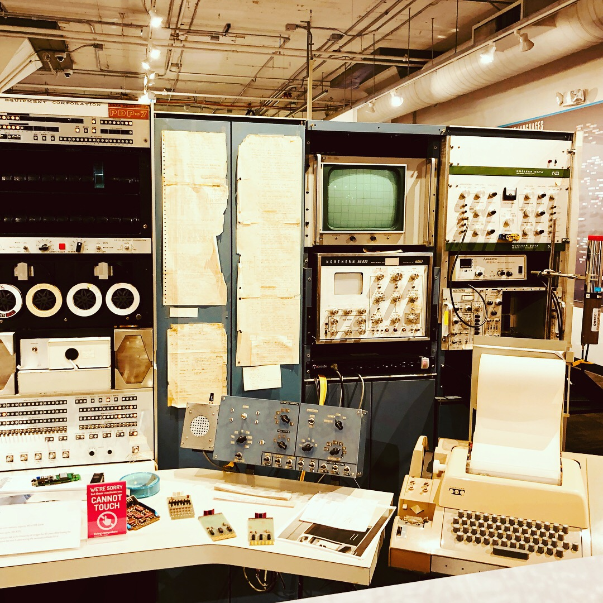
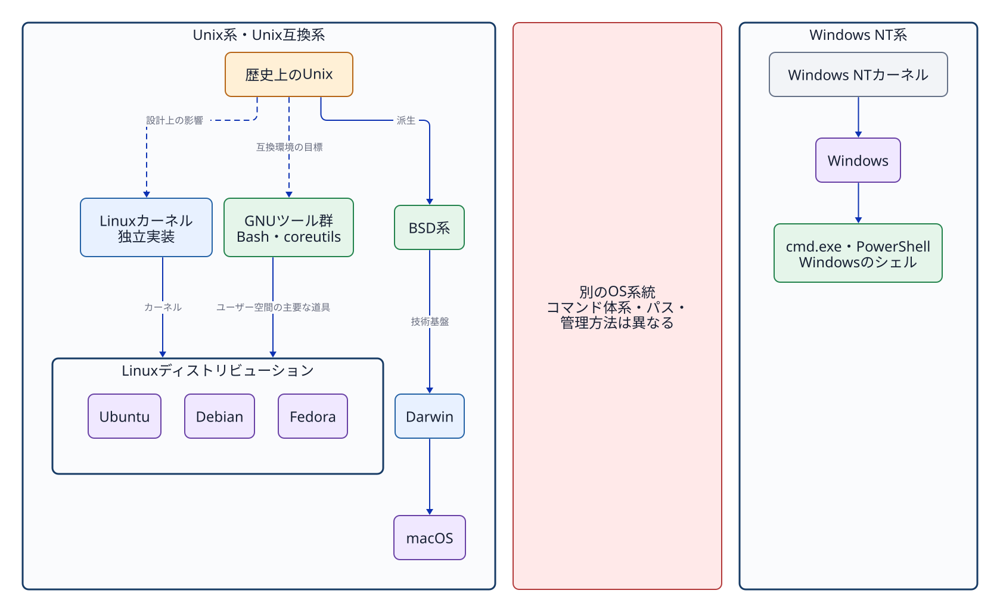
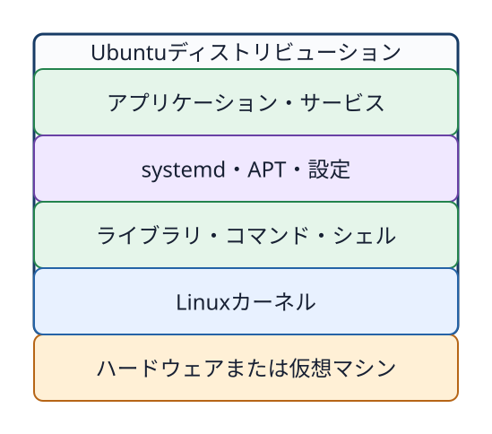

# 第2章 Unixから現在のOSへ

## なぜ歴史を学ぶのか

歴史を学ぶ目的は年号の暗記ではない。Linux、macOS、Windowsの間で似た用語や異なるコマンドが使われる理由を理解し、「LinuxはUnixのソースコードをそのまま受け継いだ」「macOSはLinuxの一種である」「WindowsもUnixから派生した」といった誤解を避けるために学ぶ。

## 2.1 Unixが示した考え方

Unixは1969年にベル研究所（Bell Labs）で開発が始まった。その後の発展を通じて、階層型ファイルシステム、プロセス、マルチユーザー（複数ユーザー）、小さなツール（small tools）の組み合わせなど、現在のOSにもつながる基本設計思想を広めた。

**写真2-1　初期Unixの開発に使われた機種DEC PDP-7の保存機。2018年、米国の博物館で撮影。撮影: ComputerGeek7066、[Wikimedia Commons](https://commons.wikimedia.org/wiki/File:DEC_PDP-7.jpg)、[CC BY-SA 4.0](https://creativecommons.org/licenses/by-sa/4.0/)（無加工）。**

写真は当時のベル研究所の実機を撮影したものではない。PDP-7は1960年代に製造されたコンピューターで、初期Unixが動いた機種である。

本書の演習との接点は明確である。ファイルをディレクトリの階層構造で扱う。プログラムをプロセスとして観測する。ユーザーとグループで利用権限を分ける。`grep`の出力を別のコマンドやファイルへつなぐ。これらはUnix系システムで長く培われてきた操作モデルである。

「Unix」は単一のコマンド集の名称ではない。また、歴史上のUnixから影響を受けたシステムが、すべて同一のソースコードや正式なUNIX商標認証を持つわけでもない。一般にUnixに似た設計やインターフェースを持つシステムを**Unix系（Unix-like）**と呼ぶ。正式な商標・製品認証の話題と、設計思想上の分類は明確に分けて考える必要がある。

## 2.2 GNUと自由に利用できるUnix互換環境

GNUプロジェクト（GNU Project）は1983年に発表され、Unixと互換性のある自由なソフトウェアシステムの構築を目指した。シェル、コンパイラ、基本ユーティリティなど多くのプログラムが開発された。現在の多くのLinuxディストリビューションでは、Linuxカーネルの周囲でGNUのツール群を含む多様なソフトウェアが動作している。

**シェル（shell）**とは、利用者が入力した文字列を読み取り、コマンドとして解釈し、必要なプログラムを起動するユーザー空間のプログラムである。シェルは、単に一つのコマンドを起動するだけではない。引数の区切りを解釈する。入出力のリダイレクトやパイプを組み立てる。環境変数を展開する。複数のコマンドを書いたシェルスクリプトを順番に実行する。このように、利用者と多数のコマンドの間で操作を取りまとめる役割を持つ。

**Bash**はGNUプロジェクトが開発するシェルの一つであり、名称は「Bourne-Again Shell」に由来する。Bash自体はLinuxカーネルでも、ターミナル画面でもない。Ubuntuのターミナルで入力した文字列をBashが解釈し、`ls`や`cp`などのプログラムを起動する。`cd`のようにシェル自身の状態を変える処理は、Bashに組み込まれたコマンドとして実行される。ターミナル、シェル、コマンドの違いは第3章で詳しく扱う。

ここで大切なのは、カーネル単体では学生が操作するシステム全体にはならないという点である。たとえばBashはシェルであり、GNU coreutilsは`ls`や`cp`などの基本コマンド群を提供する。さらにパッケージマネージャー、systemd、ライブラリ、設定ファイル、各種アプリケーションが組み合わさることで初めて実用的なシステムになる。

## 2.3 Linuxは独立に実装されたカーネル

Linuxカーネルは1991年に開発が始まった。Unixに似た機能とインターフェースを持つことを目指して開発されたが、歴史上のUnixのソースコードから直接枝分かれしたものではない。したがって、OSの系譜図ではUnixからLinuxへ「ソースコードを継承した実線」を引くのではなく、設計上の影響や互換性の目標を示す破線などで表現する。

Linuxカーネルは、プロセス、メモリ、ファイルシステム、デバイス、ネットワークなどの低レイヤーを担当する。UbuntuはLinuxカーネルに、多数のユーザー空間のツール群、パッケージ、初期設定、リリース管理方針を組み合わせたディストリビューションである。

一方、Windows NT系はUnixから枝分かれしたOSではなく、Unix系とは別の系統として設計された。Windowsの`cmd.exe`やPowerShellもシェルであるが、Bashとは構文、組み込みコマンド、パス表記、管理方法が異なる。名前が似たコマンドや、複数のOSで動く外部プログラムも存在するが、Unix系とWindowsで同じコマンドがそのまま利用できるとは考えない方がよい。BashはLinuxそのものではなく、LinuxやmacOSなどでも利用できるシェルの一つである。

**図2-1　Unix系・Unix互換系とWindows NT系は別の系統であり、コマンド体系の互換性を前提にできない。** LinuxはUnixに似たインターフェースを持つ独立実装であり、macOSはLinuxの派生ではない。

## 2.4 ディストリビューションが選択と統合を行う

Linuxカーネルを利用するシステムにはUbuntu、Debian、Fedoraなど複数のディストリビューションが存在する。各ディストリビューションは、採用するソフトウェア、パッケージ形式、更新方針、初期設定、サポート期間などを独自に決定する。

本授業では環境をUbuntu Server 24.04 LTSに統一する。ほかのディストリビューションでも同じ`ls`や`grep`を利用できる場合が多いが、パッケージ管理コマンド、設定ファイルの配置場所、セキュリティ機能、サービスの初期設定などが異なる場合がある。Red Hat/RHEL向けの手順をUbuntuへ無条件に当てはめてはならない。

**図2-2　Linuxカーネル、ライブラリ・基本コマンド、システム管理、パッケージ、アプリケーションをディストリビューションが統合する構造。** UbuntuとLinuxを完全な同義語として混同しないための構成図である。

## 2.5 macOSはDarwinを基盤に持つ

現在のmacOSはDarwinを中核（カーネル基盤）に持つ。Appleの公式資料では、DarwinはMach、BSD、Apple独自の技術などから構成されていると説明されている。BSD由来のプロセスモデル、アクセス権体系、ネットワーク機能などを備えているため、ターミナル上でUnix系に類似したコマンドやパスを利用できる。

ただし、macOSはLinuxディストリビューションではない。Linuxカーネルを中核にしておらず、独自のGUIシステムやApple固有のフレームワークなど、Darwin単体では構成されない領域も併せ持つ。また、古いClassic Mac OSと、Mac OS X以降のDarwin基盤の系譜も区別して理解する必要がある。

## 2.6 Windowsは別の系統として理解する

初期の一般消費者向けWindowsにはMS-DOSを土台にした系列（Windows 95/98など）が存在した。一方、現在のWindowsへ直接つながるWindows NT系列は、それらとは別にゼロから設計されたシステムである。Windows 2000、XP、そして現代のWindowsに至る流れを、Unixから単純に派生した系譜として描いてはならない。

Windowsにもカーネルモードとユーザーモード、プロセス、ファイルアクセス権、サービス、ネットワークソケット、CLIが存在する。これは現代のOSが解決すべき技術的課題に共通性があるためであり、Unixの子孫であることの証明ではない。PowerShellを利用できることや、Windows Subsystem for Linux（WSL）が動作することも、Windowsカーネル自体がLinuxになったことを意味するわけではない。

## 2.7 共通点と相違点をどう見るか

| 観点 | Ubuntu/Linux系 | macOS | Windows |
| --- | --- | --- | --- |
| 中核 | Linuxカーネル | Darwin（Mach・BSD等） | Windows NT系カーネル |
| 主な標準CLI | シェルとUnix系ツール群 | シェルとBSD/Unix系ツール群 | PowerShell、cmd等 |
| パスの例 | `/home/user` | `/Users/user` | `C:\Users\user` |
| ソフトウェア導入 | ディストリビューションのパッケージ管理 | App Store、インストーラー、パッケージ管理ツール等 | Microsoft Store、インストーラー、パッケージ管理ツール等 |
| 本授業での扱い | 実習対象 | 比較対象 | 比較対象 |

同じ目的を持つ機能であっても、具体的なコマンド名、初期設定、アクセス権モデルの詳細な挙動はOSごとに異なる。本授業ではUbuntuを用いてOSの基本原理を学び、将来ほかのOSへ移行する際にも、「同じコマンドを探す」のではなく、「同じ目的を担う機能や仕組みを探す」姿勢を身に付けることが重要である。

## 章末問題

### 問1　LinuxとUbuntuの違いを、「カーネル」と「ディストリビューション」という用語を用いて説明せよ。

### 問2　シェルとは何か。Bashを例に説明せよ。

### 問3　macOSをLinuxディストリビューションと呼べない理由を説明せよ。

### 問4　Windowsにもプロセスやアクセス権が存在することは、WindowsがUnixから直接派生した証拠になるか。理由とともに答えよ。

## 章末解答

### 問1

**答え:** Linuxはプロセス、メモリ、デバイスなどを管理するカーネルである。UbuntuはLinuxカーネルに、GNUツール群、シェル、ライブラリ、パッケージ管理、設定などを組み合わせたLinuxディストリビューションである。

### 問2

**答え:** シェルは、利用者が入力した文字列をコマンドとして解釈し、プログラムの起動、引数の受け渡し、リダイレクト、パイプ、変数展開、スクリプト実行などを行うユーザー空間のプログラムである。BashはGNUプロジェクトが開発するシェルの一つであり、Linuxカーネルそのものではない。

### 問3

**答え:** macOSはDarwinを基盤とし、その中核にはMachやBSD由来の技術が使われている。Linuxカーネルを中核としていないため、Linuxディストリビューションではない。

### 問4

**答え:** 証拠にはならない。プロセスやアクセス権は、現代のOSが共通して必要とする機能である。Windows NT系はUnix系とは別の系統であり、`cmd.exe`やPowerShellの構文、コマンド、パス、管理方法もBashを中心とするUnix系環境とは異なる。

## 参考資料

- Dennis M. Ritchie, [The Evolution of the Unix Time-sharing System](https://www.nokia.com/bell-labs/about/dennis-m-ritchie/hist.html)（2026-09-18確認）
- Bell Labs, [A history of computing at Bell Research Laboratories (1937-1975)](https://archive.computerhistory.org/resources/access/text/2022/08/102804421-05-01-acc.pdf)（2026-09-24確認。初期UnixとPDP-7の関係）
- Wikimedia Commons, [DEC PDP-7.jpg](https://commons.wikimedia.org/wiki/File:DEC_PDP-7.jpg)（2026-09-24確認。ComputerGeek7066撮影、CC BY-SA 4.0。2018年に保存機を撮影）
- GNU Project, [Initial Announcement](https://www.gnu.org/gnu/initial-announcement.en.html)（2026-09-18確認）
- GNU Project, [What is a shell?](https://www.gnu.org/software/bash/manual/html_node/What-is-a-shell_003f.html)（2026-09-21確認）
- GNU Project, [What is Bash?](https://www.gnu.org/software/bash/manual/html_node/What-is-Bash_003f.html)（2026-09-21確認）
- Linux Kernel Documentation, [Introduction](https://cdn.kernel.org/doc/html/latest/process/1.Intro.html)（2026-09-18確認）
- Apple, [Kernel Architecture Overview](https://developer.apple.com/library/archive/documentation/Darwin/Conceptual/KernelProgramming/Architecture/Architecture.html)（2026-09-18確認。旧archiveであるため歴史・構成の確認に限定）
- Microsoft, [Windows NT Build History](https://learn.microsoft.com/en-us/sysinternals/resources/archive/v02n03)（2026-09-18確認。歴史資料）
- Microsoft Learn, [Windows commands](https://learn.microsoft.com/en-us/windows-server/administration/windows-commands/windows-commands)（2026-09-21確認）
