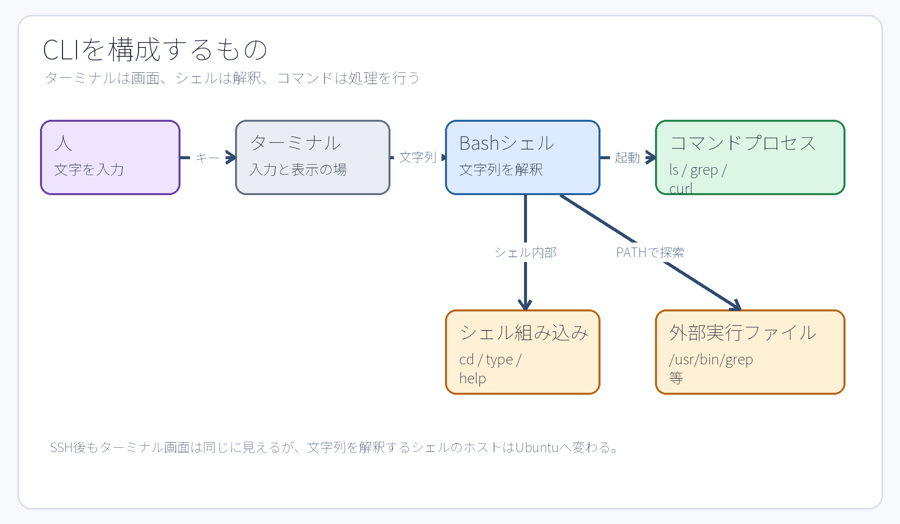

# 第3章 GUI・CLI・ターミナル・シェル

## 3.1 操作画面と処理主体を分ける

GUI（グラフィカルユーザーインターフェース）は、ウィンドウ、アイコン、メニュー、ポインタなどを使って視覚的に操作する方法である。CLI（コマンドラインインターフェース）は、文字列（テキスト）でコマンドを入力し、文字列の結果を受け取る操作方法である。どちらも人間がコンピューターへ指示を出すための入口であり、GUIが内部で必ずCLIへ変換されなければ動かない、という従属関係ではない。

**ターミナル（terminal）**は、文字を入力し結果を表示する画面・接続環境である。**シェル（shell）**は、その入力された文字列を読み取り、コマンドを解釈して実行するプログラムである。本演習環境で主に使用するシェルは Bash である。

```text
人間（操作者） → ターミナル → Bash（シェル） → コマンドのプロセス → カーネルの機能
```

ターミナルとシェルは同じものではない。たとえばSSHでUbuntuへ接続すると、CloudShell側のターミナル画面内にいながら、Ubuntu側のシェルを操作することになる。見た目は1枚の画面であっても、入力を解釈しているホスト環境が切り替わっている。



**図3-1　GUIとCLIは並列の操作入口。CLIではターミナルとシェルを明確に区別する。**

## 3.2 プロンプトは入力位置を示す

シェルがユーザーからの入力を待っているときに表示する文字列を**プロンプト（prompt）**という。プロンプトにはユーザー名、ホスト名、現在位置（カレントディレクトリ）などが表示されることが多いが、設定によって表示内容は異なる。

教材中の次のような`$`はプロンプトの表示例であり、ユーザー自身が入力する文字ではない。

```text
$ pwd
/home/ssm-user
```

入力するコマンドは`pwd`であり、その次の行は出力例である。管理者（root）権限のシェルを記号`#`で表す資料もあるが、プロンプトの記号だけで現在の権限を早合点せず、常に`id -un`コマンドで確実に確認する習慣をつける。

## 3.3 コマンド、引数、オプション

基本形は次のように読む。

```text
コマンド   オプション   引数
ls        -l          /srv
```

`ls`は実行するコマンド、`-l`は詳細表示を指定するオプション、`/srv`は対象を指定する引数（argument）である。短いオプションを組み合わせて`ls -la`のように指定できるコマンドも多いが、すべてのコマンドで同じアルファベットが同じ意味を持つとは限らない。たとえば`grep -n`は行番号の表示を意味するが、`tail -n 5`は表示する行数を指定する。

コマンドラインでは空白が要素の区切りとして扱われる。そのため、空白を含む一つの文字列をひとまとまりの引数として渡すには、クォート（引用符）で囲む必要がある。

```bash
printf '%s\n' 'JDU SSH transfer test'
```

クォート、変数展開、リダイレクトについては第5章で詳しく解説する。

## 3.4 シェル組み込みコマンドと外部コマンド

すべてのコマンドが`/usr/bin`などの保存領域にある実行ファイルとは限らない。たとえば`cd`は、現在動作しているシェル自身のカレントディレクトリ（作業ディレクトリ）を変更する必要があるため、Bashの**組み込みコマンド（シェルビルトイン、shell builtin）**として実装されている。もし外部プロセスのコマンドとして実行してしまうと、その子プロセスだけがディレクトリを変更して終了してしまい、親であるシェルの現在位置は変わらないからである。

```bash
type cd
type ls
command -v grep
```

`type`はシェルがその名前をどのように解釈するか（組み込みか、外部ファイルか、エイリアスか）を表示する。`command -v`は実行対象のパスを探索・確認するために利用できる。外部コマンドが入力された場合、シェルは環境変数`PATH`に列挙されたディレクトリ群を順に検索し、該当する実行ファイルを探し出す。

```bash
printf '%s\n' "$PATH"
command -v cmatrix
```

パッケージ導入前には`cmatrix`が見つからず、導入後に`/usr/bin/cmatrix`が見つかるという環境の変化は、第9章で実際に確認する。

## 3.5 シェルがコマンドを実行する流れ

シェルは入力された文字列をそのままカーネルへ渡しているわけではない。内部では大まかに次の処理を順番に行っている。

1. 文字列をコマンド名、オプション、引数に分割・解釈する。
2. クォート、環境変数、コマンド置換`$(...)`、ワイルドカードなどを規則に従って展開する。
3. 組み込みコマンドであればシェル内部で処理し、外部コマンドであれば実行ファイルを探索する。
4. リダイレクトやパイプなど、必要な入出力ストリームの接続を準備する。
5. プロセスを開始し、フォアグラウンドで終了を待つか、バックグラウンドで継続動作させる。
6. プロセスの終了ステータスを受け取る。

この一連の流れを把握しておくと、「`sudo`を付けたのにリダイレクト`>`だけが一般ユーザーのシェルの権限で先に処理されて失敗する」「SSHでクォートの囲み方によって、ローカルとリモートのどちらで変数が展開されるかが変わる」といった初心者がつまずきやすい問題を明確に理解できるようになる。

## 3.6 困ったときに止める・戻る・調べる

- **Ctrl+C**: フォアグラウンドで動作しているプロセスへ割り込みシグナルを送り、強制終了を求める。`cmatrix`などの画面から復帰するときに使用する。
- **q**: `less`、`man`、一部のステータス表示（ページャー）を終了して元のシェルプロンプトへ戻る。
- **exit**: 現在動作しているシェルセッションを終了する。`su`コマンドで切り替えたユーザーから元のユーザーへ戻る際や、SSH接続を切断する場合に使用する。
- **Ctrl+D**: 入力の終了（EOF: End of File）を意味する。シェル上では`exit`と同様に機能する場合があるが、操作意図を明確にするため、本書では`exit`コマンドの使用を推奨する。

`exit`を実行するたびに、多重に重なったシェルの一段外側のセッションへ戻る。たとえば`jduwriter`から`exit`すると通常は元の`ssm-user`へ戻る。さらにUbuntuのSSHシェルから`exit`すると手元のCloudShellへ戻る。操作環境を見失わないよう、切り替えのたびに次のコマンドで確認する習慣をつけるとよい。

```bash
id -un
hostname
pwd
```

## 3.7 マニュアルとヘルプを活用する

外部コマンドのマニュアルは`man`コマンド、Bashの組み込みコマンドは`help`コマンドが確認の入口となる。

```bash
man ls
help cd
systemctl --help
```

マニュアルでは`NAME`でコマンドの概要・目的、`SYNOPSIS`で構文形式、`DESCRIPTION`で詳細な動作仕様、`OPTIONS`で各オプションの意味を確認する。書式内の角括弧`[ ]`は、多くの場合「省略可能」であることを示す表記規則であり、その括弧記号自体を入力するわけではない。なお、`man`の閲覧画面は`q`キーで終了できる。

## 3.8 終了ステータスで成否を判断する

コマンドは画面へのテキスト出力とは別に、処理結果を表す小さな整数値を**終了ステータス（終了コード、exit status）**としてシェルへ返す。Unix系システムの共通規約として、`0`は「成功・正常終了」、`0`以外は何らかの「失敗・不成功・エラー」を意味する。

```bash
test -r /srv/jdu-web/index.txt
echo $?
```

`$?`は直前に実行されたコマンドの終了ステータスを保持する特殊な変数である。別のコマンドを実行すると即座に上書きされてしまうため、確認したいコマンドの直後に参照する必要がある。また、`0`以外の値がすべて同じ原因を指すとは限らない。たとえば`grep`は「パターンに一致する行がなかった場合（1）」と「ファイルが存在しないなどの実行エラー（2）」で異なる値を返す。`curl`もHTTP応答を受け取れたかどうかと通信自体の成否で挙動が異なる。画面に表示されたメッセージだけでなく、システムが何を成功・失敗の判定基準としているかを確認することが重要である。

## 章末確認

1. ターミナルとシェルの違いを、それぞれの役割に着目して一文ずつ説明せよ。
2. ディレクトリを移動する`cd`が、外部プロセスのコマンドではなくシェルの組み込みコマンドでなければならない理由を説明せよ。
3. `exit`を実行した後に、現在どの環境のどのユーザーに戻ったかを確認するための三つの基本コマンドを挙げよ。

## 参考資料

- Ubuntu Server documentation, [Welcome to the terminal](https://ubuntu.com/server/docs/tutorial/basic-installation/)（2026-09-18参照。現行ページ構成は制作時に再確認）
- GNU Project, [Bash Reference Manual](https://www.gnu.org/software/bash/manual/bash.html)（2026-09-18は本文取得timeout。執筆内容はUbuntu 24.04実機の`help`と`man bash`でも確認する）
