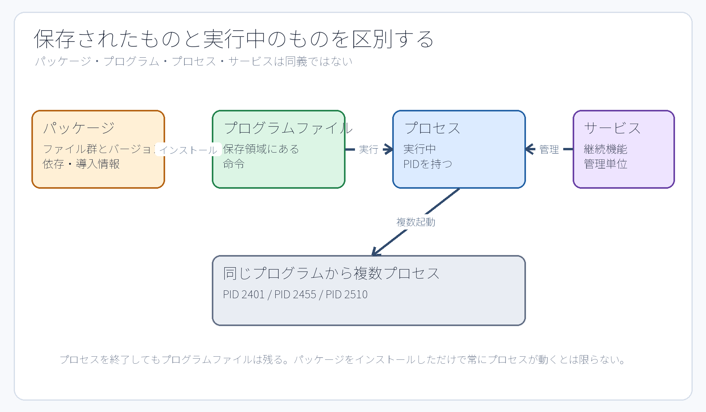

# 第8章 プログラム、プロセス、PID、シグナル

## 8.1 プログラムとプロセスは違う

**プログラム**とは、ストレージ（保存領域）に保存された命令群や関連データファイルである。一方、**プロセス**とは、そのプログラムがメモリ上に読み込まれ、OSによって実行されている状態の存在を指す。同一のプログラムから複数のプロセスを起動することが可能であり、それぞれのプロセスには一意の識別番号である**PID（プロセスID）**が割り当てられる。

なお、パッケージはプログラムや設定ファイルを配布・導入するための単位であり、サービスはバックグラウンドで継続的な機能を提供・管理するための単位である。次の関係性を混同してはならない。

```text
パッケージをインストールする → プログラムファイルが配置される
プログラムを実行する         → プロセスが生成される
systemdがユニットを管理      → サービスプロセスを起動・監視できる
```



**図8-1　保存されたもの（プログラム）、実行中のもの（プロセス）、管理単位（サービス）、配布単位（パッケージ）を明確に区別する。**

## 8.2 PIDと親子関係

カーネルは、起動された各プロセスに対して正の整数値である**PID（プロセスID）**を一意に割り当てる。プロセスは別のプロセスを子プロセスとして生成（起動）することができ、**PPID（親プロセスID）**を参照することでプロセスの親子関係を観測できる。

```bash
ps -e -o pid,ppid,user,stat,comm,args
ps -p 1234 -o pid,ppid,user,stat,comm,args
```

`ps` コマンドの表示例にある PID `1234` などを教科書からそのまま入力してはならない。PID はシステムの起動やプロセスの再起動ごとに動的に変化し、プロセスが終了した後は別の新しいプロセスに再利用されることもある。対象サービスの Main PID をコマンドで正確に取得し、その PID が指すユーザー名（`user`）、コマンド名（`comm`）、引数（`args`）が目的のプロセスと一致していることを照合してから操作を行う。

PID 1 はシステムの起動初期から動作し続ける最上位の特別な管理プロセスであり、本演習環境では systemd が担当している。演習課題において PID 1 に対してシグナルを送信してはならない。

## 8.3 フォアグラウンドとバックグラウンド

ターミナルから通常のコマンドを実行すると、シェルはそのコマンドが**フォアグラウンド（前景）プロセス**として終了するまで待機する。その間、キーボードからの入力は主にそのプロセスへ直接渡される。`Ctrl+C` は、ターミナルからフォアグラウンドのプロセスグループ全体へ割り込みシグナルを送信する操作である。

コマンドの末尾に `&` を付加することで**バックグラウンド（背景）実行**させることも可能であるが、本演習における常駐サービスはすべて systemd によって統括管理する。シェルのバックグラウンドジョブとOSのシステムサービスを同一視してはならない。SSHセッションを切断した後も恒久的に稼働させ続けるべきサービスを、単なる `command &` で安易に代用してはならない。

## 8.4 シグナルはプロセスへの通知

**シグナル（signal）**は、OSやプロセスから別のプロセスに対して、特定の出来事や制御要求を非同期に通知する仕組みである。

- **TERM（SIGTERM）**: プロセスに対して、データの保存やリソース解放などの正常な終了処理を行う猶予を与えて終了を要求する。プロセスを終了させる際に最初に使用すべき標準シグナルである。
- **KILL（SIGKILL）**: カーネルが対象プロセスを強制的に即座終了させる。プロセス側でシグナルを捕捉・後始末することはできない。TERM 等の通常シグナルを受け付けない暴走時の最終手段である。
- **INT（SIGINT）**: ターミナルの `Ctrl+C` などから送信される割り込みシグナルである。

```bash
kill -TERM PID
```

`kill` コマンドは、その物騒な名称とは裏腹に、常にプロセスを強制終了するだけのコマンドではない。本質は「対象プロセスへ指定したシグナルを送信する」ツールである。たとえば `sudo pkill 1956 -TERM` のように、PIDの数値を `pkill` のプロセス名パターン位置に渡すのは誤った使い方である。PID を直接指定する場合は `kill` を用い、プロセス名のパターンで指定する場合は `pkill` を用いる。ただし本課題では、意図しない巻き込み終了を防ぐため、対象の PID を特定して `kill` を使う手順に統一している。

## 8.5 安全に対象を終了する手順

演習P3および課題M3では、稼働している3つのサービスプロセスのうち、2番目のサービスプロセスだけを安全に終了させる。

1. ユニットの Main PID を取得する。
2. 取得した値が空、0、1、負数などの不正な値でないことを確認する。
3. `ps -p` で対象のコマンド名と実行ユーザーを照合する。
4. `kill -TERM` で終了シグナルを送信する。
5. 対象のプロセス2が正常に終了し、プロセス1とプロセス3が継続して動作していることを再確認する。

```bash
P3_PID="$(systemctl show --property MainPID --value jdu-p3-process2.service)"
printf 'MainPID=%s\n' "$P3_PID"
ps -p "$P3_PID" -o pid,user,comm,args
sudo kill -TERM "$P3_PID"
```

実際のPIDを変数へ代入して参照することで手作業による転記ミスを減らせるが、その変数に格納された値が意図したものであるかを実行前に目視確認する責任は依然として操作者にある。

## 8.6 プロセスを終了してもファイルは消えない

プロセスを終了させても、ストレージ上に保存されているプログラムファイル、ユニットファイル、データファイルなどはそのまま残る。逆に、ディスク上の実行ファイルを削除したとしても、すでにメモリ上に読み込まれてマッピングされている実行中プロセスが直ちに停止するわけではない。課題M3は「プロセスの実行状態を制御する課題」であり、ファイルを削除する課題ではない。

また、サービスマネージャー（systemd）の設定によっては、プロセスが終了したことを検知して自動的に再起動を試みる場合がある。演習P3および課題M3の練習用ユニットでは、意図的に `Restart=no` と設定されているため、TERM シグナル送信後に停止状態のまま静止して観測できる。一般的な実務環境のサービスがすべて同じ挙動をするとは限らない点に注意する。

## 8.7 `/proc/PID`で実行状態を見る

```bash
sudo cat "/proc/$P3_PID/cmdline" | tr '\0' ' '
printf '\n'
sudo readlink -f "/proc/$P3_PID/cwd"
```

`cmdline` は NUL 文字（`\0`）で引数群が区切られているため、ターミナルで人間が読みやすいよう `tr` コマンドで空白文字に置き換えて表示している。`cwd` はプロセスのカレント作業ディレクトリ（working directory）を指すシンボリックリンクである。プロセスが終了すると、その PID に対応する `/proc` 配下のエントリも自動的に消滅する。

これはカーネルの深層解析を行うためのものではなく、ユニットファイルの設定値と、現在稼働しているプロセスの実態が正しく一致しているかを客観的に観測するために活用する。

## 章末確認

1. パッケージ、プログラム、プロセス、サービスの違いを、それぞれの役割に着目して一文ずつ説明せよ。
2. シグナルを送信する前に、取得した Main PID を `ps` コマンドで照合すべき理由を説明せよ。
3. TERM シグナルを送信したにもかかわらず、サービスが直ちに再び active 状態に復帰する場合、ユニットファイルのどの設定項目を疑うべきか。

## 参考資料

- Linux man-pages / Ubuntu 24.04の`man ps`、`man kill`、`man proc`（制作時に実機確認）
- 公開Lab v1.5.0のP3/M3 unit。一般論と`Restart=no`というLab固有条件を区別する。
