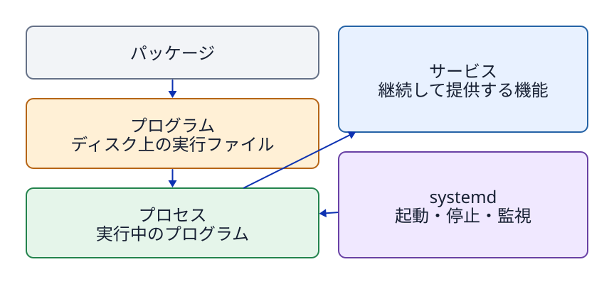

# 第8章 プログラム、プロセス、PID、シグナル

## 8.1 プログラムとプロセスは違う

**プログラム**とは、ストレージ（保存領域）に保存された命令群や関連データファイルである。一方、**プロセス**とは、そのプログラムがメモリ上に読み込まれ、OSによって実行されている状態の存在を指す。同一のプログラムから複数のプロセスを起動することが可能であり、それぞれのプロセスには一意の識別番号である**PID（プロセスID）**が割り当てられる。

なお、パッケージはプログラムや設定ファイルを配布・導入するための単位であり、サービスはバックグラウンドで継続的な機能を提供・管理するための単位である。次の関係性を混同してはならない。

```text
パッケージをインストールする → プログラムファイルが配置される
プログラムを実行する         → プロセスが生成される
systemdがユニットを管理      → サービスプロセスを起動・監視できる
```



**図8-1　保存されたもの（プログラム）、実行中のもの（プロセス）、管理単位（サービス）、配布単位（パッケージ）を明確に区別する。**

## 8.2 PIDと親子関係

カーネルは、起動された各プロセスに対して正の整数値である**PID（プロセスID）**を一意に割り当てる。プロセスは別のプロセスを子プロセスとして生成（起動）することができ、**PPID（親プロセスID）**を参照することでプロセスの親子関係を観測できる。

```bash
ps -e -o pid,ppid,user,stat,comm,args
ps -p 1234 -o pid,ppid,user,stat,comm,args
```

上の `1234` は表示例であり、実際のPIDは起動のたびに変わる。プロセスが終了した後は、同じ番号が別のプロセスに再利用されることもある。シグナルを送る前には、対象のPIDとともに、ユーザー名（`user`）、コマンド名（`comm`）、引数（`args`）を確認する。

PID 1 はシステムの起動初期から動作し続ける特別な管理プロセスである。Ubuntuでは通常、systemdがこの役割を担う。

## 8.3 サービスが管理するプロセスを見つける

Ubuntuでは、systemdがサービスの起動と状態を管理する。サービスを定義する設定を**ユニット（unit）**と呼び、サービスのユニット名は通常 `.service` で終わる。設定で指定されたプログラムが実行されると、サービスに対応するプロセスが動く。ユニットという管理対象と、現在動いているプロセスは同じものではない。

`systemctl` はsystemdが管理するユニットの状態を調べるコマンドである。次の例では、稼働中のサービスを一覧表示し、一つのサービスの状態と主なプロセスを調べる。

```bash
systemctl list-units --type=service
systemctl status systemd-journald.service --no-pager
systemctl show --property MainPID --value systemd-journald.service
```

`status` の **Main PID** は、そのサービスの主なプロセスのPIDである。`show --property MainPID --value` はその値だけを表示する。停止中のサービスでは `0` と表示されることがある。得られたPIDを `ps -fp PID` で照合すると、サービスの管理情報と実際のプロセスを結び付けられる。`ps` はプロセスを調べ、`systemctl` はサービスの管理状態を調べる。サービスの起動方法や自動起動設定は第10章で扱う。

## 8.4 フォアグラウンドとバックグラウンド

ターミナルから通常のコマンドを実行すると、シェルはそのコマンドが**フォアグラウンド（前景）プロセス**として終了するまで待機する。その間、キーボードからの入力は主にそのプロセスへ直接渡される。`Ctrl+C` は、ターミナルからフォアグラウンドのプロセスグループ全体へ割り込みシグナルを送信する操作である。

コマンドの末尾に`&`を付けると、シェルはそのコマンドを**バックグラウンド（背景）**で開始し、次の入力を受け付ける。

## 8.5 シグナルはプロセスへの通知

**シグナル（signal）**は、OSやプロセスから別のプロセスに対して、特定の出来事や制御要求を非同期に通知する仕組みである。

- **TERM（SIGTERM）**: プロセスに対して、データの保存やリソース解放などの正常な終了処理を行う猶予を与えて終了を要求する。プロセスを終了させる際に最初に使用すべき標準シグナルである。
- **KILL（SIGKILL）**: カーネルが対象プロセスを強制的に即座終了させる。プロセス側でシグナルを捕捉・後始末することはできない。TERM 等の通常シグナルを受け付けない暴走時の最終手段である。
- **INT（SIGINT）**: ターミナルの `Ctrl+C` などから送信される割り込みシグナルである。

```bash
kill -TERM PID
```

`kill`コマンドは、その名称とは異なり、対象プロセスへ指定したシグナルを送るコマンドである。たとえば`pkill 1956`とすると、`1956`はPIDではなくプロセス名の検索パターンとして解釈される。PIDを直接指定する場合は`kill`を用い、プロセス名のパターンで指定する場合は`pkill`を用いる。

## 8.6 プロセスを終了してもファイルは消えない

プロセスを終了させても、ストレージ上に保存されているプログラムファイル、ユニットファイル、データファイルなどはそのまま残る。逆に、ディスク上の実行ファイルを削除したとしても、すでにメモリ上に読み込まれている実行中プロセスが直ちに停止するわけではない。

systemdで管理されるサービスは、プロセスが終了した後に再起動される場合がある。再起動する条件は、ユニットファイルの`Restart=`などの設定で決まる。したがって、プロセスが終了したことと、サービスが停止し続けることも別である。

## 8.7 `/proc/PID`で実行状態を見る

```bash
printf 'PID=%s\n' "$$"
cat "/proc/$$/cmdline" | tr '\0' ' '
printf '\n'
readlink -f "/proc/$$/cwd"
```

`$$`は現在のBashシェルのPIDである。`/proc/PID/cmdline`では、引数群がNUL文字（`\0`）で区切られているため、`tr`で空白に置き換えて表示する。`/proc/PID/cwd`は、そのプロセスの作業ディレクトリを指すシンボリックリンクである。プロセスが終了すると、対応する`/proc/PID`も消える。

`/proc/PID`を読むと、保存されたプログラムファイルではなく、現在動作しているプロセスの情報を観測できる。

## 章末問題

### 問1　パッケージ、プログラム、プロセス、サービスはどう違うか。

### 問2　シグナルを送る前に、PIDを`ps`で照合するのはなぜか。

### 問3　TERM送信後にサービスが再び動いたら、ユニットファイルの何を確認するか。

## 章末解答

### 問1

**答え:** パッケージはプログラムや設定を配布・導入する単位である。プログラムは保存された命令群である。プロセスはプログラムの実行中の状態である。サービスは継続的な機能を提供し、systemdなどが管理する単位である。

### 問2

**答え:** PIDは起動のたびに変わり、終了後に別のプロセスへ再利用されることがあるためである。PIDだけでなく、実行ユーザー、コマンド名、引数を照合し、意図したプロセスか確認する。

### 問3

**答え:** `Restart=`などの再起動設定を確認する。プロセスが終了しても、systemdがその設定に従って再起動する場合がある。

## 参考資料

- Linux man-pages / Ubuntu 24.04の`man ps`、`man kill`、`man proc`（制作時に実機確認）
- GNU Bash Reference Manual, [Special Parameters](https://www.gnu.org/software/bash/manual/html_node/Special-Parameters.html)（2026-09-24確認。`$$`はシェルのPID）
- Ubuntu 24.04 man page, [systemd.service(5)](https://manpages.ubuntu.com/manpages/noble/man5/systemd.service.5.html)（2026-09-24確認。`Restart=`）
- Ubuntu 24.04 man page, [systemctl(1)](https://manpages.ubuntu.com/manpages/noble/man1/systemctl.1.html)（2026-09-24確認。`status`と`show`）
