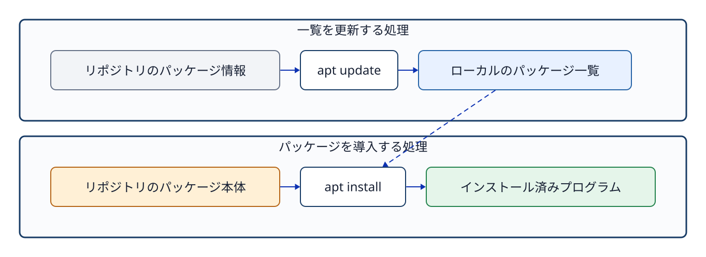

# 第9章 パッケージとソフトウェアの導入

## 9.1 パッケージが必要な理由

実用的なソフトウェアは、単一の実行ファイルだけで完結するとは限らない。動作に必要な共有ライブラリ、設定ファイルのテンプレート、マニュアル文書、データファイルなどを同時に必要とする。**パッケージ（package）**とは、これら関連するファイル群、バージョン情報、依存関係、およびシステムの導入・削除スクリプトをひとまとめにした配布単位である。

Ubuntuでは主に Debian パッケージ形式（`.deb`）を採用し、それを **APT（Advanced Package Tool）** で一括管理する。APT は**リポジトリ（repository）**から利用可能な最新のパッケージ情報を取得し、必要な依存ライブラリを自動で解決しながらシステムへ導入する。インターネット上から拾ってきた素性の知れないスクリプトを不用意に root 権限で直接実行することと、公式に信頼されたリポジトリから検証済みのパッケージを導入することは、セキュリティの観点から根本的に異なる行為である。



**図9-1　`apt update` はインデックス（一覧情報）を更新し、`apt install` がパッケージ本体を取得・導入する流れ。**

## 9.2 リポジトリとパッケージインデックス

**リポジトリ（repository）**とは、パッケージ本体とそれに付随するメタデータ（バージョンや依存関係の説明）を提供する配布拠点のサーバーである。手元のUbuntuシステムは、どのリポジトリにどのバージョンのパッケージが存在するかをローカルの**パッケージインデックス（一覧情報）**として保持している。

```bash
sudo apt update
apt show cmatrix
sudo apt upgrade
```

`apt update` は、リポジトリから利用可能なパッケージの一覧（インデックス）を最新状態に更新する。これだけでは導入済みパッケージの本体は変わらない。`apt show cmatrix` では、導入前にパッケージの説明やバージョン、依存関係を確認できる。`apt upgrade` は、更新した一覧を基に、導入済みパッケージを新しいバージョンへ更新する。実行時に表示される変更内容を確認してから、継続するか判断する。これはUbuntuの新しいリリースへ切り替える操作ではない。

## 9.3 インストールと実行確認

```bash
sudo apt install cmatrix
command -v cmatrix
cmatrix
```

`sudo` 権限が必要となるのは、システム全体のパッケージデータベースや、管理者保護下にある `/usr/bin` などの配置領域を変更するためである。導入が完了したら、`command -v` を用いてシェルがどのパスの実行ファイルを認識しているかを確認する。`cmatrix` は `Ctrl+C` で終了できる。

パッケージがシステムに導入済みであることと、現在そのプロセスがメモリ上で動作していることは全く別の状態である。コマンドを終了させてもパッケージ自体はシステムに残り続ける。その一方で、サーバー系ソフトウェアのパッケージによっては、導入完了時にサービスプロセスを自動起動する設定になっているものもある。思い込みで判断せず、`systemctl` コマンドを用いて実際の稼働状態を確認することが重要である。

## 9.4 バージョンとファイルの所属を確認する

```bash
dpkg-query -W -f='${Package} ${Version}\n' cmatrix
dpkg -S /usr/bin/cmatrix
```

`dpkg-query` は、ローカルのパッケージデータベースから現在導入されている正確なバージョン情報を読み出す。`dpkg -S PATH` は、指定したファイルパスがどのパッケージによって提供・配置されたかを調べる。`command -v` が「シェルが実行対象として認識しているファイルパス」を答えるのに対し、`dpkg -S` は「そのファイルを管理しているパッケージの所属関係」を答えるものであり、両者は解決しようとしている問いが根本的に異なる。

## 9.5 削除とクリーンアップ

`apt remove` はパッケージ本体を削除する。`apt purge` は設定ファイルも含めて削除する。`apt autoremove` は、ほかのパッケージから必要とされなくなった依存パッケージを削除する。いずれも `apt upgrade` とは異なり、削除されるものを確認してから実行する。

## 章末問題

### 問1

`apt update`、`apt upgrade`、`apt install` の役割の違いを説明せよ。

### 問2

`command -v cmatrix` と `dpkg -S /usr/bin/cmatrix` がそれぞれ何を調べるコマンドであるか、その違いを説明せよ。

### 問3

パッケージが正常に導入されていても、対応するプロセスが動いていない状況を一例挙げよ。

## 章末解答

### 問1

**答え：** `apt update` は利用可能なパッケージの一覧を更新する。`apt upgrade` は導入済みパッケージを新しいバージョンへ更新する。`apt install` は指定したパッケージを導入する。

### 問2

**答え：** `command -v cmatrix` はシェルが実行するコマンドのパスを調べる。`dpkg -S /usr/bin/cmatrix` は、そのファイルを提供するパッケージを調べる。

### 問3

**答え：** `cmatrix` を導入したあと、起動せずにいる場合や、起動後に `Ctrl+C` で終了した場合。パッケージは残るが、`cmatrix` のプロセスは動いていない。

## 参考資料

- Ubuntu Server documentation, [Install and manage packages](https://ubuntu.com/server/docs/how-to/software/package-management/)（2026-09-24確認）
- Ubuntu Server documentation, [Managing your software](https://ubuntu.com/server/docs/tutorial/managing-software/)（2026-09-24確認）
- Ubuntu 24.04実機の`man apt`、`man dpkg-query`、`man dpkg`（制作時に確認）
