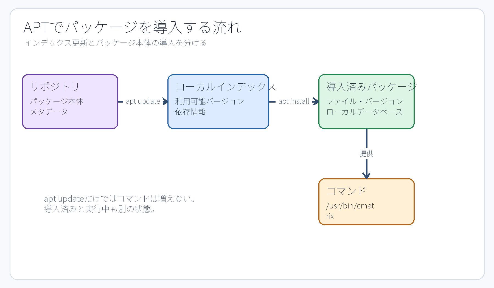

# 第9章 パッケージとソフトウェアの導入

## 9.1 パッケージが必要な理由

実用的なソフトウェアは、単一の実行ファイルだけで完結するとは限らない。動作に必要な共有ライブラリ、設定ファイルのテンプレート、マニュアル文書、データファイルなどを同時に必要とする。**パッケージ（package）**とは、これら関連するファイル群、バージョン情報、依存関係、およびシステムの導入・削除スクリプトをひとまとめにした配布単位である。

Ubuntuでは主に Debian パッケージ形式（`.deb`）を採用し、それを **APT（Advanced Package Tool）** で一括管理する。APT は**リポジトリ（repository）**から利用可能な最新のパッケージ情報を取得し、必要な依存ライブラリを自動で解決しながらシステムへ導入する。インターネット上から拾ってきた素性の知れないスクリプトを不用意に root 権限で直接実行することと、公式に信頼されたリポジトリから検証済みのパッケージを導入することは、セキュリティの観点から根本的に異なる行為である。



**図9-1　`apt update` はインデックス（一覧情報）を更新し、`apt install` がパッケージ本体を取得・導入する流れ。**

## 9.2 リポジトリとパッケージインデックス

**リポジトリ（repository）**とは、パッケージ本体とそれに付随するメタデータ（バージョンや依存関係の説明）を提供する配布拠点のサーバーである。手元のUbuntuシステムは、どのリポジトリにどのバージョンのパッケージが存在するかをローカルの**パッケージインデックス（一覧情報）**として保持している。

```bash
sudo apt update
apt show cmatrix
```

`apt update` は、リポジトリから利用可能なパッケージの一覧（インデックス）を最新状態に更新するコマンドである。これ自身は導入済みパッケージの本体を更新するコマンドではない。一方、導入済みパッケージ本体を新バージョンへ更新するコマンドは `apt upgrade` である。本演習環境では、意図しないシステム変更や演習条件の破壊を防ぐため、授業中に無関係なシステム全体のアップグレード（`apt upgrade`）を行ってはならない。

## 9.3 導入前に情報を確認する

```bash
apt show cmatrix
```

パッケージ名、バージョン、依存関係、ダウンロードサイズ、導入後の専有サイズ、機能説明を確認する。似た名前の別パッケージを誤って導入してはならない。なお、`apt` コマンドは自動化スクリプト向けに出力形式の互換性を保証しないという警告を出す場合があるため、厳密な自動スクリプトでは `apt-get` や `apt-cache` などを使い分けるのが通例である。本演習では人間が対話的に結果を確認・学習するため、使いやすい `apt` コマンドを使用する。

## 9.4 インストールと実行確認

```bash
sudo apt install cmatrix
command -v cmatrix
cmatrix
```

`sudo` 権限が必要となるのは、システム全体のパッケージデータベースや、管理者保護下にある `/usr/bin` などの配置領域を変更するためである。導入が完了したら、`command -v` を用いてシェルがどのパスの実行ファイルを認識しているかを確認する。`cmatrix` は `Ctrl+C` で終了できる。

パッケージがシステムに導入済みであることと、現在そのプロセスがメモリ上で動作していることは全く別の状態である。コマンドを終了させてもパッケージ自体はシステムに残り続ける。その一方で、サーバー系ソフトウェアのパッケージによっては、導入完了時にサービスプロセスを自動起動する設定になっているものもある。思い込みで判断せず、`systemctl` コマンドを用いて実際の稼働状態を確認することが重要である。

## 9.5 バージョンとファイルの所属を確認する

```bash
dpkg-query -W -f='${Package} ${Version}\n' cmatrix
dpkg -S /usr/bin/cmatrix
```

`dpkg-query` は、ローカルのパッケージデータベースから現在導入されている正確なバージョン情報を読み出す。`dpkg -S PATH` は、指定したファイルパスがどのパッケージによって提供・配置されたかを調べる。`command -v` が「シェルが実行対象として認識しているファイルパス」を答えるのに対し、`dpkg -S` は「そのファイルを管理しているパッケージの所属関係」を答えるものであり、両者は解決しようとしている問いが根本的に異なる。

## 9.6 削除とクリーンアップは今回の中心ではない

`apt remove`（本体削除）、`apt purge`（設定ファイルを含めた完全削除）、`apt autoremove`（不要になった依存パッケージの自動削除）には、それぞれ異なる影響範囲がある。本演習は指定されたパッケージを正しく導入し、その状態変化を観測することを目的としており、不要パッケージのクリーンアップは演習課題の範囲外としている。共通の演習環境や教員が用意したイメージにおいて、指示のないシステムパッケージを不用意に削除してはならない。

## 章末確認

1. `apt update` と `apt install` の役割の違いを、インデックス情報とパッケージ本体に着目して説明せよ。
2. `command -v cmatrix` と `dpkg -S /usr/bin/cmatrix` がそれぞれ何を調べるコマンドであるか、その違いを説明せよ。
3. パッケージが正常に導入（installed）されているにもかかわらず、対応するプロセスが動いていない具体的な状況を一例挙げよ。

## 参考資料

- Ubuntu Server documentation, [Install and manage packages](https://ubuntu.com/server/docs/how-to/software/package-management/)（2026-09-18確認）
- Ubuntu 24.04実機の`man apt`、`man dpkg-query`、`man dpkg`（制作時に確認）
