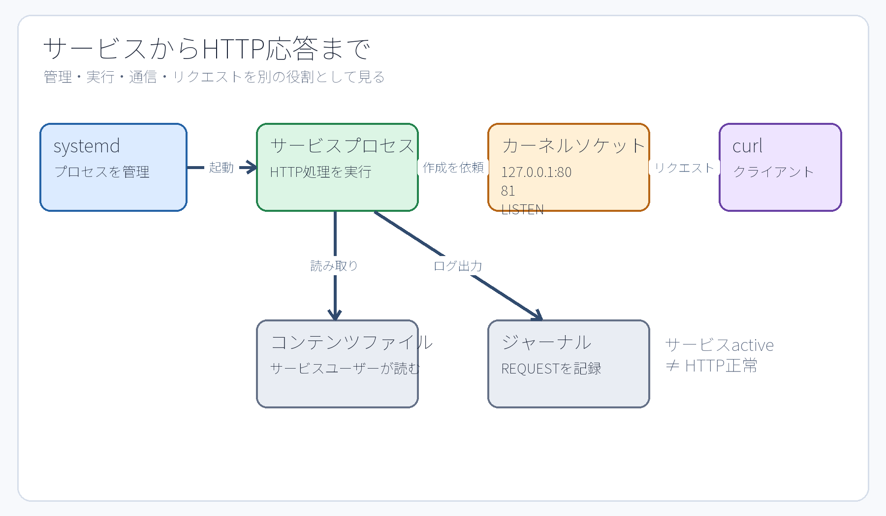
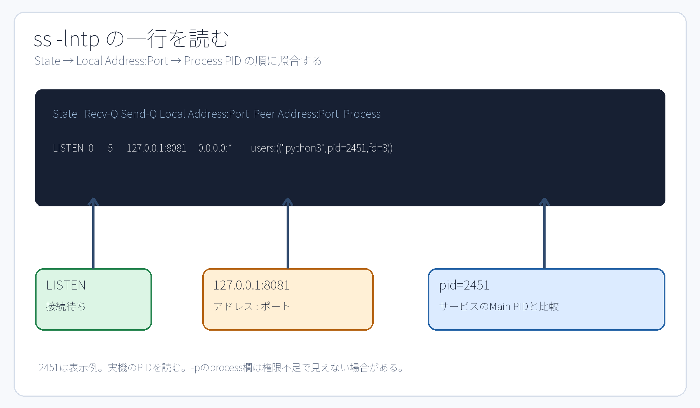

# 第11章 ソケット、HTTP、ログでサービスを観察する

## 11.1 サービス、プロセス、ソケットの関係

systemd はユニットの設定定義に従ってサービスプロセスを起動する。そのプログラムがネットワーク通信を必要とする場合、システムコールを通じてカーネルへ**ソケット（socket）**の作成を依頼する。カーネルはIPアドレス、通信プロトコル、ポート番号などに基づいて、外部からの通信データを該当するプロセスへ正しく届ける。

サービスが勝手にソケットを生み出すというよりは、「サービスとして動作するプログラムが、カーネルの提供するソケット機能を利用して通信を行っている」と理解するのが正確である。systemd の役割はそのプロセスを管理・監視することであり、ネットワーク通信の送受信処理そのものをすべて systemd が代行しているわけではない。



**図11-1　管理（systemd）、実行（プロセス）、通信機能（カーネル・ソケット）、クライアント要求（リクエスト）の各経路の分離構造。** 1つのサービスが複数のソケットを持つ場合や、ネットワーク通信を行わないサービスも存在する。

## 11.2 プロトコル、IPアドレス、ポート

本演習環境ではトランスポート層の通信プロトコルとして **TCP（Transmission Control Protocol）** を使用する。TCP はパケットの到達確認を行い、データを欠落なく順序どおりに届ける信頼性の高い通信方式である。3ウェイ・ハンドシェイク（handshake）、パケット再送、輻輳（ふくそう）制御などの詳細な仕組みは後続のネットワーク単元で扱う。

**IPアドレス**はネットワーク上のインターフェース（通信相手のホスト）を識別する。一方、**ポート（port）番号**は、同一ホスト内で動作しているどの通信窓口（どのプロセス）へデータを届けるかを識別するための番号である。「ポート番号そのものがプログラム」なのではない。カーネルがソケットの待受情報とポート番号を照合し、該当するプロセスへ通信データを引き渡す。

- `127.0.0.1`: IPv4の**ループバックアドレス（loopback）**。外部ネットワークからは直接到達できず、基本的に同一ホスト内からの通信のみを受け付ける。
- `0.0.0.0`: そのホストが持つすべてのIPv4ローカルアドレス（すべてのネットワークインターフェース）で待ち受けることを意味する特殊表記。
- `[::]`: すべてのIPv6ローカルアドレスで待ち受ける指定。OSの設定によってはIPv4通信も同時に受け付ける場合がある。

演習P5および課題M5では、セキュリティ上の到達範囲を明確に限定するため、`127.0.0.1`（ループバックアドレス）だけで待ち受ける構成をとる。ループバックで待受しているからといって「外部インターネットへ公開されている」わけではない。

## 11.3 待受ソケットを`ss`で読む

`ss`（Socket Statistics）は、カーネルが管理しているソケットの詳細な状態を表示するコマンドである。

```bash
sudo ss -lntp | grep ':8081'
```

- `-l`: 待受（LISTEN）状態のソケットのみを表示する。
- `-n`: サービス名（httpなど）へ逆引き変換せず、ポート番号の数値をそのまま表示する。
- `-t`: TCPソケットのみを表示する。
- `-p`: そのソケットを利用しているプロセスの情報（名前やPID）を表示する。表示には管理者権限が必要な場合がある。

概念上の例:

```text
State  Recv-Q Send-Q Local Address:Port Peer Address:Port Process
LISTEN 0      5      127.0.0.1:8081  0.0.0.0:*       users:(("python3",pid=2451,fd=3))
```

出力を読む順序は、状態（State: `LISTEN`）、待受アドレスとポート（Local Address:Port: `127.0.0.1:8081`）、そして利用プロセス情報（Process: `pid=...`）である。待受アドレスが `127.0.0.1:8081` であり、プロセス情報内の PID が systemd で確認したサービスの Main PID と一致しているかを照合する。なお、`2451` は教科書の表示例であり、必ず自身の環境で出力された実機の PID を読み取ること。



**図11-2　ss -lntp の出力行を、状態・アドレス・ポート・プロセス情報へ分解して照合する読み方。**

## 11.4 クライアントとサーバー、HTTP

**サーバー（server）**プロセスは、ソケットを作成してクライアントからの接続要求（リクエスト）を待ち受ける。**クライアント（client）**は、サーバーのソケットへ接続を確立し、リクエストを送信する。本演習環境では、同一のUbuntuホスト内で実行する `curl` コマンドがクライアントとなり、`jdu-web.service` のプロセスがサーバーとなる。

```bash
curl -i http://127.0.0.1:8081/
```

URL `http://127.0.0.1:8081/` において、`http` は通信プロトコル（スキーマ）、`127.0.0.1` は接続先ホスト、`8081` はポート番号、`/` はリクエスト対象のパスである。`-i` オプションは、応答本文（ボディ）だけでなく HTTP レスポンスヘッダーもあわせて表示する。

```text
HTTP/1.0 200 OK
Content-Type: text/plain

（本文）
```

`200`（200 OK）は、HTTP アプリケーション層におけるステータスコードである。「TCP レベルのネットワーク接続が成功したこと」「HTTP レベルの応答ヘッダーが返ってきたこと」「応答本文（ボディ）の内容が期待どおりであること」の3点は、それぞれ異なるレイヤーの成否として個別に検証する必要がある。

## 11.5 オープンポートとクローズドポートの比較

```bash
curl --max-time 2 http://127.0.0.1:18081/
sudo ss -lnt | grep ':18081'
```

対象のポートで接続を待ち受けるプロセス（リスナー）が存在しなければ、OSは接続拒否（Connection refused）を返すか、タイムアウトとなる。画面に出たエラーメッセージの文面だけで原因を決めつけてはならない。`ss` コマンドでリスナーが実際に存在するかを確認し、IPアドレスやポート番号の入力間違い、ファイアウォールによる遮断、ルーティング経路の不備などをレイヤーごとに論理的に切り分ける。本演習で登場するクローズドポート（閉じたポート）は、「リスナーが存在しない」という意図的な実験条件である。

## 11.6 サービスユーザーの読み取りアクセス権

Webサーバープロセスが要求されたコンテンツファイルを読み出してクライアントへ返すためには、そのサービスの実行ユーザーが、コンテンツファイル自身およびその親ディレクトリ群への正当なアクセス権（読み取り権限と実行権限）を保持していなければならない。

```bash
id jduweb
stat -c '%U:%G %a %n' /srv/jdu-web/index.txt
namei -l /srv/jdu-web/index.txt
sudo -u jduweb -- test -r /srv/jdu-web/index.txt
echo $?
```

`jduweb` ユーザーへ対話的に `su -` ログインできないことは何ら問題ではない。サービス専用ユーザーは不正利用防止のために対話シェルが無効化されているのが標準であり、第6章で学んだ `sudo -u` を用いることで、対話ログインを開くことなくそのユーザーの資格情報でファイルのアクセス可否を確実にテストできる。

## 11.7 ログはどこから来るのか

プログラムは動作中にさまざまなログメッセージを出力する。systemd 環境のログ収集デーモンである systemd-journald は、各サービスプロセスが出力した標準出力（stdout）や標準エラー出力（stderr）、およびシステムログメッセージを一元的に収集してバイナリ形式で蓄積する。`journalctl` コマンドは、その蓄積されたジャーナルログを閲覧・検索するために使用する。

```bash
curl -i http://127.0.0.1:8081/m5-check
sudo journalctl -u jdu-web.service --no-pager -n 20
```

`-u` は対象ユニットを指定してログを絞り込み、`-n 20` は直近の末尾20件を表示し、`--no-pager` はページャーを起動せず標準出力へ直接出力する。ここで `REQUEST path=/m5-check` というログ行を探し出す。リクエストを複数回送信すればログも複数行記録される。単なる時刻の文字列を暗記・転記するのではなく、指定されたリクエストパスと、現在のサービス起動（インボケーション）に対応したログが正しく記録されているかを確認することが目的である。

systemd にはサービスが起動されるたびに一意のインボケーションID（Invocation ID）を割り当てて各稼働期間を識別する機能がある。自動採点スクリプト（LabCheck）は現在の起動期間に対応するログであるかを厳密に照合しているが、学生自身がその内部IDの数値を暗記する必要はない。「過去の古い起動ログと、現在テストした動作のログを混同せず見分ける」という観測の姿勢を学ぶことが目的である。

## 11.8 観測結果を一つの鎖にする

演習P5および課題M5の確認手順は、次の多層的な因果関係を確実な証拠で結び付けていく。

```text
ユニット設定（unit file）
  ↓ systemctl start
サービスプロセス（Main PID・実行ユーザー）
  ↓ カーネルへソケット作成を依頼
127.0.0.1:port の待受ソケット（listening socket）
  ↓ curl による接続・リクエスト
HTTP ステータスコード・ヘッダー・本文
  ↓ プログラムによるログ出力
ジャーナル（journal）の REQUEST ログ記録
```

どれか1箇所の成功だけで、システム全体が正常に動いていると早合点してはならない。`systemctl`、`ss`、`curl`、`journalctl` は、それぞれ全く異なるレイヤーの事実を客観的に観測している。

## 章末確認

1. サービスが active（稼働中）であるにもかかわらず、HTTP 通信が失敗（エラー）となる具体的な原因の例を2つ挙げよ。
2. 待受アドレス `127.0.0.1:8081` と `0.0.0.0:8081` の違いを、外部ネットワークからの到達可能性に着目して説明せよ。
3. `ss` コマンドの出力にあるプロセスの PID と、systemd の Main PID を照合すべき技術的な理由を説明せよ。

## 参考資料

- Linux man-pages, [socket(7)](https://man7.org/linux/man-pages/man7/socket.7.html)（2026-09-18確認）
- Ubuntu 24.04実機の`man ss`、`man curl`、`man journalctl`（制作時に確認）
- 公開Lab v1.5.0のP5/M5 program、unit、checker（Lab固有値の正本）
