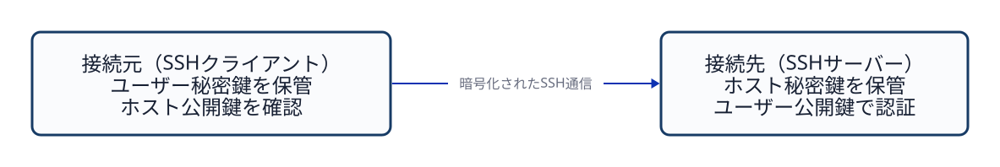
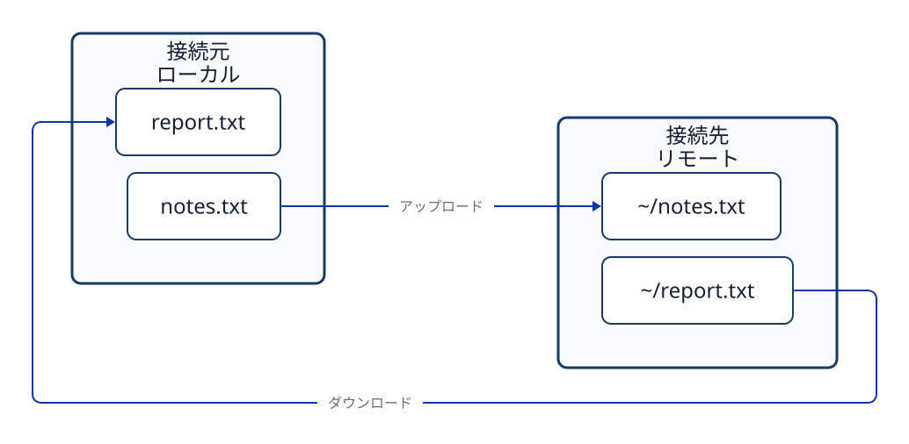

# 第12章 SSHによる遠隔操作とファイル転送

## 12.1 接続元と接続先

離れたコンピューターを操作するときは、コマンドを入力する側と、そのコマンドを受けて動く側を区別する。SSH接続を開始する側を**ローカル（local）**、接続先を**リモート（remote）**と呼ぶ。この呼び方は、操作する人の視点で決まる。ローカルが必ず手元の物理PCとは限らない。ブラウザで開いたクラウド上のターミナルからSSHを実行した場合、そのターミナルが動いている環境が接続元になる。

```text
コマンドを入力する環境（ローカル）
              ↓ SSH接続
コマンドを実行するサーバー（リモート）
```

接続前後で、ユーザー名、ホスト名、カレントディレクトリが変わることがある。例えば、接続元で `id -un`、`hostname`、`pwd` を実行すると接続元の状態が分かる。SSHでログインした後に同じコマンドを実行すると、今度は接続先の状態が分かる。`exit` でリモートのシェルを終了すると、元のローカルのシェルに戻る。プロンプトの見た目だけでは、どちらの環境にいるか判断しない。

## 12.2 SSHが守るもの

**SSH（Secure Shell）**は、離れたコンピューターとの間に暗号化された通信経路を作り、リモートのシェルやコマンドを利用できるようにする仕組みである。接続時には、主に次の二つの確認を行う。

1. **接続先の確認（ホスト認証）**：接続先が意図したサーバーかを、サーバーのホスト鍵で確認する。
2. **利用者の確認（ユーザー認証）**：接続するユーザーがログインを許可されているかを確認する。公開鍵認証では、利用者の鍵ペアを使う。

その後、操作コマンド、実行結果、転送データは暗号化されたSSH接続を通る。ただし、暗号化だけでサーバーに到達できるわけではない。接続元から接続先まで通信できる経路も必要である。また、SSHにログインできても、接続先のファイルを自由に読んだり変更したりできるわけではない。ログイン後の操作には、接続先OSのユーザーとアクセス権が適用される。



**図12-1　SSHでは、接続先を確かめるホスト鍵と、利用者を確かめるユーザー鍵が別の役割を持つ。**

## 12.3 ユーザー鍵とホスト鍵の置き場所

公開鍵認証では、接続する利用者の**秘密鍵（private key）**をSSHクライアント側で保管する。対応する**公開鍵（public key）**は、接続先のユーザーがログインを許可する鍵として、通常は接続先の `~/.ssh/authorized_keys` に登録する。SSHクライアントは秘密鍵を相手へ渡さずに、その鍵を持っていることを証明する。

一方、**ホスト鍵（host key）**はサーバーを識別するための鍵である。サーバーはホスト秘密鍵を保持する。クライアントは接続先から提示されたホスト公開鍵を確認し、信頼した記録を通常は `~/.ssh/known_hosts` に保存する。初めて接続するときに表示される鍵の指紋は、信頼できる経路で得た情報と照合してから受け入れる。知らない鍵を無条件に受け入れると、接続先のなりすましに気づけない。

| 鍵の種類 | 主な目的 | 秘密鍵の保管場所 | 公開鍵に関する情報 |
| --- | --- | --- | --- |
| ユーザー鍵 | 接続する利用者の認証 | 接続元 | 接続先の `authorized_keys` |
| ホスト鍵 | 接続先サーバーの確認 | 接続先 | 接続元の `known_hosts` など |

秘密鍵を公開したり、Gitリポジトリへ追加したりしない。秘密鍵ファイルを他の利用者が読める状態にすると、SSHクライアントが使用を拒否することもある。なお、表の `~` はそれぞれの環境のユーザーのホームディレクトリを表す。同じ文字でも、接続元と接続先では指す場所が異なる。

## 12.4 接続名と通信経路

SSHクライアントは、接続先ごとの設定を接続元の `~/.ssh/config` に記述できる。次は設定の一例である。

```text
Host study-server
    HostName server.example.edu
    User learner
    IdentityFile ~/.ssh/id_ed25519
```

この設定がある場合、`ssh study-server` と入力すると、SSHクライアントは `study-server` に対応するホスト名、ユーザー名、秘密鍵ファイルを使う。`Host` の値はSSH設定内の**別名（ホストエイリアス）**であり、DNSに登録されたホスト名とは別である。そのため、SSHでは使える別名が、SSH設定を読まない別のプログラムでは名前解決できないことがある。

接続先が直接到達できないネットワークにある場合は、踏み台や中継プログラムを経由してSSHの通信を届ける構成もある。OpenSSHでは `ProxyJump` や `ProxyCommand` などで経路を指定できる。これらは「どの経路で接続先へ届くか」の設定であり、「誰としてログインできるか」を決めるユーザー認証とは別である。正しい秘密鍵があっても、通信経路がなければ接続は成立しない。

## 12.5 対話ログインとリモートコマンド

`ssh study-server` を実行すると、認証後に接続先の対話シェルを開ける。これに対し、SSHコマンドの後ろに実行内容を付けると、接続先でその内容だけを実行し、結果を接続元へ返せる。

```bash
ssh study-server 'id -un; hostname; pwd'
```

この例の `id -un`、`hostname`、`pwd` は接続先で実行される。コマンド文字列を囲む外側のシングルクォートは、接続元のシェルが `$HOME` や `$(...)` を先に展開しないようにするためにも使える。たとえば `ssh study-server 'printf "%s\n" "$(hostname)" "$HOME"'` では、接続先のシェルがホスト名とホームディレクトリを調べる。外側をダブルクォートにすると、接続元のシェルが先に展開する。

`~` も、どちらのホスト・ユーザーのシェルが解釈するかで指すホームディレクトリが変わる。接続元の `~/notes.txt` と接続先の `~/notes.txt` は、同じ名前でも別のファイルである。

```bash
ssh study-server 'printf "%s\n" "$HOME" > "$HOME/home-path.txt"'
ssh study-server 'printf "%s\n" "$HOME"' > local-result.txt
```

一行目では `$HOME` の展開と `>` による保存が接続先で行われ、ファイルは接続先のホームディレクトリに作られる。二行目ではクォートの外にある `>` を接続元のシェルが解釈する。接続先から返った出力が、接続元の `local-result.txt` に保存される。どちらのシェルが文字列を解釈するかによって、同じ記号でも結果が変わる。

## 12.6 SCPでファイルを送受信する

`scp` はSSH接続と認証を利用してファイルを転送するコマンドである。基本形は `scp 転送元 転送先` であり、接続先のパスは `ホスト名:パス` と書く。

```bash
scp notes.txt study-server:~/notes.txt
scp study-server:~/report.txt report.txt
```

一行目は接続元の `notes.txt` を接続先へ送る**アップロード**である。二行目は接続先の `report.txt` を接続元へ受け取る**ダウンロード**である。コロン `:` の後ろの `~` は接続先ユーザーのホームディレクトリを指す。`study-server` のようなSSH設定の別名は `scp` でも使える。



**図12-2　コマンドを実行する側を基準に、アップロードとダウンロードの方向を区別する。**

転送元と転送先を逆にすると、意図とは反対の方向へファイルをコピーする。転送先に同名のファイルがある場合は上書きにも注意が必要である。接続元と接続先のファイルは、それぞれ別のファイルシステム上に存在する。

## 12.7 内容の一致とファイルの属性

転送後に二つのファイルの内容が同じかを確かめるには、両方のファイルで `sha256sum` を実行し、ハッシュ値を比較できる。

```bash
sha256sum notes.txt
ssh study-server 'sha256sum ~/notes.txt'
```

ハッシュ値の一致は、二つのファイルの**内容**が同じであることを確認する強い根拠になる。一方、所有者、グループ、アクセス権モード、保存場所はハッシュ計算に含まれない。転送先では別のユーザーがファイルの所有者になったり、アクセス権モードが異なったりする場合がある。これらの属性は接続先で `stat` を使って別に確認する。

```bash
ssh study-server 'stat -c "%U:%G %a %n" ~/notes.txt'
```

内容の確認と属性の確認は、答える問いが違う。`sha256sum` は「中身が同じか」、`stat` は「接続先で誰のファイルとして、どの権限で置かれているか」を調べる。

## 章末問題

### 問1

ブラウザで開いたクラウド上のターミナルから別のサーバーへSSH接続する。このとき、ローカルとリモートはそれぞれどの環境か。

### 問2

SSHのユーザー鍵とホスト鍵は、それぞれ何を確認するために使うか。また、ユーザー秘密鍵はどちらに置くか。

### 問3

SSH設定のホストエイリアスとDNSホスト名はどう違うか。正しい鍵を持っていても接続できない場合がある理由も述べよ。

### 問4

次の二つのコマンドでは、`$HOME` の展開と結果の保存はそれぞれどちらの環境で行われるか。

```bash
ssh study-server 'printf "%s\n" "$HOME" > "$HOME/home-path.txt"'
ssh study-server 'printf "%s\n" "$HOME"' > local-result.txt
```

### 問5

`scp` で転送した二つのファイルのSHA-256ハッシュ値が一致した。所有者とアクセス権モードも同じだと言えるか。

## 章末解答

### 問1

**答え：** SSHコマンドを実行するクラウド上のターミナル環境がローカルで、接続先のサーバーがリモートである。ブラウザを表示する物理PCが必ずローカルになるわけではない。

### 問2

**答え：** ユーザー鍵は接続する利用者を認証し、ホスト鍵は接続先サーバーを確認する。ユーザー秘密鍵は接続元に保管し、接続先へ渡さない。

### 問3

**答え：** ホストエイリアスは接続元のSSH設定で使う別名であり、DNSホスト名とは限らない。鍵が正しくても、接続先まで通信できる経路がなければSSH接続は成立しない。

### 問4

**答え：** どちらも `$HOME` は接続先で展開される。一行目の `>` は引用符の内側にあるため接続先で保存する。二行目の `>` は引用符の外側にあるため接続元で保存する。

### 問5

**答え：** 言えない。ハッシュ値はファイルの内容を比較するものであり、所有者とアクセス権モードは含まない。これらは転送先で `stat` などを使って別に確認する。

## 参考資料

- Ubuntu Server documentation, [OpenSSH server](https://ubuntu.com/server/docs/how-to/security/openssh-server/)（2026-09-24確認）
- OpenBSD manual pages, [ssh(1)](https://man.openbsd.org/ssh)、[ssh_config(5)](https://man.openbsd.org/ssh_config)、[scp(1)](https://man.openbsd.org/scp)（2026-09-24確認）
- GNU Coreutils, [sha256sum(1)](https://man7.org/linux/man-pages/man1/sha256sum.1.html)（2026-09-24確認）
