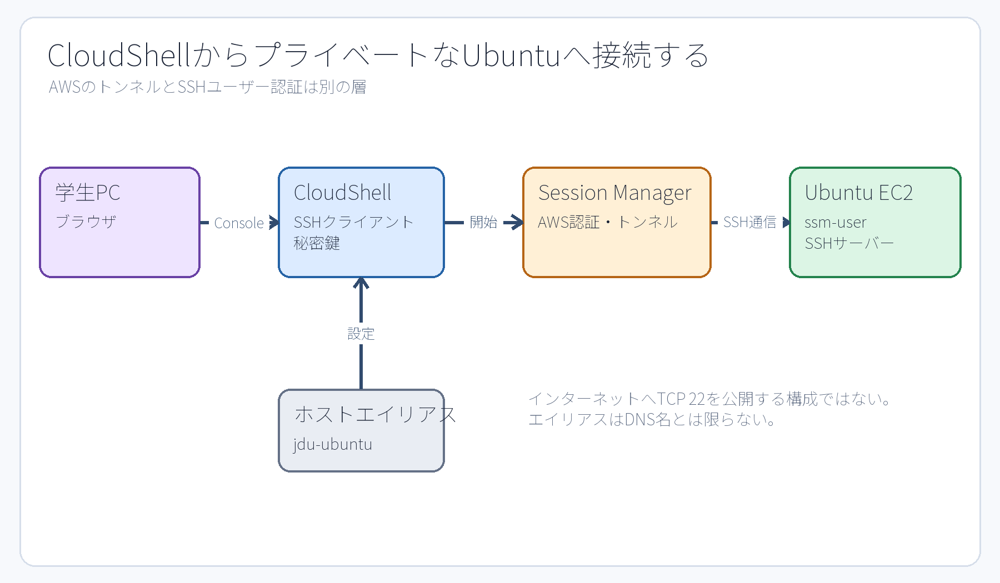
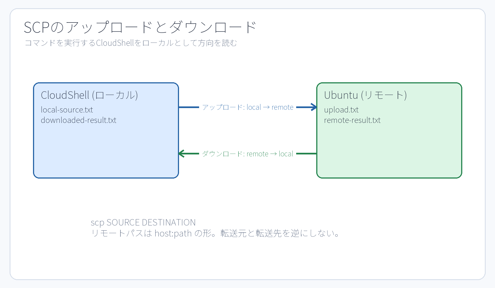

# 第12章 SSHと二つの環境、ファイル転送

## 12.1 ローカルとリモートは立場を表す

SSH通信において、接続や転送の起点（開始側）となる環境を**ローカル（local）**、接続先となる遠隔環境を**リモート（remote）**と呼ぶ。演習P6および課題M6においては、操作の起点となる AWS CloudShell が「ローカル」、演習対象の Ubuntu EC2 インスタンスが「リモート」である。学生の物理PCはブラウザを表示しているクライアントにすぎず、実際にファイル転送コマンドなどを発行・実行する現場は CloudShell である点に留意する。

```text
学生PCのブラウザ
  └─ CloudShell（ローカル）
       └─ SSH over Session Manager トンネル
            └─ Ubuntu EC2（リモート）
```

このように、「ローカル」とは「手元の物理PC」と常に同義であるわけではない。自分がどのターミナル環境でコマンドを実行しているかによって、ローカルとリモートの相対的な立場が決まる。

## 12.2 SSHが行う三つのこと

**SSH（Secure Shell）**は、主に通信経路の暗号化、接続先ホストの正当性の確認、および操作ユーザーの**認証（authentication）**を行い、リモート環境のシェルやコマンドを安全に実行するための仕組みである。

- **ユーザー鍵ペア（user key pair）**: クライアント側が保持する**秘密鍵（private key）**と、サーバー側があらかじめ信頼・登録している**公開鍵（public key）**の数学的一致を検証し、ユーザー本人であることを認証する。
- **ホスト鍵（host key）**: クライアントが接続先サーバーの正当性（真正性）を確認し、中間のなりすましを防ぐ。
- **暗号化チャネル（encrypted channel）**: ネットワーク上を流れるコマンド、実行結果、転送データなどの平文通信を暗号化して盗聴や改ざんから保護する。

秘密鍵は決して外部に公開・提出したり、Gitリポジトリへコミットしてはならない。また、秘密鍵ファイルのアクセス権を他者が読めるように緩めてはならない（SSHクライアントが警告を出して接続を拒絶する）。本演習環境では、初期構築処理によって CloudShell 側に必要な鍵と設定ファイルが自動的に準備されている。

## 12.3 エイリアス `jdu-ubuntu` はDNS名とは限らない

```bash
ssh jdu-ubuntu
```

`jdu-ubuntu` は、本演習環境のSSH設定ファイル（`~/.ssh/config`）内に定義された**ホストエイリアス（Host alias: 別名）**である。一般的なDNSサーバーで名前解決できる正式なインターネットホスト名とは限らない。そのため、`ping jdu-ubuntu` を実行したり、SSH設定を参照しない別のネットワークツールで名前解決に失敗したとしても、技術的な矛盾ではない。

このエイリアスの定義には、AWS Systems Manager のセッション機能（Session Manager）を利用して通信をトンネリングする `ProxyCommand` などの設定が組み込まれている。これは、プライベートサブネット内にある Ubuntu サーバーに対して、インターネットから TCP 22 ポートを危険に直接公開することなく、安全にSSH接続を確立するための構成である。



**図12-1　AWS認証によってセッショントンネルを確立する層と、SSHがUbuntuユーザーを公開鍵認証する層は独立している。**

AWSマネジメントコンソールへのログイン認証、Session Manager を開始するための AWS IAM 権限、そしてSSH公開鍵による Ubuntu OS 上のユーザー認証は、それぞれ全く異なるセキュリティレイヤーに属している。

## 12.4 今どちらにいるか確認する

CloudShell 側での確認:

```bash
id -un
hostname
pwd
```

Ubuntu へ接続した後の確認:

```bash
ssh jdu-ubuntu
id -un
hostname
pwd
exit
```

`exit` でログアウトした後は、手元の CloudShell 側で同じ3つの確認コマンドを再実行する。プロンプトの見た目だけに頼らず、OSの返す正確な値で現在地を把握する。

## 12.5 リモートコマンドの実行

対話的なログインシェルを開くことなく、単一のコマンドだけをリモート環境で直接実行させることができる。

```bash
ssh jdu-ubuntu 'id -un; hostname; pwd'
```

コマンド全体を外側からシングルクォートで囲むことにより、内部のコマンド文字列が CloudShell で展開されることなく、そのままリモートの Ubuntu 側のシェルへ渡されて解釈・実行される。課題M6では、リモート側の数値を手作業で転記するのではなく、このリモートコマンドの仕組みを活用してサーバー側のファイルへ直接記録する。

```bash
ssh jdu-ubuntu 'cd ~/jdu-lab/m6 && printf "REMOTE_USER=%s\nREMOTE_HOST=%s\nREMOTE_PATH=%s\n" "$(id -un)" "$(hostname)" "$HOME" > remote-result.txt'
```

この一行は次の処理を Ubuntu 側で順次実行する。

1. リモート側の `~/jdu-lab/m6` ディレクトリへ移動する。
2. Ubuntu 側でユーザー名、ホスト名、ホームディレクトリのパスを正しく取得・展開する。
3. 取得した3行の環境情報を `remote-result.txt` へ上書き保存する。

## 12.6 SCPの転送元と転送先

`scp`（Secure Copy）は、SSHの認証・暗号化機構を利用して、ネットワークを介した安全なファイル転送を行うコマンドである。

ローカルからリモートへアップロード:

```bash
scp local-source.txt jdu-ubuntu:~/jdu-lab/m6/upload.txt
```

リモートからローカルへダウンロード:

```bash
scp jdu-ubuntu:~/jdu-lab/m6/remote-result.txt downloaded-result.txt
```

コロン `:` の左側が SSH の接続先ホスト（エイリアス）、右側がリモート環境におけるパスである。転送元（source）と転送先（destination）の指定順序を逆にしてしまうと、意図とは正反対の転送や、大切なファイルへの誤った上書き事故を招く。転送を実行する前に、`pwd` と `ls` でローカル側のファイルを確認し、リモート側のパスは `ssh ... 'ls -l ...'` コマンドであらかじめ確認しておくことが肝要である。



**図12-2　コマンドを実行する CloudShell（ローカル）を基準とした、アップロードとダウンロードの転送方向。**

## 12.7 内容、所有者、アクセス権モードを別々に確認する

```bash
sha256sum local-source.txt
ssh jdu-ubuntu 'sha256sum ~/jdu-lab/m6/upload.txt'
ssh jdu-ubuntu 'stat -c "%U:%G %a %n" ~/jdu-lab/m6/upload.txt'
```

計算された SHA-256 ハッシュ値が両環境で完全に一致していれば、実用上ファイルの内容（データ本体）が同一である極めて強力な証拠となる。しかし、ハッシュ値の一致は、ファイルの所有者、グループ、アクセス権モード、配置パスまで同一であることを保証するものではない。Ubuntu 側にアップロードされたファイルが `ssm-user` 所有であり、かつアクセス権モードが `644` であるという要件は、別途 `stat` コマンドを用いて客観的に確認しなければならない。

```bash
ssh jdu-ubuntu 'chmod 644 ~/jdu-lab/m6/upload.txt'
```

上記のコマンドは、CloudShell 側から SSH 経由でリモートファイルのアクセス権モードを変更している。もしすでに Ubuntu 側に対話ログインしている状態であれば、Ubuntu 上で直接 `chmod 644 ~/jdu-lab/m6/upload.txt` を実行すればよい。自分が現在どちらの環境で作業しているのかを常に把握し、手順を混同してはならない。

## 12.8 M6は二つの環境で判定結果を持つ

課題M6の自動判定では、Ubuntu 側においてアップロードされたファイルの状態と remote-result の内容を2件検証する。一方、CloudShell 側においてはローカル元ファイル、アップロード内容の一致、リモート結果の取得、ダウンロード内容の一致という4件を検証する。

```text
M6 Ubuntu    2/2
M6 CloudShell 4/4
合計          6/6
```

同一の `jdu-check M6` という判定コマンドであっても、実行した環境（Ubuntu か CloudShell か）によって動作するチェックロジックが異なる。片方の環境で PASS しただけでは課題M6の完了とはならない。進捗ダッシュボードは両環境の最新判定結果をそれぞれ個別に管理・合算している。

## 章末確認

1. 演習P6および課題M6において、「ローカル（local）」とは具体的にどのコンピューター環境を指すか。
2. SSHのホストエイリアス（Host alias）と、一般的なDNSホスト名の違いを説明せよ。
3. ファイルの SHA-256 ハッシュ値が一致したことだけでは、所有者やアクセス権モードの一致を証明できない理由を説明せよ。

## 参考資料

- AWS Systems Manager, [Allow and control permissions for SSH connections through Session Manager](https://docs.aws.amazon.com/systems-manager/latest/userguide/session-manager-getting-started-enable-ssh-connections.html)（2026-09-18確認）
- Ubuntu 24.04実機の`man ssh`、`man ssh_config`、`man scp`、`man sha256sum`（制作時に確認）
- 公開Lab v1.5.0のSSH生成処理、P6/M6 checker（Lab固有構成の正本）
