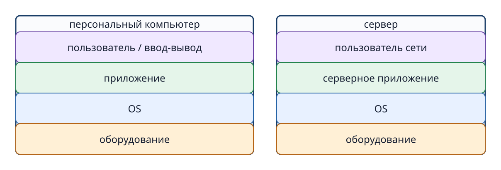
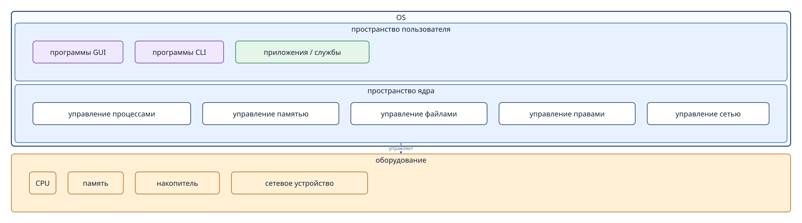
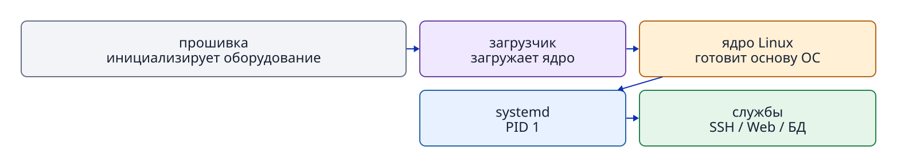
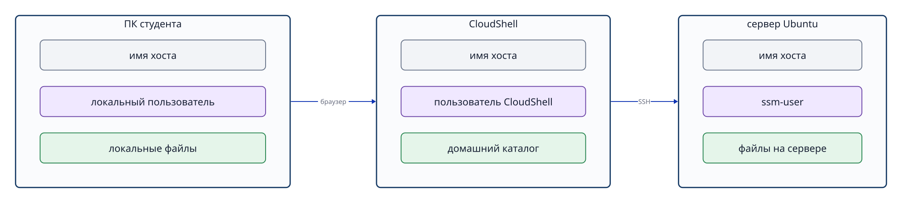

# Глава 1. Компьютер и операционная система

## Вопросы, на которые вы сможете ответить

- Из каких основных компонентов и устройств ввода-вывода состоит компьютер?
- Что общего у персонального компьютера и сервера и чем они различаются?
- Что делает ОС между пользователем, приложениями и оборудованием?
- Чем пространство пользователя отличается от пространства ядра?
- В каком порядке запускается система Linux и её службы?
- Как определяются пользователь, хост и процесс?

## 1.1 Из чего состоит компьютер

Компьютер — устройство, которое обрабатывает входные данные по инструкциям программы, а результат выводит или сохраняет. Ноутбук, настольный компьютер, смартфон и виртуальный сервер в облаке различаются внешним видом и назначением, но имеют общие основные компоненты.

- **CPU (процессор)** читает инструкции программы и выполняет вычисления и логические операции.
- **Оперативная память** временно хранит работающую программу и данные, которые нужны ей сейчас.
- **Накопитель** сохраняет программы, настройки, документы, данные и журналы после выключения питания. Примеры — SSD и виртуальный диск.
- **Устройство ввода** принимает действия пользователя или внешние данные: клавиатура, мышь, сенсорный экран.
- **Устройство вывода** передаёт результат человеку: монитор, динамики, принтер.
- **Сетевое устройство** обменивается данными с другими компьютерами.

Когда пользователь нажимает клавишу, процессор и накопитель сами по себе не понимают его намерение. Нужен общий механизм, который передаст ввод приложению, выделит ему процессорное время и память, прочитает или запишет файлы и вернёт результат на экран или в сеть. Центральную роль в этом механизме играет **операционная система (ОС)**.

## 1.2 Персональный компьютер и сервер — компьютеры одного типа

**Персональным компьютером (ПК)** обычно управляет человек перед ним, используя клавиатуру, мышь и экран. **Сервер** предоставляет функции или данные другим компьютерам по сети. Веб-сервер отдаёт страницы, сервер базы данных хранит и ищет данные, DNS-сервер сопоставляет имена и IP-адреса.

Сервер не работает по какому-то иному принципу. И ПК, и сервер имеют процессор, память, накопитель, сеть, ОС и приложения. Различаются главным образом назначение, производительность, способ подключения и требования к непрерывной работе. У сервера часто нет постоянно подключённых клавиатуры и монитора; администратор управляет им по сети с другого компьютера. Инстанс AWS EC2 — виртуальный компьютер в инфраструктуре AWS. В этом курсе мы используем его как сервер.



**Рисунок 1-1. Несмотря на разное назначение и способы управления, ПК и сервер имеют общую основу: приложения, ОС и оборудование.**

## 1.3 Чем управляет ОС

Когда одновременно работают несколько приложений, нельзя позволять каждому из них бесконтрольно занимать процессор и память или читать чужие файлы. ОС находится между оборудованием и приложениями: распределяет ресурсы, предоставляет общие способы их использования и защищает данные.

В этой книге функции ОС сгруппированы в четыре области.

1. **Управление выполнением**: запуск программ как процессов, распределение процессорного времени, отслеживание состояния процессов.
2. **Управление памятью и файлами**: выделение памяти процессам, представление данных накопителя в виде файлов и каталогов.
3. **Управление пользователями и защитой**: определение того, кто может читать, изменять и запускать объекты, с помощью пользователей, групп и прав доступа.
4. **Управление обменом данными**: предоставление общих механизмов, например сокетов, для сетевого взаимодействия процессов.

Благодаря общим функциям ОС разработчику приложения не приходится заново писать прямое управление процессором и диском для каждой модели компьютера.

## 1.4 GUI, CLI и команда

Способ, которым человек передаёт указания компьютеру, называется **пользовательским интерфейсом**. Два распространённых вида — GUI и CLI.

- **GUI (Graphical User Interface, графический интерфейс)** показывает окна, значки, меню и кнопки. Команды обычно задаются мышью или касанием.
- **CLI (Command Line Interface, интерфейс командной строки)** принимает текстовые команды и показывает результат текстом.

Отдельное указание, вводимое в CLI, называется **командой**. За её именем при необходимости следуют параметры и объект обработки. Например, команда `cat` последовательно читает файл и выводит его содержимое в стандартный вывод.

```bash
cat /etc/os-release
```

Здесь `cat` — имя команды, а `/etc/os-release` — путь к читаемому файлу. Введённую строку разбирает командная оболочка, после чего запускается программа `cat`. Она запрашивает у ОС чтение файла; ОС сначала проверяет права доступа и затем передаёт содержимое. Разницу между командой, терминалом и оболочкой, а также основные приёмы работы мы подробно рассмотрим в главе 3.

## 1.5 Пространство пользователя и пространство ядра

Работающую систему Linux удобно мысленно разделять на **пространство пользователя (user space)** и **пространство ядра (kernel space)**.

**Ядро** — центральная часть ОС. Оно управляет процессором, памятью, устройствами, файловой системой, процессами, правами доступа и сетью. Ядро обладает широкими полномочиями и работает в пространстве ядра, отделённом от обычных приложений.

Программы графического интерфейса, терминал, оболочка, команды, веб-сервер и база данных обычно работают в пространстве пользователя. GUI и CLI — не отдельные «пространства»: это способы взаимодействия и соответствующие программы в пространстве пользователя. Приложения тоже работают там и при необходимости обращаются к ядру.

Механизм обращения через эту границу к функциям ядра называется **системным вызовом (system call)**. В этой книге не нужно изучать номера системных вызовов или программирование с ними. Достаточно понимать, что это контролируемый вход к защищённым функциям ядра для программы из пространства пользователя.



**Рисунок 1-2. В широком смысле среда ОС включает программы пространства пользователя и управляющее оборудованием ядро.**

Слово «ОС» иногда обозначает преимущественно ядро, а иногда — всю систему вместе с базовыми командами и управляющими программами. Там, где это различие важно, мы отдельно говорим «ядро» и «программы пространства пользователя».

## 1.6 Linux и Ubuntu

Изначально **Linux** — название ядра. Но чтобы получить готовую к работе систему, кроме ядра нужны базовые команды, оболочка, библиотеки, управление пакетами и службами. Набор этих компонентов, собранный для установки и обновления, называется **дистрибутивом Linux**.

Ubuntu, Debian и Fedora — примеры дистрибутивов Linux. Для единой практической среды в этом курсе используется Ubuntu Server 24.04 LTS. Однако мы изучаем не столько конкретный продукт Ubuntu, сколько общие принципы и операции Linux. Историю и различия дистрибутивов рассмотрим в главе 2.

## 1.7 От включения питания до запуска служб

Программа, лежащая на накопителе, сама по себе ничего не делает. Когда её загружают в память и процессор выполняет её инструкции, возникает **процесс**. Для различения процессов ОС присваивает каждому **PID (идентификатор процесса)**.

В общих чертах загрузка Linux проходит так:

1. После включения питания прошивка инициализирует процессор, память и накопитель.
2. Загрузчик помещает ядро Linux в память.
3. Ядро подготавливает память, устройства и файловую систему к работе.
4. Ядро запускает первый управляющий процесс в пространстве пользователя.
5. В Ubuntu Server 24.04 таким процессом выступает `systemd`; он получает PID 1.
6. `systemd` читает конфигурацию и зависимости, затем запускает и контролирует службы, необходимые для сети, SSH, журналирования, веб-сервера, базы данных и других функций.

**Служба** — управляемая программа, которая предоставляет функцию в фоновом режиме без необходимости каждый раз запускать её вручную через экран. При запуске службы начинает работать один или несколько процессов. Например, у сервера базы данных служба служит объектом управления, а её процессы выполняются в памяти, читают и записывают файлы и при необходимости ожидают сетевые запросы.

`systemd` не выполняет сам обработку запросов к базе данных или веб-сайту. Он управляет тем, какие службы, когда, в каком порядке и от имени какого пользователя запускать. PID, родственные связи процессов и сигналы подробнее описаны в главе 8, а `systemd`, службы и юниты — в главе 10.



**Рисунок 1-3. Ядро запускает первый процесс пространства пользователя; затем systemd запускает процессы служб в нужном порядке.**

## 1.8 Как различать хосты и пользователей

Компьютер или виртуальная машина, подключённые к сети и работающие как самостоятельная среда ОС, называются **хостом (host)**. Для идентификации хосту задают **имя хоста (hostname)**. Это имя компьютера, а не человека.

На одном хосте можно создать несколько учётных записей пользователей. ОС хранит числовые идентификаторы пользователя и его групп. **UID (user ID)** определяет пользователя, **GID (group ID)** — группу. Команда `id` показывает имя и UID текущего пользователя, основную и дополнительные группы.

В практической части используются несколько хостов: ПК студента, AWS CloudShell и Ubuntu EC2. Поля для ввода текста могут выглядеть одинаково, но у каждого хоста собственные ОС, пользователи, процессы и файлы. Чтобы понять, где и от чьего имени вы работаете, проверьте имя пользователя, имя хоста и текущий каталог.

```bash
id
hostname
pwd
```

`id` показывает сведения о пользователе и группах, `hostname` — имя хоста, `pwd` — текущий рабочий каталог. Управление пользователями объясняется в главе 6, файлы и пути — в главе 4, а связь CloudShell с Ubuntu — в главе 12.



**Рисунок 1-4. У каждого хоста собственная среда ОС, в которой отдельно управляются пользователи, процессы и файлы.**

## Вопросы в конце главы

### Вопрос 1. Что общего у ПК и сервера и чем они различаются?

### Вопрос 2. Как связаны GUI, CLI, пространство пользователя и пространство ядра?

### Вопрос 3. Чем отличаются программа, процесс и служба?

### Вопрос 4. Что делает systemd с PID 1?

### Вопрос 5. Чем имя хоста отличается от имени пользователя?

## Ответы на вопросы главы

### Вопрос 1

**Ответ:** оба являются компьютерами с процессором, памятью, накопителем, сетью, ОС и приложениями. ПК преимущественно рассчитан на непосредственное взаимодействие с человеком, а сервер — на предоставление функций и данных другим компьютерам по сети.

### Вопрос 2

**Ответ:** GUI и CLI — способы управления; реализующие их программы обычно работают в пространстве пользователя. Через системные вызовы они используют функции пространства ядра. Ядро управляет оборудованием и ресурсами ОС.

### Вопрос 3

**Ответ:** программа — набор инструкций, сохранённых на накопителе. Процесс — экземпляр выполняемой программы, загруженный в память. Служба — управляемая `systemd` или другой системой единица для предоставления постоянной функции; фактически её выполняют один или несколько процессов.

### Вопрос 4

**Ответ:** в Ubuntu Server 24.04 первым управляющим процессом пространства пользователя, который запускает ядро, является `systemd` с PID 1. По конфигурации и зависимостям он запускает, останавливает и отслеживает службы.

### Вопрос 5

**Ответ:** имя хоста определяет компьютер или виртуальную машину с ОС, а имя пользователя — учётную запись с определёнными правами на этом хосте. На одном хосте может быть несколько пользователей.

## Источники

- Linux Kernel Organization, [The Linux Kernel documentation](https://docs.kernel.org/) (проверено 2026-09-21).
- Linux man-pages, [intro(2) — introduction to system calls](https://man7.org/linux/man-pages/man2/intro.2.html) (проверено 2026-09-21).
- Ubuntu Manpages, [boot(7) — system bootup process](https://manpages.ubuntu.com/manpages/jammy/man7/boot.7.html) (проверено 2026-09-21).
- Ubuntu Server documentation, [Ubuntu Server documentation](https://ubuntu.com/server/docs/) (проверено 2026-09-21).
