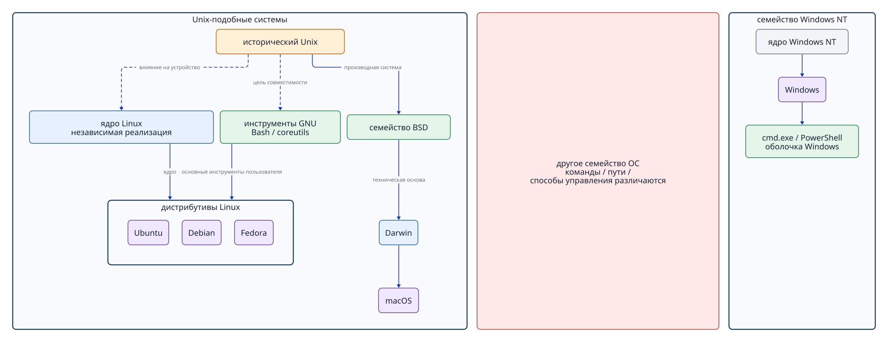
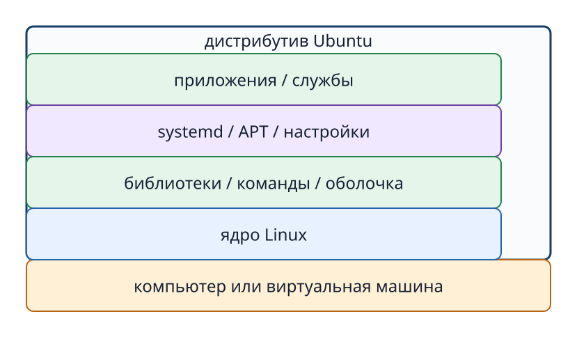

# Глава 2. От Unix до современных ОС

## Зачем изучать историю

Цель исторического обзора — не запомнить даты. Он помогает понять, почему Linux, macOS и Windows используют похожие термины, но нередко разные команды. Важно избежать ошибок: «Linux прямо унаследовал исходный код Unix», «macOS — разновидность Linux», «Windows произошла от Unix».

## 2.1 Идеи Unix

Разработка Unix началась в Bell Labs в 1969 году. По мере развития Unix распространил принципы, применяемые и в современных ОС: иерархическую файловую систему, процессы, работу нескольких пользователей и сочетание небольших инструментов.

**Фото 2-1. Сохранившийся DEC PDP-7 — модель, использованная при ранней разработке Unix. Снимок сделан в музее США в 2018 году: ComputerGeek7066, [Wikimedia Commons](https://commons.wikimedia.org/wiki/File:DEC_PDP-7.jpg), [CC BY-SA 4.0](https://creativecommons.org/licenses/by-sa/4.0/); изображение не изменено.**

На фотографии не конкретная машина из Bell Labs. PDP-7 выпускался в 1960-е годы, и на компьютере этой модели работал ранний Unix.

Эти идеи связаны с нашей практикой: файлы расположены в иерархии каталогов; работающие программы наблюдаются как процессы; права разграничиваются по пользователям и группам; вывод `grep` передаётся другой команде или в файл. Такая модель работы давно применяется в Unix-подобных системах.

«Unix» — не название единого набора команд. Системы, испытавшие его влияние, не обязательно используют один и тот же исходный код или официально сертифицированы на торговую марку UNIX. Систему с похожей организацией и интерфейсами обычно называют **Unix-подобной (Unix-like)**. Классификацию по принципам устройства следует отличать от формальной сертификации продукта.

## 2.2 GNU и свободная Unix-совместимая среда

Проект GNU был объявлен в 1983 году. Его цель — создать свободную программную систему, совместимую с Unix. Были разработаны оболочки, компиляторы и многие базовые утилиты. Во многих современных дистрибутивах Linux вокруг ядра работает разнообразное ПО, в том числе инструменты GNU.

**Командная оболочка (shell)** — программа пространства пользователя. Она читает введённый текст, разбирает его как команду и запускает нужные программы. Оболочка не ограничивается запуском одной команды: она разбирает аргументы, организует перенаправление ввода и вывода и конвейеры, подставляет значения переменных среды, последовательно выполняет команды сценария. Так она связывает действия пользователя с множеством инструментов.

**Bash** — одна из оболочек проекта GNU. Название происходит от «Bourne-Again Shell». Bash не является ни ядром Linux, ни окном терминала. Он разбирает текст, введённый в терминале Ubuntu, и запускает программы, например `ls` и `cp`. Операция `cd`, меняющая состояние самой оболочки, выполняется встроенной командой Bash. Отличия терминала, оболочки и команды подробно рассмотрены в главе 3.

Само по себе ядро ещё не составляет систему, с которой работает студент. Bash предоставляет оболочку, GNU coreutils — базовые команды вроде `ls` и `cp`. Практически полезная система возникает при соединении ядра с менеджером пакетов, `systemd`, библиотеками, файлами конфигурации и приложениями.

## 2.3 Linux — независимо созданное ядро

Разработка ядра Linux началась в 1991 году. Оно создавалось с функциями и интерфейсами, похожими на Unix, но не возникло как прямая ветвь исторического исходного кода Unix. Поэтому на схеме происхождения ОС связь Unix и Linux следует изображать как влияние идей или стремление к совместимости, а не как прямое наследование кода.

Ядро Linux отвечает за низкоуровневую работу процессов, памяти, файловой системы, устройств и сети. Ubuntu — дистрибутив, который объединяет ядро Linux с пользовательскими инструментами, пакетами, начальными настройками и политикой выпусков.

Семейство Windows NT, напротив, проектировалось отдельно от Unix-подобных систем. `cmd.exe` и PowerShell в Windows тоже являются командными оболочками, но отличаются от Bash синтаксисом, встроенными командами, записью путей и способами администрирования. Существуют похожие названия команд и программы, работающие на нескольких ОС, однако рассчитывать на полную взаимозаменяемость команд Unix-подобных систем и Windows нельзя. Bash — не сам Linux, а одна из оболочек, доступных и в Linux, и в macOS.

**Рисунок 2-1. Unix-подобное семейство и семейство Windows NT имеют разное происхождение; одинаковые команды не гарантированы.** Linux независимо реализует похожие на Unix интерфейсы, а macOS не происходит от Linux.

## 2.4 Дистрибутив выбирает и объединяет компоненты

На ядре Linux построены разные дистрибутивы: Ubuntu, Debian, Fedora и другие. Каждый выбирает программное обеспечение, формат пакетов, правила обновления, начальные настройки и срок поддержки.

Для практики в этом курсе используется Ubuntu Server 24.04 LTS. Команды `ls` и `grep` часто работают и в других дистрибутивах, но команды управления пакетами, расположение настроек, механизмы безопасности и начальная конфигурация служб могут различаться. Инструкции для Red Hat/RHEL нельзя без проверки применять к Ubuntu.

**Рисунок 2-2. Дистрибутив объединяет ядро Linux, библиотеки, базовые команды, системное управление, пакеты и приложения.** Ubuntu и Linux не следует считать полными синонимами.

## 2.5 Основа macOS — Darwin

В основе современной macOS лежит Darwin. По документации Apple он включает технологии Mach, BSD и собственные разработки Apple. Благодаря технологиям BSD, связанным с процессами, правами доступа и сетью, в терминале macOS доступны команды и пути, похожие на Unix-подобные.

Однако macOS — не дистрибутив Linux: её ядро не Linux. Кроме того, macOS включает графическую систему и платформенные компоненты Apple, не сводящиеся к Darwin. Следует также различать старую Classic Mac OS и линию на основе Darwin, начавшуюся с Mac OS X.

## 2.6 Windows — отдельная линия развития

У ранних потребительских версий Windows существовала линия на основе MS-DOS, например Windows 95/98. Линия Windows NT, ведущая к современной Windows, была спроектирована отдельно. Windows 2000, XP и более поздние версии нельзя изображать как простое ответвление Unix.

В Windows есть режим ядра и режим пользователя, процессы, права доступа к файлам, службы, сетевые сокеты и CLI. Эти общие черты объясняются тем, что современные ОС решают похожие задачи, а не происхождением Windows от Unix. Наличие PowerShell или Windows Subsystem for Linux (WSL) также не превращает само ядро Windows в Linux.

## 2.7 Как сопоставлять общее и различное

| Критерий | Ubuntu/Linux | macOS | Windows |
| --- | --- | --- | --- |
| Ядро | Linux | Darwin (включая Mach и BSD) | семейство Windows NT |
| Типичный CLI | оболочка и Unix-подобные инструменты | оболочка и инструменты BSD/Unix | PowerShell, cmd и др. |
| Пример пути | `/home/user` | `/Users/user` | `C:\Users\user` |
| Установка ПО | менеджер пакетов дистрибутива | App Store, установщики, менеджеры пакетов | Microsoft Store, установщики, менеджеры пакетов |
| Роль в курсе | практическая среда | объект сравнения | объект сравнения |

Даже при одинаковом назначении конкретные команды, настройки по умолчанию и детали прав доступа различаются между ОС. Изучая общие принципы на Ubuntu, учитесь затем искать не «ту же команду», а механизм, выполняющий ту же задачу в другой системе.

## Вопросы в конце главы

### Вопрос 1. Объясните разницу между Linux и Ubuntu с помощью терминов «ядро» и «дистрибутив».

### Вопрос 2. Что такое командная оболочка? Приведите пример Bash.

### Вопрос 3. Почему macOS нельзя назвать дистрибутивом Linux?

### Вопрос 4. Доказывает ли наличие процессов и прав доступа в Windows её прямое происхождение от Unix? Почему?

## Ответы на вопросы главы

### Вопрос 1

**Ответ:** Linux — ядро, управляющее процессами, памятью, устройствами и другими ресурсами. Ubuntu — дистрибутив Linux, в котором ядро объединено с инструментами GNU, оболочкой, библиотеками, управлением пакетами и настройками.

### Вопрос 2

**Ответ:** оболочка разбирает введённые пользователем команды и выполняет запуск программ, передачу аргументов, перенаправления, конвейеры, подстановку переменных и сценарии. Bash — оболочка проекта GNU, а не само ядро Linux.

### Вопрос 3

**Ответ:** основой macOS является Darwin с технологиями Mach и BSD. Поскольку её ядро не Linux, macOS не является дистрибутивом Linux.

### Вопрос 4

**Ответ:** нет. Процессы и права доступа нужны многим современным ОС. Windows NT развивалась отдельно от Unix; `cmd.exe` и PowerShell отличаются от среды Bash синтаксисом, командами, путями и администрированием.

## Источники

- Dennis M. Ritchie, [The Evolution of the Unix Time-sharing System](https://www.nokia.com/bell-labs/about/dennis-m-ritchie/hist.html) (проверено 2026-09-18).
- Bell Labs, [A history of computing at Bell Research Laboratories (1937-1975)](https://archive.computerhistory.org/resources/access/text/2022/08/102804421-05-01-acc.pdf) (проверено 2026-09-24; ранний Unix и PDP-7).
- Wikimedia Commons, [DEC PDP-7.jpg](https://commons.wikimedia.org/wiki/File:DEC_PDP-7.jpg) (проверено 2026-09-24; ComputerGeek7066, CC BY-SA 4.0; музейная машина в 2018 году).
- GNU Project, [Initial Announcement](https://www.gnu.org/gnu/initial-announcement.en.html) (проверено 2026-09-18).
- GNU Project, [What is a shell?](https://www.gnu.org/software/bash/manual/html_node/What-is-a-shell_003f.html) (проверено 2026-09-21).
- GNU Project, [What is Bash?](https://www.gnu.org/software/bash/manual/html_node/What-is-Bash_003f.html) (проверено 2026-09-21).
- Linux Kernel Documentation, [Introduction](https://cdn.kernel.org/doc/html/latest/process/1.Intro.html) (проверено 2026-09-18).
- Apple, [Kernel Architecture Overview](https://developer.apple.com/library/archive/documentation/Darwin/Conceptual/KernelProgramming/Architecture/Architecture.html) (проверено 2026-09-18; архивная страница используется только для истории и устройства).
- Microsoft, [Windows NT Build History](https://learn.microsoft.com/en-us/sysinternals/resources/archive/v02n03) (проверено 2026-09-18; исторический источник).
- Microsoft Learn, [Windows commands](https://learn.microsoft.com/en-us/windows-server/administration/windows-commands/windows-commands) (проверено 2026-09-21).
