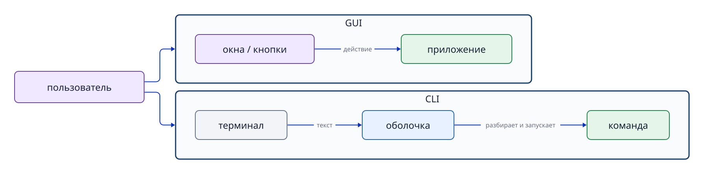

# Глава 3. GUI, CLI, терминал и командная оболочка

## 3.1 Отделяем интерфейс от исполнителя

GUI (графический пользовательский интерфейс) позволяет управлять компьютером визуально: через окна, значки, меню и указатель. В CLI (интерфейсе командной строки) вводят текстовую команду и получают текстовый результат. Оба способа служат входом для указаний человека. GUI не обязан «превращаться в CLI», чтобы работать.

**Терминал (terminal)** — окно или среда соединения для ввода текста и показа результата. **Командная оболочка (shell)** — программа, которая читает введённый текст, разбирает команды и выполняет их. В практической среде в основном используется Bash.

```text
Человек → терминал → Bash (оболочка) → процесс команды → функции ядра
```

Терминал и оболочка — разные вещи. Терминал обеспечивает обмен символами; оболочка определяет смысл введённого текста и организует выполнение.



**Рисунок 3-1. GUI и CLI — два способа взаимодействия; при использовании CLI важно различать терминал и оболочку.**

## 3.2 Приглашение показывает место ввода

Строка, которую оболочка выводит, ожидая ввода, называется **приглашением командной строки (prompt)**. В ней часто есть имя пользователя, имя хоста и текущий каталог, но содержание зависит от настроек.

Символ `$` в следующем примере изображает приглашение; самостоятельно вводить его не нужно.

```text
$ pwd
/home/ssm-user
```

Здесь вводится `pwd`, а следующая строка — пример вывода. В этой книге `$` иногда используется для различения вводимой команды и результата.

## 3.3 Команда, аргумент и параметр

Общую форму читают так:

```text
команда   параметр   аргумент
ls        -l         /srv
```

`ls` — выполняемая команда, `-l` — параметр подробного вывода, `/srv` — аргумент, указывающий объект. Во многих командах короткие параметры объединяются, например `ls -la`. Но одинаковая буква не обязательно означает одно и то же: `grep -n` добавляет номера строк, а `tail -n 5` задаёт количество выводимых строк.

Пробелы разделяют части командной строки. Чтобы передать строку с пробелами как один аргумент, заключайте её в кавычки.

```bash
printf '%s\n' 'JDU SSH transfer test'
```

Кавычки, подстановка переменных и перенаправление подробнее рассматриваются в главе 5.

## 3.4 Встроенные команды оболочки и внешние программы

Команды, вводимые в оболочке, в основном делятся на **встроенные команды** и **внешние программы**.

Встроенная команда (shell builtin) реализована самой Bash; отдельный исполняемый файл искать и запускать не нужно. Например, `cd` меняет рабочий каталог текущей оболочки Bash и поэтому является встроенной командой.

Для внешней команды оболочка ищет программу на накопителе и запускает её. `ls`, `mkdir`, `grep` обычно доступны сразу после установки Ubuntu, но это внешние программы, а не встроенные функции Bash. Следовательно, **«доступна по умолчанию»** и **«встроена в оболочку»** — разные характеристики.

Часть внешних программ устанавливается вместе с ОС, другие добавляются при необходимости. `python3` — внешняя команда для запуска Python. Она доступна, только если Python установлен. В некоторых конфигурациях Ubuntu он уже есть, в других его устанавливают пакетом. Установка пакетов рассматривается в главе 9.

```bash
type cd
type mkdir
type python3
```

Команда `type` показывает, как Bash воспринимает введённое имя: как встроенную команду или как внешнюю программу с определённым расположением файла. Если имя не найдено, такая команда в текущей среде недоступна.

Иногда `type` сообщает об **алиасе (alias)**. Алиас — короткое альтернативное имя для более длинной команды или часто используемого набора параметров. Например, в некоторых средах `ll` обозначает `ls -alF`. Наличие и значение алиасов зависят от настроек.

Для поиска внешней команды оболочка по очереди проверяет каталоги, перечисленные в настройке `PATH`. Заранее запоминать расположение каждого исполняемого файла не нужно. Сначала используйте `type`, чтобы узнать, считается ли имя встроенной командой, внешней программой или алиасом.

## 3.5 Как оболочка выполняет команду

Оболочка не передаёт введённый текст ядру без обработки. В общих чертах она:

1. Разбирает строку на имя команды, параметры и аргументы.
2. По правилам обрабатывает кавычки, переменные среды, подстановку команд `$(...)` и шаблоны имён файлов.
3. Выполняет встроенную команду сама либо ищет исполняемый файл внешней программы.
4. Подготавливает потоки ввода и вывода, перенаправления и конвейеры.
5. Запускает процесс и ждёт его завершения на переднем плане либо оставляет работать в фоне.
6. Получает код завершения процесса.

Это помогает понять, на каком этапе возникла проблема. Если команда не найдена, проверьте её имя и поиск внешней программы. Если обработан не тот объект, проверьте параметры и аргументы. Ввод-вывод и процессы подробнее описаны в главах 5 и 8.

## 3.6 Полезные действия и команды для ориентации

Если в CLI вы не знаете, где находитесь или что означает команда, остановитесь и уточните ситуацию.

| Действие или команда | Что показывает или делает |
|---|---|
| `Ctrl+C` | Просит остановить текущую операцию и вернуть приглашение. |
| `pwd` | Показывает текущий рабочий каталог. |
| `cd КАТАЛОГ` | Переходит в другой рабочий каталог. |
| `ls` | Показывает файлы и каталоги текущего каталога. |
| `grep 'ТЕКСТ' ФАЙЛ` | Ищет в файле строки с указанным текстом. |
| `type ИМЯ_КОМАНДЫ` | Показывает, является имя встроенной командой, внешней программой или алиасом. |
| `help ИМЯ_КОМАНДЫ` | Показывает справку о встроенной команде Bash. |
| `exit` | Завершает текущую оболочку и возвращает к предыдущему состоянию. |

`pwd`, `cd` и `ls` помогают понять, «где и с чем я работаю». `grep` ищет нужные строки в тексте и журналах. `type` и `help` помогают выяснить тип команды и правила её использования. `grep` и `ls` — полезные внешние программы, а не встроенные команды оболочки.

## 3.7 Справочные руководства

Для внешних команд отправной точкой служит `man`, для встроенных команд Bash — `help`.

```bash
man ls
help cd
grep --help
```

В руководстве `NAME` кратко описывает назначение команды, `SYNOPSIS` — форму записи, `DESCRIPTION` — поведение, `OPTIONS` — параметры. Квадратные скобки `[ ]` в записи синтаксиса обычно означают необязательную часть; сами скобки вводить не нужно. Просмотр `man` завершается клавишей `q`.

## 3.8 Успех операции и код завершения

Помимо текста на экране, команда возвращает оболочке небольшое целое число — **код завершения (exit status)**. В Unix-подобных системах `0` означает успешное завершение, а ненулевое значение — неуспех или ошибку.

```bash
test -e /etc/os-release
echo $?
```

Специальная переменная `$?` содержит код завершения последней команды. Следующая команда сразу заменит это значение, поэтому проверять его нужно непосредственно после интересующей операции. Ненулевые значения не всегда указывают на одну причину. Например, `grep` возвращает `1`, если совпадений нет, и `2` при ошибке выполнения, например при отсутствии файла. Важно учитывать не только сообщение на экране, но и то, что сама программа считает успехом или неуспехом.

## Вопросы в конце главы

### Вопрос 1. Чем терминал отличается от оболочки?

### Вопрос 2. Почему `cd` должна быть встроенной командой оболочки?

### Вопрос 3. Почему «команда доступна сразу» не означает «команда встроена в оболочку»?

### Вопрос 4. Как определить тип команды?

## Ответы на вопросы главы

### Вопрос 1

**Ответ:** терминал — место или среда соединения для ввода и вывода текста. Оболочка — программа, которая разбирает введённый текст, выполняет встроенные действия и запускает внешние программы.

### Вопрос 2

**Ответ:** `cd` должна менять рабочий каталог самой текущей оболочки. Если каталог изменит только отдельный внешний процесс, текущий каталог исходной оболочки останется прежним.

### Вопрос 3

**Ответ:** по умолчанию могут быть установлены и внешние программы. Например, `mkdir` часто доступна сразу в Ubuntu, но не встроена в Bash, тогда как `cd` встроена.

### Вопрос 4

**Ответ:** выполните `type ИМЯ_КОМАНДЫ`. Результат покажет встроенную команду, внешнюю программу или алиас.

## Источники

- Ubuntu Server documentation, [Welcome to the terminal](https://ubuntu.com/server/docs/tutorial/basic-installation/) (проверено 2026-09-18; актуальную структуру страницы следует перепроверить при публикации).
- GNU Project, [Bash Reference Manual](https://www.gnu.org/software/bash/manual/bash.html) (получение страницы 2026-09-18 завершилось по тайм-ауту; содержание также сверяется с `help` и `man bash` в Ubuntu 24.04).
