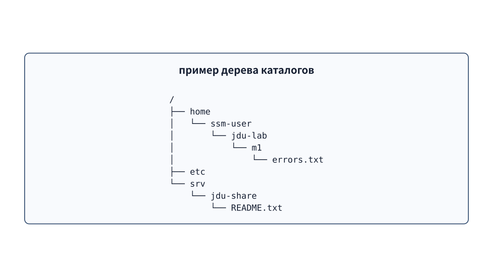
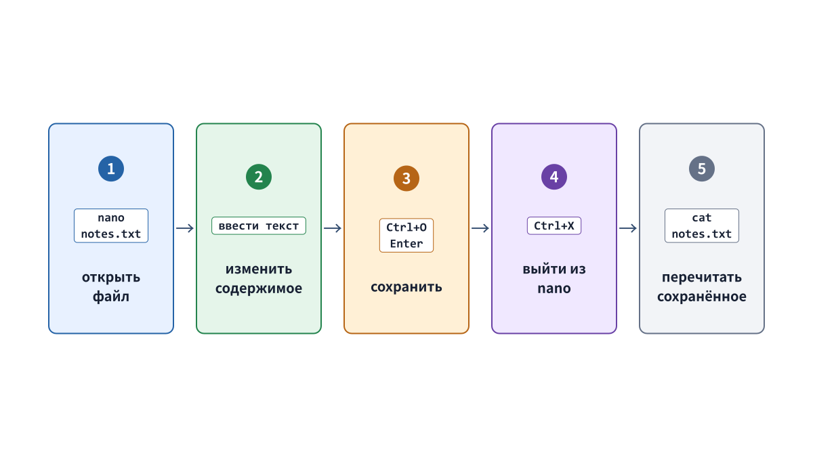

# Глава 4. Файлы, каталоги, пути и редактирование

## 4.1 У файла есть содержимое и метаданные

Помимо данных файла ОС хранит его **метаданные (metadata)**: имя, тип, владельца, группу, права доступа, размер, время последнего изменения и другое. Два файла с одинаковым выводом `cat` могут считаться разными по состоянию в ОС, если у них разные владельцы или права.

```bash
ls -l /srv/jdu-share/README.txt
stat /srv/jdu-share/README.txt
```

`ls -l` выводит основные сведения о содержимом каталога списком. `stat` подробно показывает метаданные одного указанного объекта.

## 4.2 Каталог связывает имя с объектом

Представление каталога только как «коробки, куда физически складывают файлы» неточно. Каталог — особый файл, связывающий имена файлов и других каталогов с соответствующими объектами и образующий иерархию. Путь `/srv/jdu-share/README.txt` задаёт движение от корневого каталога `/` через имена `srv`, `jdu-share` и `README.txt`.



**Рисунок 4-1. Иерархия в виде дерева, похожая на вывод `tree`: положение файла определяется последовательностью ветвей.**

В Linux вся система представлена одним **деревом каталогов** с вершиной `/`. Даже физически разные диски и виртуальные файловые системы можно присоединить к определённому каталогу и представить частью общего дерева. Такое присоединение называется **монтированием (mount)**. Здесь достаточно понять принцип; форматирование диска и практическое монтирование изучаются в последующем разделе о хранении данных.

**Корневой каталог** `/` — начало всего дерева. **Домашний каталог** — место для файлов конкретного пользователя. Например, домашний каталог `ssm-user` — `/home/ssm-user`: от `/` нужно пройти через `home` и `ssm-user`. `/home` — родительский каталог для домашних каталогов разных пользователей, а не домашний каталог самого `ssm-user`. `/` и `/home/ssm-user` имеют разные роли и положение. Похожее по названию `/root` — ещё одно отдельное место, не корневой каталог `/`.

## 4.3 Абсолютные и относительные пути

Путь, начинающийся с `/`, — **абсолютный путь**. Он обозначает одно и то же место независимо от текущего каталога.

```text
/srv/jdu-share/README.txt
```

Путь без начального `/` — **относительный путь**. Его отсчитывают от текущего рабочего каталога.

```bash
cd /srv/jdu-share
cat README.txt
```

`pwd` показывает текущий каталог. `.` означает «этот каталог», `..` — «родительский каталог». `~` (тильда) разворачивается оболочкой в домашний каталог текущего пользователя.

```bash
cd ~/jdu-lab/m1
pwd
cd ..
pwd
```

`~` не означает корневой каталог `/`. Его значение меняется с пользователем и хостом. Например, у `ssm-user` это может быть `/home/ssm-user`, а после `su - jduops` — домашний каталог `jduops`, например `/home/jduops`. На другом хосте оно относится к текущему пользователю этого хоста. Текущий каталог показывает `pwd`, а путь домашнего каталога — `printf '%s\n' "$HOME"`. `HOME` — переменная среды; переменные объясняются в главе 5.

## 4.4 Часто встречающиеся каталоги Ubuntu

| Путь | Назначение в этой книге |
| --- | --- |
| `/home` | Домашние каталоги обычных пользователей. |
| `/etc` | Общесистемные настройки и идентификационные файлы служб; здесь же находится `/etc/os-release`. |
| `/usr/bin` | Исполняемые файлы многих обычных команд. |
| `/var/log` | Файлы журналов системы и служб; не все журналы находятся только здесь. |
| `/srv` | Данные, предоставляемые системой или службой; в практике — общие каталоги и содержимое веб-сервера. |
| `/tmp` | Временные файлы; доступен для записи многим пользователям, но не подходит для постоянного хранения. |
| `/proc` | Виртуальная файловая система, через которую ядро представляет состояние процессов и системы как файлы. |

Эта таблица не означает, что каждый объект обязан находиться строго в указанном месте. Детали зависят от политики дистрибутива и проектирования приложения.

## 4.5 Создание, копирование, перемещение и удаление

```bash
mkdir -p ~/jdu-lab/p1/practice01/config
cp inbox/config/training.conf practice01/config/training.conf
mv old-name.txt new-name.txt
rm unwanted.tmp
```

- `mkdir -p` создаёт и отсутствующие родительские каталоги; существующий целевой каталог не вызывает ошибку.
- `cp SOURCE DESTINATION` копирует объект. Не перепутайте порядок источника и назначения.
- `mv` переносит файл или меняет его имя.
- `rm` удаляет файл сразу, не помещая его в привычную по GUI «корзину». Перед выполнением проверьте путь через `pwd` и `ls`.

В упражнениях для начинающих не используется опасная команда `rm -rf`, способная без предупреждения удалить всё дерево каталога. Даже перед удалением ненужных файлов `.tmp` сначала выведите их список через `find`.

```bash
find ~/jdu-lab/p1/practice01 -type f -name '*.tmp' -print
```

Одинарные кавычки вокруг `'*.tmp'` запрещают оболочке преждевременно разворачивать шаблон и передают его самой команде `find`. Визуально проверьте найденные файлы, а затем удаляйте их по одному либо действуйте только в безопасных границах, указанных в упражнении.

## 4.6 Другие команды проверки

```bash
ls -la
ls -ld /srv/jdu-share
tree ~/jdu-lab/m1/case01
stat -c '%U:%G %a %n' /srv/jdu-share/README.txt
```

- `ls -la` подробно перечисляет все объекты текущего каталога, включая скрытые имена с начальной точкой.
- `ls -ld DIR` показывает метаданные самого каталога `DIR`, а не список его содержимого.
- `tree` наглядно показывает дерево каталогов. В нашей практической среде она установлена заранее.
- `stat -c` выводит выбранные поля в заданном формате: `%U` — имя владельца, `%G` — имя группы, `%a` — права в восьмеричной записи, `%n` — имя или путь.

Выбирайте команду в зависимости от вопроса: дерево (`tree`), список содержимого (`ls`) или подробные свойства объекта (`stat`). Ни одна из этих команд не заменяет остальные во всех случаях.

## 4.7 Редактирование в nano

`nano FILE` — простой текстовый редактор внутри терминала. Перед редактированием перейдите в нужный каталог и проверьте место и целевой файл через `pwd` и `ls`.

```bash
cd ~/jdu-lab/m0
pwd
nano observation.env
```



**Рисунок 4-2. Основные действия в nano; знак ^ внизу экрана обозначает клавишу Ctrl.**

1. Перемещайте курсор стрелками и редактируйте текст обычным вводом.
2. Нажмите `Ctrl+O`, чтобы начать запись файла.
3. Когда внизу появится имя файла, проверьте путь и подтвердите сохранение клавишей `Enter`.
4. Нажмите `Ctrl+X`, чтобы выйти из nano.
5. Снова прочитайте результат, например `cat observation.env`, и убедитесь, что изменения сохранились.

При выходе с несохранёнными изменениями nano спрашивает, сохранить ли их. В англоязычном интерфейсе `Y` (Yes) сохраняет, `N` (No) отбрасывает, `Ctrl+C` отменяет действие. Не нажимайте клавиши наугад, не прочитав сообщение.

## 4.8 Важны и права на родительские каталоги

Чтобы прочитать файл, ОС проходит путь по порядку от начала. На **каждом промежуточном каталоге** она проверяет, разрешён ли текущему пользователю проход. Если хотя бы один каталог пройти нельзя, файл не удастся прочитать даже при наличии права чтения `r` у самого файла. `namei -l` показывает все компоненты пути по отдельности вместе с их владельцами и правами.

```bash
namei -l /srv/jdu-web/index.txt
```

Для каталога право выполнения `x` означает не «запуск файла-программы», а возможность пройти через каталог и обратиться к именам внутри него. Подробности разбираются в главе 7.

## Вопросы в конце главы

### Вопрос 1. Чем корневой каталог отличается от домашнего?

### Вопрос 2. Что показывают `ls -l DIR` и `ls -ld DIR`?

### Вопрос 3. Что следует проверить через `namei -l`, если файл с правом чтения `r` не открывается?

## Ответы на вопросы главы

### Вопрос 1

**Ответ:** корневой каталог `/` — начало всего дерева каталогов. Домашний каталог — личное рабочее место пользователя, например `/home/ssm-user`. `~` обозначает домашний каталог текущего пользователя.

### Вопрос 2

**Ответ:** `ls -l DIR` подробно показывает объекты внутри `DIR`, а `ls -ld DIR` — свойства самого каталога `DIR`.

### Вопрос 3

**Ответ:** проверьте у каждого родительского каталога, начиная с начала пути, есть ли у текущего пользователя право прохода `x`. Одного непроходимого каталога достаточно, чтобы нельзя было прочитать файл даже с `r`.

## Источники

- Linux man-pages, [path_resolution(7)](https://man7.org/linux/man-pages/man7/path_resolution.7.html) (проверено 2026-09-18).
- Руководства `man hier`, `man find`, `man stat` и интерфейс nano в Ubuntu 24.04 (проверяются в рабочей системе при подготовке).
