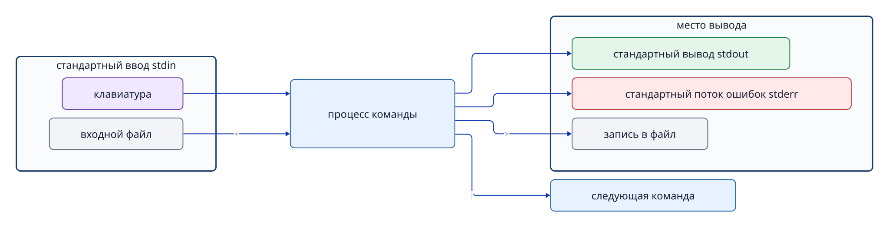

# Глава 5. Работа с текстом и потоками ввода-вывода

## 5.1 Почему настройки и журналы часто текстовые

В Ubuntu и других системах Linux многие настройки и журналы хранятся как обычный текст. Его удобно читать, сравнивать и искать без специальной графической программы, а также передавать другим командам для обработки. Но не все настройки и журналы — простые текстовые файлы. Например, системный журнал systemd хранится в двоичном формате и просматривается специальной командой.

## 5.2 Стандартный ввод, вывод и поток ошибок

У каждого процесса есть три базовых **потока** данных: **стандартный ввод (stdin)**, **стандартный вывод (stdout)** и **стандартный поток ошибок (stderr)**.

- **stdin** принимает обычные входные данные, например с клавиатуры или из вывода предыдущей команды (файловый дескриптор 0).
- **stdout** передаёт обычный результат на экран терминала, в следующую команду или в файл (дескриптор 1).
- **stderr** передаёт ошибки и предупреждения отдельно от обычного результата (дескриптор 2).



**Рисунок 5-1. Три стандартных потока программы.** `>` обычно направляет stdout в файл, а `|` соединяет stdout команды слева со stdin команды справа.

Если выполнить `cat incident.log`, файл станет источником данных, а экран терминала — местом показа stdout. Не сам файл «перелетает» в терминал: процесс `cat` читает его содержимое и записывает прочитанный текст в stdout.

## 5.3 `grep` выбирает нужные строки

```bash
grep 'ERROR' incident.log
```

`grep` просматривает входные данные построчно и выводит в stdout целые строки, совпавшие с заданным шаблоном.

```bash
grep -F 'ERROR' incident.log
```

Параметр `-F` рассматривает шаблон как буквальную строку, а не регулярное выражение. Для простого слова `ERROR` результат часто совпадает, но `-F` полезен, когда нужно найти специальные символы без экранирования.

`grep -n` добавляет перед найденной строкой её номер. Если в другой файл нужны только исходные строки, не добавляйте `-n`.

Важен и код завершения: обычно `0` означает найденное совпадение, `1` — отсутствие совпадений, `2` — ошибку выполнения, например отсутствующий файл. Когда вывод пуст, код помогает отличить «строки нет» от «ошиблись в имени файла».

## 5.4 `tail` читает конец файла

```bash
tail -n 5 incident.log
```

`tail -n 5` выводит последние пять строк в исходном порядке. Здесь `-n` задаёт число строк, а у `grep -n` добавляет номера строк: значение одной буквы зависит от команды. Проверяйте параметры по руководству, а не запоминайте их без контекста.

`tail -f` непрерывно показывает новые строки, добавляемые в файл. Остановить наблюдение можно через `Ctrl+C`.

## 5.5 Сохранение результата перенаправлением

```bash
grep 'ERROR' incident.log > errors.txt
tail -n 5 incident.log > recent.txt
```

`>` — механизм оболочки, переключающий stdout команды на файл. Если файл справа уже существует, оболочка **до запуска команды** обнуляет его размер, после чего запись идёт поверх прежнего содержимого. Если в качестве входного и выходного файла указать один и тот же файл, данные могут исчезнуть до их чтения.

```bash
# Опасный пример. Не выполняйте его.
grep 'ERROR' incident.log > incident.log
```

`>>` добавляет данные в конец файла. При повторных запусках одинаковые строки будут накапливаться. Если каждый раз нужно заново создать файл с тем же содержимым, используют `>`.

Поток stderr обычно не попадает в файл при простом `>`. Оператор `2>` направляет stderr в отдельный файл.

## 5.6 Конвейер передаёт данные без промежуточного файла

```bash
grep 'ERROR' incident.log | tail -n 5
```

`|` соединяет stdout команды слева непосредственно со stdin команды справа. Результат можно отфильтровать без промежуточного файла на диске. Однако stderr левой команды обычно не передаётся через этот конвейер.

При стандартных настройках Bash код завершения всего конвейера равен коду последней команды. Поэтому ошибка слева может остаться незаметной, если команда справа завершилась успешно. В строгих автоматических сценариях рассматривают `set -o pipefail`.

## 5.7 Кавычки, переменные и подстановка команд

До запуска команды оболочка обрабатывает и разворачивает введённый текст.

```bash
name='incident.log'
printf '%s\n' "$name"
```

- **Одинарные кавычки `'...'`** сохраняют внутренний текст почти буквально; переменная `$HOME` не подставляется.
- **Двойные кавычки `"..."`** удерживают текст с пробелами как один аргумент, но позволяют подставлять переменные и результат `$(...)`.
- **Без кавычек** содержимое переменной может неожиданно разделиться по пробелам или развернуться как шаблон имён файлов. Обычно пишите `"$name"`.

**Подстановка команды** `$(command)` запускает команду и вставляет текст её stdout в данную позицию.

```bash
current_user="$(id -un)"
printf 'USER=%s\n' "$current_user"
```

## 5.8 `&&` продолжает работу только после успеха

```bash
cd /var/log && pwd
```

Правая команда после `&&` выполняется только при коде завершения `0` у левой. Это помогает не редактировать и не удалять файлы в неправильном месте после неудачного перехода в каталог. Но слишком длинная цепочка в одной строке затрудняет поиск этапа, на котором произошла ошибка.

## Вопросы в конце главы

### Вопрос 1. Кто открывает `errors.txt` в команде `grep ERROR incident.log > errors.txt` — `grep` или оболочка?

### Вопрос 2. Чем отличаются `>` и `>>` и каковы последствия ошибки?

## Ответы на вопросы главы

### Вопрос 1

**Ответ:** оболочка. Она открывает `errors.txt`, соединяет файл со стандартным выводом `grep` и затем запускает `grep`.

### Вопрос 2

**Ответ:** `>` перезаписывает файл, `>>` дописывает в конец. Ошибочный `>` уничтожает прежнее содержимое; повторный ошибочный `>>` создаёт дублирующиеся строки.

## Источники

- Руководства `man grep`, `man tail`, `man bash` в Ubuntu 24.04 (версии проверяются в рабочей системе при подготовке).
- GNU Bash Reference Manual (получение текста через веб 2026-09-18 завершилось по тайм-ауту; первичная проверка проводится по локальному руководству).
