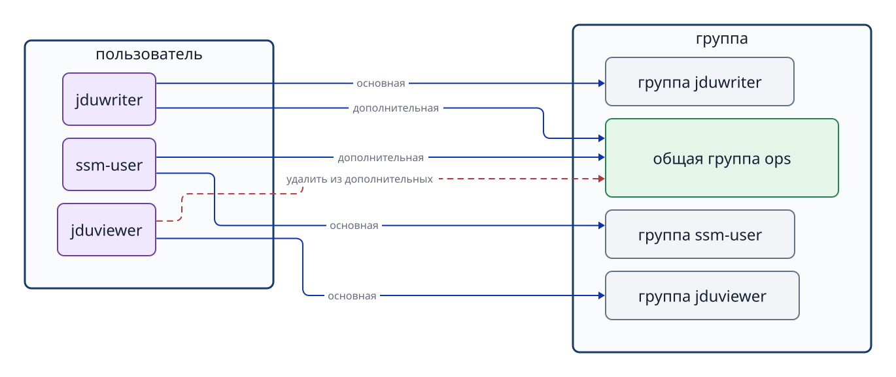

# Глава 6. Пользователи, группы и вход в систему

## 6.1 Виды учётных записей и их роли

В Linux есть учётные записи не только для людей, но и для процессов ОС и служб. Внутри система различает пользователей по числовому **UID (идентификатору пользователя)**, а группы — по **GID (идентификатору группы)**. Сначала сравним назначения и права учётных записей.

| Тип | Основная роль | Интерактивный вход |
| --- | --- | --- |
| Администратор `root` | Особый пользователь для управления всей системой; UID равен `0`. | Учётная запись существует, но прямой вход root по паролю в Ubuntu обычно отключён. Разрешённые пользователи выполняют административные команды через `sudo`. |
| Обычный пользователь | Выполняет работу человека; примеры — `ssm-user`, `jduops`. | При подходящей настройке и способе аутентификации может войти интерактивно. Обычный пользователь не обязательно имеет право на `sudo`. |
| Пользователь службы | Запускает процесс, например веб-сервер, с необходимым минимумом прав; пример — `jduweb`. | Часто не нуждается в интерактивном входе. Обычно в качестве оболочки указывают `/usr/sbin/nologin`, но это не обязательное свойство любой учётной записи службы. |

Это разделение по назначению, а не три жёстко зафиксированных внутри Linux класса. Реальные возможности зависят от настроек учётной записи, групп, прав каждого файла, правил `sudo` и SSH. Существование `root` не означает, что прямой вход под ним разрешён.

Имя вроде `ssm-user` удобно человеку. Сведения о владельце файла или каталога внутри системы хранятся как числовые UID/GID.

```bash
id
id jduops
getent passwd root
getent passwd jduops
getent passwd jduweb
getent group ops
```

Без аргумента `id` показывает UID, основную и дополнительные группы текущего пользователя. С именем пользователя команда проверяет зарегистрированные сведения об этой учётной записи. `getent passwd USER` выводит имя, UID, GID основной группы, домашний каталог, оболочку входа и другие поля. `/usr/sbin/nologin` в последнем поле означает, что обычная интерактивная оболочка недоступна. `getent` получает сведения не только из локального файла, но и из настроенных служб имён; в организации это могут быть LDAP или Active Directory.

## 6.2 Основная и дополнительные группы

У каждого пользователя есть одна **основная группа (primary group)**. В Ubuntu при создании пользователя часто автоматически создают одноимённую группу и назначают её основной, но это не обязательное правило. При необходимости основную группу можно изменить, например через `usermod -g`.

Кроме основной, пользователь может входить в несколько **дополнительных групп (supplementary groups)**. Для доступа команды к общему каталогу обычно лучше добавить её участников в отдельную дополнительную группу, чем менять основную группу каждого пользователя.



**Рисунок 6-1. Связь основных групп пользователей с дополнительной группой для общих ресурсов.**

Добавление и удаление членства в дополнительной группе выполняются командами:

```bash
sudo usermod -aG ops jduops
sudo gpasswd -d jduviewer ops
```

В `usermod -aG` параметр `-a` (append) сохраняет прежние дополнительные группы при добавлении новой. Если указать только `-G`, пользователь может лишиться членства во всех дополнительных группах, не перечисленных в команде. После изменения обязательно перепроверьте регистрацию через `id USER`.

Список в конце вывода `getent group ops` полезен для просмотра тех, у кого `ops` — дополнительная группа. Пользователь с `ops` в качестве **основной** группы может не отображаться в этом списке. Для надёжной проверки сочетайте вывод с `id USER`.

## 6.3 Запись об учётной записи и полномочия текущего процесса

Изменение членства в группе не обновляет автоматически данные уже работающей оболочки: запущенный процесс продолжает хранить полученный при старте набор групп. Новые сведения вступят в силу после нового входа или запуска нового сеанса.

```bash
id jduops
sudo su - jduops
id
```

Первый `id jduops` проверяет зарегистрированные сведения об учётной записи. `id` после `su -` показывает реальные UID/GID и группы нового процесса оболочки. При проверке доступа ядро ориентируется на учётные данные процесса, выполняющего действие, а не только на статическую запись в базе пользователей.

## 6.4 Разные задачи `su` и `sudo`

`su` (substitute user) открывает сеанс оболочки от имени другого пользователя. Дефис в `su - USER` создаёт среду, похожую на обычный вход этого пользователя: его домашний каталог и переменные среды инициализируются заново.

`sudo` позволяет пользователю, которому это разрешено настройками, выполнить команду с полномочиями администратора `root` или другого пользователя. Сам факт существования обычной учётной записи не даёт права на `sudo`. Административные полномочия следует ограничивать необходимыми операциями.

```bash
sudo su - jduops
id
pwd
exit
id -un
```

При открытии оболочки другого пользователя она оказывается внутри прежней оболочки. `exit` закрывает текущую и возвращает на один уровень назад. После переключения проверяйте имя через `id -un`, а рабочий каталог — через `pwd`.

Чтобы выполнить от имени другого пользователя только одну команду, интерактивную оболочку открывать не нужно:

```bash
sudo -u jduweb -- test -r /srv/jdu-web/index.txt
echo $?
```

Так непосредственно проверяется, может ли пользователь `jduweb` читать файл. Успешное чтение от имени `root` не доказывает, что доступ есть и у пользователя службы.

## 6.5 Отдельный пользователь ограничивает права службы

Пользователь службы помогает отделить права её процессов от прав людей и других служб. Если веб-сервер работает от имени `jduweb`, при проверке доступа используются UID/GID `jduweb`. Можно открыть ему чтение только нужных файлов.

```bash
getent passwd jduweb
id jduweb
```

`/usr/sbin/nologin` — программа, используемая вместо обычной оболочки для отказа в интерактивном входе. Учётная запись при этом существует. `systemd` может запускать процесс с правами пользователя, указанного в настройках службы. Невозможность человеку войти интерактивно не означает, что процесс службы с этим UID не может работать с файлами.

## 6.6 Учётная запись, аутентификация и проверка прав

**Учётная запись (account)** связывает имя пользователя с UID, основной группой, домашним каталогом, оболочкой входа и другими параметрами. Наличие на сервере учётной записи `ssm-user` означает, что сервер распознаёт это имя, но ещё не доказывает, что подключившийся человек вправе им пользоваться.

**Аутентификация (authentication)** подтверждает, что подключившийся действительно может использовать заявленную учётную запись. При входе по паролю проверяют секретный пароль, при аутентификации SSH по ключу — владение соответствующим закрытым ключом. Открытый ключ регистрируется, например, в `~/.ssh/authorized_keys` нужного пользователя на сервере. Закрытый ключ не отправляется на сервер для прямого сравнения.

**Проверка прав доступа (authorization)** отвечает на вопрос, разрешена ли этому субъекту определённая операция. В SSH настройки учётной записи и сервера могут ограничивать само подключение. После входа отдельно проверяются права читать или писать конкретные файлы и выполнять административные команды. Успешный вход не означает разрешение на любые действия.

Рассмотрим подключение SSH от имени `ssm-user` по трём понятиям.

1. **Учётная запись:** на сервере зарегистрирован `ssm-user`, и система может получить его UID и домашний каталог. Без регистрации обычный сеанс этого пользователя не открыть.
2. **Аутентификация:** клиент использует закрытый ключ, а сервер проверяет соответствие открытому ключу, зарегистрированному для `ssm-user`. При несоответствии вход отклоняется даже при существующей учётной записи.
3. **Проверка прав:** после прохождения ограничений SSH процесс сеанса работает с UID и группами `ssm-user`. Он не прочитает файл, доступный только другому пользователю. Право на `sudo` определяется отдельно.

Это схема для понимания понятий, а не точный порядок внутренних действий программы SSH. Правильный ключ сам по себе не гарантирует интерактивную оболочку: её могут запретить ограничения SSH или настройки учётной записи. И наоборот, `systemd` может запустить процесс службы с заданным UID без интерактивного входа по SSH. **Существование учётной записи, разрешение войти и право процесса на операцию — разные решения.**

## Вопросы в конце главы

### Вопрос 1. Чем основная группа отличается от дополнительной? Объясните на примере общего каталога.

### Вопрос 2. Почему изменение членства в группе не действует в уже открытой оболочке? Что нужно запустить заново?

### Вопрос 3. Почему `sudo -u jduweb -- test -r FILE` нельзя заменить чтением `cat FILE` от имени root?

## Ответы на вопросы главы

### Вопрос 1

**Ответ:** основная группа обязательно одна для каждого пользователя; в дополнительные группы он может входить по необходимости. Для общего каталога можно создать общую дополнительную группу и добавить в неё участников.

### Вопрос 2

**Ответ:** работающая оболочка сохраняет UID и список групп, полученные при её запуске. Нужно снова войти или открыть новый сеанс оболочки с обновлёнными группами.

### Вопрос 3

**Ответ:** чтение, разрешённое root, может быть запрещено процессу `jduweb`. `sudo -u jduweb` проверяет файл именно с полномочиями `jduweb`.

## Источники

- Ubuntu Server documentation, [User management](https://ubuntu.com/server/docs/how-to/security/user-management/) (проверено 2026-09-24; root, обычные и системные пользователи).
- Ubuntu Server documentation, [OpenSSH server](https://ubuntu.com/server/docs/how-to/security/openssh-server/) (проверено 2026-09-24; аутентификация по открытому ключу и `authorized_keys`).
- Ubuntu 24.04 man pages, [adduser(8)](https://manpages.ubuntu.com/manpages/noble/man8/adduser.8.html), [systemd.exec(5)](https://manpages.ubuntu.com/manpages/noble/man5/systemd.exec.5.html) (проверено 2026-09-24; пользователи служб и UID процесса).
- Linux man-pages, [passwd(5)](https://man7.org/linux/man-pages/man5/passwd.5.html), [credentials(7)](https://man7.org/linux/man-pages/man7/credentials.7.html) (проверено 2026-09-24; UID/GID, оболочка входа и учётные данные процесса).
- Локальные руководства Ubuntu 24.04: `man id`, `man getent`, `man usermod`, `man gpasswd`, `man su`, `man sudo` (проверяются при подготовке).
