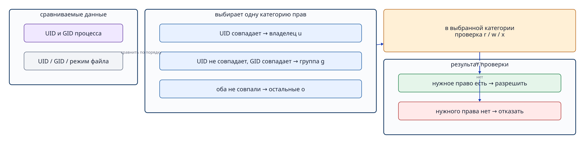
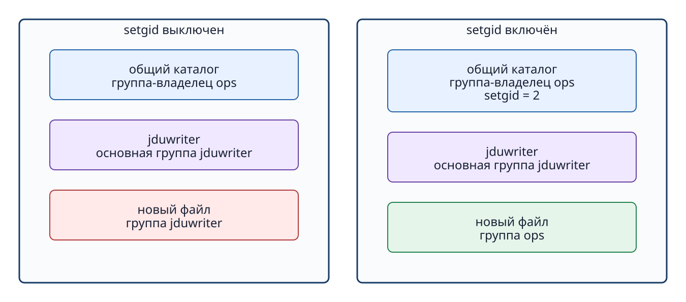

# Глава 7. Права доступа и общий каталог

## 7.1 Права доступа определяют, кому что разрешено

Базовые **права доступа** Linux задают разрешения на чтение (r: read), запись (w: write) и выполнение (x: execute) для трёх **категорий**: владельца (u: owner user), группы-владельца (g: owner group) и остальных пользователей (o: others).

```text
-rw-rw-r-- 1 root ops ... README.txt
drwxrwsr-x ... root ops ... /srv/jdu-share
```

Первый символ обозначает тип объекта: `-` — обычный файл, `d` — каталог. Следующие девять символов читают тройками для владельца, группы и остальных.

Ядро сопоставляет UID/GID процесса, который пытается выполнить действие, с метаданными объекта. Права трёх категорий **не складываются**. Если процесс работает от имени владельца, проверяется только тройка владельца. Иначе при принадлежности к группе объекта — только тройка группы. Если не подошло ни одно условие, действует тройка остальных.



**Рисунок 7-1. По учётным данным процесса выбирается категория u/g/o, затем её биты rwx определяют возможность действия.**

## 7.2 Значение rwx у файла и каталога различается

| Право | Обычный файл | Каталог |
| --- | --- | --- |
| r | Читать содержимое. | Читать список имён внутри. |
| w | Изменять или дописывать содержимое. | Создавать и удалять имена внутри. |
| x | Выполнять как программу. | Проходить внутрь и достигать объекта по пути. |

При праве записи в каталог иногда можно удалить расположенный в нём файл, даже если сам файл нельзя изменять: удаление меняет содержимое каталога. И наоборот, право чтения файла бесполезно, если нет права прохода `x` через один из родительских каталогов. `namei -l PATH` раскладывает путь на части и показывает права всех каталогов на нём.

## 7.3 Восьмеричная запись прав

В числовой записи права складываются как `r=4`, `w=2`, `x=1`.

- `6 = 4+2 = rw-`
- `7 = 4+2+1 = rwx`
- `5 = 4+1 = r-x`

Поэтому у обычного файла `664` означает `rw-rw-r--`, а у каталога `775` — `rwxrwxr-x`.

```bash
sudo chmod 664 /srv/jdu-share/README.txt
sudo chmod 2775 /srv/jdu-share
```

Режим `777` разрешает чтение, запись и выполнение даже категории «остальные». Он не подходит, если доступ должен быть только у участников общей группы.

## 7.4 `chown` и `chmod`

`chown` меняет владельца и группу-владельца, `chmod` — режим прав доступа.

```bash
sudo chown root:ops /srv/jdu-share
sudo chown root:ops /srv/jdu-share/README.txt
sudo chmod 2775 /srv/jdu-share
sudo chmod 664 /srv/jdu-share/README.txt
```

Изменение владельца или прав каталога не меняет автоматически уже существующие файлы и вложенные каталоги. Параметр `-R` позволяет менять всё дерево рекурсивно, но может затронуть неожиданные файлы.

```bash
stat -c '%U:%G %a %n' /srv/jdu-share /srv/jdu-share/README.txt
```

## 7.5 Какую проблему решает setgid у каталога

Обычно новый файл получает в качестве группы-владельца основную группу создавшего его процесса. Когда несколько пользователей работают в одном общем каталоге, файлы могут получить разные группы, и коллеги не смогут их редактировать.

Если у каталога включён **бит setgid** (Set Group ID), вновь создаваемые внутри файлы и каталоги наследуют группу-владельца родительского каталога вместо основной группы создателя. Например, при `root:ops 2775` у `/srv/jdu-share` группа нового файла обычно будет `ops`.



**Рисунок 7-2. setgid согласует группу-владельца новых объектов с родительским каталогом; он не копирует владельца, содержимое или все биты прав.**

Первая цифра `2` в восьмеричной записи режима обозначает setgid. В символьной записи на месте группового `x` показывается `s`.

```text
drwxrwsr-x root ops /srv/jdu-share
```

Если setgid установлен без права прохода `x` для группы, отображается заглавная `S`. В общем каталоге группе обычно дают `rwx`, поэтому видно строчную `s`.

## 7.6 umask влияет на начальные права

setgid управляет наследованием группы, но не фиксирует все права нового файла как `664`. Фактический режим определяется исходными правами, которые запросила программа, с учётом битов, ограниченных **umask (маской прав)**.

```bash
umask
touch /srv/jdu-share/sample.txt
stat -c '%U:%G %a %n' /srv/jdu-share/sample.txt
```

Например, при исходном режиме обычного файла `666` и umask `002` результатом будет `664` (`rw-rw-r--`). Но программа вправе запросить иной исходный режим. umask действует только в момент создания и не исправляет автоматически права уже существующего файла.

## 7.7 Проверяем разрешение и отказ от имени нужного пользователя

Недостаточно только посмотреть на метаданные — попробуйте действие с полномочиями интересующего пользователя.

```bash
sudo -u jduviewer -- test -r /srv/jdu-share/README.txt
echo $?
sudo -u jduviewer -- test -w /srv/jdu-share
echo $?
```

Код завершения `0` означает, что условие проверки истинно, `1` — ложно. Возможность создать файл внутри каталога зависит от прав `w` и `x` **самого каталога**. Проверка записи в существующий файл не заменяет проверку права создания в каталоге.

Если получен отказ, последовательно выясните пользователя и группы процесса, применённую категорию прав и недостающее право. Простое назначение `777` разрешит лишние действия и посторонним пользователям. Давайте доступ только тем, кому он нужен.

## Вопросы в конце главы

### Вопрос 1. Что означает каждая цифра режима `2775`?

### Вопрос 2. Что наследует новый файл в каталоге с setgid, а что не наследует?

### Вопрос 3. Почему чтение файла от имени root не доказывает, что его прочитает пользователь службы?

## Ответы на вопросы главы

### Вопрос 1

**Ответ:** начальная `2` включает setgid. Затем `7` означает `rwx` для владельца, следующая `7` — `rwx` для группы, `5` — `r-x` для остальных. Для каталога символьная форма — `rwxrwsr-x`.

### Вопрос 2

**Ответ:** новый файл обычно наследует группу-владельца родительского каталога. Владелец-пользователь и полный режим прав не копируются. Режим зависит от запроса создающей программы и umask.

### Вопрос 3

**Ответ:** root может обходить некоторые обычные ограничения доступа. Для процесса службы проверка выполняется с его UID и группами и может дать отказ.

## Источники

- Linux man-pages, [path_resolution(7)](https://man7.org/linux/man-pages/man7/path_resolution.7.html) (проверено 2026-09-18).
- Локальные руководства Ubuntu 24.04: `man chmod`, `man chown`, `man umask` (проверяются при подготовке).
