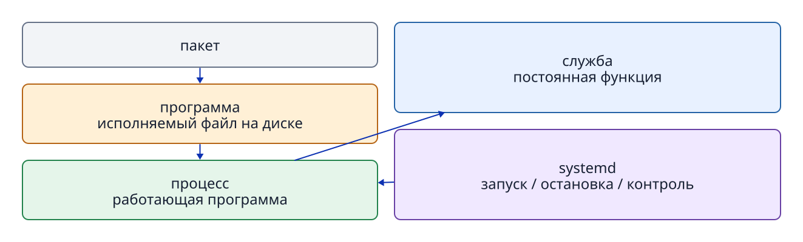

# Глава 8. Программа, процесс, PID и сигналы

## 8.1 Программа и процесс — не одно и то же

**Программа** — сохранённые на накопителе инструкции и связанные данные. **Процесс** — работающий экземпляр программы, загруженной в память и выполняемой под управлением ОС. Одну программу можно запустить несколько раз; каждый процесс получит собственный **PID (идентификатор процесса)**.

Пакет — единица распространения и установки программы и её настроек. Служба — единица управления длительно работающей фоновой функцией. Не смешивайте эти отношения.

```text
Установка пакета          → на диске появляются файлы программы.
Запуск программы          → создаётся процесс.
Управление юнитом systemd → можно запускать и отслеживать процесс службы.
```



**Рисунок 8-1. Различаем хранимую программу, работающий процесс, управляемую службу и распространяемый пакет.**

## 8.2 PID и родительский процесс

Ядро назначает каждому запущенному процессу уникальное в данный момент положительное целое число — **PID**. Процесс может запустить дочерний процесс. По **PPID (PID родителя)** видно, какой процесс его создал.

```bash
ps -e -o pid,ppid,user,stat,comm,args
ps -p 1234 -o pid,ppid,user,stat,comm,args
```

`1234` здесь только пример: реальный PID меняется при запуске, а после завершения число может достаться другому процессу. Перед отправкой сигнала сверяйте не только PID, но и пользователя (`user`), имя команды (`comm`) и аргументы (`args`).

PID 1 принадлежит особому управляющему процессу, работающему с начала загрузки. В Ubuntu это обычно `systemd`.

## 8.3 Как найти процесс службы

В Ubuntu запуском служб и их состоянием управляет `systemd`. Настройка управляемого объекта называется **юнитом (unit)**; имя юнита службы обычно заканчивается на `.service`. При запуске указанной в настройке программы появляется процесс службы. Юнит как объект управления и работающий сейчас процесс — не одно и то же.

Команда `systemctl` показывает состояние юнитов `systemd`. В примере перечисляются службы, затем проверяются состояние и главный процесс одной из них.

```bash
systemctl list-units --type=service
systemctl status systemd-journald.service --no-pager
systemctl show --property MainPID --value systemd-journald.service
```

**Main PID** в `status` — идентификатор главного процесса службы. `show --property MainPID --value` выводит только его значение; у остановленной службы это может быть `0`. Сверка через `ps -fp PID` связывает сведения об управляемой службе с реальным процессом. `ps` наблюдает процессы, `systemctl` — состояние службы. Запуск и автозапуск подробнее рассмотрены в главе 10.

## 8.4 Работа на переднем и заднем плане

Когда команда запускается в терминале обычным способом, оболочка ждёт её завершения на **переднем плане (foreground)**. Ввод с клавиатуры в это время в основном поступает этому процессу. `Ctrl+C` отправляет сигнал прерывания группе процессов переднего плана.

Символ `&` в конце команды запускает её в **фоновом режиме (background)**, после чего оболочка принимает следующий ввод.

## 8.5 Сигнал — уведомление процессу

**Сигнал (signal)** — механизм асинхронного сообщения процессу о событии или управляющем запросе.

- **TERM (SIGTERM)** просит процесс завершиться штатно, оставляя возможность сохранить данные и освободить ресурсы. Обычно это первый сигнал при остановке.
- **KILL (SIGKILL)** заставляет ядро немедленно завершить процесс. Процесс не может перехватить сигнал и выполнить очистку. Это последняя мера, если обычный сигнал не помогает.
- **INT (SIGINT)** — сигнал прерывания, например от `Ctrl+C` в терминале.

```bash
kill -TERM PID
```

Несмотря на название, `kill` отправляет указанный сигнал процессу. В записи `pkill 1956` число `1956` воспринимается как шаблон имени процесса, а не как PID. Для конкретного PID используйте `kill`, для поиска по шаблону имени — `pkill`.

## 8.6 Остановка процесса не удаляет файлы

После завершения процесса сохранённые файлы программы, юнита и данных остаются на накопителе. И наоборот: удаление исполняемого файла не обязательно немедленно остановит уже загруженный в память процесс.

После завершения процесса `systemd` иногда перезапускает управляемую службу. Условия задаёт, например, `Restart=` в файле юнита. Поэтому «процесс завершился» и «служба останется остановленной» — разные утверждения.

## 8.7 Наблюдение через `/proc/PID`

```bash
printf 'PID=%s\n' "$$"
cat "/proc/$$/cmdline" | tr '\0' ' '
printf '\n'
readlink -f "/proc/$$/cwd"
```

`$$` — PID текущей оболочки Bash. Аргументы в `/proc/PID/cmdline` разделены нулевыми байтами (`\0`), поэтому `tr` заменяет их пробелами при выводе. `/proc/PID/cwd` — символическая ссылка на рабочий каталог процесса. Когда процесс завершается, его `/proc/PID` исчезает.

Так `/proc/PID` позволяет наблюдать не сохранённый файл программы, а сведения о работающем в данный момент процессе.

## Вопросы в конце главы

### Вопрос 1. Чем различаются пакет, программа, процесс и служба?

### Вопрос 2. Почему перед отправкой сигнала нужно сверять PID через `ps`?

### Вопрос 3. Если после TERM служба заработала снова, что проверить в файле юнита?

## Ответы на вопросы главы

### Вопрос 1

**Ответ:** пакет распространяет и устанавливает файлы программы и настроек. Программа — сохранённые инструкции. Процесс — работающий экземпляр программы. Служба — управляемая `systemd` или другой системой единица, предоставляющая длительную функцию.

### Вопрос 2

**Ответ:** PID меняется между запусками и может повторно использоваться другим процессом. Нужно сверить также пользователя, команду и аргументы, чтобы не воздействовать на неправильный процесс.

### Вопрос 3

**Ответ:** настройку перезапуска, например `Restart=`. После завершения процесса `systemd` может запустить его заново.

## Источники

- Linux man-pages и Ubuntu 24.04: `man ps`, `man kill`, `man proc` (проверяются в рабочей системе).
- GNU Bash Reference Manual, [Special Parameters](https://www.gnu.org/software/bash/manual/html_node/Special-Parameters.html) (проверено 2026-09-24; `$$` — PID оболочки).
- Ubuntu 24.04 man page, [systemd.service(5)](https://manpages.ubuntu.com/manpages/noble/man5/systemd.service.5.html) (проверено 2026-09-24; `Restart=`).
- Ubuntu 24.04 man page, [systemctl(1)](https://manpages.ubuntu.com/manpages/noble/man1/systemctl.1.html) (проверено 2026-09-24; `status` и `show`).
