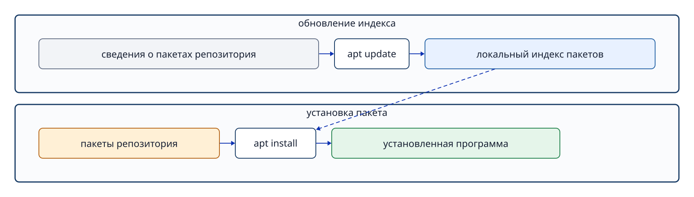

# Глава 9. Пакеты и установка программ

## 9.1 Зачем нужны пакеты

Полезная программа не всегда состоит из одного исполняемого файла. Ей могут одновременно требоваться общие библиотеки, шаблоны настроек, руководства и файлы данных. **Пакет (package)** — единица распространения, объединяющая эти файлы, сведения о версии, зависимости и сценарии установки или удаления.

Ubuntu в основном использует формат пакетов Debian (`.deb`) и управляет ими через **APT (Advanced Package Tool)**. APT получает сведения о доступных пакетах из **репозиториев**, разрешает зависимости и устанавливает нужные библиотеки. Запуск неизвестного сценария из интернета с правами root и установка проверенного пакета из доверенного официального репозитория — принципиально разные с точки зрения безопасности действия.



**Рисунок 9-1. `apt update` обновляет индекс пакетов, а `apt install` загружает и устанавливает сам пакет.**

## 9.2 Репозиторий и индекс пакетов

**Репозиторий (repository)** — сервер, предоставляющий пакеты и их метаданные, например версии и зависимости. Локальная система Ubuntu хранит **индекс пакетов** — сведения о том, какие версии доступны в подключённых репозиториях.

```bash
sudo apt update
apt show cmatrix
sudo apt upgrade
```

`apt update` обновляет из репозитория список доступных пакетов, не меняя сами уже установленные пакеты. `apt show cmatrix` позволяет заранее прочитать описание, версию и зависимости. `apt upgrade` на основе обновлённого списка обновляет установленные пакеты до новых версий. Перед продолжением изучите показанный список изменений. Это не переход на новый выпуск Ubuntu.

## 9.3 Установка и проверка запуска

```bash
sudo apt install cmatrix
command -v cmatrix
cmatrix
```

`sudo` требуется, поскольку меняются общесистемная база пакетов и защищённые каталоги, например `/usr/bin`. После установки `command -v` показывает, какой исполняемый файл оболочка нашла для команды. Завершить `cmatrix` можно через `Ctrl+C`.

Установленный пакет и работающий сейчас процесс — разные состояния. После завершения команды пакет остаётся. Однако некоторые серверные пакеты настроены так, что при установке автоматически запускают службу. Фактическое состояние проверяйте через `systemctl`, а не предполагайте.

## 9.4 Проверка версии и принадлежности файла

```bash
dpkg-query -W -f='${Package} ${Version}\n' cmatrix
dpkg -S /usr/bin/cmatrix
```

`dpkg-query` читает точную установленную версию из локальной базы пакетов. `dpkg -S PATH` выясняет, какой пакет предоставил указанный файл. `command -v` отвечает на вопрос «какой файл запустит оболочка?», а `dpkg -S` — «какому пакету принадлежит этот файл?».

## 9.5 Удаление и очистка

`apt remove` удаляет сам пакет. `apt purge` удаляет также его конфигурационные файлы. `apt autoremove` удаляет зависимости, которые больше не нужны другим пакетам. Это операции удаления, в отличие от `apt upgrade`; перед выполнением проверяйте, что именно будет удалено.

## Вопросы в конце главы

### Вопрос 1

Объясните различие между `apt update`, `apt upgrade` и `apt install`.

### Вопрос 2

Чем отличаются вопросы, на которые отвечают `command -v cmatrix` и `dpkg -S /usr/bin/cmatrix`?

### Вопрос 3

Приведите случай, когда пакет установлен, но соответствующий процесс не работает.

## Ответы на вопросы главы

### Вопрос 1

**Ответ:** `apt update` обновляет индекс доступных пакетов, `apt upgrade` обновляет уже установленные пакеты, `apt install` устанавливает указанный пакет.

### Вопрос 2

**Ответ:** `command -v cmatrix` находит путь к команде, которую запустит оболочка. `dpkg -S /usr/bin/cmatrix` находит пакет, предоставивший этот файл.

### Вопрос 3

**Ответ:** после установки `cmatrix` программу ещё не запускали либо завершили через `Ctrl+C`. Пакет есть, работающего процесса `cmatrix` нет.

## Источники

- Ubuntu Server documentation, [Install and manage packages](https://ubuntu.com/server/docs/how-to/software/package-management/) (проверено 2026-09-24).
- Ubuntu Server documentation, [Managing your software](https://ubuntu.com/server/docs/tutorial/managing-software/) (проверено 2026-09-24).
- Локальные руководства Ubuntu 24.04: `man apt`, `man dpkg-query`, `man dpkg` (проверяются при подготовке).
