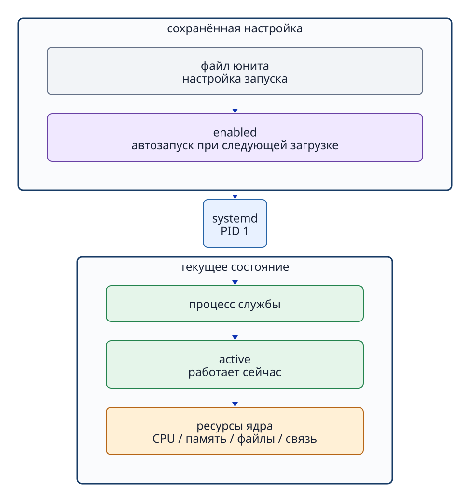

# Глава 10. systemd и службы

## 10.1 Что такое служба

**Служба (service)** — программа, которую система управляемо запускает в фоновом режиме для длительного предоставления функции без ручного запуска из терминала каждый раз. Примеры — веб-сервер, SSH-сервер, синхронизация времени и управление журналом. Не каждый процесс является службой, и не каждой службе нужен сетевой порт для ожидания соединений.

В Ubuntu 24.04 `systemd` запускается как процесс PID 1 и централизованно управляет многими службами. Важно: `systemd` не выполняет работу каждой службы сам. Это **менеджер служб**, отвечающий за запуск, остановку, зависимости, наблюдение за состоянием и автоматический запуск при загрузке.

## 10.2 Файл юнита — настройка, процесс — работа

`systemd` управляет ресурсами через общую единицу — **юнит (unit)**. В файле юнита `.service` задаются правила: какой исполняемый файл запустить, от имени какого пользователя и в каком рабочем каталоге.

```ini
[Service]
User=jduapp
WorkingDirectory=/srv/jdu-status
ExecStart=/usr/bin/python3 /srv/jdu-status/server.py
```

- `User` — пользователь, от имени которого работает процесс службы.
- `WorkingDirectory` — текущий каталог процесса при запуске.
- `ExecStart` — абсолютный путь к программе и аргументы.

```bash
systemctl cat jdu-status.service
```

`systemctl cat` показывает файл юнита на диске и дополняющие настройки (drop-in). Если после изменения файлов не выполнить `daemon-reload`, показанный текст может не совпадать с конфигурацией, загруженной в `systemd`.



**Рисунок 10-1. Юнит задаёт правила, systemd управляет, а процесс службы выполняет реальную работу.**

## 10.3 active и enabled — разные состояния

```bash
systemctl is-active jdu-status.service
systemctl is-enabled jdu-status.service
```

- **active / inactive** — служба сейчас работает в памяти или остановлена.
- **enabled / disabled** — включён или выключен её автоматический запуск при загрузке системы.

Возможны оба сочетания: «active, но disabled» означает работающую сейчас службу без включённого автозапуска; «inactive, но enabled» — остановленную сейчас службу, которая должна запускаться при следующей загрузке. Немедленный `start` и настройка автозапуска `enable` — независимые операции.

```bash
sudo systemctl start jdu-status.service
sudo systemctl enable jdu-status.service
```

`enable --now` сочетает включение автозапуска с немедленным запуском.

## 10.4 start, stop, restart и reload

- **start** запускает остановленную службу.
- **stop** останавливает работающую службу.
- **restart** останавливает и снова запускает её; возникает краткий перерыв в доступности.
- **reload** просит уже работающий процесс перечитать его настройки без остановки. Не каждая служба это поддерживает.

`systemctl daemon-reload` перечитывает изменённые **файлы юнитов самим systemd**. Это не то же самое, что `reload` настроек работающего процесса службы.

## 10.5 Сверка настроек юнита с реальным процессом

```bash
systemctl status jdu-status.service
systemctl show --property MainPID --value jdu-status.service
```

В главе 8 мы находили процесс по Main PID. Теперь сопоставим `User=`, `ExecStart=`, `WorkingDirectory=` в юните с реальным процессом. `systemctl status` показывает загрузку и состояние юнита, Main PID и последние связанные записи журнала. Если вывод открылся в постраничном просмотрщике, нажмите `q`. `systemctl show` выдаёт значение конкретного свойства.

Получив Main PID, проверьте соответствие процесса настройкам:

```bash
M4_PID="$(systemctl show --property MainPID --value jdu-status.service)"
ps -p "$M4_PID" -o pid,user,comm,args
sudo readlink -f "/proc/$M4_PID/cwd"
```

| Настройка юнита | Где проверить у процесса |
| --- | --- |
| `User=` | Поле USER в `ps`. |
| `ExecStart=` | Поле args в `ps` и `/proc/PID/cmdline`. |
| `WorkingDirectory=` | Цель символической ссылки `/proc/PID/cwd`. |

## 10.6 active не доказывает исправность функции

Процесс может числиться `active`, но не отвечать пользователю: нет прав чтения файла содержимого, сокет слушает не на том IP-адресе или приложение выдаёт исключение. В следующей главе мы расширим проверку от состояния службы к процессу, сокету, HTTP-ответу и журналу.

## 10.7 `systemctl status` не перечисляет все процессы

Без указания юнита `systemctl status` показывает сводку системы и дерево процессов; отдельные службы не обязательно удобно видны. Для проверки конкретной службы явно называйте её юнит.

```bash
systemctl status systemd-journald.service --no-pager
systemctl list-units --type=service 'systemd-*'
```

Существует много процессов, не являющихся непосредственно процессами юнитов служб, например запущенная человеком командная оболочка. Для общего списка процессов используйте `ps`, а для состояния служб под управлением systemd — `systemctl`.

## Вопросы в конце главы

### Вопрос 1

Различите роли файла юнита, systemd и процесса службы.

### Вопрос 2

Может ли служба быть одновременно `active` и `disabled`? Что это значит?

### Вопрос 3

Как по `/proc` проверить, применён ли `WorkingDirectory` к работающему процессу?

## Ответы на вопросы главы

### Вопрос 1

**Ответ:** файл юнита содержит правила запуска. systemd использует их для управления. Работающий процесс службы выполняет саму функцию.

### Вопрос 2

**Ответ:** да. `active` говорит о текущей работе, `disabled` — что автозапуск юнита не включён. Так бывает после ручного `start`.

### Вопрос 3

**Ответ:** узнайте Main PID через `systemctl show --property MainPID --value ИМЯ_ЮНИТА`, затем проверьте рабочий каталог процесса через `readlink -f /proc/PID/cwd` и сравните его с `WorkingDirectory=`.

## Источники

- Ubuntu 24.04: [systemctl(1)](https://manpages.ubuntu.com/manpages/noble/man1/systemctl.1.html), [systemd.exec(5)](https://manpages.ubuntu.com/manpages/noble/man5/systemd.exec.5.html), [proc_pid_cwd(5)](https://manpages.ubuntu.com/manpages/noble/man5/proc_pid_cwd.5.html) (проверено 2026-09-24).
- Юниты и проверки P4/M4 открытого Lab v1.0.0 (первоисточник конкретных значений для Lab).
