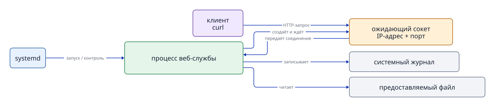
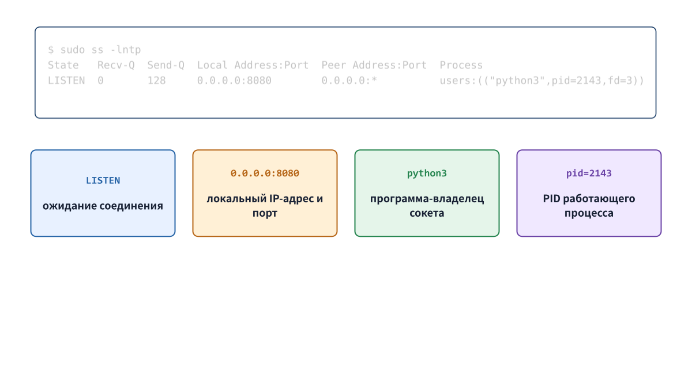

# Глава 11. Наблюдаем службу через сокеты, HTTP и журнал

## 11.1 Как связаны служба, процесс и сокет

`systemd` запускает процесс службы по правилам юнита. Если программе нужна сеть, она через системные вызовы просит ядро создать **сокет (socket)**. Ядро использует IP-адрес, протокол и номер порта, чтобы передать полученные по сети данные нужному процессу.

Точнее говорить не «служба сама создаёт сокет», а «программа, работающая как служба, использует предоставляемый ядром механизм сокетов». `systemd` управляет процессом и наблюдает за ним, но не выполняет вместо него весь обмен сетевыми данными.



**Рисунок 11-1. Управление (systemd), выполнение (процесс), сетевой механизм (ядро и сокет) и запрос клиента — разные этапы.** У службы может быть несколько сокетов или вообще не быть сетевого обмена.

## 11.2 Протокол, IP-адрес и порт

**TCP (Transmission Control Protocol)** — один из протоколов транспортного уровня, часто используемых в веб-связи. Он подтверждает доставку и сохраняет порядок данных. Установка соединения и повторная передача подробно рассматриваются в последующем сетевом разделе.

**IP-адрес** обозначает сетевой интерфейс хоста. **Номер порта** помогает различить, какому коммуникационному входу внутри этого хоста предназначены данные. Порт сам по себе не программа. Ядро сопоставляет номер порта с ожидающим сокетом и передаёт данные соответствующему процессу.

- `127.0.0.1` — **адрес обратной петли (loopback)** IPv4. Напрямую извне он недоступен; обычно принимает соединения только внутри того же хоста.
- `0.0.0.0` — особая запись ожидания на всех локальных IPv4-адресах данного хоста, то есть на всех его сетевых интерфейсах.
- `[::]` — ожидание на всех локальных IPv6-адресах. В зависимости от настроек ОС может также принимать IPv4.

## 11.3 Читаем ожидающие соединения сокеты через `ss`

`ss` (Socket Statistics) показывает подробное состояние сокетов, которыми управляет ядро.

```bash
sudo ss -lntp | grep ':8081'
```

- `-l` — только сокеты в состоянии ожидания соединений (`LISTEN`).
- `-n` — числовые порты без обратного преобразования в имена служб.
- `-t` — только сокеты TCP.
- `-p` — сведения об использующем сокет процессе, включая имя и PID; иногда нужны административные права.

Схематический пример вывода:

```text
State  Recv-Q Send-Q Local Address:Port Peer Address:Port Process
LISTEN 0      5      127.0.0.1:8081  0.0.0.0:*       users:(("python3",pid=2451,fd=3))
```

Читайте сначала состояние `LISTEN`, затем локальный адрес с портом `127.0.0.1:8081`, затем процесс и `pid=...`. Сверьте адрес и порт, а также PID с Main PID службы из `systemd`. Число `2451` дано только для примера: в своей системе читайте реально выведенный PID.



**Рисунок 11-2. Строка `ss -lntp` разбирается на состояние, адрес, порт и данные процесса.**

## 11.4 Клиент, сервер и HTTP

Процесс **сервера** создаёт сокет и ожидает соединения и запросы клиентов. **Клиент** подключается к сокету сервера и посылает запрос. В нашей практике команда `curl` на том же хосте Ubuntu выступает клиентом, а процесс `jdu-web.service` — сервером.

```bash
curl -i http://127.0.0.1:8081/
```

В URL `http://127.0.0.1:8081/` часть `http` обозначает протокол, `127.0.0.1` — адрес хоста, `8081` — порт, `/` — путь запроса. Параметр `-i` выводит не только тело ответа, но и заголовки HTTP.

```text
HTTP/1.0 200 OK
Content-Type: text/plain

(тело ответа)
```

Код `200 OK` относится к уровню приложения HTTP. Успешное соединение TCP, получение заголовков HTTP и правильное содержание тела — три разных результата, которые нужно проверять отдельно.

## 11.5 Открытый и закрытый порт

```bash
curl --max-time 2 http://127.0.0.1:18081/
sudo ss -lnt | grep ':18081'
```

Если на `127.0.0.1:18081` никто не ожидает соединение, запрос обычно отклоняется и `curl` показывает `Connection refused`. Отсутствие этого адреса и порта в `ss -lnt` указывает на отсутствие ожидающего TCP-сокета. `--max-time 2` ограничивает всю операцию `curl` двумя секундами.

Наличие ожидающего сокета не гарантирует HTTP-ответ: после соединения серверная программа должна обработать запрос. Тайм-аут лишь означает, что операция не завершилась вовремя; по одному этому результату нельзя заключить, что сокета нет.

## 11.6 Права пользователя службы на чтение

Чтобы веб-сервер вернул содержимое файла, его пользователь должен иметь нужные права на сам файл и все родительские каталоги — чтение и проход.

```bash
id jduweb
stat -c '%U:%G %a %n' /srv/jdu-web/index.txt
namei -l /srv/jdu-web/index.txt
sudo -u jduweb -- test -r /srv/jdu-web/index.txt
echo $?
```

Невозможность интерактивно войти через `su -` от имени `jduweb` не мешает проверке. Для учётной записи службы интерактивная оболочка обычно отключена. Через `sudo -u` можно проверить доступ с её учётными данными, не открывая вход для человека.

## 11.7 Откуда берутся записи журнала

Во время работы программа может выдавать разные сообщения. В системе с `systemd` демон `systemd-journald` собирает stdout, stderr процессов служб и системные сообщения и хранит их в двоичном формате. Команда `journalctl` служит для чтения и поиска накопленных записей.

```bash
curl -i http://127.0.0.1:8081/
sudo journalctl -u jdu-web.service --no-pager -n 20
```

`-u` ограничивает вывод нужным юнитом, `-n 20` показывает двадцать последних записей, `--no-pager` выводит их без постраничного просмотрщика. Если сервер запрограммирован записывать обращения, появится строка для запроса. Наличие и текст записи зависят от реализации и настроек программы.

## 11.8 От настройки службы до ответа на запрос

На примере веб-службы настройки, выполнение, сеть, ответ и журнал связаны так:

```text
Файл юнита → systemd → процесс службы
                           ↓ использует сокеты ядра
                     ожидающий сокет (IP-адрес и порт)
                           ↓ подключение и запрос клиента
                     обработка запроса процессом
                       ├─ HTTP-ответ
                       └─ при необходимости запись в журнал
```

Файл юнита определяет способ запуска, но запрос обрабатывает процесс службы. Ожидающий сокет — точка приёма соединений; HTTP-ответ — результат работы программы. Журнал помогает позднее понять ход обработки и ошибки. `systemctl` показывает состояние службы, `ss` — сокет, `curl` — HTTP-ответ, `journalctl` — собранные записи. Это сведения о разных этапах, а не четыре имени одного и того же факта.

## Вопросы в конце главы

### Вопрос 1

Назовите две возможные причины неправильного HTTP-ответа при состоянии службы `active`.

### Вопрос 2

Чем отличаются `127.0.0.1:8081` и `0.0.0.0:8081` с точки зрения доступа извне?

### Вопрос 3

Для чего сопоставлять PID процесса из `ss` с Main PID из systemd?

## Ответы на вопросы главы

### Вопрос 1

**Ответ:** например, программа слушает другой адрес или порт; либо её пользователь не может прочитать файл содержимого.

### Вопрос 2

**Ответ:** `127.0.0.1:8081` принимает соединения внутри того же хоста. `0.0.0.0:8081` слушает на всех его локальных IPv4-адресах. Фактическая доступность извне зависит также от межсетевого экрана и сети.

### Вопрос 3

**Ответ:** чтобы убедиться, что ожидающий сокет принадлежит процессу нужной управляемой службы. У многопроцессной службы PID сокета может отличаться от Main PID.

## Источники

- Linux man-pages, [socket(7)](https://man7.org/linux/man-pages/man7/socket.7.html) (проверено 2026-09-18).
- Linux man-pages, [connect(2)](https://www.man7.org/linux/man-pages/man2/connect.2.html) (проверено 2026-09-24).
- curl, [How to use curl](https://curl.se/docs/manpage.html) (проверено 2026-09-24).
- Локальные руководства Ubuntu 24.04: `man ss`, `man curl`, `man journalctl` (проверяются при подготовке).
- Программы, юниты и проверки P5/M5 открытого Lab v1.0.0 (первоисточник значений конкретной среды).
