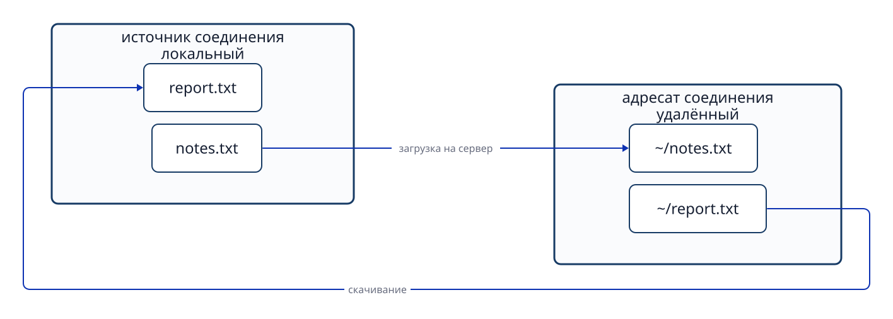

# Глава 12. Удалённая работа и передача файлов через SSH

## 12.1 Источник и адресат соединения

При управлении другим компьютером различайте место, где вводится команда, и место, где она исполняется. Сторону, начинающую SSH-соединение, называют **локальной (local)**, адресата — **удалённой (remote)**. Это названия с точки зрения текущего действия. Локальная сторона не обязательно физический ПК у вас на столе. Если SSH запускается из облачного терминала в браузере, источником соединения становится среда этого терминала.

```text
Среда ввода команды (локальная)
              ↓ соединение SSH
Сервер выполнения (удалённый)
```

После подключения могут измениться имя пользователя, хоста и рабочий каталог. Выполните `id -un`, `hostname`, `pwd` до входа — получите сведения об источнике. Те же команды после входа показывают удалённую сторону. `exit` закрывает удалённую оболочку и возвращает к локальной. Не определяйте среду только по внешнему виду приглашения.

## 12.2 Что защищает SSH

**SSH (Secure Shell)** создаёт зашифрованный канал между компьютерами и позволяет использовать удалённую оболочку или команду. При соединении важны две проверки:

1. **Проверка сервера (аутентификация хоста):** действительно ли это нужный сервер? Для проверки используется его ключ хоста.
2. **Проверка пользователя:** разрешён ли заявленному пользователю вход? При аутентификации по открытому ключу используется пара ключей пользователя.

Затем команды, результаты и передаваемые файлы проходят по зашифрованному соединению. Но шифрование не создаёт само по себе сетевой маршрут до сервера. А успешный вход SSH не даёт права свободно читать и менять любые файлы: после входа действуют учётная запись и права удалённой ОС.


**Рисунок 12-1. Ключ хоста подтверждает сервер, а ключ пользователя — право человека подключаться; роли этих ключей различаются.**

## 12.3 Где находятся ключ пользователя и ключ хоста

При аутентификации по открытому ключу **закрытый ключ (private key)** пользователя хранится у SSH-клиента. Соответствующий **открытый ключ (public key)** обычно записывается на сервере в `~/.ssh/authorized_keys` пользователя, которому разрешён вход. Клиент доказывает владение закрытым ключом, не отправляя сам закрытый ключ серверу.

**Ключ хоста (host key)** определяет сам сервер. Сервер хранит закрытый ключ хоста, а клиент проверяет предъявленный сервером открытый ключ и обычно сохраняет доверенную запись в `~/.ssh/known_hosts`. При первом подключении сверяйте отпечаток ключа с данными из доверенного канала. Безусловное принятие незнакомого ключа может скрыть подмену сервера.

| Тип ключа | Назначение | Где хранится закрытый ключ | Где проверяется открытый ключ |
| --- | --- | --- | --- |
| Ключ пользователя | Аутентификация подключающегося пользователя. | Источник соединения. | `authorized_keys` на сервере. |
| Ключ хоста | Проверка сервера. | Сервер. | `known_hosts` и другие сведения у клиента. |

Не публикуйте закрытый ключ и не добавляйте его в Git. Если файл закрытого ключа доступен другим пользователям, SSH-клиент может отказаться его использовать. В обоих путях `~` означает домашний каталог пользователя **соответствующей среды**: на источнике и адресате это разные места.

## 12.4 Имя соединения и сетевой маршрут

SSH-клиент может хранить настройки адресата в локальном `~/.ssh/config`. Пример:

```text
Host study-server
    HostName server.example.edu
    User learner
    IdentityFile ~/.ssh/id_ed25519
```

После этого `ssh study-server` использует указанные имя сервера, пользователя и файл закрытого ключа. Значение `Host` — **псевдоним** в конфигурации SSH, а не обязательно DNS-имя. Поэтому другой инструмент, не читающий конфигурацию SSH, может не разрешить такой псевдоним.

Если сервер недостижим напрямую, SSH может проходить через промежуточный узел или программу. В OpenSSH маршрут задают, например, `ProxyJump` и `ProxyCommand`. Маршрут отвечает на вопрос «как доставить соединение?», а аутентификация пользователя — «кому разрешён вход?». Даже правильный закрытый ключ бесполезен без сетевого пути.

## 12.5 Интерактивный вход и удалённая команда

`ssh study-server` после аутентификации открывает интерактивную оболочку адресата. Если после имени хоста указать команду, она выполнится на сервере и вернёт результат источнику.

```bash
ssh study-server 'id -un; hostname; pwd'
```

Здесь `id -un`, `hostname`, `pwd` выполняются на удалённом хосте. Внешние одинарные кавычки также не позволяют **локальной** оболочке заранее подставить `$HOME` или `$(...)`. Например, в `ssh study-server 'printf "%s\n" "$(hostname)" "$HOME"'` подстановку имени хоста и домашнего каталога выполняет удалённая оболочка. С внешними двойными кавычками значения подставила бы локальная оболочка.

Значение `~` тоже зависит от того, оболочка какого хоста и пользователя его интерпретирует. Локальный `~/notes.txt` и удалённый `~/notes.txt` — разные файлы.

```bash
ssh study-server 'printf "%s\n" "$HOME" > "$HOME/home-path.txt"'
ssh study-server 'printf "%s\n" "$HOME"' > local-result.txt
```

В первой строке и `$HOME`, и `>` обрабатываются на удалённой стороне, поэтому файл создаётся в домашнем каталоге адресата. Во второй строке `>` находится **снаружи** кавычек удалённой команды и обрабатывается локальной оболочкой. Полученный с сервера текст записывается в локальный `local-result.txt`. Один и тот же символ даёт разные результаты в зависимости от выполняющей его оболочки.

## 12.6 Передача файлов через SCP

`scp` переносит файлы с использованием SSH-соединения и аутентификации. Общая форма — `scp ИСТОЧНИК НАЗНАЧЕНИЕ`; удалённый путь записывают как `ХОСТ:ПУТЬ`.

```bash
scp notes.txt study-server:~/notes.txt
scp study-server:~/report.txt report.txt
```

Первая строка отправляет локальный `notes.txt` на сервер — **загрузка (upload)**. Вторая получает `report.txt` с сервера — **скачивание (download)**. `~` после двоеточия означает домашний каталог пользователя на удалённом хосте. Псевдоним из конфигурации SSH, например `study-server`, работает и для `scp`.



**Рисунок 12-2. Направление отправки и скачивания определяется относительно стороны, выполняющей команду.**

Если поменять местами источник и адресат, файл скопируется в обратном направлении. Следите и за возможной перезаписью одноимённого файла. Локальная и удалённая копии находятся в разных файловых системах.

## 12.7 Совпадение содержимого и свойства файлов

После переноса сравните вывод `sha256sum` для обеих копий:

```bash
sha256sum notes.txt
ssh study-server 'sha256sum ~/notes.txt'
```

Совпадение хешей — сильное подтверждение одинакового **содержимого**. Но хеш не включает владельца, группу, права доступа и местоположение. На сервере владельцем может стать другой пользователь, а режим доступа — отличаться. Свойства проверяют отдельно на адресате через `stat`.

```bash
ssh study-server 'stat -c "%U:%G %a %n" ~/notes.txt'
```

Это разные вопросы: `sha256sum` отвечает «одинаковы ли данные?», `stat` — «кому принадлежит файл на адресате и с какими правами он размещён?».

## Вопросы в конце главы

### Вопрос 1

Из облачного терминала в браузере устанавливается SSH-соединение с другим сервером. Какая среда локальная, а какая удалённая?

### Вопрос 2

Для чего нужны пользовательский ключ и ключ хоста SSH? Где хранится закрытый ключ пользователя?

### Вопрос 3

Чем SSH-псевдоним отличается от DNS-имени? Почему соединение может не установиться даже с правильным ключом?

### Вопрос 4

На какой стороне в двух командах подставляется `$HOME` и сохраняется результат?

```bash
ssh study-server 'printf "%s\n" "$HOME" > "$HOME/home-path.txt"'
ssh study-server 'printf "%s\n" "$HOME"' > local-result.txt
```

### Вопрос 5

Хеши SHA-256 двух файлов после `scp` совпали. Значит ли это, что совпадают владелец и права доступа?

## Ответы на вопросы главы

### Вопрос 1

**Ответ:** локальная среда — облачный терминал, где выполняется SSH, удалённая — сервер назначения. Физический ПК с браузером не обязательно является источником SSH.

### Вопрос 2

**Ответ:** ключ пользователя подтверждает право пользователя на вход, ключ хоста помогает убедиться в подлинности сервера. Закрытый ключ пользователя хранится на стороне источника и не передаётся серверу.

### Вопрос 3

**Ответ:** псевдоним задаётся в локальной конфигурации SSH и не обязательно известен DNS. Без сетевого маршрута к серверу соединения не будет даже при правильном ключе.

### Вопрос 4

**Ответ:** в обеих строках `$HOME` раскрывается удалённой оболочкой. В первой `>` находится внутри кавычек и сохраняет файл на сервере. Во второй `>` вне кавычек и сохраняет результат у источника.

### Вопрос 5

**Ответ:** нет. Хеш сравнивает содержимое, но не включает владельца и права. Их нужно отдельно проверить через `stat` на сервере.

## Источники

- Ubuntu Server documentation, [OpenSSH server](https://ubuntu.com/server/docs/how-to/security/openssh-server/) (проверено 2026-09-24).
- OpenBSD manual pages, [ssh(1)](https://man.openbsd.org/ssh), [ssh_config(5)](https://man.openbsd.org/ssh_config), [scp(1)](https://man.openbsd.org/scp) (проверено 2026-09-24).
- GNU Coreutils, [sha256sum(1)](https://man7.org/linux/man-pages/man1/sha256sum.1.html) (проверено 2026-09-24).
