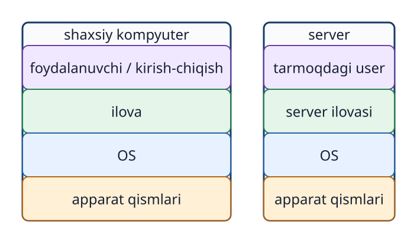
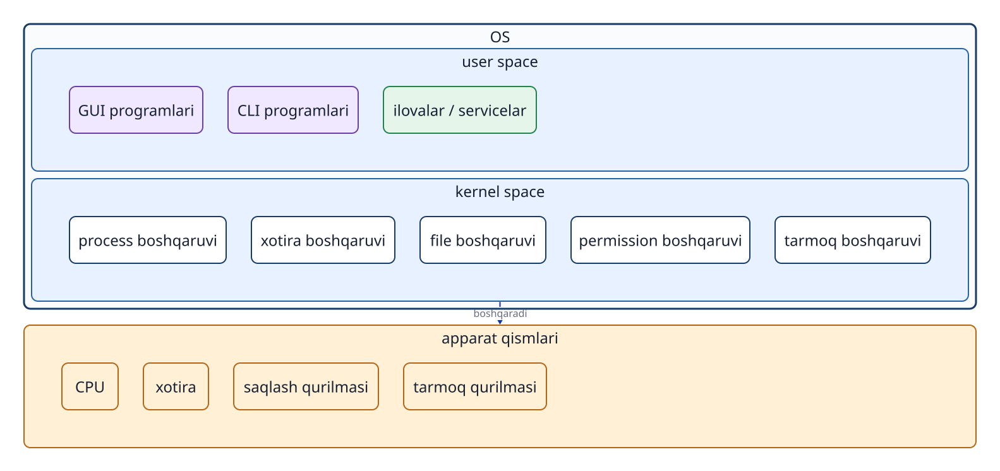
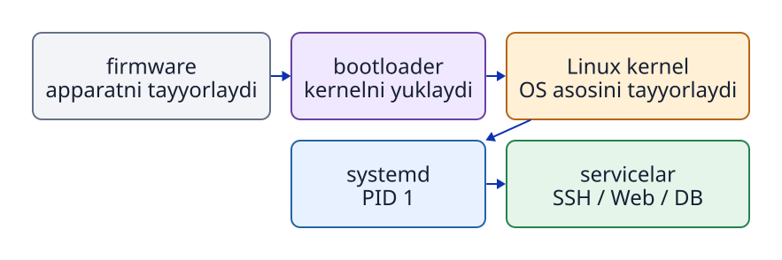
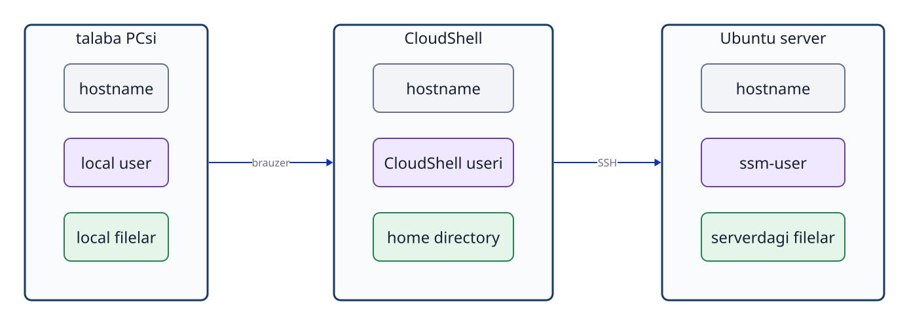

# 1-bob. Kompyuter va operatsion tizim

## Ushbu bobdan keyin javob bera oladigan savollar

- Kompyuter qanday asosiy qismlar va kiritish-chiqarish qurilmalaridan iborat?
- Shaxsiy kompyuter va `server`ning o‘xshash hamda farqli tomonlari nimada?
- `OS` foydalanuvchi, ilovalar va apparat qismlari o‘rtasida qanday vazifani bajaradi?
- `user space` va `kernel space` qanday ajratilgan?
- Linux tizimi qanday ketma-ketlikda ishga tushadi va `service`larni qanday boshlaydi?
- `user`, `host` va `process` qanday aniqlanadi?

## 1.1 Kompyuter nimalardan iborat?

Kompyuter kiritilgan ma’lumotni `program` ko‘rsatmalariga binoan qayta ishlaydigan, natijani chiqaradigan yoki saqlaydigan qurilmadir. Noutbuk, stol kompyuteri, smartfon va bulutdagi virtual `server` tashqi ko‘rinishi hamda vazifasi bilan farqlanadi. Lekin ularning asosiy tuzilishi o‘xshash.

- **CPU**: `program` ko‘rsatmalarini o‘qiydi, hisob-kitob va qaror qabul qilish amallarini bajaradi.
- **Tezkor xotira**: ishlayotgan `program` va unga hozir kerak bo‘lgan ma’lumotlarni vaqtincha saqlaydi.
- **Doimiy saqlash qurilmasi**: elektr o‘chirilgandan keyin ham qolishi kerak bo‘lgan `program`lar, sozlamalar, hujjatlar, ma’lumotlar va `log`larni saqlaydi. SSD va virtual disk bunga misol bo‘ladi.
- **Kiritish qurilmasi**: foydalanuvchi amali yoki tashqi ma’lumotni qabul qiladi. Klaviatura, sichqoncha va sensorli ekran shular jumlasidan.
- **Chiqarish qurilmasi**: natijani foydalanuvchiga ko‘rsatadi yoki eshittiradi. Monitor, karnay va printer bunga misol bo‘ladi.
- **Tarmoq qurilmasi**: boshqa kompyuterlar bilan ma’lumot almashadi.

Foydalanuvchi tugmani bosganda CPU yoki disk uning maqsadini o‘z-o‘zidan tushunmaydi. Kiritilgan amalni ilovaga yetkazish, ilovaga CPU va xotira ajratish, saqlangan `file`larni o‘qish yoki yozish hamda natijani ekranga yoki tarmoqqa chiqarish uchun umumiy mexanizm kerak. Bu vazifaning markazida **operatsion tizim (`OS`)** turadi.

## 1.2 Shaxsiy kompyuter va server ham kompyuterdir

**Shaxsiy kompyuter (PC)** odatda uning oldida o‘tirgan odam tomonidan klaviatura, sichqoncha va monitor orqali boshqariladi. **`server`** esa tarmoq orqali boshqa kompyuterlarga funksiya yoki ma’lumot taqdim etadi. Veb-sahifani yetkazadigan veb-`server`, ma’lumotni saqlaydigan va qidiradigan ma’lumotlar bazasi `server`i, nomlarni IP manzilga bog‘laydigan DNS `server`i bunga misol bo‘ladi.

`server` shaxsiy kompyuterdan butunlay boshqa tamoyil asosida ishlamaydi. Ikkalasida ham CPU, xotira, saqlash qurilmasi, tarmoq, `OS` va ilovalar bor. Asosiy farq ularning vazifasi, unumdorligi, ulanish usuli va uzluksiz ishlash talabidadir. `server`ga doimiy klaviatura yoki monitor ulanmagan bo‘lishi mumkin. Bunday holda administrator uni boshqa kompyuterdan tarmoq orqali boshqaradi. AWS EC2 `instance`i ham AWS infratuzilmasida ishlaydigan virtual kompyuter. Ushbu kursda u `server` sifatida ishlatiladi.



**1-1-rasm. Shaxsiy kompyuter va serverning vazifasi hamda boshqarish usuli farqlansa ham, ikkalasida ilovalar, OS va apparat qismlarining asosiy tuzilishi mavjud.**

## 1.3 OS nimani boshqaradi?

Bir vaqtning o‘zida bir nechta ilova ishlaganda, har biri CPU yoki xotirani o‘zi uchun to‘liq egallashi yoki boshqa foydalanuvchining `file`larini o‘qishi mumkin bo‘lmasligi kerak. `OS` apparat qismlari bilan ilovalar o‘rtasida turadi. U resurslardan foydalanishni muvofiqlashtiradi, umumiy imkoniyatlar yaratadi va himoyani ta’minlaydi.

Ushbu kitobda `OS`ning vazifalari to‘rt guruhga bo‘linadi.

1. **Ishlashni boshqarish**: `program`ni `process` sifatida ishga tushirish, CPUdan foydalanish navbati va `process` holatini boshqarish.
2. **Xotira va `file`larni boshqarish**: `process`larga xotira ajratish, saqlash qurilmasidagi ma’lumotni `file` va `directory` ko‘rinishida taqdim etish.
3. **Foydalanuvchi va himoyani boshqarish**: `user`, `group` va `permission` asosida kim nimani o‘qishi, o‘zgartirishi yoki ishga tushirishi mumkinligini aniqlash.
4. **Aloqani boshqarish**: `process`lar tarmoqdan foydalanishi uchun `socket` kabi umumiy imkoniyatlarni taqdim etish.

`OS` umumiy imkoniyatlarni bergani sababli ilova yaratuvchisi har bir kompyuter turidagi CPU va diskni boshqarish kodini boshidan yozishi shart emas.

## 1.4 GUI, CLI va command

Inson kompyuterga ko‘rsatma beradigan usul **foydalanuvchi `interface`i** deb ataladi. Uning ikki keng tarqalgan turi bor.

- **GUI (Graphical User Interface)**: oynalar, belgilar, menyular va tugmalarni ko‘rsatadi. Ko‘rsatmalar asosan sichqoncha yoki sensorli ekran orqali beriladi.
- **CLI (Command Line Interface)**: ko‘rsatma matn sifatida kiritiladi, natija ham matn ko‘rinishida olinadi.

CLIga kiritiladigan har bir ko‘rsatma **`command`** deb ataladi. `command` nomidan keyin kerak bo‘lsa `option` va ishlov beriladigan obyekt yoziladi. Masalan, `cat` `file` ichidagi ma’lumotni ketma-ket o‘qib, standart chiqishga chiqaradigan `command`dir.

```bash
cat /etc/os-release
```

Bu misolda `cat` — `command` nomi, `/etc/os-release` esa o‘qiladigan `file`ning `path`idir. Kiritilgan matnni `shell` talqin qiladi va `cat` `program`ini ishga tushiradi. `cat` `OS`dan `file`ni o‘qishni so‘raydi. `OS` avval `permission`ni tekshiradi, keyin ma’lumotni beradi. `command`, `terminal` va `shell`ning farqi hamda asosiy amallar 3-bobda batafsil ko‘rib chiqiladi.

## 1.5 User space va kernel space

Linux tizimini tushunishda uni **`user space`** va **`kernel space`**ga ajratib tasavvur qilish foydali.

**`kernel`** — `OS`ning markaziy qismi. U CPU, xotira, qurilmalar, `file system`, `process`lar, `permission`lar va tarmoqni boshqaradi. `kernel` yuqori vakolat bilan ishlaydi. Shu sababli u oddiy ilovalardan ajratilgan `kernel space`da bajariladi.

GUIga tegishli `program`lar, `terminal`, `shell`, `command`lar, veb-`server` va ma’lumotlar bazasi odatda `user space`da ishlaydi. GUI bilan CLI ikkita alohida “makon” emas. Ikkalasi ham `user space`dagi boshqarish usullari va ularga tegishli `program`lardir. Ilovalar ham `user space`da ishlaydi va kerakli amallarni bajarishni `kernel`dan so‘raydi.

`user space`dan `kernel` imkoniyatini chaqirish mexanizmi **`system call`** deyiladi. Ushbu kitobda `system call` raqamlari yoki ularni dasturlash tartibi o‘rganilmaydi. Uni “`user space`dagi `program` himoyalangan `kernel` imkoniyatidan foydalanadigan kirish nuqtasi” deb tushunish yetarli.



**1-2-rasm. Keng ma’nodagi OS muhiti user spaceda ishlaydigan programlar va apparat qismlarini boshqaradigan kernel spacedan iborat.**

“`OS`” atamasi ba’zan faqat `kernel`ga yaqin ma’noda, ba’zan esa asosiy `command`lar va boshqaruv `program`larini ham o‘z ichiga olgan butun tizim ma’nosida ishlatiladi. Farqlash zarur bo‘lsa, ushbu kitob “`kernel`” va “`user space`dagi `program`lar” iboralarini aniq ishlatadi.

## 1.6 Linux va Ubuntu

**Linux** dastlab `kernel` nomidir. Amalda foydalaniladigan tizim uchun esa `kernel` bilan birga asosiy `command`lar, `shell`, kutubxonalar, `package`larni boshqarish va `service`larni boshqarish vositalari ham kerak. Ularni o‘rnatish va yangilash mumkin bo‘lgan majmua shaklida jamlagan tizim **Linux `distribution`i** deb ataladi.

Ubuntu, Debian va Fedora — Linux `distribution`lariga misol. Amaliy mashg‘ulot muhiti bir xil bo‘lishi uchun ushbu kursda Ubuntu Server 24.04 LTS ishlatiladi. Biroq o‘qishning asosiy maqsadi Ubuntu nomini yodlash emas. Maqsad — Linux tizimlariga xos umumiy tushunchalar va amallarni o‘rganish. `distribution`lar tarixi va farqlari 2-bobda tushuntiriladi.

## 1.7 Kompyuter yoqilgandan service ishga tushguncha

Saqlash qurilmasidagi `program` faqat saqlanib turgani uchun hech qanday ish bajarmaydi. `program` xotiraga yuklanib, CPU tomonidan bajarilayotgan holat **`process`** deyiladi. `OS` har bir `process`ni farqlash uchun unga **PID (`process` ID)** raqamini beradi.

Linux tizimi taxminan quyidagi tartibda ishga tushadi.

1. Elektr yoqilgach, firmware CPU, xotira va saqlash qurilmasi kabi qismlarni tayyorlaydi.
2. Bootloader Linux `kernel`ini xotiraga yuklaydi.
3. `kernel` xotira, qurilmalar va `file system`dan foydalanish imkonini tayyorlaydi.
4. `kernel` `user space`dagi birinchi boshqaruv `process`ini ishga tushiradi.
5. Ubuntu Server 24.04da bu boshqaruv `process`i `systemd` bo‘lib, uning PID raqami 1 bo‘ladi.
6. `systemd` sozlamalar va o‘zaro bog‘liqliklarni o‘qiydi. Keyin tarmoq, SSH, `log`larni boshqarish, veb-`server` va ma’lumotlar bazasi uchun kerakli `service`larni ishga tushiradi va kuzatadi.

**`service`** — foydalanuvchi har safar ekranda qo‘lda ishga tushirmasa ham, fon rejimida davomli imkoniyat berishi uchun boshqariladigan `program`. `service` ishga tushganda, haqiqiy ishni bajaradigan bir yoki bir nechta `process` ishlaydi. Masalan, ma’lumotlar bazasi `server`ida ma’lumotlar bazasi `service`i boshqaruv obyekti bo‘ladi. Uning `process`lari xotirada ishlaydi, kerak bo‘lsa `file`larni o‘qiydi yoki yozadi va tarmoqdan keladigan so‘rovni kutadi.

`systemd` ma’lumotlar bazasidagi so‘rovlarni yoki veb-sahifa tayyorlash ishini o‘zi bajarmaydi. U qaysi `service` qachon, qanday ketma-ketlikda va qaysi `user` nomidan ishga tushishini boshqaradi. PID, `process`larning ota-bola munosabati va signallar 8-bobda, `systemd`, `service` va `unit`lar 10-bobda batafsil tushuntiriladi.



**1-3-rasm. Kernel user space dagi birinchi processni ishga tushiradi, systemd esa kerakli service processlarini belgilangan tartibda boshlaydi.**

## 1.8 Host va userni aniqlash

Tarmoqqa ulangan va mustaqil `OS` muhiti sifatida ishlaydigan kompyuter yoki virtual mashina **`host`** deb ataladi. Har bir `host`ni aniqlash uchun **`hostname`** beriladi. `hostname` — kompyuterning nomi, foydalanuvchining nomi emas.

Bitta `host`da bir nechta `user` hisobi bo‘lishi mumkin. `OS` amalni bajarayotgan `user` va unga tegishli `group`larni raqamli IDlar orqali boshqaradi. `user`ni aniqlovchi raqam **UID (`user` ID)**, `group`ni aniqlovchi raqam **GID (`group` ID)** deyiladi. `id` `command`i hozirgi `user` nomi, UID, `primary group` va `supplementary group`larni ko‘rsatadi.

Amaliy mashg‘ulotda talabaning kompyuteri, AWS CloudShell va Ubuntu EC2 kabi bir nechta `host` ishlatiladi. Ularning matn kiritish oynalari o‘xshash ko‘rinsa ham, har birining alohida `OS`i, `user`lari, `process`lari va `file`lari bor. Hozirgi `user`, `hostname` va ish `directory`sini tekshirib, aynan qaysi `host`ning qaysi joyida ishlayotganingizni bilib olasiz.

```bash
id
hostname
pwd
```

`id` `user` va `group` identifikatorlarini, `hostname` `host` nomini, `pwd` esa joriy ish `directory`sini ko‘rsatadi. `user`larni boshqarish 6-bobda, `file` va `path`lar 4-bobda, CloudShell bilan Ubuntu o‘rtasidagi aloqa 12-bobda batafsil ko‘riladi.



**1-4-rasm. Har bir host alohida OS muhitiga ega; unda userlar, processlar va filelar mustaqil boshqariladi.**

## Bob yakunidagi savollar

### 1-savol. Shaxsiy kompyuter va serverning o‘xshash hamda farqli tomonlari nimada?

### 2-savol. GUI, CLI, user space va kernel space qanday bog‘langan?

### 3-savol. Program, process va service nimasi bilan farqlanadi?

### 4-savol. PID 1 ga ega systemd nima qiladi?

### 5-savol. Hostname bilan user nomi o‘rtasidagi farq nima?

## Bob yakunidagi javoblar

### 1-savol

**Javob:** Ikkalasi ham CPU, xotira, saqlash qurilmasi, tarmoq, `OS` va ilovalarga ega kompyuterdir. Shaxsiy kompyuter odatda oldida o‘tirgan foydalanuvchining bevosita ishiga xizmat qiladi. `server`ning asosiy vazifasi esa tarmoq orqali boshqa kompyuterlarga imkoniyat yoki ma’lumot berishdir.

### 2-savol

**Javob:** GUI va CLI — foydalanuvchi ko‘rsatma beradigan ikki usul. Ularni amalga oshiradigan `program`lar odatda `user space`da ishlaydi. `user space`dagi `program` `system call` orqali `kernel space` imkoniyatidan foydalanadi. `kernel` apparat qismlari va `OS` resurslarini boshqaradi.

### 3-savol

**Javob:** `program` — saqlash qurilmasidagi ko‘rsatmalar to‘plami. `process` — shu `program` xotiraga yuklanib, bajarilayotgan holat. `service` esa davomli imkoniyat berishi uchun `systemd` kabi vosita boshqaradigan birlik bo‘lib, uning haqiqiy ishini bir yoki bir nechta `process` bajaradi.

### 4-savol

**Javob:** Ubuntu Server 24.04da `kernel` ishga tushiradigan birinchi `user space` boshqaruv `process`i `systemd` bo‘lib, u PID 1 ga ega. `systemd` sozlamalar va bog‘liqliklarga ko‘ra `service`larni ishga tushiradi, to‘xtatadi va kuzatadi.

### 5-savol

**Javob:** `hostname` `OS` ishlayotgan kompyuter yoki virtual mashinani aniqlaydi. `user` nomi esa shu `host`da ishlash huquqiga ega hisobni aniqlaydi. Bitta `host`da bir nechta `user` bo‘lishi mumkin.

## Foydalanilgan manbalar

- Linux Kernel Organization, [The Linux Kernel documentation](https://docs.kernel.org/) (2026-09-21 kuni tekshirilgan)
- Linux man-pages, [intro(2) - introduction to system calls](https://man7.org/linux/man-pages/man2/intro.2.html) (2026-09-21 kuni tekshirilgan)
- Ubuntu Manpages, [boot(7) - system bootup process](https://manpages.ubuntu.com/manpages/jammy/man7/boot.7.html) (2026-09-21 kuni tekshirilgan)
- Ubuntu Server documentation, [Ubuntu Server documentation](https://ubuntu.com/server/docs/) (2026-09-21 kuni tekshirilgan)
