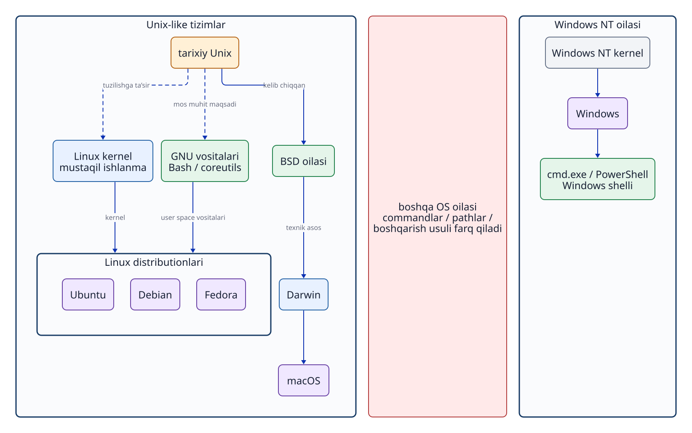
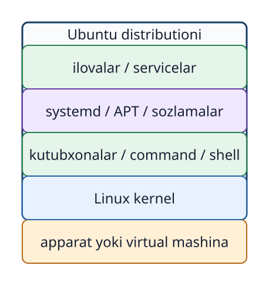

# 2-bob. Unixdan hozirgi operatsion tizimlargacha

## Nima uchun tarixni o‘rganamiz?

Maqsad sanalarni yodlash emas. Linux, macOS va Windowsda nima sababdan ayrim atamalar o‘xshash, ayrim `command`lar esa boshqacha ekanini tushunish muhim. Shuningdek, “Linux Unixning asl kodini bevosita meros qilib olgan”, “macOS Linuxning bir turi”, “Windows ham Unixdan kelib chiqqan” kabi noto‘g‘ri tasavvurlardan qochish kerak.

## 2.1 Unix ilgari surgan g‘oyalar

Unix ustida ishlash 1969-yilda Bell Labsda boshlandi. Keyingi rivojlanish jarayonida u iyerarxik `file system`, `process`, bir nechta `user` bilan ishlash va kichik vositalarni birlashtirish kabi g‘oyalarni ommalashtirdi. Bu g‘oyalar hozirgi `OS`larda ham uchraydi.

**2-1-foto. Dastlabki Unix ishlab chiqilgan DEC PDP-7 rusumidagi saqlanib qolgan kompyuter. 2018-yilda AQShdagi muzeyda suratga olingan. Surat muallifi: ComputerGeek7066, [Wikimedia Commons](https://commons.wikimedia.org/wiki/File:DEC_PDP-7.jpg), [CC BY-SA 4.0](https://creativecommons.org/licenses/by-sa/4.0/) (o‘zgartirilmagan).**

Bu surat o‘sha davrda Bell Labsda ishlatilgan aynan shu qurilmaga tegishli emas. PDP-7 1960-yillarda ishlab chiqarilgan kompyuter turi bo‘lib, dastlabki Unix shu turdagi qurilmada ishlagan.

Ushbu kitobdagi amallar bilan bog‘liqlikni ko‘rish oson: `file`larni `directory`lar iyerarxiyasida saqlash; `program`ni `process` sifatida kuzatish; `user` va `group` orqali huquqlarni ajratish; `grep` natijasini boshqa `command` yoki `file`ga uzatish. Bular Unixga o‘xshash tizimlarda uzoq vaqt shakllangan ishlash usullaridir.

“Unix” bitta `command` to‘plamining nomi emas. Tarixiy Unixdan ta’sirlangan barcha tizimlar bir xil manba kodiga yoki rasmiy UNIX savdo belgisi sertifikatiga ega degani ham emas. Odatda Unixga o‘xshash tuzilish va `interface`ga ega tizimlar **Unix-like** deb ataladi. Rasmiy sertifikatlash masalasini texnik g‘oyalarning o‘xshashligidan ajratib tushunish kerak.

## 2.2 GNU va erkin Unixga mos muhit

GNU Project 1983-yilda e’lon qilingan. Uning maqsadi Unix bilan mos, erkin foydalaniladigan dasturiy tizim yaratish edi. Loyiha doirasida `shell`, kompilyator va asosiy yordamchi `program`lar ishlab chiqildi. Hozirgi ko‘plab Linux `distribution`larida Linux `kernel`i bilan birga GNU vositalari va boshqa ko‘plab `program`lar ishlaydi.

**`shell`** — foydalanuvchi kiritgan matnni o‘qiydigan, uni `command` sifatida talqin qiladigan va kerakli `program`ni ishga tushiradigan `user space` `program`i. `shell` faqat bitta `command`ni boshlash bilan cheklanmaydi. U argumentlarni ajratadi, kirish va chiqishni qayta yo‘naltiradi, `pipe`larni ulaydi, muhit o‘zgaruvchilarini kengaytiradi va bir nechta `command`dan iborat skriptni ketma-ket bajaradi. Shunday qilib, `shell` foydalanuvchi bilan ko‘plab `command`lar o‘rtasidagi ishni tashkil qiladi.

**Bash** — GNU Project ishlab chiqadigan `shell`lardan biri. Nomi “Bourne-Again Shell” iborasidan kelib chiqqan. Bash Linux `kernel`i ham, `terminal` oynasi ham emas. Ubuntu `terminal`iga kiritilgan matnni Bash talqin qiladi va `ls` yoki `cp` kabi `program`larni ishga tushiradi. `cd` kabi `shell`ning o‘z holatini o‘zgartiradigan amal esa Bash ichiga o‘rnatilgan `command` sifatida bajariladi. `terminal`, `shell` va `command` farqi 3-bobda batafsil o‘rganiladi.

Bu yerda asosiy fikr: `kernel`ning o‘zi talaba ishlata oladigan to‘liq tizim emas. Masalan, Bash `shell` vazifasini bajaradi, GNU coreutils esa `ls` va `cp` kabi asosiy `command`larni beradi. Bundan tashqari, `package` boshqaruvchisi, `systemd`, kutubxonalar, sozlama `file`lari va turli ilovalar birlashgandagina amalda foydalaniladigan tizim hosil bo‘ladi.

## 2.3 Linux — mustaqil yaratilgan kernel

Linux `kernel`ini yaratish 1991-yilda boshlandi. Uning maqsadi Unixga o‘xshash imkoniyat va `interface`larni taqdim etish edi. Lekin Linux tarixiy Unixning manba kodidan bevosita ajralib chiqqan tarmoq emas. Shuning uchun `OS`lar kelib chiqishi chizmasida Unixdan Linuxga “manba kodi meros bo‘lgan” degan uzluksiz chiziq tortish noto‘g‘ri. G‘oyaviy ta’sir yoki moslik maqsadini uzilgan chiziq bilan ifodalash to‘g‘riroq.

Linux `kernel`i `process`, xotira, `file system`, qurilmalar va tarmoq kabi quyi `layer`larni boshqaradi. Ubuntu esa Linux `kernel`ini ko‘plab `user space` vositalari, `package`lar, boshlang‘ich sozlamalar va chiqarilish siyosati bilan birlashtirgan `distribution`dir.

Windows NT oilasi esa Unixdan ajralib chiqqan `OS` emas. U Unixga o‘xshash tizimlardan boshqa yo‘nalishda ishlab chiqilgan. Windowsdagi `cmd.exe` va PowerShell ham `shell`, lekin ularning sintaksisi, ichki `command`lari, `path` yozilishi va boshqarish usuli Bashdan farq qiladi. Nomi o‘xshash `command`lar yoki bir nechta `OS`da ishlaydigan tashqi `program`lar mavjud. Shunga qaramay, Unixga o‘xshash tizimdagi har bir `command` Windowsda aynan shu tarzda ishlaydi deb hisoblamang. Bash Linuxning o‘zi emas; u Linux va macOS kabi tizimlarda foydalanish mumkin bo‘lgan `shell`lardan biridir.

**2-1-rasm. Unix-like va Unixga mos tizimlar Windows NT oilasidan alohida yo‘nalishdir; ularning commandlari bir-biriga to‘liq mos deb bo‘lmaydi.** Linux Unixga o‘xshash `interface`larga ega mustaqil ishlanma, macOS esa Linuxdan kelib chiqmagan.

## 2.4 Distribution tanlaydi va birlashtiradi

Linux `kernel`idan foydalanadigan Ubuntu, Debian, Fedora va boshqa `distribution`lar bor. Har bir `distribution` qaysi dasturiy ta’minotni qo‘shish, `package` formati, yangilash siyosati, boshlang‘ich sozlamalar va qo‘llab-quvvatlash muddatini o‘zi belgilaydi.

Ushbu kursda amaliy muhit Ubuntu Server 24.04 LTS bilan bir xil qilinadi. Boshqa `distribution`larda ham `ls` yoki `grep` ishlashi mumkin. Lekin `package`larni boshqarish `command`lari, sozlama `file`larining joyi, xavfsizlik funksiyalari va `service`larning boshlang‘ich sozlamalari farqlanishi mumkin. Red Hat/RHEL uchun yozilgan ko‘rsatmani tekshirmasdan Ubuntuga qo‘llamang.

**2-2-rasm. Distribution Linux kernel, kutubxonalar, asosiy commandlar, tizim boshqaruvi, packagelar va ilovalarni birlashtiradi.** Bu tuzilma Ubuntu va Linuxni to‘liq sinonim deb hisoblamaslikka yordam beradi.

## 2.5 macOSning asosi — Darwin

Hozirgi macOSning asosida Darwin turadi. Apple rasmiy hujjatlarida Darwin Mach, BSD va Apple yaratgan texnologiyalardan tuzilgani aytiladi. BSDdan kelgan `process` modeli, `permission` tizimi va tarmoq funksiyalari tufayli `terminal`da Unixga o‘xshash `command` hamda `path`lardan foydalanish mumkin.

Ammo macOS Linux `distribution`i emas. Uning markazida Linux `kernel`i ishlamaydi. macOS shuningdek o‘z GUI tizimi va Applega xos dasturiy platformalarni ham o‘z ichiga oladi; ular Darwinning o‘zidan iborat emas. Qadimgi Classic Mac OS bilan Mac OS Xdan boshlangan Darwin asosidagi tizimni ham bir-biridan farqlash kerak.

## 2.6 Windowsni alohida yo‘nalish sifatida tushunish

Dastlabki oddiy foydalanuvchilarga mo‘ljallangan Windows turlarida MS-DOSga asoslangan yo‘nalish bo‘lgan (masalan, Windows 95/98). Hozirgi Windowsga bevosita olib kelgan Windows NT oilasi esa ulardan alohida, yangi tizim sifatida ishlab chiqilgan. Windows 2000, XP va bugungi Windowsni Unixdan kelib chiqqan oddiy shoxcha sifatida tasvirlash noto‘g‘ri.

Windowsda ham `kernel mode` va `user mode`, `process`, `file permission`, `service`, tarmoq `socket`i va CLI bor. Buning sababi — zamonaviy `OS`lar o‘xshash texnik muammolarni hal qilishi kerak. Bu Windows Unixning avlodi ekanini isbotlamaydi. PowerShelldan foydalanish yoki Windows Subsystem for Linux (WSL)ni ishga tushirish ham Windows `kernel`ining o‘zi Linuxga aylanganini anglatmaydi.

## 2.7 O‘xshashlik va farqlarni qanday ko‘ramiz?

| Mezoni | Ubuntu/Linux oilasi | macOS | Windows |
| --- | --- | --- | --- |
| Markaziy qism | Linux `kernel`i | Darwin (Mach, BSD va boshqalar) | Windows NT oilasidagi `kernel` |
| Odatdagi CLI | `shell` va Unixga o‘xshash vositalar | `shell` va BSD/Unix vositalari | PowerShell, cmd va boshqalar |
| `path` misoli | `/home/user` | `/Users/user` | `C:\Users\user` |
| Dastur o‘rnatish | `distribution`ning `package` boshqaruvi | App Store, o‘rnatuvchi, `package` boshqaruv vositalari | Microsoft Store, o‘rnatuvchi, `package` boshqaruv vositalari |
| Ushbu kursdagi o‘rni | Amaliy mashg‘ulot muhiti | Taqqoslash uchun | Taqqoslash uchun |

Bir xil maqsadga xizmat qiladigan funksiya ham turli `OS`larda boshqa `command` nomi, boshlang‘ich sozlama yoki `permission` xatti-harakatiga ega bo‘lishi mumkin. Bu kursda Ubuntu orqali `OS`ning asosiy tamoyillari o‘rganiladi. Keyin boshqa `OS`ga o‘tganda “aynan shu `command`ni qayerdan topaman?” deb emas, “shu vazifani qaysi funksiya yoki mexanizm bajaradi?” deb izlash muhim.

## Bob yakunidagi savollar

### 1-savol. “Kernel” va “distribution” atamalaridan foydalanib, Linux bilan Ubuntu farqini tushuntiring.

### 2-savol. Shell nima? Bash misolida tushuntiring.

### 3-savol. Nima uchun macOSni Linux distributioni deb bo‘lmaydi?

### 4-savol. Windowsda ham process va permission borligi uning Unixdan bevosita kelib chiqqanini isbotlaydimi? Sababini ayting.

## Bob yakunidagi javoblar

### 1-savol

**Javob:** Linux — `process`, xotira va qurilmalarni boshqaradigan `kernel`. Ubuntu — Linux `kernel`ini GNU vositalari, `shell`, kutubxonalar, `package` boshqaruvi va sozlamalar bilan birlashtirgan Linux `distribution`i.

### 2-savol

**Javob:** `shell` foydalanuvchi yozgan matnni `command` sifatida talqin qiladigan `user space` `program`idir. U `program`ni ishga tushiradi, argumentlarni uzatadi, kirish-chiqishni qayta yo‘naltiradi, `pipe` va o‘zgaruvchilar bilan ishlaydi, skriptlarni bajaradi. Bash GNU Project ishlab chiqadigan `shell`lardan biri; u Linux `kernel`i emas.

### 3-savol

**Javob:** macOS Darwin asosida qurilgan. Uning markazida Mach va BSDdan kelgan texnologiyalar bor, Linux `kernel`i emas. Shuning uchun u Linux `distribution`i hisoblanmaydi.

### 4-savol

**Javob:** Yo‘q. `process` va `permission` zamonaviy `OS`larga umumiy zarur funksiyalardir. Windows NT oilasi Unix-like tizimlardan alohida yo‘nalishda rivojlangan. `cmd.exe` va PowerShell sintaksisi, `command`lari, `path`lari va boshqarish usullari Bashga asoslangan Unix-like muhitdan farqlanadi.

## Foydalanilgan manbalar

- Dennis M. Ritchie, [The Evolution of the Unix Time-sharing System](https://www.nokia.com/bell-labs/about/dennis-m-ritchie/hist.html) (2026-09-18 kuni tekshirilgan)
- Bell Labs, [A history of computing at Bell Research Laboratories (1937-1975)](https://archive.computerhistory.org/resources/access/text/2022/08/102804421-05-01-acc.pdf) (2026-09-24 kuni tekshirilgan; dastlabki Unix va PDP-7 munosabati)
- Wikimedia Commons, [DEC PDP-7.jpg](https://commons.wikimedia.org/wiki/File:DEC_PDP-7.jpg) (2026-09-24 kuni tekshirilgan; ComputerGeek7066 surati, CC BY-SA 4.0; saqlangan kompyuter 2018-yilda suratga olingan)
- GNU Project, [Initial Announcement](https://www.gnu.org/gnu/initial-announcement.en.html) (2026-09-18 kuni tekshirilgan)
- GNU Project, [What is a shell?](https://www.gnu.org/software/bash/manual/html_node/What-is-a-shell_003f.html) (2026-09-21 kuni tekshirilgan)
- GNU Project, [What is Bash?](https://www.gnu.org/software/bash/manual/html_node/What-is-Bash_003f.html) (2026-09-21 kuni tekshirilgan)
- Linux Kernel Documentation, [Introduction](https://cdn.kernel.org/doc/html/latest/process/1.Intro.html) (2026-09-18 kuni tekshirilgan)
- Apple, [Kernel Architecture Overview](https://developer.apple.com/library/archive/documentation/Darwin/Conceptual/KernelProgramming/Architecture/Architecture.html) (2026-09-18 kuni tekshirilgan; eski arxiv hujjati faqat tarix va tuzilish uchun)
- Microsoft, [Windows NT Build History](https://learn.microsoft.com/en-us/sysinternals/resources/archive/v02n03) (2026-09-18 kuni tekshirilgan; tarixiy manba)
- Microsoft Learn, [Windows commands](https://learn.microsoft.com/en-us/windows-server/administration/windows-commands/windows-commands) (2026-09-21 kuni tekshirilgan)
