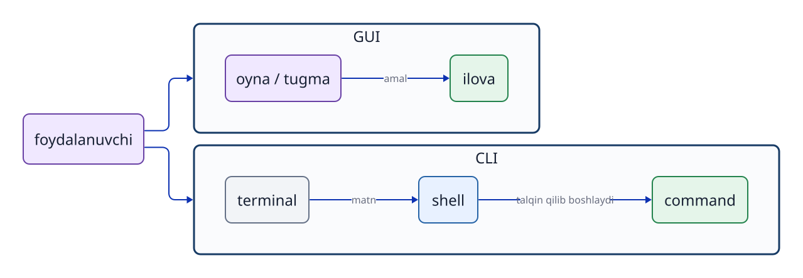

# 3-bob. GUI, CLI, terminal va shell

## 3.1 Boshqarish oynasi va amalni bajaruvchi programni ajratish

GUI (Graphical User Interface) — oyna, belgi, menyu va ko‘rsatkich yordamida ko‘rib boshqarish usuli. CLI (Command Line Interface) — `command`larni matn sifatida kiritish va natijani matn ko‘rinishida olish usuli. Ikkalasi ham odamning kompyuterga ko‘rsatma berishi uchun kirish nuqtasidir. GUI ishlashi uchun u ichkarida albatta CLIga aylanishi kerak degan qoida yo‘q.

**`terminal`** — matn kiritish va natijani ko‘rsatish oynasi yoki ulanish muhiti. **`shell`** esa kiritilgan matnni o‘qiydigan, `command`ni talqin qilib bajaradigan `program`. Ushbu amaliy muhitda asosan Bash `shell`i ishlatiladi.

```text
Odam (operator) → terminal → Bash (shell) → command processi → kernel imkoniyati
```

`terminal` va `shell` bir xil narsa emas. `terminal` matn almashiladigan joy; `shell` esa kiritilgan matnning ma’nosini aniqlab, amalni bajaradigan `program`.



**3-1-rasm. GUI va CLI parallel kirish usullaridir. CLI ishlatilganda terminal va shell vazifalarini farqlash kerak.**

## 3.2 Prompt matn kiritiladigan joyni ko‘rsatadi

`shell` `user`dan yangi ko‘rsatma kutayotganda ko‘rsatadigan matn **`prompt`** deyiladi. Unda ko‘pincha `user` nomi, `hostname` va joriy ish `directory`si ko‘rsatiladi. Aniq ko‘rinishi sozlamaga bog‘liq.

Darslikdagi quyidagi `$` — `prompt` namunasi. Uni foydalanuvchi o‘zi kiritmaydi.

```text
$ pwd
/home/ssm-user
```

Kiritiladigan `command` — `pwd`. Keyingi qator uning chiqishiga misol. Kitobdagi ayrim misollarda kiritilgan matnni natijadan ajratish uchun `$` ko‘rsatiladi.

## 3.3 Command, argument va option

Asosiy tuzilishni quyidagicha o‘qing.

```text
command   option   argument
ls        -l       /srv
```

`ls` — bajariladigan `command`; `-l` — batafsil ko‘rsatishni tanlaydigan `option`; `/srv` — ishlov beriladigan obyektni bildiradigan argument. Ko‘p `command`larda qisqa `option`lar birlashtiriladi, masalan `ls -la`. Lekin bir xil harf har bir `command`da bir xil vazifani anglatmaydi. Masalan, `grep -n` satr raqamlarini ko‘rsatadi, `tail -n 5` esa ko‘rsatiladigan satrlar sonini belgilaydi.

`command` satrida bo‘sh joy elementlarni ajratadi. Shu sababli ichida bo‘sh joy bor matnni bitta argument sifatida uzatish uchun uni qo‘shtirnoq yoki apostrof bilan o‘rash kerak.

```bash
printf '%s\n' 'JDU SSH transfer test'
```

Qo‘shtirnoqlar, o‘zgaruvchilarni kengaytirish va chiqishni qayta yo‘naltirish 5-bobda batafsil o‘rganiladi.

## 3.4 Shell builtin va tashqi command

`shell`ga kiritiladigan `command`lar ikki asosiy turga bo‘linadi: **`shell builtin`** va **tashqi `command`**.

`shell builtin` — Bashning o‘ziga kiritilgan funksiya. Uni bajarish uchun alohida ishlatiladigan `file`ni topib ishga tushirish shart emas. Masalan, `cd` hozir ishlayotgan Bashning o‘z ish `directory`sini o‘zgartiradigan `shell builtin`dir.

Tashqi `command` esa saqlash qurilmasidagi `program`dir; `shell` uni topib ishga tushiradi. `ls`, `mkdir` va `grep` Ubuntu o‘rnatilganda ko‘pincha mavjud bo‘ladi. Lekin ular Bashning ichki funksiyasi emas, tashqi `program`dir. Demak, **boshidan mavjud bo‘lish** va **`shell` ichiga kiritilgan bo‘lish** — ikki boshqa tasnif.

Ba’zi tashqi `command`lar `OS` bilan birga keladi, boshqalari kerak bo‘lganda qo‘shimcha o‘rnatiladi. Masalan, `python3` Python `program`larini ishga tushiradigan tashqi `command`. U faqat Python o‘rnatilgan muhitda ishlaydi. Ubuntu turiga qarab oldindan mavjud bo‘lishi yoki keyin `package` sifatida o‘rnatilishi mumkin. `package` o‘rnatish 9-bobda ko‘riladi.

```bash
type cd
type mkdir
type python3
```

`type` kiritilgan nomni Bash qanday talqin qilishini ko‘rsatadi. `shell builtin` bo‘lsa shu haqida xabar beradi; tashqi `command` bo‘lsa uning bajariladigan `file`i joylashgan `path`ni ko‘rsatadi. Nom topilmasa, hozirgi muhitda bu `command`dan foydalanib bo‘lmaydi.

`type` natijasida **`alias`** ham chiqishi mumkin. `alias` — uzun yoki tez-tez ishlatiladigan `command`ga qisqa boshqa nom berish imkoniyati. Masalan, ayrim muhitlarda `ll` nomi `ls -alF`ga bog‘langan. Bunday nomning mavjudligi va mazmuni muhitga qarab o‘zgaradi.

Tashqi `command` kiritilganda, `shell` `PATH` sozlamasida sanab o‘tilgan `directory`larni ketma-ket ko‘rib, mos nomli bajariladigan `file`ni izlaydi. Uning joylashgan manzilini oldindan yodlash kerak emas. Avval `type` orqali nom `shell builtin`, tashqi `command` yoki `alias` ekanini tekshiring.

## 3.5 Shell commandni qanday bajaradi?

`shell` kiritilgan matnni o‘zgartirmasdan `kernel`ga yubormaydi. Taxminan quyidagi amallarni bajaradi.

1. Matnni `command` nomi, `option` va argumentlarga ajratib talqin qiladi.
2. Qo‘shtirnoq qoidalari, muhit o‘zgaruvchilari, `$(...)` orqali `command` natijasini qo‘yish va `wildcard`larni tegishli qoida bo‘yicha kengaytiradi.
3. `shell builtin` bo‘lsa o‘zida bajaradi; tashqi `command` bo‘lsa bajariladigan `file`ni qidiradi.
4. Kerakli kirish-chiqish oqimlarini qayta yo‘naltirish va `pipe` orqali ulashga tayyorlaydi.
5. `process`ni boshlaydi; u oldingi planda tugashini kutadi yoki orqa planda ishlashda davom etadi.
6. `process`ning `exit status` qiymatini oladi.

Bu tartib xato qayerda yuz berganini aniqlashga yordam beradi. `command` topilmasa, uning nomi va tashqi `program` qayerdan qidirilganini tekshiring. Kutilgan obyektga amal qilinmasa, `option` va argumentlar to‘g‘ri talqin qilinganini tekshiring. Kirish-chiqish 5-bobda, `process`lar 8-bobda batafsil ko‘riladi.

## 3.6 Qiyin vaziyatda foydali amallar va tekshirish commandlari

CLI ishlatayotganda qayerda turganingizni yoki `command`ning vazifasini bilmay qolsangiz, taxmin bilan davom etish o‘rniga holatni tekshiring.

| Amal yoki `command` | Nimani bilib olasiz? |
|---|---|
| `Ctrl+C` | Hozirgi amalga to‘xtash signali yuboradi va `prompt`ga qaytishga yordam beradi. |
| `pwd` | Joriy ish `directory`sini ko‘rsatadi. |
| `cd directory_name` | Ish `directory`sini o‘zgartiradi. |
| `ls` | Joriy `directory`dagi `file` va `directory`larni ko‘rsatadi. |
| `grep 'search_text' file_name` | `file`dan ko‘rsatilgan matn bor satrlarni izlaydi. |
| `type command_name` | Nom `shell builtin`, tashqi `command` yoki `alias` ekanini aniqlaydi. |
| `help command_name` | Bash `shell builtin`i uchun tushuntirishni ko‘rsatadi. |
| `exit` | Hozirgi `shell`dan chiqib, uni boshlashdan oldingi holatga qaytadi. |

`pwd`, `cd` va `ls` “qayerda, nimani boshqaryapman?” savoliga javob topishda asosiy vositalardir. `grep` katta matn yoki `log`dan kerakli satrni qidiradi. `type` va `help` `command`ning turi va ishlatilishini aniqlashga yordam beradi. `grep` va `ls` foydali tekshirish vositalari bo‘lsa ham, `shell builtin` emas; yuqoridagi jadvaldagi hamma amal `shell` ichiga kiritilgan degani emas.

## 3.7 Manual va helpdan foydalanish

Tashqi `command` uchun `man`, Bash `shell builtin`i uchun esa `help` ma’lumot olishning boshlang‘ich nuqtasidir.

```bash
man ls
help cd
grep --help
```

Manualdagi `NAME` bo‘limi `command`ning qisqa maqsadini, `SYNOPSIS` yozilish tartibini, `DESCRIPTION` ishlashini, `OPTIONS` esa `option`larning ma’nosini ko‘rsatadi. Sintaksisdagi `[ ]` odatda “ixtiyoriy” degan belgi; bu qavslarning o‘zini kiritish kerak emas. `man` oynasidan chiqish uchun `q` tugmasini bosing.

## 3.8 Exit status orqali natijani aniqlash

`command` ekranga chiqargan matndan tashqari, natijani bildiradigan kichik butun sonni `shell`ga qaytaradi. Bu son **`exit status`** yoki `exit code` deyiladi. Unix-like tizimlarda `0` odatda muvaffaqiyatli yakunlanishni, `0`dan boshqa son esa muvaffaqiyatsizlik yoki xatoni bildiradi.

```bash
test -e /etc/os-release
echo $?
```

`$?` oxirgi bajarilgan `command`ning `exit status`ini saqlaydigan maxsus o‘zgaruvchi. Keyingi `command` bajarilishi bilan bu qiymat yangilanadi. Shuning uchun kerakli `command`dan darhol keyin tekshirish zarur. `0`dan boshqa qiymatlarning hammasi bir xil sababni anglatmaydi. Masalan, `grep` mos satr topilmaganda `1`, `file` yo‘qligi kabi bajarish xatosida `2` qaytaradi. Faqat ekrandagi xabarga emas, natija qanday baholanishiga ham qarang.

## Bob yakunidagi savollar

### 1-savol. Terminal va shell vazifalari nimasi bilan farqlanadi?

### 2-savol. Nima uchun `cd` shell builtin bo‘lishi kerak?

### 3-savol. Nima uchun “boshidan mavjud command” va “shell builtin” bir xil tushuncha emas?

### 4-savol. Command turini qanday tekshirasiz?

## Bob yakunidagi javoblar

### 1-savol

**Javob:** `terminal` matn kiritiladigan va natija ko‘rsatiladigan oyna yoki ulanish muhiti. `shell` esa kiritilgan matnni talqin qilib, ichki funksiyani bajaradigan yoki tashqi `program`ni ishga tushiradigan `program`.

### 2-savol

**Javob:** `cd` aynan hozir ishlayotgan `shell`ning ish `directory`sini o‘zgartirishi kerak. Agar faqat alohida tashqi `process` o‘z joyini o‘zgartirsa, asl `shell`ning joriy joyi o‘zgarmaydi.

### 3-savol

**Javob:** Boshidan mavjud tashqi `program`lar ham bor. Masalan, `mkdir` Ubuntuda ko‘pincha oldindan mavjud, lekin Bash ichiga kiritilgan emas; u tashqi `command`. `cd` esa Bashning `shell builtin`idir.

### 4-savol

**Javob:** `type command_name` yordamida nom `shell builtin`, tashqi `command` yoki `alias` ekanini bilib olish mumkin.

## Foydalanilgan manbalar

- Ubuntu Server documentation, [Welcome to the terminal](https://ubuntu.com/server/docs/tutorial/basic-installation/) (2026-09-18 kuni ko‘rilgan; sahifaning hozirgi tuzilishi nashrdan oldin qayta tekshiriladi)
- GNU Project, [Bash Reference Manual](https://www.gnu.org/software/bash/manual/bash.html) (2026-09-18 kuni matnni yuklashda timeout bo‘lgan; yozilgan ma’lumot Ubuntu 24.04dagi `help` va `man bash` orqali ham tekshiriladi)
