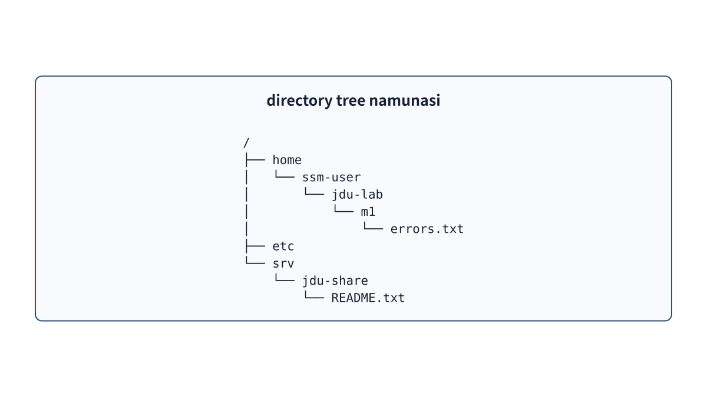
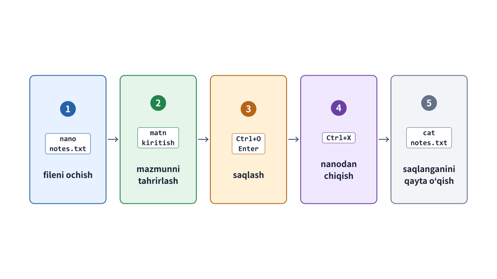

# 4-bob. File, directory, path va tahrirlash

## 4.1 File ichidagi ma’lumot va metadata

`file` faqat ichidagi matn yoki ma’lumotdan iborat emas. Uning nomi, turi, egasi (`owner`), `group`i, `permission`i, hajmi va oxirgi o‘zgartirilgan vaqti kabi **`metadata`**si ham bor. `cat` bilan ko‘rsatilganda mazmuni aynan bir xil bo‘lgan ikkita `file`ning egasi yoki `permission`i farq qilsa, `OS` ularni turli holatdagi obyektlar deb hisoblaydi.

```bash
ls -l /srv/jdu-share/README.txt
stat /srv/jdu-share/README.txt
```

`ls -l` `directory`dagi asosiy ma’lumotlarni ro‘yxat shaklida ko‘rsatadi. `stat` esa bitta belgilangan obyektning `metadata`sini batafsil ko‘rsatadi.

## 4.2 Directory nomni obyektga bog‘laydi

`directory`ni shunchaki “ichiga `file`lar solingan quti” deb tushunish to‘liq emas. Aslida u `file` va boshqa `directory`larning nomini tegishli obyektlarga bog‘lab, iyerarxiya hosil qiladigan maxsus turdagi `file`dir. `/srv/jdu-share/README.txt` `path`i eng yuqoridagi `/` `directory`sidan boshlanib, `srv`, `jdu-share`, so‘ng `README.txt` nomlarini ketma-ket bosib o‘tadigan manzildir.



**4-1-rasm. Tree commandi chiqishiga o‘xshash iyerarxik chizma. Shoxlarni ketma-ket kuzatib, file joyini aniqlash mumkin.**

Linuxda butun tizim yuqorisida `/` joylashgan yagona **`directory tree`** ko‘rinishida taqdim etiladi. Turli fizik disklar yoki virtual `file system`lar ham ma’lum `directory`ga ulanib, butun tizimning bir qismidek ko‘rsatilishi mumkin. Bunday ulash **`mount`** deyiladi. Bu bobda faqat g‘oya tushuntiriladi. Diskni formatlash va `mount`ni amalda bajarish keyingi saqlash mavzusida o‘rganiladi.

**`root directory`** — butun `directory tree`ning boshlanish nuqtasi, ya’ni `/`. **`home directory`** — har bir `user` o‘z `file`larini saqlaydigan joy. Masalan, `ssm-user`ning `home directory`si `/home/ssm-user`. Unga `/`dan boshlab `home`, keyin `ssm-user` nomi orqali boriladi. `/home` bir nechta `user`ning `home directory`larini o‘z ichiga oladigan yuqori `directory`; u `ssm-user`ning shaxsiy `home directory`si emas. `/` va `/home/ssm-user`ning vazifasi ham, joyi ham boshqa. Nomi o‘xshash `/root` ham `/` `root directory`si bilan bir xil joy emas.

## 4.3 Absolute path va relative path

`/` belgisi bilan boshlanadigan `path` **`absolute path`** deyiladi. Hozir qaysi `directory`da bo‘lishingizdan qat’i nazar, u bir xil joyni ko‘rsatadi.

```text
/srv/jdu-share/README.txt
```

`/` bilan boshlanmaydigan `path` **`relative path`** deyiladi. U joyni hozirgi ish `directory`siga nisbatan belgilaydi.

```bash
cd /srv/jdu-share
cat README.txt
```

`pwd` hozirgi ish `directory`sini ko‘rsatadi. `.` — “hozirgi `directory`”, `..` — “bir pog‘ona yuqoridagi `directory`”. `~` esa `shell` tomonidan hozirgi `user`ning `home directory`siga kengaytiriladi.

```bash
cd ~/jdu-lab/m1
pwd
cd ..
pwd
```

`~` `root directory` `/`ni emas, aynan hozirgi `user`ning `home directory`sini anglatadi. Shu sababli `~` bor `path`ning aniq joyi `user` va `host`ga qarab o‘zgaradi. Masalan, `ssm-user` uchun `~` `/home/ssm-user` bo‘lsa, `su - jduops` bilan `user` almashtirilgach, u `jduops`ning `home directory`sini (masalan, `/home/jduops`) ko‘rsatadi. Boshqa `host`ga ulanganda ham o‘sha `host`dagi hozirgi `user`ning `home directory`si ko‘rsatiladi. Hozirgi joyni `pwd`, `home directory`ni esa `printf '%s\n' "$HOME"` bilan tekshirish mumkin. `HOME` shu manzilni saqlaydigan muhit o‘zgaruvchisidir; o‘zgaruvchilar 5-bobda tushuntiriladi.

## 4.4 Ubuntuda ko‘p uchraydigan directorylar

| `path` | Ushbu kitobdagi vazifasi |
| --- | --- |
| `/home` | Odatdagi `user`larning `home directory`lari joylashadi. |
| `/etc` | Tizim va `service`larning sozlama hamda identifikatsiya `file`lari joylashadi. `/etc/os-release` ham shu yerda. |
| `/usr/bin` | Ko‘p oddiy `command`larning bajariladigan `file`lari saqlanadi. |
| `/var/log` | Tizim va `service`larning `log file`lari joylashadi. Barcha `log`lar aynan shu yerda bo‘lishi shart emas. |
| `/srv` | Tizim yoki `service` taqdim etadigan ma’lumotlar uchun joy. Amaliy mashg‘ulotda umumiy `directory` va veb-kontent shu yerda. |
| `/tmp` | Vaqtinchalik `file`lar uchun `directory`. Ko‘pchilik undan foydalana oladi, lekin u doimiy saqlash joyi emas. |
| `/proc` | `kernel` `process` va tizim holatini `file` ko‘rinishida ko‘rsatadigan virtual `file system`. |

Bu jadval “barcha `file`lar faqat shu joyda bo‘lishi shart” degan qat’iy qoida emas. Tafsilotlar `distribution` siyosati va ilova tuzilishiga qarab farqlanishi mumkin.

## 4.5 Yaratish, nusxalash, ko‘chirish va o‘chirish

```bash
mkdir -p ~/jdu-lab/p1/practice01/config
cp inbox/config/training.conf practice01/config/training.conf
mv old-name.txt new-name.txt
rm unwanted.tmp
```

- `mkdir -p` `path`da yetishmayotgan yuqori `directory`larni ham yaratadi. Belgilangan `directory` oldindan bor bo‘lsa ham xato bermaydi.
- `cp SOURCE DESTINATION` `file` yoki `directory`dan nusxa oladi. Manba (`SOURCE`) va manzil (`DESTINATION`) tartibini adashtirmang.
- `mv` `file`ni ko‘chirish yoki nomini o‘zgartirish uchun ishlatiladi.
- `rm` `file`ni o‘chiradi. Oddiy GUI dagi “savatcha” orqali o‘tmaydi; odatda darhol o‘chadi. Ishlatishdan oldin `pwd` va `ls` bilan manzilni tekshiring.

Boshlang‘ich amaliyotda ogohlantirishsiz butun `directory`ni o‘chirishi mumkin bo‘lgan xavfli `rm -rf`dan foydalanilmaydi. Masalan, ortiqcha `.tmp` `file`larni o‘chirishdan oldin `find` bilan ro‘yxatni ko‘ring.

```bash
find ~/jdu-lab/p1/practice01 -type f -name '*.tmp' -print
```

Yakka qo‘shtirnoq ichidagi `'*.tmp'` `shell`ning `wildcard`ni oldindan kengaytirishiga yo‘l qo‘ymaydi. Natijada qidiruv namunasi `find`ga o‘z holicha yetadi. Topilgan `file`larni ko‘zdan kechiring, keyin ularni bittadan yoki aniq ko‘rsatilgan xavfsiz doirada o‘chiring.

## 4.6 Boshqa tekshirish commandlari

```bash
ls -la
ls -ld /srv/jdu-share
tree ~/jdu-lab/m1/case01
stat -c '%U:%G %a %n' /srv/jdu-share/README.txt
```

- `ls -la` hozirgi `directory`dagi barcha obyektlarni, jumladan nomi `.` bilan boshlanadigan yashirin `file`larni batafsil ro‘yxatda ko‘rsatadi.
- `ls -ld DIR` ichidagi `file`larni emas, ko‘rsatilgan `directory`ning o‘z `metadata`sini ko‘rsatadi.
- `tree` `directory` iyerarxiyasini daraxt ko‘rinishida ko‘rsatadi. U amaliy muhitni tayyorlash paytida oldindan o‘rnatiladi.
- `stat -c` kerakli maydonlarni belgilangan formatda chiqaradi. `%U` — egasi bo‘lgan `user` nomi, `%G` — egasi bo‘lgan `group` nomi, `%a` — sakkizlik sanoq tizimidagi `permission mode`, `%n` — `file` nomi yoki `path`.

Hammasini bitta `command` orqali bilishga urinmang. Iyerarxiya kerakmi (`tree`), ichidagi obyektlar ro‘yxatimi (`ls`), yoki atribut va `metadata` tafsilotlarimi (`stat`) — maqsadga mos vositani tanlang.

## 4.7 Nano bilan tahrirlash

`nano FILE` `terminal` ichida matnli `file`ni tahrirlash uchun sodda editordir. Ushbu kitobda tahrirlashdan oldin kerakli `directory`ga o‘ting, `pwd` va `ls` orqali joy hamda `file`ni tekshiring.

```bash
cd ~/jdu-lab/m0
pwd
nano observation.env
```



**4-2-rasm. Nanonning asosiy amallari. Oynaning pastki qismidagi ^ belgisi Ctrl tugmasini bildiradi.**

1. Yo‘nalish tugmalari bilan kursorni kerakli joyga olib boring va oddiy klaviatura bilan matnni tahrirlang.
2. `Ctrl+O`ni bosib, `file`ni yozish (saqlashga tayyorlash) amalini boshlang.
3. Eng pastki satrda `file` nomi chiqqanda, `path` to‘g‘riligini tekshirib `Enter`ni bosing.
4. `Ctrl+X`ni bosib, nano editoridan chiqing.
5. `cat observation.env` kabi `command` bilan natijani qayta o‘qing va saqlanganini tekshiring.

Saqlanmagan o‘zgarish bo‘lsa, chiqishda saqlash yoki rad etish haqida savol beriladi. Inglizcha oynada `Y` (Yes) saqlash, `N` (No) saqlamasdan chiqish, `Ctrl+C` esa so‘rovni bekor qilishni bildiradi. Ekrandagi xabarni o‘qimasdan tugmalarni ketma-ket bosmang.

## 4.8 Yuqori directory permissioni ham muhim

`file` o‘qilayotganda `OS` `path`ni boshidan oxirigacha kuzatadi. Yo‘ldagi **har bir `directory`** uchun hozirgi `user`ning undan o‘tish `permission`i borligini tekshiradi. Birgina `directory`dan o‘tish mumkin bo‘lmasa, `file`ning o‘zida o‘qish `permission`i `r` bo‘lsa ham uni o‘qib bo‘lmaydi. `namei -l` `path`dagi har bir yuqori `directory` va oxirgi `file`ni alohida ko‘rsatadi; ularning egasi va `permission`ini tekshirish mumkin.

```bash
namei -l /srv/jdu-web/index.txt
```

`directory` uchun bajarish `permission`i `x` `program file`ni ishga tushirishdan boshqa ma’noga ega. Bu `directory`dan o‘tib, uning ichidagi nomga murojaat qilish huquqidir. Tafsilotlar 7-bobda tushuntiriladi.

## Bob yakunidagi savollar

### 1-savol. Root directory va home directory o‘rtasidagi farq nima?

### 2-savol. `ls -l DIR` va `ls -ld DIR` nimalarni ko‘rsatadi?

### 3-savol. Filening o‘zida o‘qish permissioni `r` bo‘lsa ham o‘qib bo‘lmasa, `namei -l`da nimani tekshirasiz?

## Bob yakunidagi javoblar

### 1-savol

**Javob:** `root directory` `/` butun tizimdagi `directory tree`ning boshlanishi. `home directory` har bir `user`ning ish joyi; masalan, `ssm-user` uchun `/home/ssm-user`. `~` hozirgi `user`ning `home directory`sini bildiradi.

### 2-savol

**Javob:** `ls -l DIR` `DIR` ichidagi obyektlarni batafsil ko‘rsatadi. `ls -ld DIR` esa `DIR`ning o‘zi haqidagi ma’lumotni chiqaradi.

### 3-savol

**Javob:** `path` boshidan oxirgi `file`gacha bo‘lgan har bir yuqori `directory`da hozirgi `user` uchun o‘tish `permission`i `x` borligini tekshiring. Oraliqdagi bittasidan ham o‘tib bo‘lmasa, oxirgi `file`da `r` bo‘lishi yetarli emas.

## Foydalanilgan manbalar

- Linux man-pages, [path_resolution(7)](https://man7.org/linux/man-pages/man7/path_resolution.7.html) (2026-09-18 kuni tekshirilgan)
- Ubuntu 24.04 amaliy muhitidagi `man hier`, `man find`, `man stat` va nano oynasi (nashrdan oldin amalda tekshiriladi)
