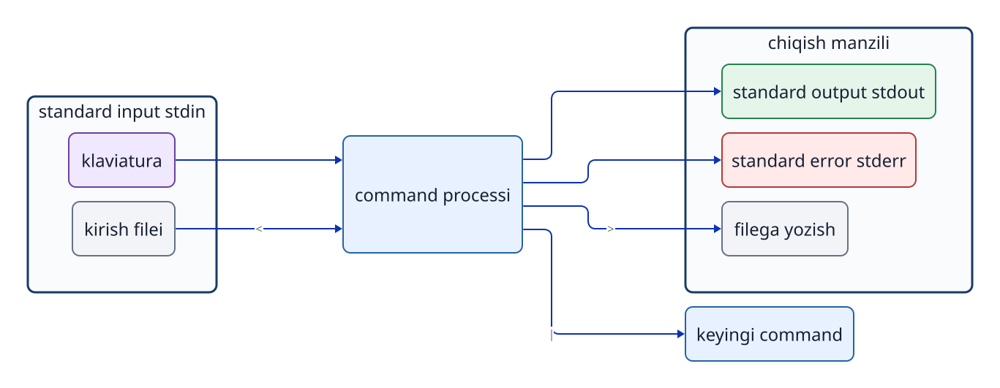

# 5-bob. Matn va kirish-chiqishni birlashtirish

## 5.1 Nima uchun sozlama va loglar ko‘pincha matn bo‘ladi?

Ubuntu va boshqa Linux tizimlarida ko‘plab sozlamalar hamda `log`lar oddiy matn sifatida saqlanadi. Shunda maxsus GUI bo‘lmasa ham ularni o‘qish, solishtirish va qidirish oson. Natijani boshqa `command`ga ham uzatish mumkin. Lekin har bir sozlama yoki `log` oddiy matnli `file` bo‘lishi shart emas. Masalan, `systemd journal` ma’lumotni ikkilik formatda saqlaydi va uni maxsus `command` orqali ko‘rish mumkin.

## 5.2 Standard input, standard output va standard error

Har bir `process` uchun ma’lumot almashishning uchta asosiy oqimi bor: **`stdin` (standard input)**, **`stdout` (standard output)** va **`stderr` (standard error)**.

- **`stdin`**: odatdagi kirish ma’lumoti. Klaviatura yoki avvalgi `command` chiqishidan ma’lumot qabul qiladi (`file descriptor` 0).
- **`stdout`**: odatdagi natija. `terminal`da ko‘rsatilishi, keyingi `command`ga yoki `file`ga uzatilishi mumkin (`file descriptor` 1).
- **`stderr`**: xato xabari yoki ogohlantirish. Odatdagi natija (`stdout`)dan alohida oqimdir (`file descriptor` 2).



**5-1-rasm. Programning uchta standart oqimi.** `>` odatda `stdout`ni `file`ga, `|` esa chapdagi `command`ning `stdout`ini o‘ngdagi `command`ning `stdin`iga ulaydi.

`cat incident.log` bajarilganda `file` ma’lumot manbasi, `terminal` esa `stdout`ni ko‘rsatadigan joy bo‘ladi. `file`ning o‘zi `terminal`ga “uchib o‘tmaydi”. `cat` `process`i `file` mazmunini o‘qib, matnni `stdout`ga yozadi.

## 5.3 Grep bilan kerakli satrlarni tanlash

```bash
grep 'ERROR' incident.log
```

`grep` kirishni satrma-satr tekshiradi va berilgan namunaga mos kelgan satrlarni to‘liq holda `stdout`ga chiqaradi.

```bash
grep -F 'ERROR' incident.log
```

`-F` qidiruv namunasini `regular expression` emas, oddiy qat’iy matn deb qabul qiladi. `ERROR` kabi oddiy so‘zda natija ko‘pincha bir xil. Lekin maxsus belgilarni qo‘shimcha qochirishsiz aynan o‘zicha qidirmoqchi bo‘lsangiz, `-F` foydali.

`grep -n` mos satr oldiga satr raqamini ham qo‘shadi. Faqat asl satrlarni boshqa `file`ga yozish kerak bo‘lsa, `-n`ni qo‘shmang.

`exit status` ham ma’noli. `grep` odatda kamida bitta mos satr topsa `0`, birorta mos satr topmasa `1`, `file` yo‘qligi kabi bajarish xatosida `2` qaytaradi. Ekranda hech narsa chiqmaganda, qidirilgan matn yo‘qmi yoki `file` nomi xatomi — `exit status` orqali farqlang.

## 5.4 Tail bilan oxirgi satrlarni o‘qish

```bash
tail -n 5 incident.log
```

`tail -n 5` `file`ning oxirgi besh satrini asl tartibida `stdout`ga chiqaradi. Bu yerda `-n` satrlar sonini belgilaydi; `grep -n`dagi satr raqamini ko‘rsatish bilan ma’nosi boshqa. Faqat `option` harfini yodlash o‘rniga, har bir `command`ning manualini tekshiring.

`tail -f` `file`ga keyin qo‘shiladigan yangi satrlarni ham davomli ko‘rsatadi. To‘xtatish uchun `Ctrl+C`ni bosing.

## 5.5 Redirection yordamida natijani filega yozish

```bash
grep 'ERROR' incident.log > errors.txt
tail -n 5 incident.log > recent.txt
```

`>` — `shell` `stdout`ning manzilini `file`ga almashtiradigan `redirection`. O‘ng tomondagi `file` oldindan mavjud bo‘lsa, `command` ishlashidan avval u bo‘shatiladi va yangi natija bilan yoziladi. Shuning uchun kirish va chiqish uchun aynan bir `file`ni ko‘rsatish xavfli: `command` eski ma’lumotni o‘qishga ulgurmasidan mazmun yo‘qolishi mumkin.

```bash
# Xavfli misol. Bajarmang.
grep 'ERROR' incident.log > incident.log
```

`>>` ma’lumotni `file` oxiriga qo‘shadi. Uni bir necha marta ishlatsangiz, ayni satrlar takrorlanishi mumkin. Har safar mazmunni qayta yaratish kerak bo‘lsa, `>`dan foydalaning.

Odatda `>`ning o‘zi `stderr`ni shu `file`ga yo‘naltirmaydi. `2>` `stderr` uchun boshqa chiqish `file`ini ko‘rsatadi.

## 5.6 Pipe oraliq file yaratmasdan uzatadi

```bash
grep 'ERROR' incident.log | tail -n 5
```

`|` — `pipe`: chapdagi `command`ning `stdout`ini o‘ngdagining `stdin`iga to‘g‘ridan-to‘g‘ri ulaydi. Natijani diskdagi oraliq `file`ga yozmasdan bosqichma-bosqich saralash mumkin. Chapdagi `command`ning `stderr`i odatda bu `pipe`ga uzatilmaydi.

Bashning odatdagi sozlamasida butun `pipeline`ning `exit status`i oxirgi `command`ning natijasiga teng. Demak, chap tomon xato qilsa ham o‘ng tomon muvaffaqiyatli bo‘lsa, umumiy natija muvaffaqiyatli ko‘rinishi mumkin. Aniq avtomatik skriptlarda `set -o pipefail` kabi sozlamalarni ko‘rib chiqish kerak.

## 5.7 Quoting, o‘zgaruvchilar va command substitution

`shell` `command`ni boshlashdan avval kiritilgan matndagi maxsus yozuvlarni kengaytiradi.

```bash
name='incident.log'
printf '%s\n' "$name"
```

- **Yakka qo‘shtirnoq `'...'`**: ichidagi belgilar deyarli aynan yozilganicha qabul qilinadi. `$HOME` kabi o‘zgaruvchi kengaytirilmaydi.
- **Qo‘sh qo‘shtirnoq `"..."`**: bo‘sh joyli matnni bitta argument sifatida saqlaydi, lekin `$HOME` va `$(...)` kabi ifodalarni kengaytiradi.
- **Qo‘shtirnoqsiz yozish**: bo‘sh joy argumentni kutilmagan joyda ajratishi yoki `wildcard` kengayishi mumkin. O‘zgaruvchilarni odatda `"$name"` kabi qo‘sh qo‘shtirnoq bilan o‘rang.

`$(command)` — `command substitution`: ichidagi `command` bajariladi va uning `stdout` natijasi shu joyga matn sifatida qo‘yiladi.

```bash
current_user="$(id -un)"
printf 'USER=%s\n' "$current_user"
```

## 5.8 && faqat chap tomon muvaffaqiyatli bo‘lsa davom etadi

```bash
cd /var/log && pwd
```

`&&`ning o‘ngidagi `command` faqat chapdagi `command` `exit status` `0` bilan yakunlanganda bajariladi. Bu `directory`ga o‘tish muvaffaqiyatsiz bo‘lgach, noto‘g‘ri joyda `file`ni tahrirlash yoki o‘chirishning oldini oladi. Lekin bir satrga juda ko‘p bosqichni yig‘ish xato qayerda yuz berganini aniqlashni qiyinlashtiradi.

## Bob yakunidagi savollar

### 1-savol. `grep ERROR incident.log > errors.txt`da `errors.txt`ni grepmi yoki shell ochadimi?

### 2-savol. `>` va `>>` qanday farq qiladi? Ularni adashtirsangiz nima bo‘ladi?

## Bob yakunidagi javoblar

### 1-savol

**Javob:** `shell` ochadi. U `errors.txt`ni ochib, `grep`ning `stdout`iga ulaydi. Shundan keyin `grep`ni ishga tushiradi.

### 2-savol

**Javob:** `>` mavjud mazmunning ustidan yozadi; `>>` esa oxiriga qo‘shadi. `>`ni noto‘g‘ri ishlatish eski ma’lumotni yo‘qotadi. `>>`ni keragidan ortiq takrorlash bir xil mazmunni ko‘paytiradi.

## Foydalanilgan manbalar

- Ubuntu 24.04 amaliy muhitidagi `man grep`, `man tail`, `man bash` (nashrdan oldin versiyalar tekshiriladi)
- GNU Bash Reference Manual (2026-09-18 kuni veb-matnni yuklashda timeout bo‘lgan; amaliy muhitdagi manual asosiy tekshiruv manbasi)
