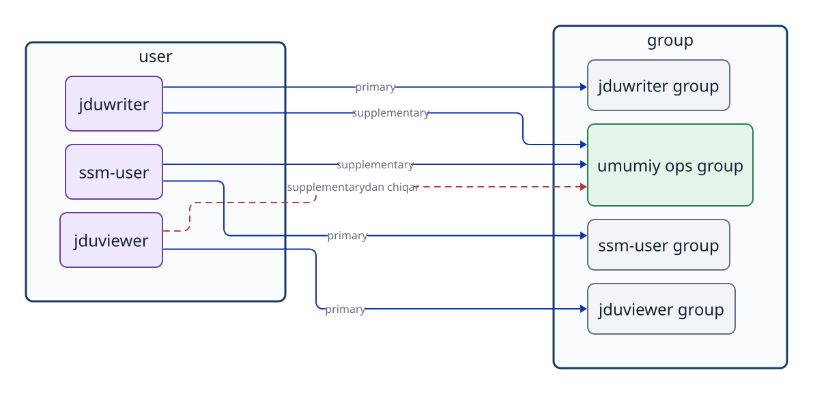

# 6-bob. User, group va login

## 6.1 User turlari va vazifalari

Linuxda odam ishlatadigan hisoblargina emas, `OS` va `service` `process`larini ishlatish uchun hisoblar ham bor. Linux ichkarida `user`ni **UID (`user` ID)**, `group`ni esa **GID (`group` ID)** raqami bilan ajratadi. Avval ularning vazifasi va huquqlari farqini ko‘raylik.

| Turi | Asosiy vazifasi | Interaktiv login bilan aloqasi |
| --- | --- | --- |
| Administrator `root` | Butun tizimni boshqaradigan maxsus `user`. UID qiymati `0`. | Hisob mavjud, lekin Ubuntuda odatda `root` paroli bilan bevosita login o‘chiriladi. Ruxsat berilgan `user` kerakli boshqaruv amalini `sudo` orqali bajaradi. `sudo` `command`ni administrator yoki boshqa `user` huquqi bilan bajarish mexanizmidir. |
| Oddiy `user` | Odamning o‘z ishini bajaradi. Masalan, `ssm-user` va `jduops`. | Sozlama va `authentication` usuli ruxsat bersa, interaktiv login qiladi. Oddiy `user` bo‘lish avtomatik ravishda `sudo` huquqi bor degani emas. |
| `service` uchun `user` | Veb-`server` kabi `process`ni faqat kerakli huquqlar bilan ishlatadi. Masalan, `jduweb`. | Odatda interaktiv login talab qilinmaydi. Ko‘pincha login `shell`i `/usr/sbin/nologin` qilib qo‘yiladi, ammo bu har bir `service` hisobiga majburiy qoida emas. |

Jadval Linuxning ichida `user`lar aynan uch turga qat’iy bo‘linganini anglatmaydi. Bu ularning vazifasini tushunish uchun qulay tasnif. Aslida qaysi amal mumkinligi hisob sozlamalari, `group`lar, har bir `file`ning `permission`i, `sudo` va SSH sozlamalari bilan belgilanadi. `root` hisobining mavjudligi bilan unga bevosita login qilish imkoniyati ham alohida masalalardir.

`ssm-user` kabi nomlar odam uchun qulay belgidir. `file` va `directory` egasi haqidagi ma’lumot tizim ichida raqamli UID/GID sifatida saqlanadi.

```bash
id
id jduops
getent passwd root
getent passwd jduops
getent passwd jduweb
getent group ops
```

`id` hozir ishlayotgan `user`ning UID, `primary group` va `supplementary group`larini ko‘rsatadi. Argument sifatida `user` nomini bersangiz, uning ro‘yxatdan o‘tgan ma’lumotlarini tekshirasiz. `getent passwd USER` `user` nomi, UID, `primary group` GID, `home directory` va login `shell`ini ko‘rsatadi. Masalan, oxirgi maydon `/usr/sbin/nologin` bo‘lsa, bu hisob odatdagi interaktiv `shell` uchun ishlatilmaydi. `getent` faqat mahalliy `file`larni emas, tizim sozlagan nom xizmatlarini ham so‘raydi. Korporativ muhitda LDAP yoki Active Directory hisoblari ham natijaga kirishi mumkin.

## 6.2 Primary group va supplementary group

Har bir `user` uchun bittadan **`primary group`** belgilanadi. Ubuntuda yangi `user` yaratilganda, odatda uning nomi bilan bir xil maxsus `group` yaratiladi va `primary group` qilib qo‘yiladi. Lekin bu o‘zgarmas majburiy qoida emas. Kerak bo‘lsa, masalan `usermod -g` bilan o‘zgartirish mumkin.

Bir `user` o‘z `primary group`idan tashqari bir nechta **`supplementary group`** a’zosi bo‘la oladi. Jamoaviy `file` yoki `directory`ga kirish berish uchun `primary group`ni o‘ylamasdan almashtirish o‘rniga, shu maqsad uchun tuzilgan `supplementary group`ga `user`ni qo‘shish ma’qul.



**6-1-rasm. Har bir userning primary groupi va umumiy ishlash uchun qo‘llanadigan supplementary grouplar o‘rtasidagi munosabat.**

`supplementary group`ga qo‘shish va undan chiqarish uchun quyidagi `command`lardan foydalaniladi.

```bash
sudo usermod -aG ops jduops
sudo gpasswd -d jduviewer ops
```

`usermod -aG`dagi `-a` (`append`) eski a’zoliklarni saqlagan holda yangisini qo‘shadi. Agar faqat `-G` ishlatib, `-a` tushirib qoldirilsa, ko‘rsatilmagan barcha eski `supplementary group`lardan `user` chiqarilishi mumkin. O‘zgartirgach, `id USER` bilan ma’lumotni qayta tekshiring.

`getent group ops` oxirida ko‘rinadigan a’zolar ro‘yxati shu `group`ga `supplementary group` sifatida kirganlarni tekshirishga yordam beradi. Lekin `ops` `primary group` bo‘lgan `user`ning nomi bu ro‘yxatda ko‘rinmasligi mumkin. Barcha a’zolarni aniqlash uchun `id USER` kabi vositalar bilan ham tekshiring.

## 6.3 Ro‘yxatdagi ma’lumot va ishlayotgan process huquqlari

`group` a’zoligi o‘zgartirilganda, oldindan ishlab turgan `shell` `process`ining huquqlari va undagi `group`lar ro‘yxati avtomatik yangilanmaydi. Yangi ma’lumotni olish uchun qayta login qilish yoki yangi `session` boshlash kerak.

```bash
id jduops
sudo su - jduops
id
```

Birinchi qatordagi `id jduops` tizimda ro‘yxatdan o‘tgan hisobni tekshiradi. `su -`dan keyingi `id` esa yangi login `shell` `process`i haqiqatda olgan huquqlarni ko‘rsatadi. `kernel` `permission`ni statik ro‘yxat yozuviga emas, amalni bajarayotgan `process`ning UID/GID qiymatlariga qarab tekshiradi.

## 6.4 Su va sudo turli maqsadga xizmat qiladi

`su` (`substitute user`) boshqa `user` huquqi bilan ishlaydigan `shell session`ni boshlaydi. `su - USER`dagi `-` o‘sha `user` odatdagidek login qilgandagi muhitga o‘tishni bildiradi: `home directory` va muhit o‘zgaruvchilari uning standart holatiga o‘rnatiladi.

`sudo` sozlamada ruxsat olgan `user`ga `command`ni administrator (`root`) yoki boshqa `user` huquqi bilan bajarishga imkon beradi. Hamma oddiy `user` `sudo`dan foydalana olmaydi. Boshqaruv huquqi va ruxsat etilgan amallar doirasi zarur minimum bilan cheklanishi kerak.

```bash
sudo su - jduops
id
pwd
exit
id -un
```

Boshqa `user`ning `shell`i boshlanganda, asl `shell` ichida yangi `shell` ochiladi. `exit` hozirgisini tugatib, oldingi `shell`ga qaytaradi. Almashgandan keyin `id -un` bilan `user` nomini, `pwd` bilan ish `directory`sini tekshiring.

Faqat bitta `command`ni boshqa `user` huquqi bilan sinamoqchi bo‘lsangiz, interaktiv `shell` ochmasdan bajarishingiz mumkin.

```bash
sudo -u jduweb -- test -r /srv/jdu-web/index.txt
echo $?
```

Bu `jduweb`ning amaldagi huquqlari bilan `file`ni o‘qish mumkinligini to‘g‘ridan-to‘g‘ri tekshiradi. `root` uni o‘qiy olishi oddiy `service user` ham o‘qiy olishini isbotlamaydi.

## 6.5 Service user orqali process huquqlarini ajratish

`service` uchun alohida `user` uning `process` huquqlarini odam ishlatadigan hisoblar va boshqa `service`lardan ajratadi. Masalan, veb-`server` `process`i `jduweb` sifatida ishlasa, `permission` `jduweb`ning UID va GID qiymatlariga qarab tekshiriladi. Shunda faqat `service`ga kerakli `file`larni o‘qish huquqini berish mumkin.

```bash
getent passwd jduweb
id jduweb
```

`/usr/sbin/nologin` odatdagi login `shell`i o‘rnida ishga tushadigan, interaktiv loginni rad etib tugaydigan `program`dir. Shunday sozlama bo‘lsa ham hisob mavjud. `systemd` `service` sozlamasida ko‘rsatilgan `user` huquqi bilan `process` boshlay oladi. Odam shu hisob orqali interaktiv login qila olmasligi bilan `service process`ining shu UID nomidan `file`larga murojaat qilishi boshqa-boshqa masaladir.

## 6.6 Account, authentication va authorization

**`account`** tizimda ro‘yxatdan o‘tgan `user` haqidagi ma’lumotdir. U `user` nomini UID, `primary group`, `home directory` va login `shell`i bilan bog‘laydi. “`ssm-user` `account`i bor” degani `server` shu nomni taniydi, xolos. Ulangan odam haqiqatda shu hisobdan foydalanishga haqli ekanini hali isbotlamaydi.

**`authentication`** ulangan tomon da’vo qilgan `account`ning haqiqiy foydalanuvchisi ekanini tekshirishdir. Parol usulida maxfiy parol, SSH `public key authentication`da tegishli `private key`ga egalik tekshiriladi. Ochiq kalit bilan ishlaganda, ulanish maqsadidagi `user`ning `~/.ssh/authorized_keys` `file`iga `public key` kiritiladi. `private key`ning o‘zi `server`ga yuborilmaydi.

**`authorization`** muayyan tomon aniq bir amalni bajara olishini hal qilishdir. SSHda hisob va `server` sozlamalari ulanish mumkinligini ham belgilaydi. Ulangandan keyin `file`ni o‘qish, yozish yoki `command`ni administrator huquqi bilan bajarish har biri alohida qoida bilan tekshiriladi. Login muvaffaqiyatli bo‘lishi barcha amallarga ruxsat degani emas.

SSH orqali `ssm-user` sifatida ulanishni shu uch tushunchaga ajrating.

1. **`account`:** ulanish tomonida `ssm-user` ro‘yxati bor. Tizim uning UID, `home directory` va boshqa ma’lumotlarini topa oladi. Hisob bo‘lmasa, odatdagi `session`ni shu `user` nomidan boshlay olmaydi.
2. **`authentication`:** ulanuvchi `private key`dan foydalanadi; ulanish tomonidagi tizim u `ssm-user` uchun ro‘yxatdagi `public key`ga mosligini tekshiradi. Kalit mos bo‘lmasa, `account` mavjud bo‘lsa ham tekshiruvdan o‘tilmaydi.
3. **`authorization`:** SSH sozlamalari ulanishga yo‘l qo‘ygach ham, yangi `process` `ssm-user`ning UID va `group`lariga mos huquqlar bilan cheklanadi. Masalan, boshqa `user`gagina o‘qish mumkin bo‘lgan `file`ni o‘qiy olmaydi. `sudo` huquqi ham alohida sozlama bilan belgilanadi.

Bu tushunchaviy ajratishdir; SSH `program`ining ichki amallari aniq vaqt tartibini ifodalamaydi. SSH kaliti to‘g‘ri bo‘lsa ham, SSHga oid kirish cheklovi yoki `account` sozlamasi sababli interaktiv `shell` ochilmasligi mumkin. `service user` esa SSH bilan login qilmasdan, `systemd` tomonidan belgilangan UID bilan `process` boshlashi mumkin. **Account mavjudligi, login huquqi va processning biror amalni bajarish huquqi alohida qarorlardir.**

## Bob yakunidagi savollar

### 1-savol. Primary group va supplementary group farqi nima? Umumiy directory misolida tushuntiring.

### 2-savol. Group ro‘yxati o‘zgarsa ham ochiq shell nega darhol yangilanmaydi? Nimani qayta boshlash kerak?

### 3-savol. Nima uchun `sudo -u jduweb -- test -r FILE` o‘rniga root nomidan `cat FILE` ishlatib bo‘lmaydi?

## Bob yakunidagi javoblar

### 1-savol

**Javob:** `primary group` har bir `user`ga majburiy belgilanadigan asosiy `group`. `supplementary group` qo‘shimcha a’zolikdir. Bir necha `user` umumiy `directory` bilan ishlashi uchun alohida `group` tuzilib, kerakli `user`lar unga qo‘shiladi.

### 2-savol

**Javob:** Ishlab turgan `shell` ishga tushganda olgan UID va `group` huquqlarini saqlaydi. Yangi `group`lar ro‘yxatini olish uchun qayta login qilish yoki yangi `session` boshlash kerak.

### 3-savol

**Javob:** `root` `file`ni o‘qiy olishi `jduweb` `process`ida ham o‘qish `permission`i borligini bildirmaydi. `sudo -u jduweb` aynan `jduweb` huquqi bilan o‘qish mumkinligini tekshiradi.

## Foydalanilgan manbalar

- Ubuntu Server documentation, [User management](https://ubuntu.com/server/docs/how-to/security/user-management/) (2026-09-24 kuni tekshirilgan; `root`, oddiy va tizim `user`lari)
- Ubuntu Server documentation, [OpenSSH server](https://ubuntu.com/server/docs/how-to/security/openssh-server/) (2026-09-24 kuni tekshirilgan; ochiq kalit bilan `authentication` va `authorized_keys`)
- Ubuntu 24.04 man pages, [adduser(8)](https://manpages.ubuntu.com/manpages/noble/man8/adduser.8.html), [systemd.exec(5)](https://manpages.ubuntu.com/manpages/noble/man5/systemd.exec.5.html) (2026-09-24 kuni tekshirilgan; `service user` va `process`ni ishga tushirish)
- Linux man-pages, [passwd(5)](https://man7.org/linux/man-pages/man5/passwd.5.html), [credentials(7)](https://man7.org/linux/man-pages/man7/credentials.7.html) (2026-09-24 kuni tekshirilgan; UID/GID, login `shell`i va `process` huquqlari)
- Ubuntu 24.04 amaliy muhitidagi `man id`, `man getent`, `man usermod`, `man gpasswd`, `man su`, `man sudo` (nashrdan oldin tekshiriladi)
