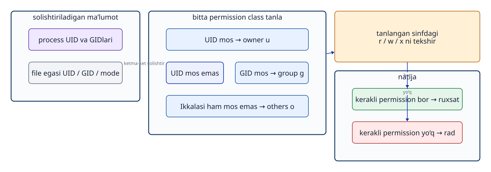
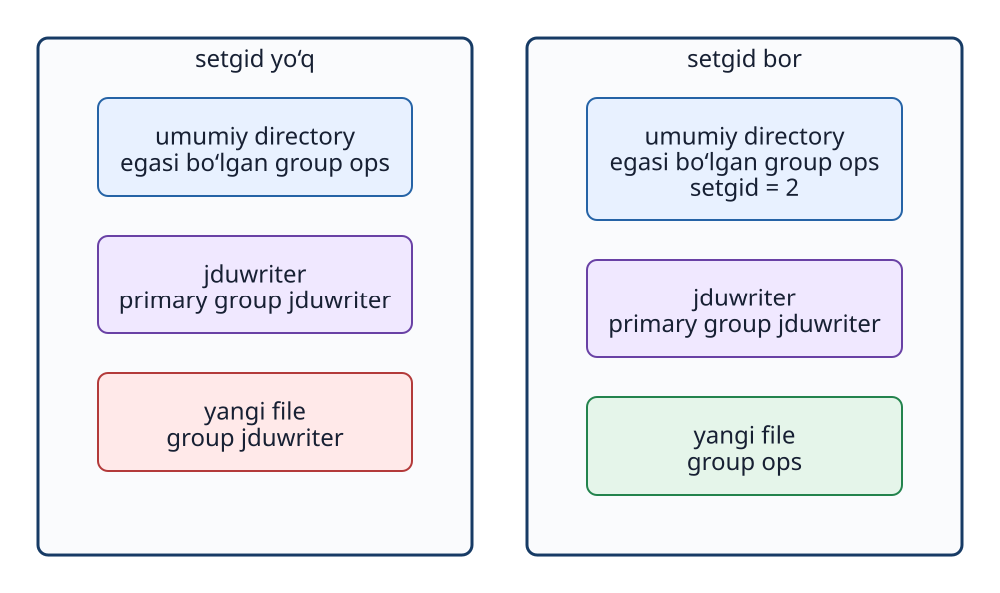

# 7-bob. Permission va umumiy directory

## 7.1 Permission kimga qaysi amal mumkinligini bildiradi

Linuxdagi asosiy **`permission`** uchta sinf uchun belgilanadi: egasi bo‘lgan `user` (`u: owner user`), egasi bo‘lgan `group` (`g: owner group`) va boshqalar (`o: others`). Har bir sinfga o‘qish (`r: read`), yozish (`w: write`) va bajarish (`x: execute`) huquqlari berilishi mumkin.

```text
-rw-rw-r-- 1 root ops ... README.txt
drwxrwsr-x ... root ops ... /srv/jdu-share
```

Birinchi belgi obyekt turini bildiradi: `-` oddiy `file`, `d` `directory`. Keyingi to‘qqiz belgini egasi, `group` va boshqalar uchun uchtadan ajratib o‘qing.

`kernel` amalni bajarmoqchi bo‘lgan `process`ning UID/GID huquqlarini va `file` `metadata`sini solishtiradi. Muhim jihat: egasi, `group` va boshqalarga tegishli barcha huquqlar qo‘shib hisoblanmaydi. `process` `file` egasi bo‘lsa faqat `owner` qatori; egasi bo‘lmay, tegishli `group`ga kirsa faqat `group` qatori; ikkalasiga ham kirmasa `others` qatori qo‘llanadi.



**7-1-rasm. Process huquqlariga ko‘ra u/g/o sinfi tanlanadi, keyin shu sinfdagi rwx belgilari amal mumkinligini aniqlaydi.**

## 7.2 Rwx file va directory uchun turlicha ma’noga ega

| Huquq | Oddiy `file` | `directory` |
| --- | --- | --- |
| r | Ichidagi ma’lumotni o‘qish | Ichidagi nomlar (`file` va `directory` nomlari) ro‘yxatini o‘qish |
| w | Mazmunni o‘zgartirish yoki qo‘shish | Ichida yangi nom yaratish yoki mavjud nomni o‘chirish |
| x | `program` sifatida bajarish | Ichidagi nomga o‘tish, ko‘rsatilgan `path`ga yetish (`traverse`) |

`directory`ga yozish (`w`) huquqi bo‘lsa, uning ichidagi `file`ning o‘zida yozish huquqi bo‘lmasa ham, ayrim hollarda uni o‘chirish mumkin. Chunki `file`ni o‘chirish `directory` ichidagi nomlar ro‘yxatini o‘zgartiradi. Aksincha, `file`ning o‘zida o‘qish (`r`) bo‘lsa ham, yuqori `directory`dan o‘tish (`x`) huquqi bo‘lmasa, unga yetib borib o‘qib bo‘lmaydi. `namei -l PATH` butun yo‘ldagi `directory`larning `permission`ini alohida ko‘rsatadi.

## 7.3 Sakkizlik sanoq tizimidagi modeni o‘qish

`permission`ning sonli yozuvi — sakkizlik `mode` — `r=4`, `w=2`, `x=1` qiymatlari yig‘indisidir.

- `6 = 4+2 = rw-`
- `7 = 4+2+1 = rwx`
- `5 = 4+1 = r-x`

Shunday qilib, oddiy `file` uchun `664` `rw-rw-r--`, `directory` uchun `775` `rwxrwxr-x` bo‘ladi.

```bash
sudo chmod 664 /srv/jdu-share/README.txt
sudo chmod 2775 /srv/jdu-share
```

`777` hamma huquqlarni, jumladan `others` uchun o‘qish, yozish va bajarishni ochadi. Bu faqat umumiy `group` a’zolariga huquq berish maqsadiga mos emas.

## 7.4 Chown va chmod

`chown` egasi bo‘lgan `user` va `group`ni, `chmod` esa `permission mode`ni o‘zgartiradi.

```bash
sudo chown root:ops /srv/jdu-share
sudo chown root:ops /srv/jdu-share/README.txt
sudo chmod 2775 /srv/jdu-share
sudo chmod 664 /srv/jdu-share/README.txt
```

`directory` egasi yoki `permission`ini almashtirish uning ichida oldindan mavjud barcha `file` va kichik `directory`larning atributini avtomatik o‘zgartirmaydi. `-R` bilan ichidagi hamma obyektga rekursiv ta’sir qilish mumkin, lekin kutilmagan `file`lar ham o‘zgarib ketishi xavfi bor.

```bash
stat -c '%U:%G %a %n' /srv/jdu-share /srv/jdu-share/README.txt
```

## 7.5 Setgid directory qanday muammoni hal qiladi?

Odatda yangi yaratilgan `file`ning egasi bo‘lgan `group` yaratuvchi `process`ning `primary group`i bo‘ladi. Bir necha `user` bitta umumiy `directory`da ishlasa, yangi `file`lar turli `group`larga tegishli bo‘lib qolishi mumkin. Natijada boshqa a’zo uni tahrirlay olmaydi.

`directory`ga **`setgid` biti** (Set Group ID) qo‘yilsa, shu `directory` ichida yaratiladigan yangi `file` va kichik `directory`lar odatda yaratuvchining `primary group`ini emas, yuqori `directory`ning egasi bo‘lgan `group`ni meros oladi. Masalan, `/srv/jdu-share` `root:ops 2775` bo‘lsa, yangi `file`ning `group`i odatda `ops` bo‘ladi.



**7-2-rasm. Setgid yangi obyektning groupini yuqori directory groupi bilan bir xil qiladi. U file egasi, mazmuni yoki butun permission modeni nusxalamaydi.**

Sakkizlik `mode` boshidagi `2` `setgid` bitidir. Belgilar bilan yozilganda `group`ning bajarish joyida `x` o‘rniga `s` chiqadi.

```text
drwxrwsr-x root ops /srv/jdu-share
```

Agar `group`ga bajarish (`x`) huquqi berilmagan bo‘lsa-yu, `setgid` bor bo‘lsa, katta `S` ko‘rinadi. Umumiy `directory`da `group`ga odatda `rwx` (shu jumladan `x`) beriladi, shuning uchun kichik `s` chiqadi.

## 7.6 Umask yangi modega ta’sir qiladi

`setgid` `group` meros bo‘lishini boshqaradi; u yangi `file`ning butun `permission mode`ini majburan `664` qilmaydi. Yangi `file`ning haqiqiy `permission`i `program` so‘ragan asosiy `mode`dan **`umask`** cheklagan bitlar chiqarilgach aniqlanadi.

```bash
umask
touch /srv/jdu-share/sample.txt
stat -c '%U:%G %a %n' /srv/jdu-share/sample.txt
```

Masalan, odatdagi `file` `666` asosida yaratilsa va `umask` `002` bo‘lsa, natija `664` (`rw-rw-r--`) bo‘ladi. Ammo `program` boshidan boshqa `mode` so‘rashi mumkin. `umask` faqat yangi yaratish paytida ta’sir qiladi; oldindan mavjud `file`ning `permission`ini keyin o‘z-o‘zidan o‘zgartirmaydi.

## 7.7 Ruxsat va rad etishni haqiqiy user bilan sinash

Faqat `metadata`ni ko‘rish bilan cheklanmay, kerakli `user` huquqi bilan amalni sinab ko‘ring.

```bash
sudo -u jduviewer -- test -r /srv/jdu-share/README.txt
echo $?
sudo -u jduviewer -- test -w /srv/jdu-share
echo $?
```

`exit status` `0` shart bajarilganini (muvaffaqiyat), `1` bajarilmaganini bildiradi. `directory` ichida yangi `file` yaratish unga yozish (`w`) va undan o‘tish (`x`) huquqlariga bog‘liq. Faqat mavjud `file`ga yozish mumkinligini sinab, yangi `file` yaratish mumkin degan xulosaga kelmang.

Kirish rad etilsa, amalni bajargan `process`ning `user` va `group`ini, qo‘llangan `permission` sinfini va yetishmagan huquqni ketma-ket tekshiring. Muammoni shunchaki `777` bilan “hal qilish” boshqa `user`larga ham keraksiz huquq beradi. Faqat kerakli `user`ga kerakli huquqni bering.

## Bob yakunidagi savollar

### 1-savol. `2775` permission mode raqamlari nimani bildiradi?

### 2-savol. Setgid directoryda yangi file yaratilsa, nimasi yuqori directorydan meros bo‘ladi, nimasi bo‘lmaydi?

### 3-savol. Root file o‘qiy olishi service user ham o‘qiy olishini nima uchun isbotlamaydi?

## Bob yakunidagi javoblar

### 1-savol

**Javob:** Birinchi `2` `directory` uchun `setgid`ni bildiradi. Keyingi `7` egasining `rwx`, uchinchi `7` egasi bo‘lgan `group`ning `rwx`, oxirgi `5` `others`ning `r-x` huquqlaridir. `directory`ning belgili ko‘rinishi `rwxrwsr-x`.

### 2-savol

**Javob:** Yangi `file` odatda yuqori `directory`ning egasi bo‘lgan `group`ni meros oladi. Egasi bo‘lgan `user` yoki butun `permission mode` ko‘chirib olinmaydi. Yangi `file` `mode`iga uni yaratgan `program` so‘rovi va `umask` kabi sozlamalar ta’sir qiladi.

### 3-savol

**Javob:** `root` odatdagi `file permission` cheklovini chetlab o‘tib o‘qiy olishi mumkin. `service user` `process`i uchun esa uning UID va `group`lariga tegishli `permission` tekshiriladi.

## Foydalanilgan manbalar

- Linux man-pages, [path_resolution(7)](https://man7.org/linux/man-pages/man7/path_resolution.7.html) (2026-09-18 kuni tekshirilgan)
- Ubuntu 24.04 amaliy muhitidagi `man chmod`, `man chown`, `man umask` (nashrdan oldin tekshiriladi)
