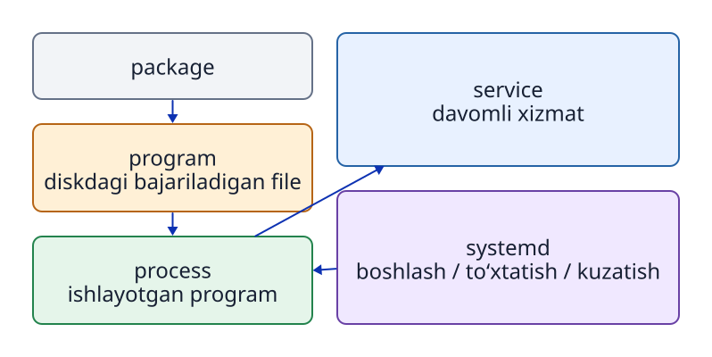

# 8-bob. Program, process, PID va signal

## 8.1 Program va process bir xil emas

**`program`** — saqlash qurilmasidagi ko‘rsatmalar va ularga tegishli ma’lumot `file`lari. **`process`** esa shu `program` xotiraga yuklanib, `OS` tomonidan bajarilayotgan holat. Bir `program`dan bir nechta `process` boshlash mumkin. Har biriga alohida **PID (`process` ID)** raqami beriladi.

`package` `program` va sozlama `file`larini tarqatish hamda o‘rnatish birligidir. `service` esa fonda davomli imkoniyat beradigan ishni boshqarish birligidir. Quyidagi munosabatlarni farqlang.

```text
Package o‘rnatiladi       → program filelari joylashtiriladi
Program ishga tushiriladi → process paydo bo‘ladi
Systemd unitni boshqaradi → service processini ishga tushiradi va kuzatadi
```



**8-1-rasm. Saqlangan program, ishlayotgan process, boshqaruv birligi service va tarqatish birligi package alohida tushunchalardir.**

## 8.2 PID va processlarning ota-bola munosabati

`kernel` har bir ishga tushirilgan `process`ga musbat butun son — **PID** — beradi. `process` boshqa `process`ni bola sifatida boshlashi mumkin. **PPID (parent process ID)** orqali ularning ota-bola munosabatini ko‘rish mumkin.

```bash
ps -e -o pid,ppid,user,stat,comm,args
ps -p 1234 -o pid,ppid,user,stat,comm,args
```

Bu yerdagi `1234` faqat misol. Haqiqiy PID har safar o‘zgarishi mumkin. `process` tugagach, ayni raqam keyin boshqa `process`ga berilishi ham mumkin. `signal` yuborishdan oldin PID bilan birga `user`, `command` nomi (`comm`) va argumentlarni (`args`) tekshiring.

PID 1 tizim ishga tushganining boshidan ishlaydigan alohida boshqaruv `process`idir. Ubuntuda bu vazifani odatda `systemd` bajaradi.

## 8.3 Service boshqaradigan processni topish

Ubuntuda `systemd` `service`larning boshlanishi va holatini boshqaradi. `service`ni tavsiflovchi sozlama **`unit`** deyiladi; `service` `unit`i nomi odatda `.service` bilan tugaydi. Sozlamada ko‘rsatilgan `program` bajarilganda, unga tegishli `process` ishlaydi. Boshqaruv obyekti bo‘lgan `unit` bilan hozir ishlayotgan `process` aynan bitta narsa emas.

`systemctl` `systemd` boshqaradigan `unit` holatini tekshiradi. Quyidagi misol ishlayotgan `service`lar ro‘yxatini, bittasining holatini va asosiy `process`ini ko‘rsatadi.

```bash
systemctl list-units --type=service
systemctl status systemd-journald.service --no-pager
systemctl show --property MainPID --value systemd-journald.service
```

`status`dagi **Main PID** `service`ning asosiy `process` PIDidir. `show --property MainPID --value` faqat shu raqamni chiqaradi. To‘xtagan `service` uchun `0` ko‘rinishi mumkin. Raqamni `ps -fp PID` bilan solishtirib, boshqaruv ma’lumoti va haqiqiy `process` o‘rtasidagi bog‘liqlikni ko‘ring. `ps` `process`ni, `systemctl` `service`ning boshqaruv holatini tekshiradi. `service`ni ishga tushirish va avtomatik boshlash 10-bobda ko‘riladi.

## 8.4 Foreground va background

`terminal`dan odatdagi `command` bajarilganda, `shell` uning **`foreground process`** sifatida tugashini kutadi. Shu paytda klaviatura kiritishi asosan shu `process`ga boradi. `Ctrl+C` `terminal`dan `foreground process group`ga uzilish `signal`ini yuboradi.

`command` oxiriga `&` qo‘yilsa, `shell` uni **`background`**da boshlaydi va keyingi kiritishni qabul qiladi.

## 8.5 Signal processga xabar beradi

**`signal`** — `OS` yoki bir `process` boshqa `process`ga hodisa yoki boshqaruv talabini asinxron tarzda bildiradigan mexanizm.

- **TERM (SIGTERM)**: `process`dan ma’lumotni saqlash va resurslarni bo‘shatish kabi odatdagi yakunlash ishlarini bajarib, chiqishni so‘raydi. `process`ni to‘xtatishda odatda avval ishlatiladi.
- **KILL (SIGKILL)**: `kernel` `process`ni majburan va zudlik bilan tugatadi. `process` bu `signal`ni tutib, o‘zini tartibli yopishga ulgurmaydi. TERM kabi odatdagi `signal`lar ishlamaganda oxirgi choradir.
- **INT (SIGINT)**: masalan, `terminal`dagi `Ctrl+C` yuboradigan uzilish `signal`i.

```bash
kill -TERM PID
```

Nomiga qaramay, `kill`ning vazifasi ko‘rsatilgan `signal`ni `process`ga yuborishdir. Masalan, `pkill 1956`da `1956` PID emas, `process` nomini izlash namunasi sifatida talqin qilinadi. PIDni aniq ko‘rsatish uchun `kill`, nom namunasi orqali tanlash uchun `pkill` ishlatiladi.

## 8.6 Process tugasa ham filelar qoladi

`process` tugatilsa ham saqlash qurilmasidagi bajariladigan `program file`i, `unit file`i va ma’lumot `file`lari saqlanib qoladi. Aksincha, diskdagi bajariladigan `file` o‘chirilsa ham, xotirada oldindan ishlayotgan `process` darhol to‘xtamaydi.

`systemd` boshqaradigan `service` `process`i tugagach qayta ishga tushishi mumkin. Bu `unit file`idagi `Restart=` kabi sozlamaga bog‘liq. Shuning uchun `process`ning tugashi bilan `service` doimiy to‘xtashi ham boshqa hodisalardir.

## 8.7 /proc/PID orqali joriy holatni ko‘rish

```bash
printf 'PID=%s\n' "$$"
cat "/proc/$$/cmdline" | tr '\0' ' '
printf '\n'
readlink -f "/proc/$$/cwd"
```

`$$` hozirgi Bash `shell`ining PIDidir. `/proc/PID/cmdline`dagi argumentlar NUL (`\0`) belgisi bilan ajratiladi; `tr` ularni bo‘sh joyga almashtirib ko‘rsatadi. `/proc/PID/cwd` shu `process`ning ish `directory`siga ishora qiladigan ramziy `link`. `process` tugasa, unga mos `/proc/PID` ham yo‘qoladi.

`/proc/PID`ni o‘qish orqali saqlangan `program file`ini emas, hozir ishlayotgan `process` haqidagi ma’lumotni kuzatasiz.

## Bob yakunidagi savollar

### 1-savol. Package, program, process va service farqi nima?

### 2-savol. Signal yuborishdan avval nima uchun PIDni `ps` bilan tekshirish kerak?

### 3-savol. TERM yuborgach service qayta ishga tushsa, unit fileda nimani tekshirish kerak?

## Bob yakunidagi javoblar

### 1-savol

**Javob:** `package` `program` va sozlamalarni tarqatish-o‘rnatish birligi. `program` saqlangan ko‘rsatmalar. `process` shu `program`ning ishlayotgan holati. `service` davomli imkoniyat beradigan, `systemd` kabi vosita boshqaradigan birlik.

### 2-savol

**Javob:** PID har ishga tushishda o‘zgarishi, tugagach boshqa `process`ga qayta berilishi mumkin. Shu sababli PIDga qo‘shimcha ravishda `user`, `command` nomi va argumentlarni ham tekshirib, aynan kerakli `process` ekanini aniqlang.

### 3-savol

**Javob:** `Restart=` kabi avtomatik qayta ishga tushirish sozlamasini tekshiring. `process` tugaganidan keyin `systemd` sozlamaga binoan uni qayta boshlashi mumkin.

## Foydalanilgan manbalar

- Linux man-pages / Ubuntu 24.04dagi `man ps`, `man kill`, `man proc` (nashrdan oldin amalda tekshiriladi)
- GNU Bash Reference Manual, [Special Parameters](https://www.gnu.org/software/bash/manual/html_node/Special-Parameters.html) (2026-09-24 kuni tekshirilgan; `$$` `shell` PIDidir)
- Ubuntu 24.04 man page, [systemd.service(5)](https://manpages.ubuntu.com/manpages/noble/man5/systemd.service.5.html) (2026-09-24 kuni tekshirilgan; `Restart=`)
- Ubuntu 24.04 man page, [systemctl(1)](https://manpages.ubuntu.com/manpages/noble/man1/systemctl.1.html) (2026-09-24 kuni tekshirilgan; `status` va `show`)
