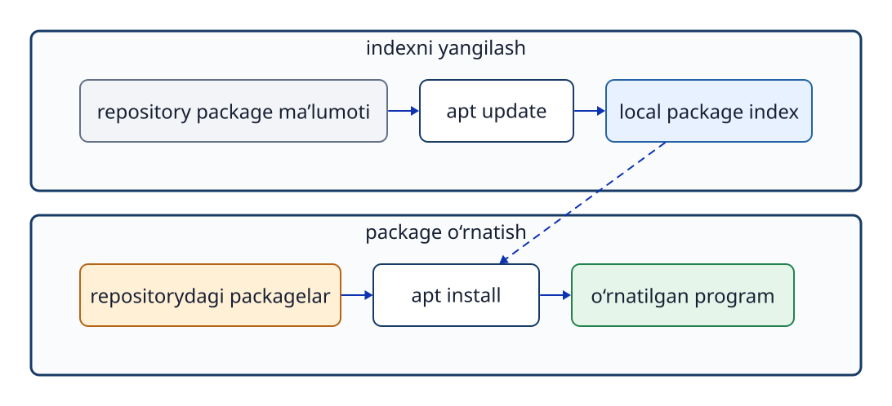

# 9-bob. Package va dastur o‘rnatish

## 9.1 Nima uchun package kerak?

Amalda ishlatiladigan dasturiy ta’minot doim bitta bajariladigan `file`dan iborat bo‘lmaydi. Unga umumiy kutubxonalar, sozlama `file`lari namunalari, manual va ma’lumot `file`lari ham kerak bo‘lishi mumkin. **`package`** — shu o‘zaro bog‘liq `file`lar, versiya ma’lumoti, bog‘liqliklar hamda o‘rnatish va o‘chirish skriptlarini birlashtiradigan tarqatish birligi.

Ubuntu asosan Debian `package` formatidan (`.deb`) foydalanadi va ularni **APT (Advanced Package Tool)** orqali boshqaradi. APT **`repository`**dan mavjud `package`lar haqidagi yangi ma’lumotni oladi, kerakli kutubxona bog‘liqliklarini aniqlaydi va `package`ni tizimga o‘rnatadi. Internetdan manbasi noma’lum skriptni `root` huquqi bilan bevosita ishga tushirish va ishonchli rasmiy `repository`dagi tekshirilgan `package`ni o‘rnatish xavfsizlik jihatidan tubdan farq qiladi.



**9-1-rasm. `apt update` mavjud packagelar ro‘yxatini yangilaydi; `apt install` esa package mazmunini olib o‘rnatadi.**

## 9.2 Repository va package index

**`repository`** — `package`lar va ularga tegishli `metadata`ni (versiya va bog‘liqlik ma’lumotlarini) tarqatadigan `server`. Ubuntu mahalliy **`package index`**da qaysi `repository`da qaysi versiya borligi haqidagi ro‘yxatni saqlaydi.

```bash
sudo apt update
apt show cmatrix
sudo apt upgrade
```

`apt update` `repository`dan mavjud `package`lar ro‘yxatining yangi nusxasini oladi. Uning o‘zi o‘rnatilgan `package`larning mazmunini o‘zgartirmaydi. `apt show cmatrix` o‘rnatishdan oldin tavsif, versiya va bog‘liqliklarni ko‘rsatadi. `apt upgrade` yangilangan ro‘yxatga ko‘ra o‘rnatilgan `package`larni yangi versiyalarga o‘tkazadi. Davom etishdan oldin ekranda ko‘rsatilgan o‘zgarishlarni tekshiring. Bu Ubuntu tizimini yangi katta relizga almashtirish emas.

## 9.3 O‘rnatish va ishga tushishni tekshirish

```bash
sudo apt install cmatrix
command -v cmatrix
cmatrix
```

`sudo` huquqi kerak, chunki umumiy `package` ma’lumotlar bazasi va administrator himoyasidagi `/usr/bin` kabi joylar o‘zgaradi. O‘rnatilgach, `command -v` bilan `shell` bajariladigan `file`ni qaysi `path`da topishini tekshiring. `cmatrix`dan chiqish uchun `Ctrl+C`ni bosing.

`package` o‘rnatilgan bo‘lishi bilan uning `process`i hozir xotirada ishlashi boshqa holat. `command` tugagach ham `package` tizimda qoladi. Ba’zi `server` dasturlari o‘rnatilganda esa `service process`ini avtomatik boshlashi mumkin. Taxmin qilmang: haqiqiy holatni `systemctl` bilan tekshiring.

## 9.4 Versiya va file qaysi packagega tegishli ekanini aniqlash

```bash
dpkg-query -W -f='${Package} ${Version}\n' cmatrix
dpkg -S /usr/bin/cmatrix
```

`dpkg-query` mahalliy `package` ma’lumotlar bazasidan o‘rnatilgan aniq versiyani oladi. `dpkg -S PATH` ko‘rsatilgan `file`ni qaysi `package` yetkazib berganini aniqlaydi. `command -v` “`shell` qaysi `path`dagi bajariladigan `file`ni ko‘ryapti?” degan savolga javob beradi. `dpkg -S` esa “bu `file` qaysi `package`ga tegishli?” degan boshqa savolga javob beradi.

## 9.5 O‘chirish va tozalash

`apt remove` `package`ning asosiy qismini o‘chiradi. `apt purge` sozlama `file`lari bilan birga o‘chiradi. `apt autoremove` boshqa `package`larga endi kerak bo‘lmay qolgan bog‘liq `package`larni o‘chiradi. Ularning hammasi `apt upgrade`dan farq qiladi; bajarishdan oldin nimani o‘chirishi ko‘rsatilganini tekshiring.

## Bob yakunidagi savollar

### 1-savol

`apt update`, `apt upgrade` va `apt install` vazifalarini farqlang.

### 2-savol

`command -v cmatrix` va `dpkg -S /usr/bin/cmatrix` nimalarni tekshiradi?

### 3-savol

Package o‘rnatilgan, lekin unga tegishli process ishlamayotgan holatga misol keltiring.

## Bob yakunidagi javoblar

### 1-savol

**Javob:** `apt update` mavjud `package`lar ro‘yxatini yangilaydi. `apt upgrade` o‘rnatilgan `package`larni yangi versiyaga yangilaydi. `apt install` ko‘rsatilgan `package`ni o‘rnatadi.

### 2-savol

**Javob:** `command -v cmatrix` `shell` bajaradigan `command`ning `path`ini topadi. `dpkg -S /usr/bin/cmatrix` esa shu `file`ni qaysi `package` yetkazib berganini aniqlaydi.

### 3-savol

**Javob:** `cmatrix` o‘rnatilgach uni umuman boshlamaslik yoki ishga tushirib, `Ctrl+C` bilan tugatish. `package` tizimda qoladi, ammo `cmatrix` `process`i ishlamaydi.

## Foydalanilgan manbalar

- Ubuntu Server documentation, [Install and manage packages](https://ubuntu.com/server/docs/how-to/software/package-management/) (2026-09-24 kuni tekshirilgan)
- Ubuntu Server documentation, [Managing your software](https://ubuntu.com/server/docs/tutorial/managing-software/) (2026-09-24 kuni tekshirilgan)
- Ubuntu 24.04 amaliy muhitidagi `man apt`, `man dpkg-query`, `man dpkg` (nashrdan oldin tekshiriladi)
