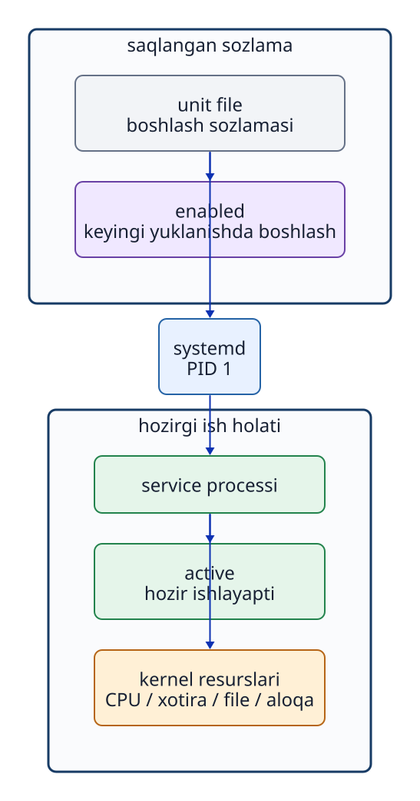

# 10-bob. Systemd va service

## 10.1 Service nima?

**`service`** — foydalanuvchi har safar `terminal`dan qo‘lda ishga tushirmasa ham, `OS` fonda boshqaradigan va davomli funksiya beradigan `program`. Veb-`server`, SSH `server`, vaqtni sinxronlash va `log`larni boshqarish bunga misol. Biroq tizimdagi har bir `process` `service` emas. Har bir `service` ham tarmoqda kutadigan `port`ga ega bo‘lishi shart emas.

Ubuntu 24.04da `systemd` PID 1 sifatida boshlanadi va turli `service`larni markaziy tarzda boshqaradi. `systemd` ularning aniq ishini o‘zi bajarmaydi. U `service`larni boshlash, to‘xtatish, bog‘liqliklarini tartiblash, holatini kuzatish va tizim ishga tushganda avtomatik boshlashni boshqaradigan **`service manager`**dir.

## 10.2 Unit file — sozlama; process — joriy ish

`systemd` resurslarni **`unit`** deb ataladigan boshqaruv birliklari orqali boshqaradi. `service`ni belgilaydigan `.service` `unit file`ida qaysi bajariladigan `file`ni, qaysi `user` huquqi bilan va qaysi ish `directory`sida boshlash yoziladi.

```ini
[Service]
User=jduapp
WorkingDirectory=/srv/jdu-status
ExecStart=/usr/bin/python3 /srv/jdu-status/server.py
```

- `User`: `service process`i ishlaydigan `user`.
- `WorkingDirectory`: `process` boshlangandagi joriy ish `directory`si.
- `ExecStart`: ishga tushiriladigan `program`ning `absolute path`i va argumentlari.

```bash
systemctl cat jdu-status.service
```

`systemctl cat` diskdagi `unit file`ini va uning ayrim sozlamalarini almashtiradigan `drop-in` yozuvlarini ko‘rsatadi. `file` o‘zgartirilib, hali `daemon-reload` bajarilmagan bo‘lsa, ko‘rsatilgan matn bilan `systemd` xotirasidagi sozlama farq qilishi mumkin.



**10-1-rasm. Unit — sozlama, systemd — boshqaruvchi, service processi esa haqiqiy ishni bajaruvchi.**

## 10.3 Active va enabled boshqa-boshqa holatlar

```bash
systemctl is-active jdu-status.service
systemctl is-enabled jdu-status.service
```

- **active / inactive**: `service process`i hozir xotirada ishlayaptimi yoki to‘xtaganmi.
- **enabled / disabled**: tizim keyingi safar yoqilganda shu `unit` avtomatik boshlanishga sozlanganmi.

Shunday qilib, “hozir `active`, ammo keyingi yuklanishda avtomatik boshlanmaydigan `disabled`” holati mumkin. “Hozir `inactive`, ammo keyingi yuklanishda avtomatik boshlanadigan `enabled`” holati ham mumkin. Darhol boshlash (`start`) va avtomatik boshlanishni yoqish (`enable`) ikki alohida amaldir.

```bash
sudo systemctl start jdu-status.service
sudo systemctl enable jdu-status.service
```

`enable --now` ikkala amalni birga bajaradi.

## 10.4 Start, stop, restart va reload

- **start**: to‘xtagan `service process`ini boshlaydi.
- **stop**: ishlayotgan `service process`ini to‘xtatadi.
- **restart**: to‘xtatib, yana boshlaydi; qisqa xizmat uzilishi yuz beradi.
- **reload**: `process`ni to‘xtatmay, uning sozlamasini qayta o‘qishni so‘raydi. Hamma `service` buni qo‘llamaydi.

`unit file`i o‘zgargandan keyin `systemd`ning o‘ziga yangi sozlamani o‘qitadigan `systemctl daemon-reload` va `service process`idan o‘z sozlamasini qayta o‘qishni so‘raydigan `reload` mutlaqo boshqa amallardir.

## 10.5 Unit sozlamasi va haqiqiy processni solishtirish

```bash
systemctl status jdu-status.service
systemctl show --property MainPID --value jdu-status.service
```

8-bobda Main PID orqali `process` topilgan edi. Endi `unit`dagi `User=`, `ExecStart=`, `WorkingDirectory=` qiymatlarini amaldagi `process` bilan solishtiring. `systemctl status` `unit` yuklanganini, ishlayotganini (`active`), Main PID va yaqindagi `log`larni ko‘rsatadi. Natija uzun bo‘lsa `pager` ochilishi mumkin; undan `q` bilan chiqing. `systemctl show` kerakli `property` qiymatini alohida chiqaradi.

Main PIDni olgach, `unit` sozlamasi va ishlab turgan `process` mosligini tekshiring.

```bash
M4_PID="$(systemctl show --property MainPID --value jdu-status.service)"
ps -p "$M4_PID" -o pid,user,comm,args
sudo readlink -f "/proc/$M4_PID/cwd"
```

| `unit` sozlamasi | Haqiqiy `process`da tekshiriladigan joy |
| --- | --- |
| `User=` | `ps`dagi USER ustuni |
| `ExecStart=` | `ps`dagi args ustuni va `/proc/PID/cmdline` |
| `WorkingDirectory=` | `/proc/PID/cwd` ishora qiladigan manzil |

## 10.6 Active bo‘lish funksiyaning to‘g‘riligini isbotlamaydi

`systemd` `process`ni `active` deb ko‘rsatsa ham, foydalanuvchiga to‘g‘ri javob qaytmasligi mumkin. Masalan, kontent `file`iga `permission` yetmasligi, kutilmagan IP manzilda kutishi (`listen`) yoki ilova ichida xato bo‘lishi mumkin. Keyingi bobda `service` boshqaruv holatidan tashqari `process`, `socket`, HTTP `response` va `log` ham tekshiriladi.

## 10.7 Systemctl status hamma processni ko‘rsatmaydi

`systemctl status`ni argumentsiz bajarish butun tizimning qisqa holati va `process tree`ni ko‘rsatadi. Ayrim `unit` tafsilotlarini ko‘rish qiyin bo‘lishi mumkin. Muayyan `service` uchun uning `unit` nomini aniq kiriting.

```bash
systemctl status systemd-journald.service --no-pager
systemctl list-units --type=service 'systemd-*'
```

Foydalanuvchi `terminal`da boshlagan `shell` kabi ko‘plab `process`lar `systemd`ning `service unit`i ostida ishlamaydi. Butun tizimdagi `process`larni ko‘rish uchun `ps`, `systemd` boshqaradigan `service`lar holati uchun `systemctl` ishlatiladi.

## Bob yakunidagi savollar

### 1-savol

Unit file, systemd va service processi vazifalari nimasi bilan farqlanadi?

### 2-savol

Service `active` va `disabled` bo‘lishi bir vaqtda mumkinmi? Bu nimani anglatadi?

### 3-savol

Unit fileda belgilangan `WorkingDirectory` ishlab turgan processga qo‘llanganini `/proc` orqali qanday tekshirasiz?

## Bob yakunidagi javoblar

### 1-savol

**Javob:** `unit file` ishga tushirish usuli kabi sozlamalarni saqlaydi. `systemd` shu sozlamalarga ko‘ra `service`ni boshqaradi. `service process`i esa haqiqiy ishni bajaradigan ishlab turgan `program`dir.

### 2-savol

**Javob:** Ha. `active` hozir ishlayotganini, `disabled` esa keyingi yuklanishda avtomatik boshlanish yoqilmaganini bildiradi. Qo‘lda `start` qilingan `service` shunday bo‘lishi mumkin.

### 3-savol

**Javob:** `systemctl show --property MainPID --value unit_name` bilan asosiy PIDni toping. `readlink -f /proc/PID/cwd` shu `process`ning hozirgi ish `directory`sini ko‘rsatadi. Natijani `unit file`dagi `WorkingDirectory=` bilan solishtiring.

## Foydalanilgan manbalar

- Ubuntu 24.04 [systemctl(1)](https://manpages.ubuntu.com/manpages/noble/man1/systemctl.1.html), [systemd.exec(5)](https://manpages.ubuntu.com/manpages/noble/man5/systemd.exec.5.html), [proc_pid_cwd(5)](https://manpages.ubuntu.com/manpages/noble/man5/proc_pid_cwd.5.html) (2026-09-24 kuni tekshirilgan)
- Ochiq Lab v1.0.0dagi P4/M4 `unit` va `checker` (Labga xos qiymatlar uchun asosiy manba)
