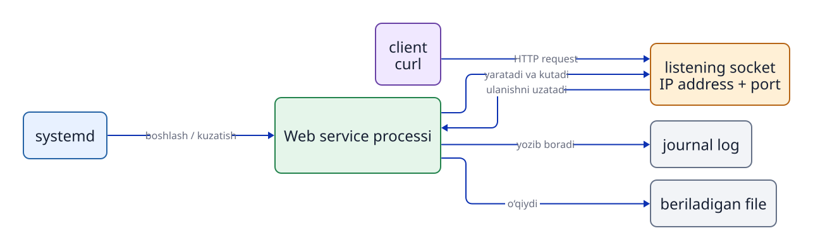
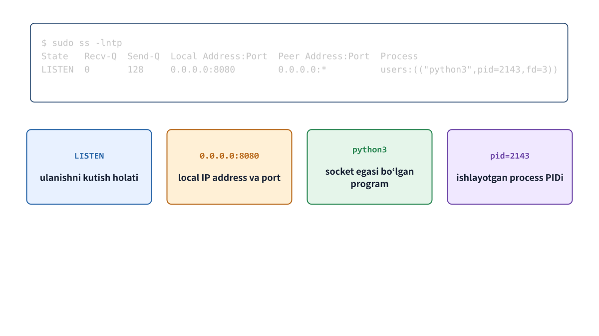

# 11-bob. Service holatini socket, HTTP va log orqali kuzatish

## 11.1 Service, process va socket munosabati

`systemd` `unit` sozlamasiga binoan `service process`ini ishga tushiradi. Agar `program`ga tarmoq aloqasi kerak bo‘lsa, `system call` orqali `kernel`dan **`socket`** yaratishni so‘raydi. `kernel` IP manzil, aloqa `protocol`i va `port` raqamiga qarab kelgan ma’lumotni tegishli `process`ga yetkazadi.

“`service` o‘zi `socket` yaratadi” degandan ko‘ra, “`service` sifatida ishlayotgan `program` `kernel` bergan `socket` funksiyasidan foydalanib aloqa qiladi” deyish aniqroq. `systemd` `process`ni boshqaradi va kuzatadi; tarmoqdagi barcha ma’lumotni uning o‘zi yuborib-qabul qilmaydi.



**11-1-rasm. Boshqaruv (systemd), bajarish (process), aloqa (kernel va socket) hamda client requesti alohida vazifalardir.** Bir `service` bir nechta `socket`ga ega bo‘lishi yoki umuman tarmoqdan foydalanmasligi mumkin.

## 11.2 Protocol, IP address va port

Veb-aloqada keng ishlatiladigan transport `protocol`laridan biri **TCP (Transmission Control Protocol)**. TCP ma’lumot yetganini tasdiqlash va uni tartib bilan yetkazish imkonini beradi. Ulanishni boshlash va qayta yuborishning tafsilotlari keyingi tarmoq bo‘limida o‘rganiladi.

**IP address** tarmoq `interface`ini (aloqa qilinadigan `host`ni) aniqlaydi. **`port`** raqami esa ayni `host` ichidagi qaysi aloqa nuqtasiga, ya’ni qaysi `process`ga ma’lumot yetkazilishini farqlaydi. `port` raqamining o‘zi `program` emas. `kernel` `socket`ning kutish ma’lumotini `port` bilan solishtirib, ma’lumotni tegishli `process`ga beradi.

- `127.0.0.1`: IPv4dagi **`loopback address`**. Unga tashqi tarmoqdan bevosita yetib bo‘lmaydi; odatda faqat shu `host` ichidan ulanish mumkin.
- `0.0.0.0`: shu `host`ning barcha mahalliy IPv4 manzillarida (barcha tarmoq `interface`larida) kutishni bildiradigan maxsus yozuv.
- `[::]`: barcha mahalliy IPv6 manzillarida kutishni bildiradi. `OS` sozlamasiga qarab IPv4 ulanishlarini ham qabul qilishi mumkin.

## 11.3 Ss bilan listening socketni o‘qish

`ss` (Socket Statistics) `kernel` boshqaradigan `socket`larning batafsil holatini ko‘rsatadi.

```bash
sudo ss -lntp | grep ':8081'
```

- `-l`: faqat kutish (`LISTEN`) holatidagi `socket`larni ko‘rsatadi.
- `-n`: `port`ni xizmat nomiga (masalan, http) almashtirmay, raqamligicha ko‘rsatadi.
- `-t`: faqat TCP `socket`larini ko‘rsatadi.
- `-p`: `socket`dan foydalanadigan `process` nomi va PIDini ko‘rsatadi. Ba’zan buning uchun administrator huquqi kerak.

Tushunchaviy chiqish namunasi:

```text
State  Recv-Q Send-Q Local Address:Port Peer Address:Port Process
LISTEN 0      5      127.0.0.1:8081  0.0.0.0:*       users:(("python3",pid=2451,fd=3))
```

Natijani avval holat (`State: LISTEN`), keyin kutish manzili va `port`i (`Local Address:Port: 127.0.0.1:8081`), so‘ng `process` (`pid=...`) tartibida o‘qing. Kutish manzili `127.0.0.1:8081` ekanini va ko‘rsatilgan PID `systemd`dagi `service` Main PIDiga mosligini solishtiring. Bu yerda `2451` faqat misol; o‘z muhitingizdagi haqiqiy PIDni o‘qing.



**11-2-rasm. `ss -lntp` chiqishidagi satr holat, manzil, port va process ma’lumotiga ajratib o‘qiladi.**

## 11.4 Client, server va HTTP

**`server process`** `socket` yaratib, `client` ulanishi va `request`ini kutadi. **`client`** `server socket`iga ulanib, `request` yuboradi. Amaliy muhitda Ubuntu `host`ining o‘zida ishlatiladigan `curl` `client`, `jdu-web.service` `process`i esa `server` vazifasini bajaradi.

```bash
curl -i http://127.0.0.1:8081/
```

`http://127.0.0.1:8081/` URLida `http` aloqa `protocol`i (`scheme`), `127.0.0.1` ulaniladigan `host`, `8081` `port`, `/` esa `request` qilinadigan `path`. `-i` `response body` bilan birga HTTP `response header`larini ham ko‘rsatadi.

```text
HTTP/1.0 200 OK
Content-Type: text/plain

(Javob matni)
```

`200` (200 OK) HTTP ilova `layer`idagi `status code`dir. “TCP darajasida ulanish bo‘ldi”, “HTTP `response header` qaytdi”, “`response body` kutilgan mazmunda” — bular turli `layer`larga tegishli uchta alohida tekshiruvdir.

## 11.5 Open port va closed portni solishtirish

```bash
curl --max-time 2 http://127.0.0.1:18081/
sudo ss -lnt | grep ':18081'
```

Agar `127.0.0.1:18081`da kutayotgan `socket` bo‘lmasa, ulanish odatda rad etiladi va `curl` `Connection refused` deb ko‘rsatadi. `ss -lnt`da shu manzil va `port` ko‘rinmasligi u yerda TCP kutish `socket`i yo‘qligini bildiradi. `--max-time 2` `curl`ning butun amaliga ikki soniya chegarasi qo‘yadi.

Kutish `socket`i mavjudligi HTTP `response` ham keladi degani emas. Kutish ulanishni qabul qilishga tayyorlikdir; HTTP `response` uchun `server program`i `request`ni qayta ishlashi kerak. `Timeout` esa aloqa belgilangan vaqt ichida tugamaganini bildiradi. Bu natijaning o‘zi “kutish `socket`i yo‘q” degan isbot emas.

## 11.6 Service userning o‘qish permissioni

Veb-`server process`i kontent `file`ini `client`ga qaytarishi uchun, uni ishlatayotgan `user`da shu `file`ni o‘qish va yuqori `directory`lardan o‘tish `permission`lari bo‘lishi kerak.

```bash
id jduweb
stat -c '%U:%G %a %n' /srv/jdu-web/index.txt
namei -l /srv/jdu-web/index.txt
sudo -u jduweb -- test -r /srv/jdu-web/index.txt
echo $?
```

`jduweb` nomidan `su -` bilan interaktiv login qila olmaslik muammo emas. `service user` uchun interaktiv `shell` ko‘pincha xavfsizlik sababli o‘chiriladi. 6-bobdagi `sudo -u` bilan interaktiv login ochmasdan, aynan shu `user` huquqida `file`ni o‘qib bo‘lishini sinash mumkin.

## 11.7 Loglar qayerdan keladi?

`program` ishlayotganda turli `log message`lar chiqarishi mumkin. `systemd-journald` har xil `service process`larining `stdout`, `stderr` va tizim `log` xabarlarini yig‘ib, ikkilik formatda saqlaydi. `journalctl` shu `journal log`larni ko‘rish va qidirish uchun ishlatiladi.

```bash
curl -i http://127.0.0.1:8081/
sudo journalctl -u jdu-web.service --no-pager -n 20
```

`-u` natijani belgilangan `unit` bilan cheklaydi, `-n 20` oxirgi 20 yozuvni ko‘rsatadi. `--no-pager` qo‘shimcha ko‘rish oynasini ochmaydi. Veb-`server` murojaatlarni yozadigan qilib tuzilgan bo‘lsa, `request`ga mos `log` satri qoladi. Uning mazmuni va umuman mavjudligi `program`ning tuzilishi va sozlamasiga bog‘liq.

## 11.8 Web service requestga qanday javob beradi?

Veb-`service` misolida sozlama, bajarish, aloqa, javob va `log` quyidagicha bog‘lanadi.

```text
Unit file → systemd → service processi
                         ↓ kernel socketidan foydalanadi
                 Listening socket (IP address va port)
                         ↓ client ulanadi va request yuboradi
                 Service processi requestni qayta ishlaydi
                    ├─ HTTP response qaytaradi
                    └─ kerak bo‘lsa log yozadi
```

`unit file` ishga tushish tartibini belgilaydi, lekin aloqa mazmunini `service process`i qayta ishlaydi. Kutish `socket`i ulanish nuqtasidir. HTTP `response` `program` `request`ni qayta ishlaganining natijasi. `log` esa amal yoki xatoni keyin bilish uchun yozuvdir. `systemctl` `service` holatini, `ss` `socket`ni, `curl` HTTP javobini, `journalctl` yig‘ilgan `log`ni ko‘rsatadi. Ular bitta hodisaning turli nomlari emas.

## Bob yakunidagi savollar

### 1-savol

Service active bo‘lsa ham HTTP orqali kutilgan javob kelmasligiga ikki sabab keltiring.

### 2-savol

`127.0.0.1:8081` va `0.0.0.0:8081` kutish manzillari tashqi tarmoqdan ulanish nuqtayi nazaridan qanday farqlanadi?

### 3-savol

Nima uchun `ss` chiqishidagi process PIDi systemd Main PIDi bilan solishtiriladi?

## Bob yakunidagi javoblar

### 1-savol

**Javob:** Masalan, `server program`i boshqa manzil yoki `port`da kutayotgan bo‘lishi mumkin. Yoki `service user` kontent `file`ini o‘qiy olmagani sababli `request`ni to‘g‘ri bajara olmaydi.

### 2-savol

**Javob:** `127.0.0.1:8081` faqat shu `host` ichidagi ulanishlarni qabul qiladi. `0.0.0.0:8081` shu `host`ning barcha mahalliy IPv4 manzillarida kutadi. Lekin tashqi tarmoqdan haqiqiy yetib kelish `firewall` va tarmoq tuzilishiga ham bog‘liq.

### 3-savol

**Javob:** Kutayotgan `socket`dan foydalanuvchi `process` aynan `systemd` kerakli `service` sifatida boshqarayotgan `process` ekanini tekshirish uchun. Bir nechta `process`li `service`da kutayotgan PID Main PIDdan farq qilishi ham mumkin.

## Foydalanilgan manbalar

- Linux man-pages, [socket(7)](https://man7.org/linux/man-pages/man7/socket.7.html) (2026-09-18 kuni tekshirilgan)
- Linux man-pages, [connect(2)](https://www.man7.org/linux/man-pages/man2/connect.2.html) (2026-09-24 kuni tekshirilgan)
- curl, [How to use curl](https://curl.se/docs/manpage.html) (2026-09-24 kuni tekshirilgan)
- Ubuntu 24.04 amaliy muhitidagi `man ss`, `man curl`, `man journalctl` (nashrdan oldin tekshiriladi)
- Ochiq Lab v1.0.0dagi P5/M5 `program`, `unit` va `checker` (Labga xos qiymatlar uchun asosiy manba)
