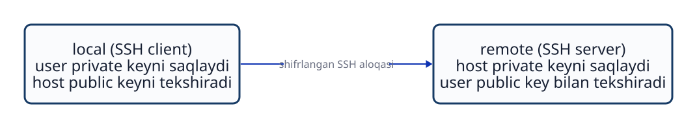
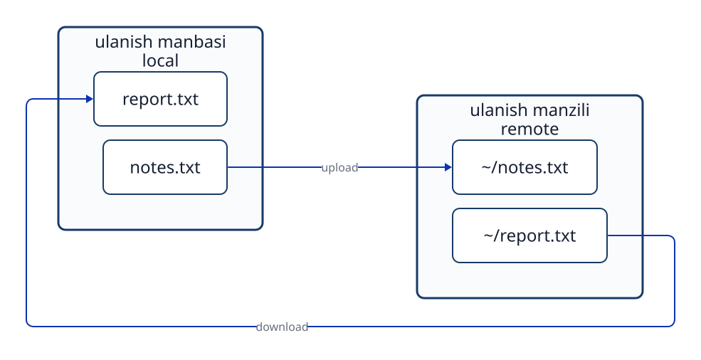

# 12-bob. SSH orqali masofadan boshqarish va file uzatish

## 12.1 Ulanish manbasi va manzili

Masofadagi kompyuterni boshqarayotganda `command`ni kiritayotgan tomon bilan uni bajaradigan tomonni ajrating. SSH ulanishini boshlaydigan muhit **`local`**, ulaniladigan muhit **`remote`** deyiladi. Bu nomlar amalni bajarayotgan odamning nuqtayi nazariga bog‘liq. `local` doim stol ustingizdagi fizik PC emas. Agar brauzerda ochilgan bulut `terminal`idan SSH bajarilsa, o‘sha `terminal` ishlayotgan muhit ulanish manbasi bo‘ladi.

```text
Command kiritiladigan muhit (local)
              ↓ SSH ulanishi
Command bajariladigan server (remote)
```

Ulanishdan oldin va keyin `user` nomi, `hostname` va ish `directory`si o‘zgarishi mumkin. Masalan, avval `id -un`, `hostname`, `pwd` bajarilsa `local` holati ko‘rinadi. SSH orqali login qilingach, ayni `command`lar `remote` holatini ko‘rsatadi. `exit` `remote shell`ni tugatib, oldingi `local shell`ga qaytaradi. Faqat `prompt` ko‘rinishiga qarab qaysi muhitda ekaningizni taxmin qilmang.

## 12.2 SSH nimani himoya qiladi?

**SSH (Secure Shell)** uzoqdagi kompyuter bilan shifrlangan aloqa yo‘lini yaratib, `remote shell` va `command`lardan foydalanishga imkon beradi. Ulanishda asosan ikkita tekshiruv bor.

1. **Ulaniladigan `host`ni tekshirish (`host authentication`):** u haqiqatan mo‘ljallangan `server` ekanini `host key` orqali aniqlash.
2. **`user`ni tekshirish (`user authentication`):** ulanuvchining login huquqi borligini aniqlash. `public key authentication`da `user`ning kalit jufti ishlatiladi.

Shundan keyin `command`lar, natijalar va uzatiladigan ma’lumotlar shifrlangan SSH aloqasidan o‘tadi. Lekin shifrlashning o‘zi `server`ga yetib borishni ta’minlamaydi; ular o‘rtasida tarmoq yo‘li ham bo‘lishi kerak. SSH login muvaffaqiyatli bo‘lsa ham, `remote`dagi har bir `file`ni o‘qish yoki o‘zgartirish mumkin degani emas. Login keyingi amallarga `remote OS`dagi `user` va `permission`lar qo‘llanadi.



**12-1-rasm. SSHda serverni aniqlaydigan host key va userni tasdiqlaydigan user key turli vazifani bajaradi.**

## 12.3 User key va host key qayerda saqlanadi?

`public key authentication`da ulanuvchi `user`ning **`private key`**i SSH `client` tomonida saqlanadi. Unga mos **`public key`** odatda `remote user`ning `~/.ssh/authorized_keys` `file`ida ro‘yxatdan o‘tkaziladi. SSH `client` `private key`ni `server`ga bermasdan unga egaligini isbotlaydi.

**`host key`** esa `server`ni aniqlaydi. `server` `host private key`ni o‘zida saqlaydi. `client` `server` ko‘rsatgan `host public key`ni tekshiradi; ishonilgan yozuv odatda `~/.ssh/known_hosts`da saqlanadi. Birinchi ulanishda ko‘rsatilgan kalit barmoq izini ishonchli boshqa yo‘ldan olingan ma’lumot bilan solishtirgach qabul qiling. Noma’lum kalitni ko‘r-ko‘rona qabul qilsangiz, soxta `server`ni sezmay qolishingiz mumkin.

| Kalit turi | Asosiy maqsad | `private key` joyi | `public key`ga oid ma’lumot |
| --- | --- | --- | --- |
| `user key` | Ulanuvchi `user`ning `authentication`i | `local` | `remote`dagi `authorized_keys` |
| `host key` | Ulaniladigan `server`ni tekshirish | `remote` | `local`dagi `known_hosts` va boshqa yozuvlar |

`private key`ni e’lon qilmang va Git `repository`ga qo‘shmang. Boshqa `user`lar o‘qiy oladigan `private key file`ini SSH `client` ishlatishni rad etishi mumkin. Jadvaldagi `~` har bir muhitdagi `user`ning `home directory`sini bildiradi. Belgisi bir xil bo‘lsa ham, `local` va `remote`da boshqa joyni ko‘rsatadi.

## 12.4 Ulanish nomi va tarmoq yo‘li

SSH `client` har bir ulanish uchun sozlamani `local`dagi `~/.ssh/config`ga yozishi mumkin. Quyidagi namuna shunday sozlamadir.

```text
Host study-server
    HostName server.example.edu
    User learner
    IdentityFile ~/.ssh/id_ed25519
```

Shu sozlama bilan `ssh study-server` yozilsa, SSH `client` `study-server`ga bog‘langan `hostname`, `user` va `private key file`ini ishlatadi. `Host` qiymati SSH sozlamasidagi **`host alias`** bo‘lib, DNSda ro‘yxatga olingan `hostname`dan farq qiladi. Shu sababli SSHda ishlaydigan alias SSH sozlamasini o‘qimaydigan boshqa `program`da nomga aylantirilmasligi mumkin.

`remote` tarmoqqa bevosita yetib bo‘lmasa, SSH aloqasi oraliq `host` yoki uzatuvchi `program` orqali o‘tishi mumkin. OpenSSHda yo‘lni `ProxyJump` yoki `ProxyCommand` bilan belgilash mumkin. Bu “ulanish qanday yetib boradi?” savoliga javob; “kim login qila oladi?” degan `user authentication`dan boshqa masala. To‘g‘ri `private key` bo‘lsa ham tarmoq yo‘li bo‘lmasa, ulanish amalga oshmaydi.

## 12.5 Interaktiv login va remote command

`ssh study-server` muvaffaqiyatli `authentication`dan keyin `remote`dagi interaktiv `shell`ni ochadi. SSH `command`idan keyin bajariladigan matn yozilsa, u faqat `remote`da bajariladi va natija `local`ga qaytariladi.

```bash
ssh study-server 'id -un; hostname; pwd'
```

Bu misoldagi `id -un`, `hostname`, `pwd` `remote`da ishlaydi. Tashqi yakka qo‘shtirnoqlar `local shell`ning `$HOME` yoki `$(...)`ni muddatidan oldin kengaytirishiga ham yo‘l qo‘ymaydi. Masalan, `ssh study-server 'printf "%s\n" "$(hostname)" "$HOME"'`da `remote shell` `hostname` va `home directory`ni aniqlaydi. Tashqarisiga qo‘sh qo‘shtirnoq ishlatilsa, buni avval `local shell` kengaytiradi.

`~` ham qaysi `host` va qaysi `user shell`i talqin qilishiga qarab boshqa `home directory`ni anglatadi. `local`dagi `~/notes.txt` bilan `remote`dagi `~/notes.txt` nomi o‘xshash, lekin boshqa `file`lardir.

```bash
ssh study-server 'printf "%s\n" "$HOME" > "$HOME/home-path.txt"'
ssh study-server 'printf "%s\n" "$HOME"' > local-result.txt
```

Birinchi qatorda `$HOME` kengaytirilishi ham, `>` orqali saqlash ham `remote`da bajariladi; `file` `remote user`ning `home directory`sida yaratiladi. Ikkinchi qatorda tashqi qo‘shtirnoqlardan keyingi `>`ni `local shell` talqin qiladi. `remote`dan qaytgan natija `local`dagi `local-result.txt`ga yoziladi. Qaysi `shell` matnni talqin qilishi ayni belgining ta’sirini o‘zgartiradi.

## 12.6 SCP orqali file yuborish va qabul qilish

`scp` SSH aloqa va `authentication`idan foydalanib `file` uzatadi. Umumiy ko‘rinishi `scp SOURCE DESTINATION`; `remote path` `hostname:path` shaklida yoziladi.

```bash
scp notes.txt study-server:~/notes.txt
scp study-server:~/report.txt report.txt
```

Birinchi qator `local`dagi `notes.txt`ni `remote`ga yuboradi — **upload**. Ikkinchisi `remote`dagi `report.txt`ni `local`ga oladi — **download**. `:`dan keyingi `~` `remote user`ning `home directory`sini anglatadi. `study-server` kabi SSH alias `scp`da ham ishlaydi.



**12-2-rasm. Upload va download command bajarilayotgan tomon nuqtayi nazaridan farqlanadi.**

`SOURCE` va `DESTINATION`ni almashtirib yuborsangiz, `file` kutilganiga teskari yo‘nalishda ko‘chadi. Manzilda shu nomli `file` bo‘lsa ustidan yozilishi mumkin. `local` va `remote` `file`lari alohida `file system`larda saqlanadi.

## 12.7 Mazmun mosligi va file atributlari

Uzatgandan keyin ikki `file` mazmuni bir xil ekanini tekshirish uchun ikkalasida `sha256sum` bajarib, `hash` qiymatlarini solishtirish mumkin.

```bash
sha256sum notes.txt
ssh study-server 'sha256sum ~/notes.txt'
```

`hash` qiymatlari mos kelishi ikkala `file`ning **mazmuni** bir xil ekaniga kuchli dalil. Lekin `owner`, `group`, `permission mode` va saqlash manzili `hash`ga kirmaydi. Uzatilgan `file`ning egasi yoki `permission`i manzilda boshqacha bo‘lishi mumkin. Atributlarni `remote`da `stat` bilan alohida tekshiring.

```bash
ssh study-server 'stat -c "%U:%G %a %n" ~/notes.txt'
```

Mazmunni tekshirish bilan atributni tekshirish turli savollarga javob beradi. `sha256sum`: “ichidagi ma’lumot bir xilmi?” `stat`: “`remote`da `file` kimga tegishli va qanday `permission`ga ega?”

## Bob yakunidagi savollar

### 1-savol

Brauzerda ochilgan bulut terminalidan boshqa serverga SSH ulansa, local va remote qaysi muhitlar bo‘ladi?

### 2-savol

SSH user key va host key nimani tekshiradi? User private key qayerda bo‘ladi?

### 3-savol

SSH host alias bilan DNS hostname farqi nima? To‘g‘ri kalit bo‘lsa ham ulanish nima uchun amalga oshmasligi mumkin?

### 4-savol

Quyidagi ikki `command`da `$HOME` qayerda kengaytiriladi va natija qayerda saqlanadi?

```bash
ssh study-server 'printf "%s\n" "$HOME" > "$HOME/home-path.txt"'
ssh study-server 'printf "%s\n" "$HOME"' > local-result.txt
```

### 5-savol

`scp` bilan uzatilgan ikki filening SHA-256 qiymati bir xil. Egasi va permission mode ham bir xil deyish mumkinmi?

## Bob yakunidagi javoblar

### 1-savol

**Javob:** SSH `command`i ishlayotgan bulut `terminal` muhiti `local`, ulaniladigan `server` esa `remote`. Brauzerni ko‘rsatayotgan fizik PC har doim `local` bo‘lavermaydi.

### 2-savol

**Javob:** `user key` ulanuvchi `user`ni tasdiqlaydi; `host key` ulaniladigan `server`ni tekshiradi. `user private key` `local`da saqlanadi va `remote`ga berilmaydi.

### 3-savol

**Javob:** `host alias` `local`dagi SSH sozlamasida yozilgan boshqa nom, u DNS `hostname` bo‘lishi shart emas. Kalit to‘g‘ri bo‘lsa ham, `remote`gacha tarmoq yo‘li bo‘lmasa SSH ulana olmaydi.

### 4-savol

**Javob:** Ikkalasida ham `$HOME` `remote`da kengaytiriladi. Birinchi qatordagi `>` qo‘shtirnoq ichida bo‘lgani uchun `remote`da yozadi. Ikkinchisidagi `>` qo‘shtirnoq tashqarisida bo‘lgani uchun `local`da yozadi.

### 5-savol

**Javob:** Yo‘q. `hash` `file` mazmunini solishtiradi, egasi va `permission mode`ni o‘z ichiga olmaydi. Ularni manzilda `stat` bilan alohida tekshiring.

## Foydalanilgan manbalar

- Ubuntu Server documentation, [OpenSSH server](https://ubuntu.com/server/docs/how-to/security/openssh-server/) (2026-09-24 kuni tekshirilgan)
- OpenBSD manual pages, [ssh(1)](https://man.openbsd.org/ssh), [ssh_config(5)](https://man.openbsd.org/ssh_config), [scp(1)](https://man.openbsd.org/scp) (2026-09-24 kuni tekshirilgan)
- GNU Coreutils, [sha256sum(1)](https://man7.org/linux/man-pages/man1/sha256sum.1.html) (2026-09-24 kuni tekshirilgan)
