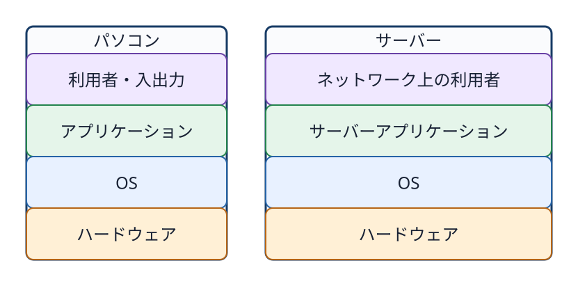
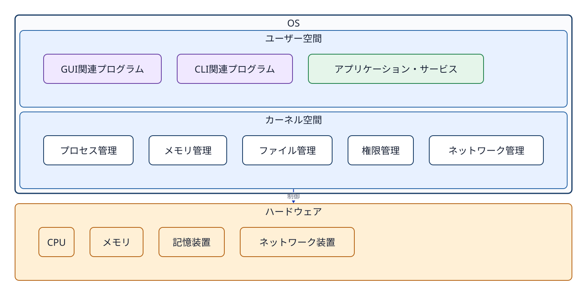
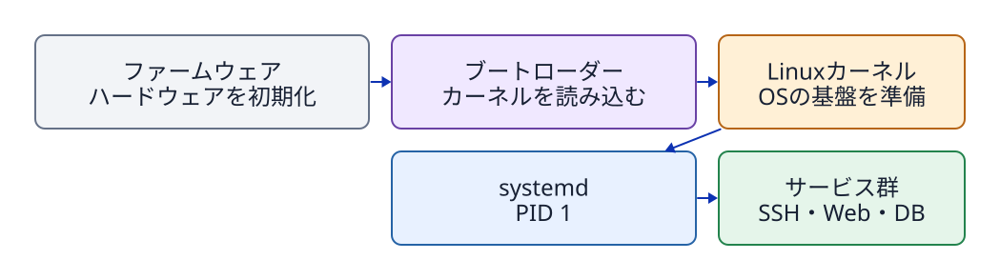
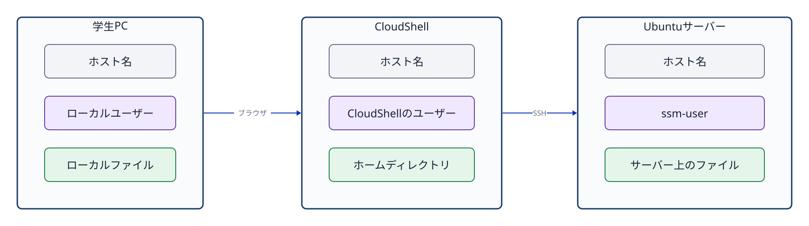

# 第1章 コンピューターとオペレーティングシステム

## この章で答えられるようになる問い

- コンピューターは、どのような部品と入出力装置から構成されるか。
- パソコンとサーバーは、何が同じで何が異なるか。
- OSは、利用者、アプリケーション、ハードウェアの間で何をしているか。
- ユーザー空間とカーネル空間は、どのように分かれているか。
- Linuxシステムは、どのような順序で起動し、サービスを動かすか。
- ユーザー、ホスト、プロセスは、どのように識別されるか。

## 1.1 コンピューターを構成するもの

コンピューターは、入力された情報をプログラムに従って処理し、結果を出力または保存する機械である。ノートパソコン、デスクトップパソコン、スマートフォン、クラウド上の仮想サーバーは外見や用途が異なるが、基本的な構成は共通している。

- **CPU**: プログラムの命令を読み取り、計算や判断を実行する。
- **メモリ**: 実行中のプログラムと、そのプログラムがすぐに使うデータを一時的に置く。
- **ストレージ（保存領域）**: 電源を切った後も残すプログラム、設定、文書、データ、ログを保存する。SSDや仮想ディスクなどが該当する。
- **入力装置**: 利用者の操作や外部の情報を受け取る。キーボード、マウス、タッチパネルなどがある。
- **出力装置**: 処理結果を利用者へ伝える。ディスプレイ、スピーカー、プリンターなどがある。
- **ネットワーク装置**: ほかのコンピューターとデータを送受信する。

利用者がキーボードを押しただけでは、CPUやストレージが自動的に目的を理解するわけではない。入力をアプリケーションへ渡し、アプリケーションが必要とするCPU時間やメモリを割り当て、保存されたファイルを読み書きし、結果を画面やネットワークへ返す共通の仕組みが必要である。その中心を担うのが**オペレーティングシステム（OS）**である。

## 1.2 パソコンとサーバーは同じ種類のコンピューターである

**パソコン（PC）**は、通常は目の前の利用者がキーボード、マウス、ディスプレイを使って操作する。一方、**サーバー**は、ネットワークを通じてほかのコンピューターへ機能やデータを提供する役割を持つ。Webページを返すWebサーバー、データを保存・検索するデータベースサーバー、名前解決を行うDNSサーバーなどがある。

サーバーはパソコンとは別原理の機械ではない。どちらにもCPU、メモリ、ストレージ、ネットワーク、OS、アプリケーションがある。違いは主に用途、性能、接続方法、連続稼働の要件である。サーバーには常設のキーボードやディスプレイがないことも多く、管理者は別のコンピューターからネットワーク経由で操作する。AWS EC2のインスタンスも、AWSの設備内に作られた仮想的なコンピューターであり、本授業ではサーバーとして使用する。



**図1-1　パソコンとサーバーは、用途や操作方法が異なっても、アプリケーション、OS、ハードウェアという基本構成を共有する。**

## 1.3 OSは何を管理するのか

複数のアプリケーションが同時に動くとき、それぞれがCPUやメモリを自由に独占したり、ほかの利用者のファイルを勝手に読んだりしては困る。OSは、ハードウェアとアプリケーションの間に入り、資源の利用を調整し、共通の利用方法と保護機能を提供する。

本書では、OSの主な働きを次の四つに整理する。

1. **実行の管理**: プログラムをプロセスとして動かし、CPUを使う順序や実行状態を管理する。
2. **メモリとファイルの管理**: メモリをプロセスへ割り当て、ストレージをファイルとディレクトリとして利用できる形にする。
3. **利用者と保護の管理**: ユーザー、グループ、アクセス権（パーミッション）を使い、誰が何を読めるか、変更できるか、実行できるかを判断する。
4. **通信の管理**: プロセスがネットワークを利用するためのソケットなどの共通機能を提供する。

OSが共通機能を提供するため、アプリケーションの開発者は、機種ごとにCPUやディスクを直接制御する処理をすべて書き直す必要がない。

## 1.4 GUI、CLI、コマンド

人がコンピューターへ操作を伝える方法を**ユーザーインターフェース**という。代表的なものがGUIとCLIである。

- **GUI（Graphical User Interface）**: ウィンドウ、アイコン、メニュー、ボタンなどを画面に表示し、主にマウスやタッチ操作で指示する。
- **CLI（Command Line Interface）**: 文字で命令を入力し、文字で結果を受け取る。

CLIで入力する個々の命令を**コマンド**という。コマンド名に、必要に応じてオプションや処理対象を続ける。たとえば、`cat`はファイルの内容を順に読み取り、標準出力へ表示するコマンドである。

```bash
cat /etc/os-release
```

この例では、`cat`がコマンド名、`/etc/os-release`が読み取るファイルのパスである。入力された文字列はシェルによって解釈され、`cat`プログラムが起動される。`cat`はOSへファイルの読み取りを依頼し、OSはアクセス権を確認してから内容を渡す。コマンド、ターミナル、シェルの違いと基本操作は第3章で詳しく扱う。

## 1.5 ユーザー空間とカーネル空間

Linuxを使用しているシステムは、概念上、**ユーザー空間（user space）**と**カーネル空間（kernel space）**に分けて考えられる。

**カーネル**はOSの中核であり、CPU、メモリ、デバイス、ファイルシステム、プロセス、アクセス権、ネットワークを管理する。カーネルは強い権限を持つため、通常のアプリケーションから分離されたカーネル空間で動く。

GUIを構成するプログラム、ターミナル、シェル、コマンド、Webサーバー、データベースなどは、通常はユーザー空間で動く。GUIとCLIは「別の空間」ではなく、どちらもユーザー空間に存在する操作方法と関連プログラムである。アプリケーションもユーザー空間で動き、必要な処理をカーネルへ依頼する。

この境界を通ってカーネルの機能を呼び出す仕組みを**システムコール（system call）**という。本書ではシステムコールの番号やプログラミング方法までは扱わない。「ユーザー空間のプログラムが、保護されたカーネル機能を利用するための窓口」と理解すればよい。



**図1-2　広い意味でのOS環境は、ユーザー空間で動く各種プログラムと、ハードウェアを管理するカーネル空間から構成される。**

厳密には、「OS」という語をカーネルだけに近い意味で使う場合と、基本コマンドや管理プログラムを含むシステム全体の意味で使う場合がある。本書では、両者を区別する必要がある箇所では「カーネル」と「ユーザー空間のプログラム」という名称を使う。

## 1.6 LinuxとUbuntu

**Linux**は本来カーネルの名称である。一方、実際に利用できるシステムを作るには、カーネルに加えて、基本コマンド、シェル、ライブラリ、パッケージ管理、サービス管理などが必要になる。これらを組み合わせて導入・更新できる形にまとめたものを**Linuxディストリビューション**という。

Ubuntu、Debian、FedoraなどはLinuxディストリビューションの例である。本授業では実習環境を統一するためにUbuntu Server 24.04 LTSを使用するが、学習の中心はUbuntuという製品名ではなく、Linuxシステムに共通する基本概念と操作である。ディストリビューションの歴史と違いは第2章で扱う。

## 1.7 電源投入からサービスが動くまで

ストレージに保存されているプログラムは、置かれているだけでは処理を行わない。プログラムがメモリへ読み込まれ、CPUによって実行されている状態の存在を**プロセス**という。OSは各プロセスを区別するために、**PID（プロセスID）**という番号を割り当てる。

Linuxシステムの起動は、概略として次の順序で進む。

1. 電源投入後、ファームウェアがCPU、メモリ、ストレージなどを初期化する。
2. ブートローダーがLinuxカーネルをメモリへ読み込む。
3. カーネルがメモリ、デバイス、ファイルシステムなどを利用できる状態にする。
4. カーネルが、ユーザー空間で最初に動く管理プロセスを起動する。
5. Ubuntu Server 24.04では、その管理プロセスとして`systemd`が動き、PID 1を持つ。
6. `systemd`が設定と依存関係を読み、ネットワーク、SSH、ログ管理、Webサーバー、データベースなどに必要なサービスを起動・監視する。

**サービス**とは、利用者が画面から毎回起動しなくても、バックグラウンドで継続的な機能を提供するよう管理されるプログラムである。サービスを起動すると、実際の処理を行う一つ以上のプロセスが動く。たとえばデータベースサーバーでは、データベースのサービスが管理対象となり、その実体であるプロセスがメモリ上で動き、必要に応じてファイルを読み書きし、ネットワークからの要求を待ち受ける。

`systemd`はデータベースやWeb処理そのものを実行するプログラムではない。どのサービスを、いつ、どの順番で、どのユーザーとして起動するかを管理する。PID、プロセスの親子関係、シグナルは第8章、`systemd`、サービス、ユニットは第10章で詳しく扱う。



**図1-3　カーネルが最初のユーザー空間プロセスを起動し、systemdが必要なサービスプロセスを順序付けて起動する。**

## 1.8 ホストとユーザーの識別

ネットワークへ接続され、独立したOS環境として動作するコンピューターまたは仮想マシンを、**ホスト（host）**と呼ぶ。ホストには、それを識別するための**ホスト名（hostname）**が設定される。ホスト名はコンピューター側の名前であり、利用者の名前ではない。

一つのホストには複数のユーザーアカウントを登録できる。OSは、操作を行っているユーザーと所属グループを数値のIDで管理する。ユーザーを識別する番号を**UID（user ID）**、グループを識別する番号を**GID（group ID）**という。`id`コマンドは、現在のユーザー名、UID、主グループ、補助グループを確認するために使う。

本演習では、学生PC、AWS CloudShell、Ubuntu EC2という複数のホストを使用する。画面上では同じような文字入力欄に見えても、それぞれが別のOS、ユーザー、プロセス、ファイルを持つ。現在のユーザー名、ホスト名、作業ディレクトリを確認することで、どのホストのどの場所を操作しているかを判断できる。

```bash
id
hostname
pwd
```

`id`はユーザーとグループの識別情報、`hostname`はホスト名、`pwd`は現在の作業ディレクトリを表示する。ユーザー管理は第6章、ファイルとパスは第4章、CloudShellとUbuntuの接続関係は第12章で詳しく扱う。



**図1-4　各ホストは独立したOS環境を持ち、その中でユーザー、プロセス、ファイルが個別に管理される。**

## 章末確認と答え

### 問1　パソコンとサーバーは、何が同じで何が異なるか。

**答え:** どちらもCPU、メモリ、ストレージ、ネットワーク、OS、アプリケーションを持つコンピューターである。パソコンは目の前の利用者による対話操作を主な用途とし、サーバーはネットワークを通じてほかのコンピューターへ機能やデータを提供することを主な役割とする。

### 問2　GUI、CLI、ユーザー空間、カーネル空間はどのような関係にあるか。

**答え:** GUIとCLIは利用者が操作を伝える方法であり、それを実現するプログラムは通常ユーザー空間で動く。ユーザー空間のプログラムは、システムコールを通じてカーネル空間の機能を利用する。カーネルはハードウェアとOS資源を管理する。

### 問3　プログラム、プロセス、サービスの違いは何か。

**答え:** プログラムはストレージに保存された命令群である。プロセスは、そのプログラムがメモリへ読み込まれて実行されている存在である。サービスは、継続的な機能を提供するようsystemdなどによって管理される単位であり、その実体として一つ以上のプロセスが動く。

### 問4　PID 1のsystemdは何をするか。

**答え:** Ubuntu Server 24.04では、カーネルが最初に起動するユーザー空間の管理プロセスがsystemdであり、PID 1を持つ。systemdは設定と依存関係に従って各種サービスを起動、停止、監視する。

### 問5　ホスト名とユーザー名は何が違うか。

**答え:** ホスト名はOSが動いているコンピューターまたは仮想マシンを識別する名前である。ユーザー名は、そのホスト上で操作権限を持つアカウントを識別する名前である。一つのホストに複数のユーザーを登録できる。

## 参考資料

- Linux Kernel Organization, [The Linux Kernel documentation](https://docs.kernel.org/)（2026-09-21確認）
- Linux man-pages, [intro(2) - introduction to system calls](https://man7.org/linux/man-pages/man2/intro.2.html)（2026-09-21確認）
- Ubuntu Manpages, [boot(7) - system bootup process](https://manpages.ubuntu.com/manpages/jammy/man7/boot.7.html)（2026-09-21確認）
- Ubuntu Server documentation, [Ubuntu Server documentation](https://ubuntu.com/server/docs/)（2026-09-21確認）
