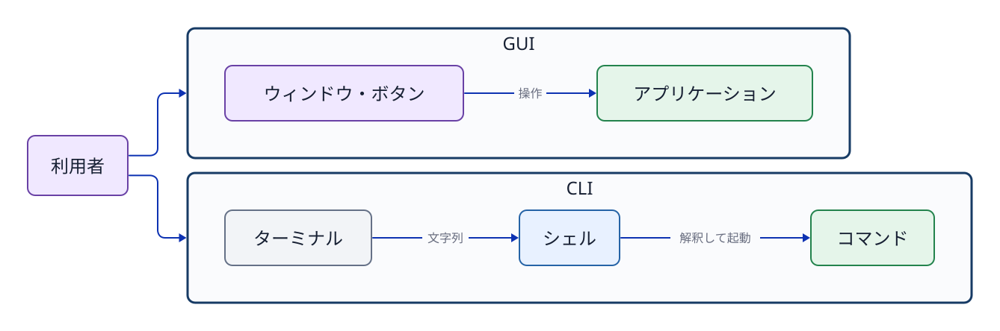

# 第3章 GUI・CLI・ターミナル・シェル

## 3.1 操作画面と処理主体を分ける

GUI（グラフィカルユーザーインターフェース）は、ウィンドウ、アイコン、メニュー、ポインタなどを使って視覚的に操作する方法である。CLI（コマンドラインインターフェース）は、文字列（テキスト）でコマンドを入力し、文字列の結果を受け取る操作方法である。どちらも人間がコンピューターへ指示を出すための入口であり、GUIが内部で必ずCLIへ変換されなければ動かない、という従属関係ではない。

**ターミナル（terminal）**は、文字を入力し結果を表示する画面・接続環境である。**シェル（shell）**は、その入力された文字列を読み取り、コマンドを解釈して実行するプログラムである。本演習環境で主に使用するシェルは Bash である。

```text
人間（操作者） → ターミナル → Bash（シェル） → コマンドのプロセス → カーネルの機能
```

ターミナルとシェルは同じものではない。ターミナルは文字をやり取りする場所であり、シェルは入力された文字列の意味を判断して処理するプログラムである。



**図3-1　GUIとCLIは並列の操作入口。CLIではターミナルとシェルを明確に区別する。**

## 3.2 プロンプトは入力位置を示す

シェルがユーザーからの入力を待っているときに表示する文字列を**プロンプト（prompt）**という。プロンプトにはユーザー名、ホスト名、現在位置（カレントディレクトリ）などが表示されることが多いが、設定によって表示内容は異なる。

教材中の次のような`$`はプロンプトの表示例であり、ユーザー自身が入力する文字ではない。

```text
$ pwd
/home/ssm-user
```

入力するコマンドは`pwd`であり、その次の行は出力例である。本書のコマンド例では、入力する部分と出力を区別するために`$`を表示する場合がある。

## 3.3 コマンド、引数、オプション

基本形は次のように読む。

```text
コマンド   オプション   引数
ls        -l          /srv
```

`ls`は実行するコマンド、`-l`は詳細表示を指定するオプション、`/srv`は対象を指定する引数（argument）である。短いオプションを組み合わせて`ls -la`のように指定できるコマンドも多いが、すべてのコマンドで同じアルファベットが同じ意味を持つとは限らない。たとえば`grep -n`は行番号の表示を意味するが、`tail -n 5`は表示する行数を指定する。

コマンドラインでは空白が要素の区切りとして扱われる。そのため、空白を含む一つの文字列をひとまとまりの引数として渡すには、クォート（引用符）で囲む必要がある。

```bash
printf '%s\n' 'JDU SSH transfer test'
```

クォート、変数展開、リダイレクトについては第5章で詳しく解説する。

## 3.4 シェル組み込みコマンドと外部コマンド

シェルへ入力できるコマンドには、大きく分けて**シェル組み込みコマンド**と**外部コマンド**がある。

シェル組み込みコマンド（shell builtin）は、Bash自身に用意されている機能である。別の実行ファイルを探して起動する必要がない。たとえば`cd`は、現在動作しているBash自身の作業ディレクトリを変更するための組み込みコマンドである。

外部コマンドは、ストレージ上に保存されたプログラムをシェルが探して起動するものである。`ls`、`mkdir`、`grep`などは、Ubuntuで最初から利用できることが多いが、Bashの組み込み機能ではなく外部プログラムである。つまり、**最初から使えること**と**シェルに組み込まれていること**は別の分類である。

外部コマンドの中には、OSの導入時から用意されているものと、必要になったときに追加導入するものがある。たとえば`python3`はPythonプログラムを実行する外部コマンドであり、環境にPythonが導入されている場合だけ利用できる。Ubuntuの構成によっては最初から存在するが、存在しない場合はパッケージとして導入する。パッケージの導入方法は第9章で扱う。

```bash
type cd
type mkdir
type python3
```

`type`は、入力した名前をBashがどのように解釈するかを表示する。組み込みコマンドならその事実が表示され、外部コマンドなら実行ファイルの場所が表示される。見つからない場合は、その名前のコマンドを現在の環境では利用できない。

`type`の結果に**エイリアス（alias）**と表示されることもある。エイリアスとは、長いコマンドやよく使う指定に、短い別名を付けるシェルの機能である。たとえば環境によっては`ll`という名前に`ls -alF`などが登録されている。エイリアスの有無や内容は環境ごとに異なる。

外部コマンドが入力されると、シェルは`PATH`という設定に登録されたディレクトリを順に調べ、同じ名前の実行ファイルを探す。実際の保存場所を最初から暗記する必要はない。まず`type`で、組み込みコマンド、外部コマンド、エイリアスのどれとして認識されているかを確認する。

## 3.5 シェルがコマンドを実行する流れ

シェルは入力された文字列をそのままカーネルへ渡しているわけではない。内部では大まかに次の処理を順番に行っている。

1. 文字列をコマンド名、オプション、引数に分割・解釈する。
2. クォート、環境変数、コマンド置換`$(...)`、ワイルドカードなどを規則に従って展開する。
3. 組み込みコマンドであればシェル内部で処理し、外部コマンドであれば実行ファイルを探索する。
4. リダイレクトやパイプなど、必要な入出力ストリームの接続を準備する。
5. プロセスを開始し、フォアグラウンドで終了を待つか、バックグラウンドで継続動作させる。
6. プロセスの終了ステータスを受け取る。

この流れを知っていると、問題が起きた場所を切り分けやすくなる。コマンドが見つからない場合は、名前の解釈や外部プログラムの探索を確認する。期待した対象が処理されない場合は、オプションや引数の解釈を確認する。入出力やプロセスについては、第5章と第8章で詳しく扱う。

## 3.6 困ったときによく使う操作と調査コマンド

CLIで現在位置やコマンドの意味が分からなくなった場合は、推測で操作を続けず、次の操作で状況を確認する。

| 操作・コマンド | 確認できること |
|---|---|
| `Ctrl+C` | 現在実行中の処理へ停止を求め、プロンプトへ戻る。 |
| `pwd` | 現在作業しているディレクトリを表示する。 |
| `cd ディレクトリ` | 作業するディレクトリを移動する。 |
| `ls` | 現在のディレクトリにあるファイルやディレクトリを表示する。 |
| `grep '文字列' ファイル` | ファイルから指定した文字列を含む行を探す。 |
| `type コマンド名` | その名前が組み込み、外部コマンド、エイリアスのどれとして認識されるか調べる。 |
| `help コマンド名` | Bashの組み込みコマンドの説明を表示する。 |
| `exit` | 現在のシェルを終了し、そのシェルを開始する前の状態へ戻る。 |

`pwd`、`cd`、`ls`は「どこで何を操作しているか」を確認する基本である。`grep`は長い文章やログから必要な行を探すときに使う。`type`と`help`は、コマンド自体の種類や使い方を調べるために使う。なお、`grep`や`ls`は調査に便利な外部コマンドであり、すべてがシェル組み込みコマンドという意味ではない。

## 3.7 マニュアルとヘルプを活用する

外部コマンドのマニュアルは`man`コマンド、Bashの組み込みコマンドは`help`コマンドが確認の入口となる。

```bash
man ls
help cd
grep --help
```

マニュアルでは`NAME`でコマンドの概要・目的、`SYNOPSIS`で構文形式、`DESCRIPTION`で詳細な動作仕様、`OPTIONS`で各オプションの意味を確認する。書式内の角括弧`[ ]`は、多くの場合「省略可能」であることを示す表記規則であり、その括弧記号自体を入力するわけではない。なお、`man`の閲覧画面は`q`キーで終了できる。

## 3.8 終了ステータスで成否を判断する

コマンドは画面へのテキスト出力とは別に、処理結果を表す小さな整数値を**終了ステータス（終了コード、exit status）**としてシェルへ返す。Unix系システムの共通規約として、`0`は「成功・正常終了」、`0`以外は何らかの「失敗・不成功・エラー」を意味する。

```bash
test -e /etc/os-release
echo $?
```

`$?`は直前に実行されたコマンドの終了ステータスを保持する特殊な変数である。別のコマンドを実行すると即座に上書きされてしまうため、確認したいコマンドの直後に参照する必要がある。また、`0`以外の値がすべて同じ原因を指すとは限らない。たとえば`grep`は「パターンに一致する行がなかった場合（1）」と「ファイルが存在しないなどの実行エラー（2）」で異なる値を返す。画面に表示されたメッセージだけでなく、システムが何を成功・失敗の判定基準としているかを確認することが重要である。

## 章末確認と答え

### 問1　ターミナルとシェルの違いを、それぞれの役割に着目して説明せよ。

**答え:** ターミナルは文字を入力し結果を表示する場所・接続環境である。シェルは入力された文字列を解釈し、組み込み機能を処理したり外部プログラムを起動したりするプログラムである。

### 問2　`cd`がシェルの組み込みコマンドでなければならない理由を説明せよ。

**答え:** `cd`は、現在動作しているシェル自身の作業ディレクトリを変更する必要があるためである。別の外部プロセスだけが移動しても、元のシェルの現在位置は変わらない。

### 問3　「最初から使えるコマンド」と「シェル組み込みコマンド」が同じ意味ではない理由を説明せよ。

**答え:** 最初から使える外部プログラムも存在するためである。たとえば`mkdir`はUbuntuで最初から使えることが多いが、Bashの組み込みではなく外部コマンドである。一方、`cd`はBashの組み込みコマンドである。

### 問4　コマンドの種類を調べる方法を答えよ。

**答え:** `type コマンド名`を使用する。組み込みコマンド、外部コマンド、エイリアスのどれとして認識されているかを確認できる。

## 参考資料

- Ubuntu Server documentation, [Welcome to the terminal](https://ubuntu.com/server/docs/tutorial/basic-installation/)（2026-09-18参照。現行ページ構成は制作時に再確認）
- GNU Project, [Bash Reference Manual](https://www.gnu.org/software/bash/manual/bash.html)（2026-09-18は本文取得timeout。執筆内容はUbuntu 24.04実機の`help`と`man bash`でも確認する）
