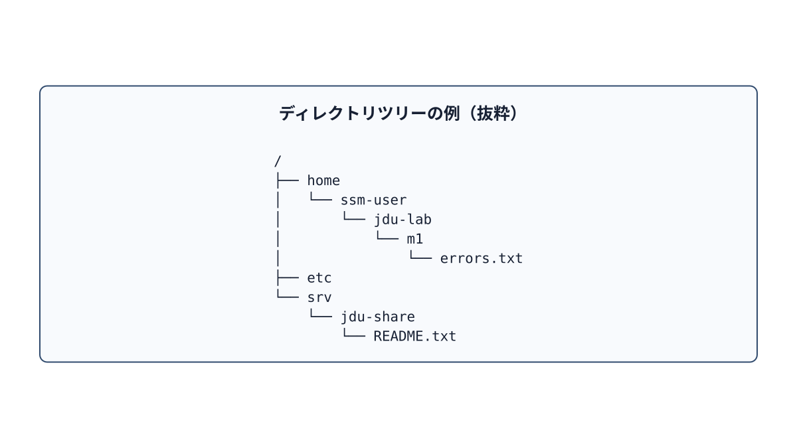
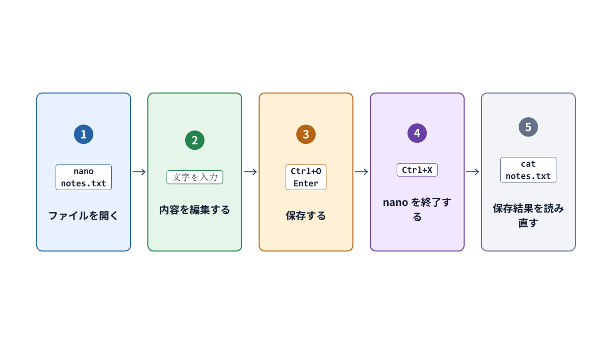

# 第4章 ファイル、ディレクトリ、パス、編集

## 4.1 ファイルには内容とメタデータがある

ファイルにはデータ本文だけでなく、名前、種別、所有者（owner）、グループ（group）、アクセス権（パーミッション）、サイズ、最終更新時刻などの**メタデータ（metadata）**が存在する。`cat` で表示される内容が完全に同一の2つのファイルであっても、所有者やアクセス権が異なればOS上では別の状態として扱われる。

```bash
ls -l /srv/jdu-share/README.txt
stat /srv/jdu-share/README.txt
```

`ls -l` はディレクトリ内の主要情報を一覧形式で表示する。`stat` は指定した単一対象のメタデータを詳細に表示する。

## 4.2 ディレクトリは名前と対象を結び付ける

ディレクトリを「ファイルを箱の中に物理的に詰め込む入れ物」という比喩だけで理解すると、実態とずれて不正確になる。ディレクトリの本質は、ファイル名や別のディレクトリ名を実体と対応付け、階層構造を構築する特殊なファイルである。`/srv/jdu-share/README.txt` というパスは、最上位のルートディレクトリ `/` から出発し、`srv`、`jdu-share`、`README.txt` という名前を順番にたどる位置指定である。



**図4-1　`tree`コマンドの表示に近い階層図。枝を順にたどるとファイルの位置が分かる。**

Linuxでは、システム全体がルート `/` を頂点とする単一の**ディレクトリツリー（階層構造）**として構成される。物理的に異なるディスクや仮想ファイルシステムも、特定のディレクトリへ結合してシステム全体の一部として見せることができる。この接続操作を**マウント（mount）**という。本章では概念の理解にとどめ、ディスクのフォーマットやマウントの具体的な操作は後続のストレージ単元で扱う。

**ルートディレクトリ**は、ディレクトリツリー全体の出発点 `/` である。**ホームディレクトリ**は、各ユーザーが自分のファイルを置く場所である。たとえば `ssm-user` のホームディレクトリは `/home/ssm-user` であり、`/` の下にある `home`、その下にある `ssm-user` と順にたどって到達する。`/home` は複数ユーザーのホームディレクトリを置く親ディレクトリで、`ssm-user` 本人のホームディレクトリではない。`/` と `/home/ssm-user` は役割も位置も異なる。名前が似ている `/root` も、ルートディレクトリ `/` とは別の場所である。

## 4.3 絶対パスと相対パス

先頭がスラッシュ `/` で始まるパスは**絶対パス（absolute path）**である。現在どのディレクトリにいても、常に同じ場所を一意に指し示す。

```text
/srv/jdu-share/README.txt
```

先頭がスラッシュ `/` で始まらないパスは**相対パス（relative path）**であり、現在のカレントディレクトリ（作業ディレクトリ）を基準として位置を指定する。

```bash
cd /srv/jdu-share
cat README.txt
```

`pwd` は現在のカレントディレクトリを表示する。`.` は「現在のディレクトリ」、`..` は「1つ上の親ディレクトリ」、`~`（チルダ）は「現在のユーザーのホームディレクトリ」へシェルによって自動展開される。

```bash
cd ~/jdu-lab/m1
pwd
cd ..
pwd
```

`~` は現在のユーザーのホームディレクトリを表し、ルートディレクトリ `/` を表す記号ではない。`~` を含むパスが指す場所は、操作中のユーザーやホストによって変わる。たとえば `ssm-user` の `~` が `/home/ssm-user` であっても、`su - jduops` でユーザーを切り替えると、`~` は `jduops` のホームディレクトリ（`/home/jduops` など）を指す。別のホストに接続した場合も、そのホスト上で操作しているユーザーのホームディレクトリを指す。現在の場所は `pwd`、現在のホームディレクトリは `printf '%s\n' "$HOME"` で確認できる。`HOME` はホームディレクトリの場所を保持する環境変数であり、変数の仕組みは第5章で説明する。

## 4.4 Ubuntuでよく見るディレクトリ

| パス | 本教材での役割 |
| --- | --- |
| `/home` | 通常ユーザーのホームディレクトリが配置される |
| `/etc` | システム全体や各種サービスの設定・識別情報ファイル群。`/etc/os-release` もここに配置される |
| `/usr/bin` | 多くの一般的なコマンドの実行ファイルが格納される |
| `/var/log` | システムやサービスのログファイルが配置される。すべてのログがここにあるとは限らない |
| `/srv` | システムやサービスが提供するデータを配置する領域。本演習では共有フォルダやWebコンテンツに使用する |
| `/tmp` | 一時ファイル用のディレクトリ。誰でも読み書きできるが、恒久的な保存先ではない |
| `/proc` | カーネルがプロセスやシステムの状態をファイルの形式で見せる仮想ファイルシステム |

この配置表は「絶対にこのディレクトリにしか置いてはならない」という固定規則ではない。ディストリビューションの方針やアプリケーションの設計によって細部は異なる場合がある。

## 4.5 作成、コピー、移動、削除

```bash
mkdir -p ~/jdu-lab/p1/practice01/config
cp inbox/config/training.conf practice01/config/training.conf
mv old-name.txt new-name.txt
rm unwanted.tmp
```

- `mkdir -p` は、指定したパスの途中に存在する親ディレクトリも含めて一括作成し、対象ディレクトリがすでに存在していてもエラーにしない。
- `cp SOURCE DESTINATION` はファイルやディレクトリを複製する。コピー元（SOURCE）とコピー先（DESTINATION）の指定順序を取り違えないよう注意する。
- `mv` はファイルの移動や名前の変更（リネーム）に使用する。
- `rm` はファイルを削除する。通常のGUIのような「ごみ箱」を経由せず即座に削除されるため、実行前に対象パスを `pwd` や `ls` で確認する習慣をつける。

初学者の演習では、指定ディレクトリ以下を警告なしで一括削除できる危険な `rm -rf` は使用しない。たとえば不要な `.tmp` ファイルを削除する場合も、まずは `find` コマンドで一覧を確認する。

```bash
find ~/jdu-lab/p1/practice01 -type f -name '*.tmp' -print
```

シングルクォートで囲まれた `'*.tmp'` は、シェルによるワイルドカードの事前展開を防ぎ、検索パターン文字列をそのまま `find` コマンドへ渡すための指定である。対象ファイルを目視で確認した上で、1件ずつ削除するか、演習で指示された安全な範囲だけを慎重に処理する。

## 4.6 そのほかの確認コマンド

```bash
ls -la
ls -ld /srv/jdu-share
tree ~/jdu-lab/m1/case01
stat -c '%U:%G %a %n' /srv/jdu-share/README.txt
```

- `ls -la` は、ドット `.` で始まる隠しファイルを含め、カレントディレクトリ内の全項目を詳細一覧で表示する。
- `ls -ld DIR` は、ディレクトリ内のファイル一覧ではなく、指定したディレクトリ自身のメタデータ（属性）を表示する。
- `tree` はディレクトリの階層構造を視覚的なツリー形式で表示する。本演習環境では初期セットアップ時にあらかじめ導入されている。
- `stat -c` は必要な項目だけを指定したフォーマットで抽出表示できる。`%U` は所有者ユーザー名、`%G` は所有グループ名、`%a` は8進数表現のアクセス権モード、`%n` はファイル名・パスである。

単一のコマンドですべてを把握しようとするのではなく、「階層構造を見たいのか（`tree`）」「中身の一覧を見たいのか（`ls`）」「属性・メタデータを詳しく見たいのか（`stat`）」という自身の目的に合わせて適切なコマンドを選択する。

## 4.7 nanoで編集する

`nano FILE` は、ターミナル画面内でテキストファイルを編集するための簡易エディタである。本書の演習では、編集作業を行う前に対象ディレクトリへ移動し、`pwd` と `ls` で現在地と対象ファイルを確実に確認してから起動する。

```bash
cd ~/jdu-lab/m0
pwd
nano observation.env
```



**図4-2　nanoの基本操作の流れ。画面下に表示される ^ 記号は Ctrlキー を表す。**

1. カーソルキー（矢印キー）で編集位置を移動し、通常のキーボード入力でテキストを編集する。
2. `Ctrl+O` を押してファイルの書き込み（保存準備）を開始する。
3. 画面最下行にファイル名が表示されたら、意図したパスであることを確認して `Enter` キーを押して保存を確定する。
4. `Ctrl+X` を押して nano エディタを終了する。
5. `cat observation.env` などで編集結果を再度読み出し、正しく保存されたことを確認する。

未保存の変更が残っている状態で終了しようとすると、変更を保存するかどうかの確認メッセージが表示される。英語表記の画面では、`Y`（Yes）が保存、`N`（No）が破棄、`Ctrl+C` が取り消し（キャンセル）を意味する。画面に表示された英語のメッセージを読まずにキーを乱打してはならない。

## 4.8 親ディレクトリのアクセス権も関係する

ファイルを読むとき、OSはパスを先頭から順にたどる。その途中にある**各ディレクトリ**で、操作中のユーザーに通り抜ける権限があるかを確かめる。どこか一つでも通過できないディレクトリがあれば、対象ファイル自身に読み取り権限 `r` があっても、そのファイルを読むことはできない。`namei -l` コマンドは、指定したパスを構成する親ディレクトリと対象ファイルを一段ずつ表示し、それぞれの所有者とアクセス権を確認できる。

```bash
namei -l /srv/jdu-web/index.txt
```

ディレクトリに対する実行権限 `x` は、プログラムファイルの「実行」とは異なり、「そのディレクトリを経由して配下の名前にアクセスする（通り抜ける）」権限を意味する。この仕組みの詳細は第7章で詳しく解説する。

## 章末確認と答え

### 問1　ルートディレクトリとホームディレクトリは何が違うか。

**答え:** ルートディレクトリ `/` はシステム全体のディレクトリツリーの出発点である。ホームディレクトリはユーザーごとの作業場所であり、たとえば `ssm-user` なら `/home/ssm-user` である。`~` は現在のユーザーのホームディレクトリを表す。

### 問2　`ls -l DIR` と `ls -ld DIR` では、何を表示するか。

**答え:** `ls -l DIR` は `DIR` の中にある項目を詳細に表示する。`ls -ld DIR` は `DIR` というディレクトリ自身の情報を表示する。

### 問3　同じ `~/jdu-lab/m6` が、ユーザーやホストによって別の場所を指すのはなぜか。

**答え:** `~` は現在操作しているユーザーのホームディレクトリへ展開されるためである。ユーザーやホストが変わるとホームディレクトリも変わり得る。

### 問4　ファイル自身に読み取り権限 `r` があるのに読めない場合、`namei -l` の何を確認するか。

**答え:** パスの先頭から対象ファイルまでの各親ディレクトリについて、操作中のユーザーが通り抜ける権限 `x` を持つかを確認する。途中の一つでも通過できなければ、ファイルに `r` があっても読めない。

## 参考資料

- Linux man-pages, [path_resolution(7)](https://man7.org/linux/man-pages/man7/path_resolution.7.html)（2026-09-18確認）
- Ubuntu 24.04実機の`man hier`、`man find`、`man stat`、nanoの画面（制作時に実機確認する）
