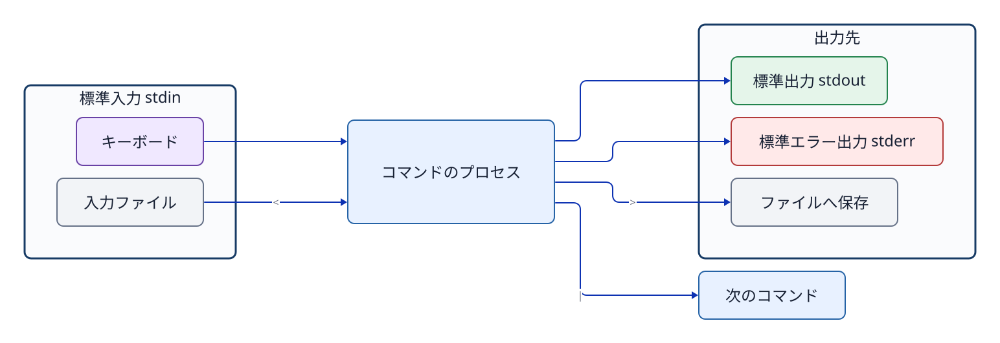

# 第5章 テキストと入出力を組み合わせる

## 5.1 なぜ設定とログはテキストなのか

UbuntuをはじめとするLinuxでは、設定やログの多くがプレーンテキスト（文字列データ）として保存される。専用のGUIツールがなくても内容の確認・比較・検索が容易であり、別のコマンドへ柔軟に処理を引き渡せるためである。ただし、すべての設定やログが単純なテキストファイルであるとは限らない。systemd journalのように、バイナリ形式で記録され専用のコマンドを通じて閲覧する仕組みもある。

## 5.2 標準入力・標準出力・標準エラー出力

各プロセスには、**標準入力（stdin: standard input）**、**標準出力（stdout: standard output）**、**標準エラー出力（stderr: standard error）**という3つの基本的なデータ入出力の窓口（ストリーム）が用意されている。

- **stdin（標準入力）**: 通常の入力データ。キーボード入力や前段のコマンドの出力からデータを受け取る（ファイルディスクリプタ 0）。
- **stdout（標準出力）**: 通常の処理結果。ターミナル画面への表示や、次のコマンド、ファイルへ渡す（ファイルディスクリプタ 1）。
- **stderr（標準エラー出力）**: エラーメッセージや警告。通常の処理結果（stdout）と明確に分離して扱われる（ファイルディスクリプタ 2）。



**図5-1　プログラムの三つの標準ストリーム。** `>` は通常stdoutをファイルへ接続し、`|` は左側のコマンドのstdoutを右側のコマンドのstdinへ接続する。

`cat incident.log`をそのまま実行すると、ファイルが入力元となり、ターミナル画面がstdoutの表示先となる。ファイルそのものがターミナルへ飛んでいくのではなく、`cat`プロセスがファイルの内容を読み出し、その文字列データをstdoutへ書き出しているのである。

## 5.3 `grep`で必要な行を選ぶ

```bash
grep 'ERROR' incident.log
```

`grep`は入力を1行ずつ走査し、指定したパターンに一致する行全体をstdoutへ出力する。

```bash
grep -F 'ERROR' incident.log
```

`-F`は検索パターンを正規表現ではなく固定文字列（プレーンテキスト）として扱うオプションである。`ERROR`のような単純な英単語であれば結果は同じになることが多いが、記号文字をエスケープなしでそのまま検索したい場合に有効である。

`grep -n`は一致した行番号も先頭に付加して表示する。元の行だけを別のファイルへ保存したい場合は、行番号を加える`-n`を付けない。

終了ステータスにも重要な意味がある。`grep`では一般に「パターンに一致する行があった場合」は`0`、「一致する行が1行もなかった場合」は`1`、「ファイルが存在しないなどの実行時エラー」は`2`となる。画面に何も出力されなかった際、単に対象文字列が存在しなかったのか、それともファイル名を間違えてエラーになっていたのかを区別するために終了ステータスを確認する。

## 5.4 `tail`で末尾を読む

```bash
tail -n 5 incident.log
```

`tail -n 5`は、ファイルの末尾5行を元の順序のままstdoutへ出力する。ここでの`-n`は出力行数を指定するオプションであり、`grep -n`の行番号付加とは全く意味が異なる。オプションのアルファベット1文字だけを丸暗記するのではなく、コマンドごとのマニュアルで仕様を確認することが重要である。

`tail -f`は、ファイルへ新たに追加された行を継続して表示する。表示を止めるには`Ctrl+C`を押す。

## 5.5 リダイレクトで結果をファイルへ保存する

```bash
grep 'ERROR' incident.log > errors.txt
tail -n 5 incident.log > recent.txt
```

`>`（リダイレクト）は、シェルがstdoutの出力先をファイルへと切り替える機能である。右辺に指定したファイルがすでに存在する場合、コマンドが実行される前にファイルサイズをゼロに切り詰めて（空にして）上書きする。そのため、入力ファイルと出力ファイルに同じファイルを指定すると、コマンドがデータを読み込む前にファイルの内容が消失してしまう危険がある。

```bash
# 危険な例。実行しない
grep 'ERROR' incident.log > incident.log
```

`>>`はファイルの末尾にデータを追記する。複数回実行すると同じ行が重複して増える。毎回同じ内容のファイルを作り直すなら、`>`で上書きする。

標準エラー出力（stderr）は、通常`>`だけでは同じファイルには書き込まれない。`2>`を使うと、stderrの出力先を別のファイルへ指定できる。

## 5.6 パイプはファイルを作らず次へ渡す

```bash
grep 'ERROR' incident.log | tail -n 5
```

`|`（パイプ）は、左側のコマンドのstdoutを右側のコマンドのstdinへ直接接続する。ディスク上へ中間ファイルを作成することなく、処理結果をパイプラインとして絞り込むことができる。ただし、左側のコマンドが出力したstderrは通常パイプラインには渡されない。

パイプライン全体の終了ステータスは、Bashの標準設定では「最後に実行されたコマンド」の終了ステータスとなる。そのため、左側のコマンドが失敗していても右側のコマンドが成功すればパイプ全体として成功と判定されてしまう場合がある。厳密な自動処理スクリプトでは`set -o pipefail`などの利用を検討する。

## 5.7 クォート、変数、コマンド置換

シェルはコマンドを実行する前に、入力された文字列の展開処理を行う。

```bash
name='incident.log'
printf '%s\n' "$name"
```

- **シングルクォート `'...'`**: 囲まれた内部の文字列をほぼ文字どおり（リテラル）に扱う。`$HOME`などの変数も展開されない。
- **ダブルクォート `"..."`**: 空白を含む文字列を単一の引数としてまとめつつ、`$HOME`などの変数や`$(...)`などのコマンド置換は展開する。
- **クォートなし**: 空白による意図しない引数分割やワイルドカード展開が発生するため、変数を使用する際は原則として`"$name"`のようにダブルクォートで囲む。

`$(command)`（コマンド置換）は、指定したコマンドを実行し、そのstdout出力をその位置へ文字列として展開・代入する。

```bash
current_user="$(id -un)"
printf 'USER=%s\n' "$current_user"
```

## 5.8 ローカルシェルとリモートシェルの展開

SSHではクォートの使い方が特に重要となる。

```bash
ssh jdu-ubuntu 'printf "%s\n" "$(hostname)" "$HOME"'
```

コマンド全体の外側をシングルクォートで囲むと、`$(hostname)`や`$HOME`は手元のシェルでは展開されず、接続先のシェルへ文字列として届く。接続先のシェルがそれらを展開する。もし外側をダブルクォートにすると、手元のシェルで先に展開され、手元の情報が接続先へ送られる。

## 5.9 `&&`は前が成功したときだけ続ける

```bash
cd /var/log && pwd
```

`&&`の右辺のコマンドは、左辺のコマンドの終了ステータスが`0`（成功）であったときのみ実行される。ディレクトリ移動に失敗したまま意図しない場所でファイルを編集・削除してしまう事故を防止できる。ただし、1行の中に何段階も詰め込むと、どの段階でエラーが発生したのか把握しづらくなる。

## 章末確認と答え

### 問1　`grep ERROR incident.log > errors.txt`で、`errors.txt`を開くのは`grep`かシェルか。

**答え:** シェルである。シェルが`errors.txt`を開いて`grep`の標準出力先へ接続してから、`grep`を実行する。

### 問2　`>`と`>>`の動作はどう違うか。取り違えると何が起こるか。

**答え:** `>`はファイルを上書きし、`>>`は末尾へ追記する。`>`を誤って使うと既存の内容が失われる。`>>`を誤って繰り返すと同じ内容が重複する。

### 問3　SSHで実行するコマンドの外側をシングルクォートで囲むのはなぜか。

**答え:** `$HOME`や`$(hostname)`を手元のシェルで展開させず、接続先のシェルに渡してから展開させるためである。

## 参考資料

- Ubuntu 24.04実機の`man grep`、`man tail`、`man bash`（制作時にversion確認）
- GNU Bash Reference Manual（2026-09-18はWeb本文取得timeout。実機manualを一次確認に使う）
