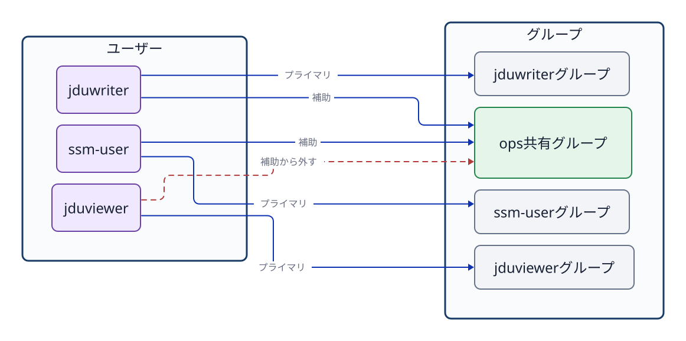

# 第6章 ユーザー、グループ、ログイン

## 6.1 ユーザーの種類と役割

Linuxには、人が操作するためのアカウントだけでなく、OSやサービスのプロセスを動かすためのアカウントもある。Linuxはユーザーを**UID（ユーザーID）**、グループを**GID（グループID）**という数値で内部的に識別する。まず、用途と権限の違いを整理する。

| 種類 | 主な役割 | 対話ログインとの関係 |
| --- | --- | --- |
| 管理者の`root` | システム全体を管理する特別なユーザー。UIDは`0` | アカウントは存在するが、Ubuntuでは通常、rootのパスワードによる直接ログインを無効にする。必要な管理操作は許可されたユーザーが`sudo`（管理者などの権限でコマンドを実行する仕組み）で行う |
| 一般ユーザー | 人が自分の作業を行う。`ssm-user`や`jduops`など | 設定と認証方法が許せば対話ログインできる。一般ユーザーであることと`sudo`を使えることは別である |
| サービス用ユーザー | Webサーバーなどのプロセスを、必要な範囲の権限で動かす。`jduweb`など | 対話ログインを必要としないことが多い。ログインシェルを`/usr/sbin/nologin`に設定するのが一般的だが、すべてのサービス用ユーザーに必須の性質ではない |

この表はLinuxが内部でユーザーを三種類に固定しているという意味ではない。用途を理解するための分類である。実際にできる操作は、そのアカウントの設定、所属グループ、各ファイルの権限、`sudo`やSSHの設定によって決まる。また、`root`のアカウントが存在することと、`root`として直接ログインできることも別である。

`ssm-user`のような名前は人間が扱いやすい識別名である。ファイルやディレクトリの所有者情報も、内部では数値のUID/GIDとして記録されている。

```bash
id
id jduops
getent passwd root
getent passwd jduops
getent passwd jduweb
getent group ops
```

`id`は、現在操作しているユーザーのUID、主グループ、補助グループを表示する。引数にユーザー名を指定すると、そのアカウントの登録情報を確認できる。`getent passwd USER`には、ユーザー名、UID、主グループのGID、ホームディレクトリ、ログインシェルなどが表示される。たとえば最後の項目が`/usr/sbin/nologin`なら、通常の対話シェルとしては使えない。`getent`はローカルファイルだけでなく、システムが設定したネームサービスからも情報を取得する。企業の環境では、LDAPやActive Directoryなどのアカウント情報が含まれる場合もある。

## 6.2 主グループと補助グループ

各ユーザーには、必ず1つの**主グループ（primary group）**が設定される。Ubuntuで新規ユーザーを作成すると、ユーザー名と同じ名前の専用グループを主グループとして自動作成する運用が一般的であるが、これは必須の絶対規則ではない。必要に応じて `usermod -g` コマンドなどで変更することも可能である。

1人のユーザーは、主グループに加えて複数の**補助グループ（supplementary group）**に所属できる。チームで共有するファイルやディレクトリへのアクセス権を付与する際は、ユーザーの主グループを不用意に変更するのではなく、用途ごとに作成した補助グループへユーザーを追加する運用が適切である。



**図6-1　ユーザーごとの主グループと、共有用途で利用する補助グループの関係。**

補助グループへの追加と、補助グループからの削除には、次のコマンドを使う。

```bash
sudo usermod -aG ops jduops
sudo gpasswd -d jduviewer ops
```

`usermod -aG` において、`-a`（append）は既存の所属グループを維持したまま追加することを意味する。もし `-a` を付けずに `-G` だけでグループ名を指定してしまうと、そこに記載しなかった既存の補助グループからすべて除外されてしまう危険がある。設定を変更した後は、必ず `id USER` で登録情報を再確認する。

`getent group ops` の出力末尾にあるメンバー一覧は、そのグループを補助グループとして所属しているメンバーを確認するのに役立つ。しかし、そのグループを主グループとして登録されているユーザーは、この一覧に名前が表示されない場合がある。グループの全所属者を確実に確認する際は、`id USER` などと組み合わせて多角的に照合する。

## 6.3 登録情報と現在のプロセスの資格情報

グループの所属登録を変更しても、すでに起動して動作しているシェルのプロセスの資格情報（保持しているグループ一覧）が自動的に更新されるわけではない。新しくログインし直すか、新しいセッションを開始して初めて、最新のグループ情報が反映される。

```bash
id jduops
sudo su - jduops
id
```

1行目の `id jduops` はシステムに登録されているアカウント情報を調べる。一方、`su -` で切り替えた後の `id` は、新たに起動したログインシェルが実際に保持している実行資格情報を表す。カーネルによるアクセス権の判定は、設定ファイルの静的な登録情報ではなく、操作を実行しているプロセス自身が保持するUID/GIDに基づいて行われる。

## 6.4 `su`と`sudo`は目的が違う

`su`（substitute user）は、別のユーザー権限で動作するシェルセッションを開始する。`su - USER` のハイフン `-` は、実際にそのユーザーがログインした際と同様の環境へ切り替える指定であり、ホームディレクトリや環境変数を対象ユーザーの標準状態に初期化する。

`sudo`は、設定で許可されたユーザーが、管理者（root）や別のユーザーの権限でコマンドを実行する仕組みである。一般ユーザーなら誰でも`sudo`を使えるわけではない。管理者権限を与える対象と操作の範囲は、必要最小限にする。

```bash
sudo su - jduops
id
pwd
exit
id -un
```

別のユーザーのシェルを開始すると、元のシェルの内側に新しいシェルが開く。`exit`は現在のシェルを終了して一つ前のシェルへ戻る。切り替え後は`id -un`でユーザー名、`pwd`で作業ディレクトリを確認できる。

1つのコマンドだけを別ユーザーの権限で試す場合は、対話シェルを開かずに実行する。

```bash
sudo -u jduweb -- test -r /srv/jdu-web/index.txt
echo $?
```

これは `jduweb` の実行資格情報で対象ファイルが読み取り可能かどうかを直接テストしている。管理者である root で読み取れたことをもって、一般のサービスユーザーでも読み取れる証拠と誤認してはならない。

## 6.5 サービス用ユーザーでプロセスの権限を分ける

サービス用ユーザーは、サービスのプロセスに与える権限を、人の作業用アカウントや他のサービスから分離するために使う。たとえばWebサーバーのプロセスを`jduweb`として動かせば、アクセス権の判定には`jduweb`のUIDとGIDが使われる。サービスが必要とするファイルだけを読めるように設定できる。

```bash
getent passwd jduweb
id jduweb
```

`/usr/sbin/nologin`は、通常の対話ログインに使うシェルの代わりに起動し、ログインを断って終了するプログラムである。この設定でも、アカウント自体は存在する。systemdはサービスの設定で指定したユーザーの権限でプロセスを起動できる。人がそのアカウントで対話ログインできないことと、サービスのプロセスがそのUIDでファイルを扱えることは別である。

## 6.6 アカウント、認証、認可を区別する

**アカウント（account）**は、システムに登録されたユーザーの情報である。ユーザー名とUID、主グループ、ホームディレクトリ、ログインシェルなどを結び付ける。「`ssm-user`というアカウントがある」とは、サーバーがその名前を識別できるという意味であり、接続してきた人が本当にその利用者かどうかまでは証明しない。

**認証（authentication）**は、接続してきた相手が、申告したアカウントを使用する正当な相手か確かめることである。パスワード認証なら秘密のパスワードを、SSHの公開鍵認証なら対応する秘密鍵を所持していることを確かめる。公開鍵認証では、接続先の対象ユーザーの`~/.ssh/authorized_keys`などに公開鍵を登録する。秘密鍵そのものをサーバーへ送って照合するわけではない。

**認可（authorization）**は、その主体が特定の操作をしてよいか判断することである。SSHでは、アカウントやサーバーの設定によって接続を許すかも判断する。接続後は、ファイルを読めるか、書けるか、コマンドを管理者権限で実行できるかを、それぞれの規則で判断する。ログインに成功しても、すべての操作が許されるわけではない。

SSHで`ssm-user`として接続する例を、三つの概念に分けてみる。

1. **アカウント:** 接続先に`ssm-user`の登録があり、UIDやホームディレクトリなどを取得できる。登録がなければ、そのユーザーとして通常のセッションを開始できない。
2. **認証:** 接続元は秘密鍵を使い、接続先は`ssm-user`に登録された公開鍵と対応することを確認する。鍵が合わなければ、アカウントが存在しても認証は失敗する。
3. **認可:** 接続を許すSSHの設定を通過した後も、開始されたプロセスは`ssm-user`のUIDと所属グループに応じて操作が制限される。たとえば別ユーザーだけが読めるファイルは読めない。`sudo`を使えるかも別の設定で判断される。

これは概念を理解するための整理であり、SSHプログラム内部の厳密な処理順を示すものではない。SSH鍵が正しくても、SSH側のアクセス制限やアカウントの設定によって対話シェルを使えない場合がある。また、サービス用ユーザーはSSHで認証してログインしなくても、systemdから指定されたUIDでプロセスを起動できる。**アカウントを持つこと、ログインを認められること、プロセスが何かを操作できることは、それぞれ別の判断である。**

## 章末確認と答え

### 問1　主グループと補助グループはどう違うか。共有ディレクトリの例で説明せよ。

**答え:** 主グループはユーザーに必ず一つ設定される基本のグループである。補助グループは追加で所属できるグループである。複数のユーザーが共有ディレクトリを利用するときは、共通の補助グループを作って対象ユーザーを追加できる。

### 問2　グループ登録を変更しても、開いたままのシェルに反映されないのはなぜか。何を開始し直すか。

**答え:** 動作中のシェルは、開始時に得たUIDとグループの資格情報を保持しているためである。新しくログインするか、新しいセッションを開始して、最新のグループ情報を持つシェルを起動する。

### 問3　`sudo -u jduweb -- test -r FILE`を、rootによる`cat FILE`で代用できないのはなぜか。

**答え:** rootが読めても、`jduweb`のプロセスに読み取り権限があるとは限らないためである。`sudo -u jduweb`は`jduweb`の権限で読み取り可否を判定する。

## 参考資料

- Ubuntu Server documentation, [User management](https://ubuntu.com/server/docs/how-to/security/user-management/)（2026-09-24確認。rootと一般・システム用ユーザー、アカウント管理）
- Ubuntu Server documentation, [OpenSSH server](https://ubuntu.com/server/docs/how-to/security/openssh-server/)（2026-09-24確認。公開鍵認証と`authorized_keys`）
- Ubuntu 24.04 man pages, [adduser(8)](https://manpages.ubuntu.com/manpages/noble/man8/adduser.8.html)、[systemd.exec(5)](https://manpages.ubuntu.com/manpages/noble/man5/systemd.exec.5.html)（2026-09-24確認。サービス用ユーザーとプロセスの実行ユーザー）
- Linux man-pages, [passwd(5)](https://man7.org/linux/man-pages/man5/passwd.5.html)、[credentials(7)](https://man7.org/linux/man-pages/man7/credentials.7.html)（2026-09-24確認。UID/GID、ログインシェル、プロセスの資格情報）
- Ubuntu 24.04実機の`man id`、`man getent`、`man usermod`、`man gpasswd`、`man su`、`man sudo`（制作時に確認）
