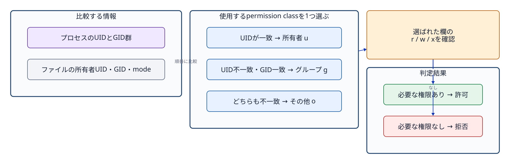
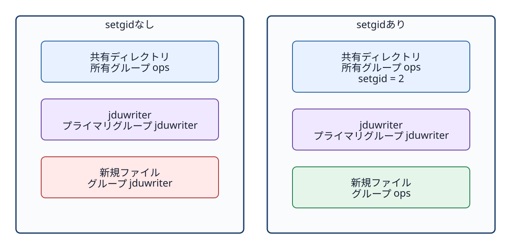

# 第7章 アクセス権と共有ディレクトリ

## 7.1 アクセス権は誰に何を許すかを表す

基本的なLinuxの**アクセス権（パーミッション）**は、所有ユーザー（u: owner user）、所有グループ（g: owner group）、その他（o: others）という3つの**クラス（区分）**に対して、読み取り（r: read）、書き込み（w: write）、実行（x: execute）の各権限を設定する。

```text
-rw-rw-r-- 1 root ops ... README.txt
drwxrwsr-x ... root ops ... /srv/jdu-share
```

先頭の1文字はファイル種別を示し、`-` は通常のファイル、`d` はディレクトリを表す。それに続く9文字を、所有者、グループ、その他の3文字ずつに分割して読み取る。

カーネルは、操作を試みるプロセスの実行資格情報（UID/GID）と、対象ファイルのメタデータを照合してアクセスの可否を判断する。ここで重要なのは、所有者・グループ・その他の権限をすべて足し合わせて判定するのではない、という点である。プロセスがファイルの所有者であれば「所有者（owner）欄」だけが評価され、所有者ではないがグループに該当すれば「グループ（group）欄」だけが評価され、どちらにも該当しなければ「その他（others）欄」が適用される。



**図7-1　プロセスの資格情報から u/g/o のどのクラスを適用するかを選択し、その欄の rwx で操作の可否を判断する流れ。**

## 7.2 ファイルとディレクトリでrwxの意味が違う

| 権限 | 通常ファイル | ディレクトリ |
| --- | --- | --- |
| r | 内容を読み取る | 内部の名前（ファイル名・ディレクトリ名）一覧を読み取る |
| w | 内容を変更・追記する | 内部に名前を新規作成・削除する |
| x | プログラムとして実行する | 内部の名前をたどる、対象のパスへ到達する（トラバース） |

ディレクトリに対して書き込み権限（w）があれば、ファイル自体に書き込み権限がなくても、そのディレクトリからファイルを削除できる場合がある（ファイル削除はディレクトリの内容変更であるため）。逆に、ファイル自体に読み取り権限（r）があっても、親ディレクトリに実行権限（x）が付与されていなければ、そのファイルへ到達できず読み取ることができない。このような多段階の権限関係を把握するには、`namei -l PATH` コマンドで経路上の全ディレクトリのアクセス権を分解して確認する。

## 7.3 8進数モードを読む

アクセス権の数値表記（8進数モード）は、`r=4`、`w=2`、`x=1` を加算して表現する。

- `6 = 4+2 = rw-`
- `7 = 4+2+1 = rwx`
- `5 = 4+1 = r-x`

したがって、通常ファイルの `664` は `rw-rw-r--`、ディレクトリの `775` は `rwxrwxr-x` となる。

```bash
sudo chmod 664 /srv/jdu-share/README.txt
sudo chmod 2775 /srv/jdu-share
```

全権限を意味する `777` は、「その他（others）」に対しても読み取り・書き込み・実行を許可する。共有グループのメンバーだけに操作を許す設計には適さない。

## 7.4 `chown`と`chmod`

`chown` は所有者ユーザーおよび所有グループを変更し、`chmod` はアクセス権モードを変更する。

```bash
sudo chown root:ops /srv/jdu-share
sudo chown root:ops /srv/jdu-share/README.txt
sudo chmod 2775 /srv/jdu-share
sudo chmod 664 /srv/jdu-share/README.txt
```

ディレクトリの所有者やアクセス権を変更しても、その配下にすでに存在する既存ファイルやサブディレクトリの属性が自動的に一括変更されるわけではない。`-R` オプションによって再帰的に配下全体を変更することも可能であるが、想定外のファイルまで意図せず書き換えてしまう危険を伴う。

```bash
stat -c '%U:%G %a %n' /srv/jdu-share /srv/jdu-share/README.txt
```

## 7.5 setgidディレクトリが解決する問題

通常、新規に作成されたファイルの所有グループは、作成したプロセスの主グループ（primary group）がそのまま適用される。そのため、複数のユーザーが単一の共有ディレクトリ内で作業を行うと、作成者ごとにファイルのグループがばらばらになり、他のメンバーが編集できなくなる問題が生じ得る。

ディレクトリに **setgid ビット**（Set Group ID）を設定しておくと、そのディレクトリ配下で新規作成されるファイルやサブディレクトリが、作成者の主グループではなく、親ディレクトリの所有グループを自動的に引き継ぐようになる。たとえば共有先 `/srv/jdu-share` が `root:ops 2775` なら、新規ファイルの所有グループは通常 `ops` になる。



**図7-2　setgid は新規項目の所有グループを親ディレクトリとそろえる。所有者、ファイル内容、アクセス権モード全体をコピーする機能ではない。**

8進数モード表記の先頭にある数値 `2` が setgid ビットを表す。記号（シンボリック）表記では、グループの実行権限の位置が `x` ではなく `s` と表示される。

```text
drwxrwsr-x root ops /srv/jdu-share
```

グループに実行権限（x）が付与されていない状態で setgid だけが設定されていると、大文字の `S` と表示される。共有ディレクトリでは通常グループに `rwx`（実行権限を含む）を与えるため、小文字の `s` として表示される。

## 7.6 umaskは新規モードの初期値へ影響する

setgid は所有グループの継承を制御する機能であり、新規作成されるファイルのアクセス権モード全体を `664` に固定するわけではない。新規ファイル作成時の実際のアクセス権は、アプリケーションプログラムが要求する基本モード値から、**umask（ユーザーマスク）**によって制限・マスクされたビットを差し引くことで決定される。

```bash
umask
touch /srv/jdu-share/sample.txt
stat -c '%U:%G %a %n' /srv/jdu-share/sample.txt
```

たとえば、通常ファイルが基本値 `666` を基準に作成される際、umask が `002` であれば、結果として `664`（`rw-rw-r--`）が設定される。ただし、プログラムが最初から別のモード値を要求することもある。なお、umask は新規作成時にのみ作用し、すでに存在するファイルのアクセス権を後から自動変更することはない。

## 7.7 許可と拒否を実際のユーザーで試す

メタデータの表示を目視するだけでなく、実際に対象ユーザーの権限で操作を試行して確認する。

```bash
sudo -u jduviewer -- test -r /srv/jdu-share/README.txt
echo $?
sudo -u jduviewer -- test -w /srv/jdu-share
echo $?
```

終了ステータス `0` はテスト条件が成立（成功）したことを示し、`1` は不成立（失敗）を意味する。ディレクトリ内にファイルを新規作成できるかどうかは、そのディレクトリ自身の書き込み権限（w）と実行権限（x）に依存する。既存ファイルの書き込み可否だけを確認して、ディレクトリへの作成権限の代用としてはならない。

アクセス拒否が起きたときは、操作したプロセスのユーザーとグループ、適用された権限クラス、不足した権限を順に確認する。単に`777`を設定して拒否を解消すると、他のユーザーにも不要な操作を許してしまう。必要なユーザーに必要な権限だけを与える。

## 章末確認と答え

### 問1　アクセス権モード`2775`の各桁は何を表すか。

**答え:** 先頭の`2`はディレクトリのsetgidである。続く`7`は所有者の`rwx`、次の`7`は所有グループの`rwx`、最後の`5`はその他の`r-x`を表す。ディレクトリなら記号表記は`rwxrwsr-x`になる。

### 問2　setgidディレクトリ内で新規ファイルを作ると、何が親から引き継がれ、何は引き継がれないか。

**答え:** 新規ファイルの所有グループは、通常、親ディレクトリの所有グループを引き継ぐ。所有ユーザーやアクセス権モード全体はコピーされない。新規ファイルのモードには、作成プログラムが要求する値とumaskなどが影響する。

### 問3　rootがファイルを読めても、サービス用ユーザーが読める証明にならないのはなぜか。

**答え:** rootは通常のファイルアクセス権による制限を越えて読み取れる場合がある。一方、サービス用ユーザーのプロセスには、そのUIDと所属グループに応じた権限判定が適用されるためである。

## 参考資料

- Linux man-pages, [path_resolution(7)](https://man7.org/linux/man-pages/man7/path_resolution.7.html)（2026-09-18確認）
- Ubuntu 24.04実機の`man chmod`、`man chown`、`man umask`（制作時に確認）
