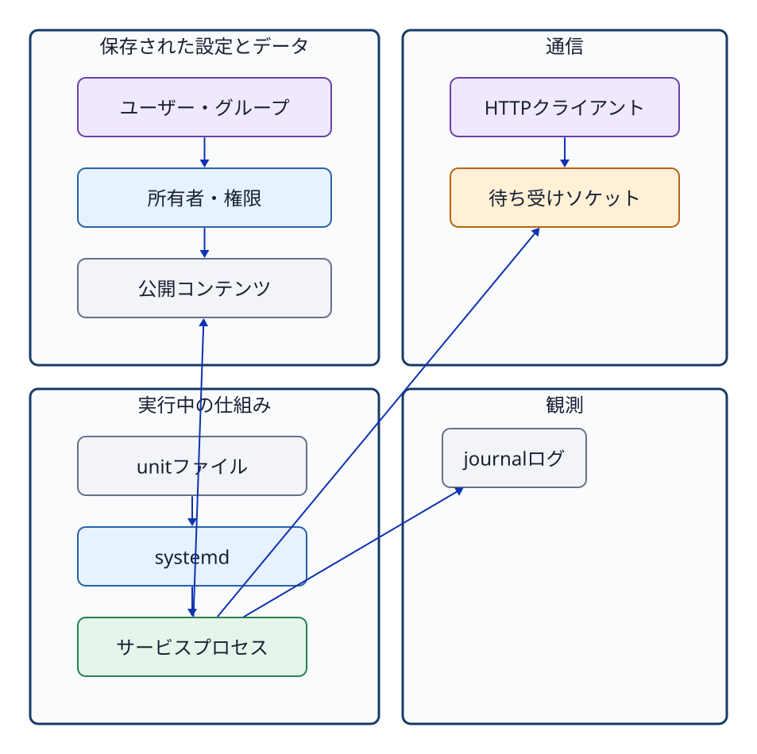

# 第13章 OSの機能を組み合わせて説明する

## 13.1 一つの機能だけではサービスは成立しない

最終課題である M7 は、新しい未知のコマンドを暗記して実行する課題ではない。第1章から第12章までで個別に学んできたOSの各要素機能を、単一の**サービスシステム（service system）**として有機的に統合・連動させる総まとめの課題である。

```text
ユーザー/グループ ─ アクセス権 ─ コンテンツファイル
                          │
ユニットファイル   ─ systemd  ─ サービスプロセス
                          │
                   待受ソケット
                          │
                   HTTP レスポンス
                          │
                   ジャーナルログ
```



**図13-1　設定、保存状態、実行状態、通信、観測の各要素を一本の強固な鎖として照合する関係図。**

## 13.2 設定・稼働・観測を分ける

システムの障害や未完成状態（不具合）を調査・トラブルシューティングする際は、次の3つのレイヤーに明確に切り分けて思考する。

### 設定（Configuration）

- ユニットファイルの `User`、`WorkingDirectory`、`ExecStart` は正しく定義されているか。
- ディレクトリやコンテンツファイルの所有者、所有グループ、アクセス権モードは要件どおりか。
- 各作業ユーザー（writer / viewer）のグループ所属登録は適切に行われているか。

### 稼働（Runtime State）

- サービスは active（稼働中）か、そして enabled（自動起動有効）か。
- サービスの Main PID は実在し、期待された実行ユーザーとコマンド引数で動作しているか。
- 期待されたIPアドレスとポート番号で、ソケットが正常に待受（LISTEN）しているか。

### 観測（Observation / Verification）

- `curl` コマンドで接続した際、どのHTTPステータスコードと応答本文が返ってくるか。
- サービスの実行ユーザー権限で、対象コンテンツファイルを実際に読み取れるか。
- リクエストされたパスは、現在の起動期間（インボケーション）のジャーナルログへ正しく記録されているか。

設定ファイルの記述が正しく見えても、サービスを `start` していなければプロセスは稼働しない。また、プロセスが active であっても、ファイルのアクセス権やソケットの待受設定が誤っていれば、HTTPクライアントは期待どおりの応答を受け取れない。さらに、手動テストでHTTPアクセスに成功したとしても、それだけでシステムの次回起動時（ブート時）に自動起動する保証にはならない。

## 13.3 確認コマンドを問いに合わせる

| 検証したい問い | 主な確認コマンド |
| --- | --- |
| アカウント/グループの登録 | `id USER`、`getent passwd/group` |
| ファイルのメタデータ | `stat`、`namei -l` |
| 特定ユーザーのアクセス権 | `sudo -u USER -- test ...` |
| ユニット定義の設定値 | `systemctl cat UNIT` |
| 現在およびブート時の稼働状態 | `systemctl is-active/is-enabled` |
| 稼働中プロセス情報 | `systemctl show -p MainPID`、`ps`、`/proc/PID` |
| 待受ソケットの状態 | `sudo ss -lntp` |
| HTTPの疎通・応答内容 | `curl -i URL` |
| サービスのジャーナルログ | `sudo journalctl -u UNIT` |

「画面に大量の出力をとりあえず全部出す」のではなく、自分の立てた仮説を検証するために最適なコマンドを選択し、得られた事実に基づいて次の調査ステップへと進む姿勢が求められる。

## 13.4 M7へ取り組む順序の考え方

ここでは完成したコマンド列をそのまま提示することはしない。学生自身が自力で課題を解決できるよう、作業の論理的な依存関係のみを整理して示す。

1. ユニット定義を読み解き、必要とされるディレクトリ、コンテンツ、サービス実行ユーザー、待受アドレス、ポート番号を特定する。
2. グループの所属関係と、ファイル／ディレクトリのメタデータ（所有者・グループ・アクセス権モード）を設計要件に合わせて構成する。
3. writer ユーザーと viewer ユーザーの異なる資格情報を用いてアクセスを試行し、許可されるべき操作と拒否されるべき操作が正しく機能しているかを検証する。
4. サービスを起動し、即時起動状態（active）と自動起動設定（enabled）を分けてそれぞれ確認する。
5. サービスの Main PID、プロセス実行ユーザー、ソケット待受プロセスの PID、および待受アドレス・ポート番号が正しく一致していることを照合する。
6. HTTP 通信を試行し、ステータスコード `200 OK` と応答本文が正しく返ることを確認する。
7. 指定されたパスへHTTPリクエストを送信し、ジャーナルログにそのアクセス記録が正しく出力されていることを確認する。
8. 管理ユーザー `ssm-user` のシェルへ戻り、採点チェックスクリプト（`jdu-check M7`）を実行する。

途中の段階で意図どおりに動かない場合であっても、最後まで強引に進めてから全体を破棄して最初からやり直す必要はない。たとえばサービス自体が起動しないのであれば `systemctl status` や `journalctl` で起動エラーの原因を調べ、サービスは起動するもののHTTP本文が返らないのであればコンテンツファイルの配置パスやサービスユーザーの読み取りアクセス権を調べる、といったように原因箇所を局所化して対処する。

## 13.5 後続単元への接続

本教科書で学んだ Ubuntu・OS基礎の知識は、後続の授業単元で扱う Nginx（Webサーバー）、BIND 9（DNSサーバー）、PostgreSQL（リレーショナルデータベース）などを構築・運用する際にもそのまま土台となる。これらは用途の異なるソフトウェアであるが、OS上で動作する仕組みとしては全く同一の基本機能を共有している。

| 後続のサービス | 本書で再利用する技術的視点 |
| --- | --- |
| Nginx | パッケージ管理、ユニット定義、ワーカープロセス、コンテンツや設定ファイルのアクセス権、80/443 ポートのソケット待受、HTTP プロトコル処理、アクセスログ・エラーログ |
| BIND 9 | サービス専用ユーザー、ゾーン定義・設定ファイル、53番ポート（TCP/UDP）のソケット待受、DNS クエリ処理、ジャーナルログ |
| PostgreSQL | サービス専用ユーザー、データディレクトリのアクセス権保護、複数プロセス構成、5432番ポートのソケット待受、ロール認証、データベースログ |

この対照表は個別の設定手順を示したものではない。将来未知の新しいソフトウェアやミドルウェアに出会った際にも、「どのユーザー権限で動くのか」「どの設定やファイルを読み取るのか」「どのIPアドレス・ポートで待ち受けるのか」「稼働状態や障害をどう観測するのか」という、本書で培った普遍的な共通の問いを適用できることを示している。

## 13.6 最終理解確認

次のトラブルシューティングの場面において、どのような論理的順序でシステムを観測・確認すべきか説明せよ。

1. サービスは active（稼働中）と表示されているが、`curl` コマンドを実行すると Connection refused（接続拒否）になる。
2. ソケットは正常に LISTEN しているが、返ってきた HTTP 応答本文が期待した内容と異なる。
3. root ユーザーではコンテンツファイルを問題なく読めるが、サービスのジャーナルログには Permission denied（アクセス拒否）が記録されている。
4. 現在は正常に動作しているが、OSを再起動（リブート）した後にサービスが自動起動しない。
5. CloudShell 上で作成したファイルが、Ubuntu 上の同一パスに見当たらない。

解答には単一のコマンド名だけを挙げるのではなく、設定・稼働・観測のどのレイヤーに着目し、どのようなコマンドと証拠を用いて原因を特定・切り分けるかを含めて論述せよ。

## この教科書の到達点

個々のコマンドのオプションや構文を機械的に丸暗記することが、本教科書の学習目標（到達点）ではない。OSが提供するファイル、ユーザー識別情報（UID/GID）、アクセス権、プロセス、サービス、ソケット、ログという各機能を明確に概念として区別し、目的に応じて適切な観測手段を選択・実行できるようになることこそが到達点である。実務や演習においてマニュアルや早見表を参照しながらであっても、異なるパス、異なるユーザー、異なるサービスに対して、ここで学んだ普遍的な思考の枠組みを一貫して適用できれば十分である。

## 参考資料

- 本書第1～12章の一次資料。
- 公開Lab v1.5.0のM7 guide、unit、fixture、checker。M7の完成解答は学生向けに掲載しない。
