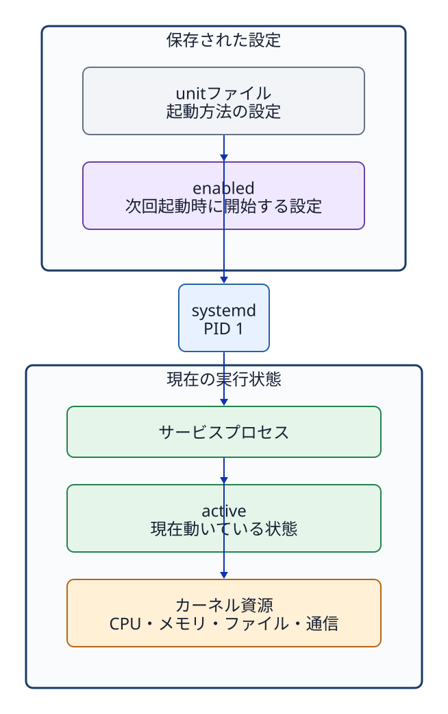

# 第10章 systemdとサービス

## 10.1 サービスとは何か

**サービス（service）**とは、利用者が毎回ターミナルから手動で起動しなくても、OSシステムがバックグラウンドで自動管理し、継続的な機能を提供するプログラムである。Webサーバー、SSHサーバー、時刻同期、ログ管理デーモンなどがその代表例である。ただし、システム上で動作するすべてのプロセスがサービスであるわけではなく、またすべてのサービスがネットワーク待受用のポートを持つわけでもない。

Ubuntu 24.04では、最上位プロセスである systemd が PID 1 として起動し、システム内の多様なサービス群を一元管理する。ここで重要なのは、systemd は「個々のサービス処理そのもの」を行うのではなく、各種サービスの起動、停止、依存関係の解決、死活監視、システム起動時の自動起動などを統括管理する「サービスマネージャー」プログラムである、という点である。

## 10.2 ユニットファイルは設定、プロセスは実行状態

systemd は**ユニット（unit）**という統一的な管理単位を用いて各種リソースを制御する。その中でもサービスを定義する `.service` ユニットファイルには、「どの実行ファイルを、どのユーザーの権限で、どのディレクトリを作業場所として起動するか」といった実行ルールが明確に記述されている。

```ini
[Service]
User=jduapp
WorkingDirectory=/srv/jdu-status
ExecStart=/usr/bin/python3 /srv/jdu-status/server.py
```

- `User`: サービスプロセスを実行するユーザー（資格情報）。
- `WorkingDirectory`: プロセス起動時のカレントディレクトリ（作業ディレクトリ）。
- `ExecStart`: 実際に起動するプログラムの絶対パスと引数。

```bash
systemctl cat jdu-status.service
```

`systemctl cat` コマンドは、ディスク上のユニットファイルと、設定を部分上書きするドロップイン設定（drop-in）の内容を表示する。ファイルの変更後に `daemon-reload` を実行していない場合、表示内容とsystemdが認識している設定は一致しないことがある。



**図10-1　ユニット（unit）は設定、systemd は管理者、サービスプロセスが実際の処理を行う構造。**

## 10.3 activeとenabledは別の軸

```bash
systemctl is-active jdu-status.service
systemctl is-enabled jdu-status.service
```

- **active / inactive**: そのサービスプロセスが現在メモリ上で動作しているか、停止しているか。
- **enabled / disabled**: システムのブート（起動）時に、自動的に起動対象として組み込まれているか否か。

したがって、「現在は active（稼働中）だが disabled（再起動時には自動起動しない）」という状態や、「現在は inactive（停止中）だが enabled（次回起動時には自動起動する）」という状態が当然に成立し得る。サービスの即時起動（`start`）と自動起動の有効化（`enable`）は、全く別軸の独立した操作である。

```bash
sudo systemctl start jdu-status.service
sudo systemctl enable jdu-status.service
```

`enable --now` オプションを使うと、起動と自動起動設定を同時に行える。

## 10.4 start、stop、restart、reload

- **start**: 停止しているサービスプロセスを起動する。
- **stop**: 動作中のサービスプロセスを停止する。
- **restart**: サービスを一度停止させてから再度起動する。一時的な通信断（停止時間）が発生する。
- **reload**: プロセスを停止させることなく、設定ファイルの再読み込みだけを要求する。すべてのサービスがこの機能に対応しているわけではない。

なお、ユニットファイル自体の記述を変更した際に systemd 本体へ再読み込みを指示する `systemctl daemon-reload` と、サービスプロセス自身に設定を再読込させる `reload` は全く別の操作である。

## 10.5 ステータスとMain PIDを読む

```bash
systemctl status jdu-status.service
systemctl show --property MainPID --value jdu-status.service
```

`systemctl status` は、ユニットのロード状態、稼働状態（active）、Main PID、直近の関連ログなどを一覧表示する。出力行数が多い場合は自動的にページャー（`less` 互換画面）が起動するため、`q` キーを押して終了し元のシェルプロンプトへ戻る。一方、`systemctl show` は機械的な読み取りに適したプロパティ（キーと値の形式）を抽出できる。

Main PID を取得したら、稼働中の実プロセスとユニット設定が合致しているかを照合する。

```bash
M4_PID="$(systemctl show --property MainPID --value jdu-status.service)"
ps -p "$M4_PID" -o pid,user,comm,args
sudo readlink -f "/proc/$M4_PID/cwd"
```

確認する対応は次のとおりである。

| ユニットの設定 | 実プロセスで確認する場所 |
| --- | --- |
| `User=` | `ps` の USER 欄 |
| `ExecStart=` | `ps` の args 欄、および `/proc/PID/cmdline` |
| `WorkingDirectory=` | `/proc/PID/cwd` が指すシンボリックリンク先 |

## 10.6 activeだけでは機能正常を証明しない

systemd がプロセスを active（稼働中）として管理していたとしても、コンテンツファイルに対するアクセス権が不足して読めない、意図しないIPアドレスで待受（listen）している、あるいはアプリケーション内部で例外エラーが発生しているなどの理由で、利用者に正常な応答を返せない場合がある。次章では、サービス管理の状態にとどまらず、プロセス、ソケット、HTTPレスポンス、ログ出力へと確認範囲を広げていく。

## 10.7 `systemctl status`にすべてのプロセスが並ぶわけではない

引数を指定せずに `systemctl status` を実行すると、システム全体の稼働サマリーやプロセスツリーが表示され、個々のユニットの詳細が必ずしも見やすく一覧化されるわけではない。目的のサービスを確認する際は、必ずユニット名を明示的に指定して実行する。

```bash
systemctl status jdu-m3-process1.service
systemctl list-units --type=service 'jdu-m3-*'
```

ユーザーがターミナルで起動したシェルプロセスなど、systemd のサービスユニット配下に属さないプロセスも多数存在する。システム全体のプロセス一覧を網羅的に確認するには `ps` コマンドを使用し、systemd の管理対象であるサービスの状態を確認するには `systemctl` コマンドを使用する、という使い分けを明確にする。

## 章末確認と答え

### 問1

ユニットファイル、systemd、サービスプロセスの3者の役割の違いを説明せよ。

**答え：** ユニットファイルは起動方法などの設定を記す。systemdはその設定を使ってサービスを管理する。サービスプロセスは、実際の処理を行う稼働中のプログラムである。

### 問2

サービスの状態において「active かつ disabled」という組み合わせは成立し得るか。その状態が何を意味するかを含めて説明せよ。

**答え：** 成立し得る。`active`は現在動いていること、`disabled`はそのユニットの自動起動が有効化されていないことを示す。手動の`start`で起動したサービスが、その状態になり得る。

### 問3

ユニットファイルに定義された `WorkingDirectory` の設定が、実際の稼働プロセスへ正しく反映されているかを `/proc` 配下の情報を用いて確認する方法を説明せよ。

**答え：** 稼働中サービスのMain PIDを`systemctl show --property MainPID --value ユニット名`で調べる。`readlink -f /proc/PID/cwd`で、そのプロセスの現在の作業ディレクトリを確認する。表示されたパスをユニットファイルの`WorkingDirectory=`と照合する。

## 参考資料

- Ubuntu 24.04 [systemctl(1)](https://manpages.ubuntu.com/manpages/noble/man1/systemctl.1.html)、[systemd.exec(5)](https://manpages.ubuntu.com/manpages/noble/man5/systemd.exec.5.html)、[proc_pid_cwd(5)](https://manpages.ubuntu.com/manpages/noble/man5/proc_pid_cwd.5.html)（2026-09-24確認）
- 公開Lab v1.5.0のP4/M4 unitとchecker（Lab固有値の正本）
