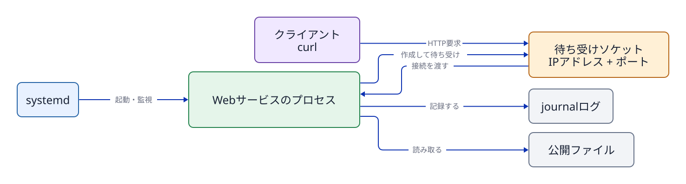
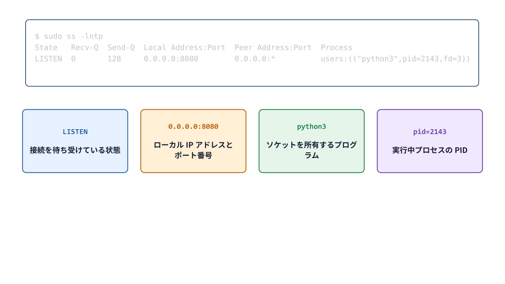

# 第11章 ソケット、HTTP、ログでサービスを観察する

## 11.1 サービス、プロセス、ソケットの関係

systemd はユニットの設定定義に従ってサービスプロセスを起動する。そのプログラムがネットワーク通信を必要とする場合、システムコールを通じてカーネルへ**ソケット（socket）**の作成を依頼する。カーネルはIPアドレス、通信プロトコル、ポート番号などに基づいて、外部からの通信データを該当するプロセスへ正しく届ける。

サービスが勝手にソケットを生み出すというよりは、「サービスとして動作するプログラムが、カーネルの提供するソケット機能を利用して通信を行っている」と理解するのが正確である。systemd の役割はそのプロセスを管理・監視することであり、ネットワーク通信の送受信処理そのものをすべて systemd が代行しているわけではない。



**図11-1　管理（systemd）、実行（プロセス）、通信機能（カーネル・ソケット）、クライアント要求（リクエスト）の各経路の分離構造。** 1つのサービスが複数のソケットを持つ場合や、ネットワーク通信を行わないサービスも存在する。

## 11.2 プロトコル、IPアドレス、ポート

Web通信でよく使われるトランスポート層の通信プロトコルの一つが **TCP（Transmission Control Protocol）** である。TCP はデータが相手へ届いたことを確認し、順序どおりに届ける通信方式である。接続の確立や再送などの詳しい仕組みは後続のネットワーク単元で扱う。

**IPアドレス**はネットワーク上のインターフェース（通信相手のホスト）を識別する。一方、**ポート（port）番号**は、同一ホスト内で動作しているどの通信窓口（どのプロセス）へデータを届けるかを識別するための番号である。「ポート番号そのものがプログラム」なのではない。カーネルがソケットの待受情報とポート番号を照合し、該当するプロセスへ通信データを引き渡す。

- `127.0.0.1`: IPv4の**ループバックアドレス（loopback）**。外部ネットワークからは直接到達できず、基本的に同一ホスト内からの通信のみを受け付ける。
- `0.0.0.0`: そのホストが持つすべてのIPv4ローカルアドレス（すべてのネットワークインターフェース）で待ち受けることを意味する特殊表記。
- `[::]`: すべてのIPv6ローカルアドレスで待ち受ける指定。OSの設定によってはIPv4通信も同時に受け付ける場合がある。

## 11.3 待受ソケットを`ss`で読む

`ss`（Socket Statistics）は、カーネルが管理しているソケットの詳細な状態を表示するコマンドである。

```bash
sudo ss -lntp | grep ':8081'
```

- `-l`: 待受（LISTEN）状態のソケットのみを表示する。
- `-n`: サービス名（httpなど）へ逆引き変換せず、ポート番号の数値をそのまま表示する。
- `-t`: TCPソケットのみを表示する。
- `-p`: そのソケットを利用しているプロセスの情報（名前やPID）を表示する。表示には管理者権限が必要な場合がある。

概念上の例:

```text
State  Recv-Q Send-Q Local Address:Port Peer Address:Port Process
LISTEN 0      5      127.0.0.1:8081  0.0.0.0:*       users:(("python3",pid=2451,fd=3))
```

出力を読む順序は、状態（State: `LISTEN`）、待受アドレスとポート（Local Address:Port: `127.0.0.1:8081`）、そして利用プロセス情報（Process: `pid=...`）である。待受アドレスが `127.0.0.1:8081` であり、プロセス情報内の PID が systemd で確認したサービスの Main PID と一致しているかを照合する。なお、`2451` は教科書の表示例であり、必ず自身の環境で出力された実機の PID を読み取ること。



**図11-2　ss -lntp の出力行を、状態・アドレス・ポート・プロセス情報へ分解して照合する読み方。**

## 11.4 クライアントとサーバー、HTTP

**サーバー（server）**プロセスは、ソケットを作成してクライアントからの接続要求（リクエスト）を待ち受ける。**クライアント（client）**は、サーバーのソケットへ接続を確立し、リクエストを送信する。本演習環境では、同一のUbuntuホスト内で実行する `curl` コマンドがクライアントとなり、`jdu-web.service` のプロセスがサーバーとなる。

```bash
curl -i http://127.0.0.1:8081/
```

URL `http://127.0.0.1:8081/` において、`http` は通信プロトコル（スキーマ）、`127.0.0.1` は接続先ホスト、`8081` はポート番号、`/` はリクエスト対象のパスである。`-i` オプションは、応答本文（ボディ）だけでなく HTTP レスポンスヘッダーもあわせて表示する。

```text
HTTP/1.0 200 OK
Content-Type: text/plain

（本文）
```

`200`（200 OK）は、HTTP アプリケーション層におけるステータスコードである。「TCP レベルのネットワーク接続が成功したこと」「HTTP レベルの応答ヘッダーが返ってきたこと」「応答本文（ボディ）の内容が期待どおりであること」の3点は、それぞれ異なるレイヤーの成否として個別に検証する必要がある。

## 11.5 オープンポートとクローズドポートの比較

```bash
curl --max-time 2 http://127.0.0.1:18081/
sudo ss -lnt | grep ':18081'
```

この例で `127.0.0.1:18081` に待受ソケットがなければ、接続要求は通常拒否され、`curl` は `Connection refused` と表示する。`ss -lnt` にそのアドレスとポートの行がないことは、そこで待ち受けるTCPソケットがないことを示す。`--max-time 2` は、`curl` の処理全体を最長2秒に制限する指定である。

待受ソケットが存在することと、HTTPの応答が返ることも別である。待受は接続を受け付ける準備を示す。HTTPの応答には、接続後にサーバープログラムがリクエストを処理する必要がある。また、タイムアウトは通信が時間内に完了しなかったという結果であり、それだけで「待受ソケットがない」とは判断できない。

## 11.6 サービスユーザーの読み取りアクセス権

Webサーバープロセスが要求されたコンテンツファイルを読み出してクライアントへ返すためには、そのサービスの実行ユーザーが、コンテンツファイル自身およびその親ディレクトリ群への正当なアクセス権（読み取り権限と実行権限）を保持していなければならない。

```bash
id jduweb
stat -c '%U:%G %a %n' /srv/jdu-web/index.txt
namei -l /srv/jdu-web/index.txt
sudo -u jduweb -- test -r /srv/jdu-web/index.txt
echo $?
```

`jduweb` ユーザーへ対話的に `su -` ログインできないことは何ら問題ではない。サービス専用ユーザーは不正利用防止のために対話シェルが無効化されているのが標準であり、第6章で学んだ `sudo -u` を用いることで、対話ログインを開くことなくそのユーザーの資格情報でファイルのアクセス可否を確実にテストできる。

## 11.7 ログはどこから来るのか

プログラムは動作中にさまざまなログメッセージを出力する。systemd 環境のログ収集デーモンである systemd-journald は、各サービスプロセスが出力した標準出力（stdout）や標準エラー出力（stderr）、およびシステムログメッセージを一元的に収集してバイナリ形式で蓄積する。`journalctl` コマンドは、その蓄積されたジャーナルログを閲覧・検索するために使用する。

```bash
curl -i http://127.0.0.1:8081/
sudo journalctl -u jdu-web.service --no-pager -n 20
```

`-u` は対象ユニットでログを絞り込み、`-n 20` は直近の20件を表示する。`--no-pager` はページャーを起動せずに結果を表示する。Webサーバーがアクセスを記録する設計なら、リクエストに対応するログ行が残る。ログの内容や有無はプログラムの実装と設定によって異なる。

## 11.8 Webサービスが要求に応じるまで

Webサービスを例にすると、設定・実行・通信・応答・ログは、次のようにつながる。

```text
ユニットファイル → systemd → サービスプロセス
                                ↓ カーネルのソケット機能を利用
                    待受ソケット（IPアドレスとポート）
                                ↓ クライアントが接続・要求
                    サービスプロセスが要求を処理
                       ├─ HTTPレスポンスを返す
                       └─ 必要に応じてログを出力する
```

ユニットファイルは起動方法を定めるが、通信内容を処理するのはサービスプロセスである。待受ソケットは接続を受ける窓口であり、HTTPレスポンスはプログラムが要求を処理した結果である。ログは、その処理やエラーを後から知るための記録である。`systemctl` はサービスの状態、`ss` はソケット、`curl` はHTTP応答、`journalctl` はジャーナルに収集されたログをそれぞれ表示する。これらは同じ事実を別名で示すものではない。

## 章末問題

### 問1

サービスが active（稼働中）であるにもかかわらず、HTTPで期待した応答を得られない原因の例を2つ挙げよ。

### 問2

待受アドレス `127.0.0.1:8081` と `0.0.0.0:8081` の違いを、外部ネットワークからの到達可能性に着目して説明せよ。

### 問3

`ss` の出力にあるプロセスのPIDと、systemdのMain PIDを照合する理由を説明せよ。

## 章末解答

### 問1

**答え：** 例えば、サーバープログラムが想定とは別のアドレスやポートで待ち受けている場合。または、サービスの実行ユーザーにコンテンツファイルの読み取り権限がなく、要求を処理できない場合である。

### 問2

**答え：** `127.0.0.1:8081` は同じホスト内からの接続を受け付ける。`0.0.0.0:8081` は、そのホストのすべてのIPv4ローカルアドレスで待ち受ける。ただし、外部から実際に到達できるかはファイアウォールやネットワーク構成にも左右される。

### 問3

**答え：** 待受ソケットを利用しているプロセスが、目的のサービスとしてsystemdに管理されているプロセスかを確かめるためである。ただし、複数プロセスで動くサービスでは、待受を持つPIDがMain PIDと異なることもある。

## 参考資料

- Linux man-pages, [socket(7)](https://man7.org/linux/man-pages/man7/socket.7.html)（2026-09-18確認）
- Linux man-pages, [connect(2)](https://www.man7.org/linux/man-pages/man2/connect.2.html)（2026-09-24確認）
- curl, [How to use curl](https://curl.se/docs/manpage.html)（2026-09-24確認）
- Ubuntu 24.04実機の`man ss`、`man curl`、`man journalctl`（制作時に確認）
- 公開Lab v1.5.1のP5/M5 program、unit、checker（Lab固有値の正本）
