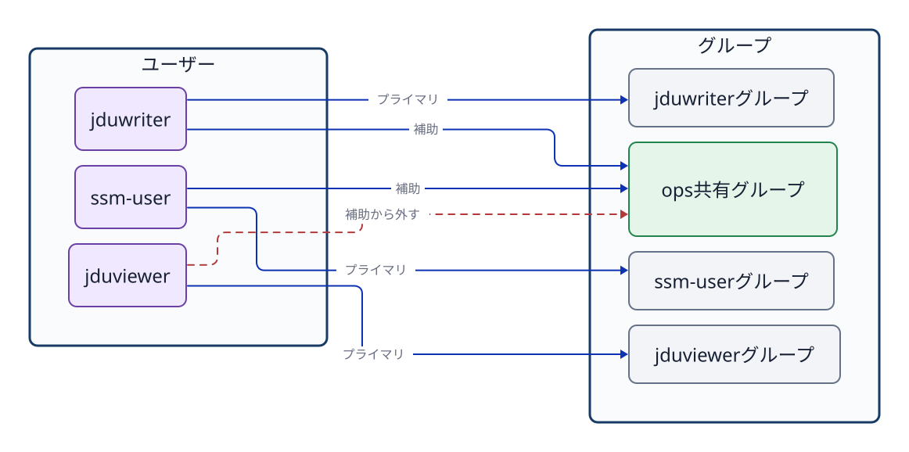

# 第6章 ユーザー、グループ、ログイン

## 6.1 ユーザーは名前だけでなく識別番号を持つ

Linuxはユーザーを**UID（ユーザーID）**、グループを**GID（グループID）**という数値で内部的に識別する。`ssm-user` のような名前は人間が扱いやすいように用意された表示用の識別名である。ファイルやディレクトリの所有者情報も、内部ではすべて数値のUID/GIDとして記録されている。

```bash
id
id jduops
getent passwd jduops
getent group ops
```

`id` コマンドは、現在操作しているユーザーのUID、主グループ（primary group）、補助グループ群（supplementary groups）を表示する。引数にユーザー名を指定すれば、そのアカウントの登録情報を確認できる。`getent` コマンドは、ローカルの設定ファイル（`/etc/passwd` や `/etc/group`）だけでなく、システムのネームサービス設定を通じてアカウントやグループの情報を統一的に取得する。本演習では主にローカルアカウントを扱うが、企業の実務環境ではLDAPやActive Directoryなどが併用されることもある。

## 6.2 主グループと補助グループ

各ユーザーには、必ず1つの**主グループ（primary group）**が設定される。Ubuntuで新規ユーザーを作成すると、ユーザー名と同じ名前の専用グループを主グループとして自動作成する運用が一般的であるが、これは必須の絶対規則ではない。必要に応じて `usermod -g` コマンドなどで変更することも可能である。

1人のユーザーは、主グループに加えて複数の**補助グループ（supplementary group）**に所属できる。チームで共有するファイルやディレクトリへのアクセス権を付与する際は、ユーザーの主グループを不用意に変更するのではなく、用途ごとに作成した補助グループへユーザーを追加する運用が適切である。



**図6-1　ユーザーごとの主グループと、共有用途で利用する補助グループの関係。**

課題M2では、`jduops` をグループ `ops` へ追加し、誤って所属している `jduviewer` を `ops` グループから削除する。

```bash
sudo usermod -aG ops jduops
sudo gpasswd -d jduviewer ops
```

`usermod -aG` において、`-a`（append）は既存の所属グループを維持したまま追加することを意味する。もし `-a` を付けずに `-G` だけでグループ名を指定してしまうと、そこに記載しなかった既存の補助グループからすべて除外されてしまう危険がある。設定を変更した後は、必ず `id USER` で登録情報を再確認する。

`getent group ops` の出力末尾にあるメンバー一覧は、そのグループを補助グループとして所属しているメンバーを確認するのに役立つ。しかし、そのグループを主グループとして登録されているユーザーは、この一覧に名前が表示されない場合がある。グループの全所属者を確実に確認する際は、`id USER` などと組み合わせて多角的に照合する。

## 6.3 登録情報と現在のプロセスの資格情報

グループの所属登録を変更しても、すでに起動して動作しているシェルのプロセスの資格情報（保持しているグループ一覧）が自動的に更新されるわけではない。新しくログインし直すか、新しいセッションを開始して初めて、最新のグループ情報が反映される。

```bash
id jduops
sudo su - jduops
id
```

1行目の `id jduops` はシステムに登録されているアカウント情報を調べる。一方、`su -` で切り替えた後の `id` は、新たに起動したログインシェルが実際に保持している実行資格情報を表す。カーネルによるアクセス権の判定は、設定ファイルの静的な登録情報ではなく、操作を実行しているプロセス自身が保持するUID/GIDに基づいて行われる。

## 6.4 `su`と`sudo`は目的が違う

`su`（substitute user）は、別のユーザー権限で動作するシェルセッションを開始する。`su - USER` のハイフン `-` は、実際にそのユーザーがログインした際と同様の環境へ切り替える指定であり、ホームディレクトリや環境変数を対象ユーザーの標準状態に初期化する。

`sudo` は、設定ファイルで許可された特定のユーザーが、一時的に管理者（root）や別のユーザーの権限でコマンドを実行する仕組みである。本演習環境では `ssm-user` だけがパスワードなしで必要な管理者操作を実行できるよう構成されている。演習用の一般ユーザーへ不用意に sudo 権限を付与してはならない。

```bash
sudo su - jduops
id
pwd
exit
id -un
```

`jduops` から `jduviewer` へ直接切り替えようとするのではなく、一度 `exit` で元の管理ユーザー `ssm-user` へ戻る手順を徹底する。ユーザー切り替えを行うたびにシェルは多重に入れ子（ネスト）構造となるため、自分が今どのユーザーのシェルにいるかを `id -un`、`hostname`、`pwd` でこまめに確認する。

1つのコマンドだけを別ユーザーの権限で試す場合は、対話シェルを開かずに実行する。

```bash
sudo -u jduweb -- test -r /srv/jdu-web/index.txt
echo $?
```

これは `jduweb` の実行資格情報で対象ファイルが読み取り可能かどうかを直接テストしている。管理者である root で読み取れたことをもって、一般のサービスユーザーでも読み取れる証拠と誤認してはならない。

## 6.5 サービスユーザーは人間のログインユーザーとは限らない

サービス専用のユーザーアカウントは、各プロセスの権限を最小限に分離・制限するために作成される。`jduweb` や `jdufinal` は人間による対話的なログインを目的としておらず、ログインシェルには `/usr/sbin/nologin` などのログインを拒否する設定が施されている。

```bash
getent passwd jduweb
id jduweb
```

`nologin` は「そのアカウントが無効・存在しない」という意味ではない。systemdなどのサービスマネージャーは、その指定されたユーザーのUIDで安全にサービスプロセスを起動・動作させることができる。人間がシェルに対話ログインできないことと、システムサービスがそのUIDの権限でファイルを読み書きすることは、全く別の概念である。

## 6.6 アカウント、認証、認可

- **アカウント（account）**: システムがユーザーやサービスを識別するための登録情報。
- **認証（authentication）**: そのユーザー本人、または正当な接続主体であるかを確かめること（「誰であるか」の確認）。
- **認可（authorization）**: 認証された主体に対して、対象リソースの特定の操作を許可するか判断すること（「何ができるか」の決定）。

SSH鍵による照合は「認証」のために用いられる。一方、ファイルのアクセス権や sudo の設定規則は「認可」に関係する。SSHでサーバーへログインできたからといって、サーバー上のすべてのファイルを自由に変更・操作できるわけではない。

## 章末確認

1. 主グループと補助グループの違いを、プロジェクト共有ディレクトリの運用例を用いて説明せよ。
2. グループに追加した直後、すでに開いている既存のシェルで所属が反映されない場合、何を再作成（開始）すべきか。
3. `sudo -u jduweb -- test -r FILE` による確認を、root による `cat FILE` で代用できない技術的な理由を説明せよ。

## 参考資料

- Ubuntu Server documentation, [User management](https://ubuntu.com/server/docs/how-to/security/user-management/)（2026-09-18確認）
- Ubuntu 24.04実機の`man id`、`man getent`、`man usermod`、`man gpasswd`、`man su`、`man sudo`（制作時に確認）
